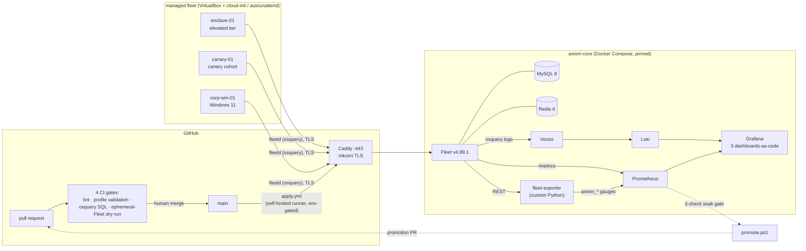

# Project AXIOM — device management, run entirely as code

[](https://github.com/worthingtontech/axiom-fleet-mdm-lab/actions/workflows/gitleaks.yml)
[](https://fleetdm.com)
[](docs/adr/0001-right-sized-topology.md)
[](LICENSE)

**A $0, fully self-hosted MDM / endpoint-management platform for a fictional frontier-AI company
("Axiom Intelligence"), built and operated as a production service by one engineer.** Every piece of
configuration, policy, enrollment, telemetry, and rollout logic is code in this repository —
PR-gated, CI-validated, wired for nightly drift detection, and rebuildable from a fresh clone with
zero secrets in Git.

The scenario is deliberate: a company whose crown jewels are **model weights** needs tiered trust
zones, compliance-as-code, and evidence — not dashboards of assumptions. The lab implements that
posture on Fleet **Free**, and wherever a capability is Premium-gated (teams, profile delivery,
enforcement), it says so and builds the closest free-tier equivalent instead of pretending.

---

## The headline: progressive rollout, gated on telemetry — proven live

New controls do **not** ship fleet-wide. They land on a **canary cohort** first (hosts carrying
`/etc/axiom/canary`, graded by self-scoping policy SQL), soak under Prometheus observation, and are
promoted only when a three-check gate passes:

```
axiom_exporter_up == 1                                    # telemetry itself is alive
axiom_label_hosts{label="canary"} >= 1                    # the cohort exists
max_over_time(axiom_policy_failing_hosts{policy=...}[soak]) == 0   # zero failures, entire window
```

The full loop was demonstrated end to end on a live host (`canary-01`): the canary policy **failed**
→ the gate returned **HOLD** → remediation shipped via Fleet's free run-script API → the cohort went
**green** → the gate **opened the fleet-wide promotion** as a CI-gated pull request
([PR #2](https://github.com/worthingtontech/axiom-fleet-mdm-lab/pull/2), all checks green; merging
it is the rollout, applied by `apply.yml`).
Design: [ADR-0009](docs/adr/0009-canary-progressive-rollout.md) · gate:
[`gitops/promote/`](gitops/promote/) · evidence: [LAB_STATE.md](LAB_STATE.md).

## Architecture



## Honest scope — proven vs. authored

A compliance claim you can't test is a liability, so this table is load-bearing. "Proven live"
means demonstrated on an enrolled host and recorded in [LAB_STATE.md](LAB_STATE.md).

| Status | What |
|---|---|
| ✅ **Proven live** | Fleet core stack (Compose IaC, TLS edge, WSTEP CA); 11 Linux policies on enrolled hosts, with controls **deliberately broken and observed flipping red→green** ([test plans](docs/test-plans.md)); the full telemetry pipeline (kill-agent → dashboard-drop acceptance); the **canary → soak → promote loop**; script-based remediation via the free run-script API |
| 📝 **Authored + CI-validated** | 6 macOS + 6 Windows policies (no host of that platform enrolled yet); Windows patch-deadline CSP profile (GitOps profile delivery is Premium — wired but commented, [documented](docs/adr/0005-windows-mdm-enablement.md)); Windows zero-touch provisioning (unattended install + first-logon proven; MDM enroll last-mile documented in [ADR-0002](docs/adr/0002-vm-backend-virtualbox-cloudinit.md)); Claude-in-the-loop remediation drafting ([`gitops/remediate/`](gitops/remediate/)) |
| 🕐 **Deferred, by design** | macOS/iOS enrollment (requires Apple hardware — authored now, enrolls later); Android BYOD work profile; SSO/device-trust (Phase 7) and the SOAR receiver (Phase 8) — designs live in the [encyclopedia](docs/encyclopedia/README.md) |

Current phase-by-phase detail: [docs/PROJECT-STATUS.md](docs/PROJECT-STATUS.md).

## What this demonstrates

| Discipline | Where to look |
|---|---|
| **MDM as a production service** (not SaaS consumption) | [`infra/`](infra/) — pinned Compose, TLS edge, private PKI ×2, upgrade/rebuild path |
| **Endpoint configuration as code** | [`gitops/`](gitops/) — 23 CIS/MITRE-mapped policies, labels, reports; zero click-ops (UI changes are *drift*; a nightly job is wired to diff live state against Git and file an issue) |
| **Progressive rollout gated on telemetry** | [ADR-0009](docs/adr/0009-canary-progressive-rollout.md), [`gitops/promote/`](gitops/promote/) |
| **CI/CD for config** | [`.github/workflows/`](.github/workflows/) — 4-gate PR CI incl. an **ephemeral Fleet server built per-PR** for `gitops --dry-run` |
| **Fleet telemetry → action** | [`infra/telemetry/`](infra/telemetry/) — custom Prometheus exporter, dashboards-as-JSON, Loki/Vector; the promote gate consumes it |
| **Compliance engineering** | [compliance matrix](docs/compliance-matrix.md) (CIS + MITRE mapping) · [per-control break/fix test plans](docs/test-plans.md) |
| **Security architecture & honesty** | [SECURITY.md](SECURITY.md) · [security review](docs/security-review.md) · [runner threat model (ADR-0007)](docs/adr/0007-self-hosted-runner-security.md) |
| **AI-native operations** | Built and operated with Claude Code end to end ([origin prompt](docs/origin-prompt.md)); [Claude-drafted remediation PRs](gitops/remediate/) on a schedule, human-merged |
| **Decision discipline** | [9 ADRs](docs/adr/) — including the failures: broken tables ([ADR-0008](docs/adr/0008-osquery-table-detection-choices.md)), hypervisor coexistence ([ADR-0002](docs/adr/0002-vm-backend-virtualbox-cloudinit.md)) |

## CI/CD topology (and why a fork can't touch the LAN)

| Workflow | Trigger | Runner | Job |
|---|---|---|---|
| [`pr-ci`](.github/workflows/pr-ci.yml) | pull request | **cloud** | yamllint/actionlint · profile validation (plist/JSON/CSP-XML) · osquery SQL compile-check · `fleetctl gitops --dry-run` against an ephemeral Fleet |
| [`gitleaks`](.github/workflows/gitleaks.yml) | push / PR + manual | **cloud** | full-history secret scan |
| [`apply`](.github/workflows/apply.yml) | merge to `main` + manual | self-hosted | applies desired state to the live Fleet — behind a reviewer-gated `production` environment |
| [`drift-detection`](.github/workflows/drift-detection.yml) | nightly + manual | self-hosted | regenerates GitOps from live state, diffs vs. Git, files an issue on drift |
| [`promote`](.github/workflows/promote.yml) | 6-hourly + manual | self-hosted | runs the canary soak gate; opens the promotion PR when green |
| [`claude-remediate`](.github/workflows/claude-remediate.yml) | weekday cron + manual + `repository_dispatch` | self-hosted | Claude triages failing policies and drafts remediation briefs as a PR — a human merges |

> Status note: the two cloud workflows have a green history; the four self-hosted workflows are
> newly wired to a just-registered LAN runner and their first scheduled runs are landing now —
> live status in [PROJECT-STATUS](docs/PROJECT-STATUS.md).

Only the two **cloud** workflows are fork-triggerable; every workflow that can reach the LAN or
mutate the live server runs on trusted, `main`-only triggers ([ADR-0007](docs/adr/0007-self-hosted-runner-security.md)).

## Rebuild from a fresh clone

Everything regenerates; no secret is ever committed ([prove it](SECURITY.md#prove-it-what-a-reviewer-can-run)).

```powershell
git clone https://github.com/worthingtontech/axiom-fleet-mdm-lab
cd axiom-fleet-mdm-lab
infra\scripts\new-env.ps1        # generate all six secrets -> gitignored infra\.env
infra\tls\make-certs.ps1         # mkcert CA + stable-named leaf for fleet.axiom.lab
infra\scripts\new-wstep-ca.ps1   # Windows MDM identity CA
docker compose -f infra\docker-compose.yml up -d          # Fleet + MySQL + Redis + Caddy
docker compose -f infra\telemetry\docker-compose.yml up -d # Loki/Vector/Prometheus/Grafana/exporter
provisioning\build-packages.ps1  # fleetd .deb/.msi (carry the enroll secret -> never committed)
provisioning\linux\new-linux-vm.ps1 -Name gpu-node-1       # cloud-init VM, enrolled on first boot
```

Requires: Windows host with Docker Desktop, VirtualBox, mkcert, Node 20+ (`fleetctl`). Details:
[`provisioning/README.md`](provisioning/README.md) · runbooks in [`runbooks/`](runbooks/).

## Reading order

1. **[PROJECT-STATUS.md](docs/PROJECT-STATUS.md)** — what's done, what's partial, what's pending (no varnish)
2. **[ADRs](docs/adr/)** — nine decisions, including the ones that hurt
3. **[Compliance matrix](docs/compliance-matrix.md)** + **[test plans](docs/test-plans.md)** — every control mapped and break-tested
4. **[The stack encyclopedia](docs/encyclopedia/README.md)** — 12 layers, from hypervisor to trust model; see especially [what each control actually enforces on the endpoint](docs/encyclopedia/12-endpoint-security-relevance.md)
5. **[SECURITY.md](SECURITY.md)** + **[security review](docs/security-review.md)** — the secret-hygiene contract and its audit
6. [LAB_STATE.md](LAB_STATE.md) — the raw engineering journal (evidence, not narrative)

---

Apache-2.0 · © 2026 Aaron W. Perkins · built AI-natively with [Claude Code](https://claude.com/claude-code) — see [the origin prompt](docs/origin-prompt.md)
