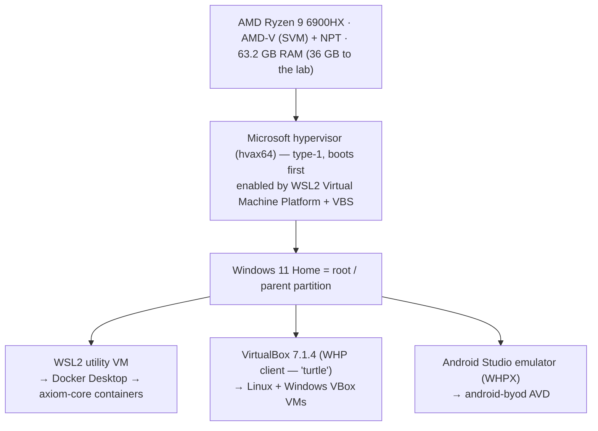

# 🖥️ Host, Hypervisor & Virtualization
> Part of the **[Project AXIOM Encyclopedia](./README.md)** · Layer: Host & Virtualization. The physical machine, the CPU/firmware virtualization features it exposes, the Microsoft hypervisor that quietly owns them, and every guest (VirtualBox VMs, the WSL2 utility VM, the Android emulator) that the whole lab is built on top of.

This is the *substrate* layer — everything else in Project AXIOM (the Fleet stack, the enrolled endpoints, the CI runner) is a guest, a container, or a process running somewhere on this one Windows 11 Home laptop. The single most important fact about this layer is that **the Microsoft hypervisor is already running** (`HypervisorPresent=True`), because Docker Desktop's WSL2 backend and Windows VBS switch it on at boot. That one fact cascades into everything below: it is why VirtualBox runs in a slower "coexistence" mode, why the Android emulator uses WHPX, and why you can't simply "turn Hyper-V off." Read this layer as a stack of tenants negotiating for one CPU's virtualization extensions.



---

## 1. Windows 11 Home (the host OS)

- **In one line** — The single physical operating system that owns the hardware and hosts every other moving part of the lab.
- **What it actually is** — The consumer edition of Windows 11 (build 26200) running natively on the Ryzen 9 6900HX laptop. It is the *root/parent partition* once the Microsoft hypervisor loads (see §3): Windows still feels like it owns the machine, but it is actually the most-privileged tenant *on top of* the hypervisor. "Home" matters here: it ships **without** the full Hyper-V role and Hyper-V Manager GUI (those are Pro/Enterprise), yet it **does** include the lower-level pieces that matter — the *Virtual Machine Platform* and *Windows Hypervisor Platform* optional features, plus Virtualization-Based Security (VBS). Analogy: Home doesn't come with the "server admin console," but the engine that console would drive is bolted in all the same.
- **Why it's in Project AXIOM** — It's the one machine the entire $0 lab must run on and be rebuildable onto from Git alone. Everything — the Docker stack, the VBox fleet, the Android emulator, the self-hosted CI runner — is a guest or process here.
- **Where it sits in the stack** — Top of the physical stack, but *below* the Microsoft hypervisor in privilege once virtualization is active. Directly above the CPU/firmware (§2); directly beside/parent-to WSL2 (§5), VirtualBox (§6), and the AVD (§10).
- **How it works** — Standard Windows kernel scheduling and memory management for host apps (VirtualBox GUI/service, Docker Desktop, Android Studio, VS Code, the GitHub runner). When VBS/WSL2 are enabled, Windows relinquishes direct control of AMD-V root mode to the Microsoft hypervisor and continues as the root partition, brokering hardware for child partitions via the hypervisor.
- **Who talks to it, and how** —
  - **The operator → Windows**: interactively, plus PowerShell + `VBoxManage` lifecycle scripts under `infra/`/`provisioning/` (per [ADR-0002](../adr/0002-vm-backend-virtualbox-cloudinit.md)) that create/start/destroy VMs.
  - **Guest VMs → Windows host network**: VBox guests and the AVD reach the Fleet stack by hitting the **host's LAN IP:443** (or `10.0.2.2` from the AVD's NAT), which Docker Desktop forwards into the WSL2 VM to Caddy (see §5, §6).
  - **The self-hosted GitHub Actions runner** runs as a Windows process and is the only thing that can apply GitOps to the LAN-only Fleet server — see [GitOps & CI/CD](./06-gitops-and-cicd.md).
- **Free vs Premium** — Not a Fleet-licensed component; the host OS sits entirely below Fleet's tiering. The Home license is perpetual and already owned (zero lab cost); the only clock here belongs to the *guest* `corp-win-*` Enterprise **Eval** (90 days), which has nothing to do with a Fleet seat.
- **Gotchas / myth-busting** —
  - "Windows Home can't virtualize / can't run Hyper-V." Half-true: it can't run the *Hyper-V role/Manager*, but the hypervisor **is** present and active here because WSL2 + VBS require it. `HypervisorPresent=True` on Home is normal, not a misconfiguration.
  - The Windows 11 **Enterprise Eval** license used for the `corp-win-*` guest VMs is a **90-day** clock — those VMs must be rebuildable from Git before expiry (reinforces the zero-touch Phase 6 goal). That eval clock is a *guest* concern; the *host* Home license is perpetual.
- **See also** — [CPU virtualization](#2-cpu-virtualization-vt-x--amd-v-slat--npt) · [Hyper-V coexistence](#4-hyper-v-coexistence--why-virtualbox-runs-slow-here) · [Containers & Docker](./02-containers-and-docker.md) · [Trust model & topology](./11-concepts-and-trust-model.md)

---

## 2. CPU virtualization: VT-x / AMD-V, SLAT / NPT

- **In one line** — The silicon-level CPU extensions that make hardware-assisted virtualization fast and safe; on this AMD host they're **AMD-V (SVM)** and **NPT**.
- **What it actually is** — Two families of processor features:
  - **VT-x (Intel) / AMD-V (AMD's "SVM" — *Secure Virtual Machine*)** — adds a new, more-privileged execution mode ("root mode") so a hypervisor can let a guest OS run real ring-0 code directly, trapping only the sensitive instructions. On AMD this is enabled via the SVM bit and driven by instructions like `VMRUN`; the guest's saved state lives in a VMCB (VM Control Block). Because this is a **Ryzen 9 6900HX**, the relevant feature is **AMD-V/SVM**, *not* Intel VT-x — this distinction matters for the Android emulator (§10) because Intel HAXM simply does not exist on AMD.
  - **SLAT (Second-Level Address Translation)** — hardware that translates guest-physical → host-physical addresses in the MMU, so the hypervisor doesn't have to maintain shadow page tables in software. Intel calls it **EPT**; **AMD calls it NPT** (Nested Page Tables, a.k.a. RVI). SLAT is what makes memory virtualization cheap, and it is a **hard requirement** for the Microsoft hypervisor, WSL2, and WHPX.
  - Analogy: AMD-V is the CPU giving the hypervisor a separate, higher master key; NPT is a hardware address-book so the hypervisor never has to hand-translate every guest memory access.
- **Why it's in Project AXIOM** — Without these enabled in firmware, nothing in this lab boots: no Microsoft hypervisor, no WSL2 (so no Docker, so no Fleet stack), no VBox guests, no Android emulator. Recon confirmed **VT/SVM firmware = enabled** ([ADR-0001](../adr/0001-right-sized-topology.md)).
- **Where it sits in the stack** — The absolute bottom of the virtualization stack: a CPU/firmware capability consumed by whichever hypervisor grabs it first (here, the Microsoft hypervisor at boot).
- **How it works** — At power-on the firmware exposes SVM + NPT. Whichever hypervisor initializes first executes the enable sequence and enters root mode; from then on it "owns" the extension. Guests run natively until they hit a sensitive event (a **VM-exit**), which transfers control back to the hypervisor to emulate/handle, then resumes (**VM-entry**).
- **Who talks to it, and how** —
  - **Firmware/UEFI → CPU**: the "SVM Mode / AMD-V" toggle in BIOS gates the whole feature (must be *Enabled*).
  - **Microsoft hypervisor → CPU**: at boot it enters SVM root mode and programs NPT for every child partition; it is the *only* thing directly in root mode on this host.
  - **VirtualBox / the AVD → CPU (indirectly)**: because the Microsoft hypervisor already owns root mode, these do **not** touch AMD-V directly; they request virtual processors via the Windows Hypervisor Platform API (§3, §4). This indirection is the whole story of the performance turtle.
- **Free vs Premium** — N/A. A silicon/firmware capability, entirely outside Fleet licensing — Fleet never sees it.
- **Gotchas / myth-busting** —
  - "Enable VT-x in Android Studio / VirtualBox." On this AMD box there is **no VT-x** to enable — it's AMD-V. Intel HAXM is Intel-only and irrelevant here (see §10).
  - Only **one** component can be in AMD-V root mode at a time. On this host that's the Microsoft hypervisor — which is exactly why VirtualBox can't also grab it and instead runs as a WHP client (§4).
- **See also** — [Hypervisor & WHP](#3-hypervisor--the-windows-hypervisor-platform-type-1-vs-type-2) · [Hyper-V coexistence](#4-hyper-v-coexistence--why-virtualbox-runs-slow-here) · [AVD emulator](#10-android-studio--the-avd-emulator-whpx)

---

## 3. Hypervisor & the Windows Hypervisor Platform (type-1 vs type-2)

- **In one line** — The **Microsoft hypervisor** is a type-1 hypervisor that boots before Windows; the **Windows Hypervisor Platform (WHP)** is the public API that lets third-party VMMs (VirtualBox, the Android emulator, Docker's backend) run their guests *on top of* it.
- **What it actually is** —
  - **Type-1 (bare-metal)** hypervisors run directly on hardware and boot before any OS (Microsoft hypervisor, ESXi, KVM). **Type-2 (hosted)** hypervisors run as an app on top of a normal OS (classic VirtualBox, VMware Workstation).
  - The **Microsoft hypervisor** (`hvax64.exe` on AMD) is *type-1*: when WSL2's Virtual Machine Platform or VBS is enabled, it loads first at boot, and Windows itself becomes the *root/parent partition*. Everything else — including Windows — is a partition it schedules.
  - The **Windows Hypervisor Platform (WHP)** is a user-mode API surface (`WHvCreatePartition`, `WHvCreateVirtualProcessor`, `WHvRunVirtualProcessor`, …) that lets a third-party VMM create and run *its own* child partitions on the Microsoft hypervisor **without** needing to touch AMD-V root mode itself. This is the bridge that turns a would-be type-2 hypervisor (VirtualBox) into a *client* of the type-1 hypervisor. VirtualBox's internal name for this execution backend is **NEM** (Native Execution Manager).
  - Analogy: the Microsoft hypervisor is the landlord who took the deed to the CPU at move-in; WHP is the standard lease that lets other tenants (VirtualBox, QEMU/AVD, Docker) rent virtual CPUs from the landlord instead of squatting on the hardware directly.
- **Why it's in Project AXIOM** — It's the reason the lab can run Docker (WSL2 needs it) **and** VirtualBox VMs **and** the Android emulator *simultaneously* on one machine — they all become clients of the same type-1 hypervisor rather than fighting over AMD-V.
- **Where it sits in the stack** — Directly above the CPU (§2) and *below* Windows-as-root-partition (§1). WHP is the seam where VirtualBox (§6) and the AVD (§10) attach.
- **How it works** — Enabling any of {WSL2 Virtual Machine Platform, VBS/Memory Integrity, Hyper-V, Windows Sandbox} sets `hypervisorlaunchtype=Auto`; at next boot `hvax64` initializes AMD-V/NPT and starts Windows as the root partition. Third-party VMMs detect the active hypervisor and route through WHP instead of loading their own ring-0 driver into root mode.
- **Who talks to it, and how** —

  ```mermaid
  flowchart LR
    subgraph Root["Windows root partition (user mode)"]
      VB["VirtualBox VMM"]
      AVD["Android emulator (qemu)"]
      DD["Docker Desktop / WSL2 svc"]
    end
    VB -- "WHP API (WHvRunVirtualProcessor)" --> MSH
    AVD -- "WHPX (WHP API)" --> MSH
    DD  -- "VID / hypervisor calls" --> MSH
    MSH["Microsoft hypervisor (type-1)"] -- "AMD-V VMRUN / NPT" --> CPU["Ryzen 6900HX"]
  ```

  - **VirtualBox & the Android emulator → WHP → hypervisor**: outbound API calls from user mode to schedule guest vCPUs; every guest VM-exit round-trips back up through WHP.
  - **WSL2 / Docker → hypervisor**: via Microsoft's own VID/kernel path (not WHP), managing the WSL2 utility VM partition.
- **Free vs Premium** — N/A. The Microsoft hypervisor and WHP ship with Windows at no extra cost and have no relationship to Fleet Free vs Premium.
- **Gotchas / myth-busting** —
  - "Windows Hypervisor Platform" ≠ "Hyper-V." WHP is just the *API for third-party hypervisors*; you can have WHP-based coexistence on Windows **Home** even though the full Hyper-V role isn't available there.
  - Once the Microsoft hypervisor is present, the type-1/type-2 label for VirtualBox blurs: it's a type-2 *front-end* whose execution is delegated to a type-1 hypervisor.
- **See also** — [Hyper-V coexistence](#4-hyper-v-coexistence--why-virtualbox-runs-slow-here) · [WSL2](#5-wsl2-windows-subsystem-for-linux-2) · [CPU virtualization](#2-cpu-virtualization-vt-x--amd-v-slat--npt)

---

## 4. Hyper-V coexistence — why VirtualBox runs "slow" here

- **In one line** — Because the Microsoft hypervisor already owns AMD-V, VirtualBox 7.1 can't run its guests on raw hardware and instead runs them *through* the Windows Hypervisor Platform, incurring a measurable performance penalty (VBox shows the green "turtle").
- **What it actually is** — "Coexistence" is VirtualBox's **NEM** (*Native Execution Manager*) execution backend — added in VirtualBox 6.1 and selected automatically whenever it detects `HypervisorPresent=True`. Instead of loading its own ring-0 hypervisor and owning AMD-V, VirtualBox gracefully falls back to being a **WHP client** of the Microsoft hypervisor. Functionally identical (guests boot and run correctly); performance-degraded, because VirtualBox is *designed* to own AMD-V directly and only tolerates the WHP path. (Note: NEM, the *execution backend*, is a separate thing from VirtualBox's guest-facing "Paravirtualization Interface = Hyper-V" enlightenment setting — they're often conflated.)
- **Why it's in Project AXIOM** — Unavoidable and **accepted** ([ADR-0001](../adr/0001-right-sized-topology.md), [ADR-0002](../adr/0002-vm-backend-virtualbox-cloudinit.md)). The lab *must* run Docker Desktop (it hosts the entire Fleet stack via WSL2), and Docker Desktop keeps the Microsoft hypervisor on — so VirtualBox has no choice but to coexist. Every Linux and Windows guest VM in the topology pays this tax.
- **Where it sits in the stack** — It's not a component; it's the *operating condition* of VirtualBox (§6) whenever WSL2/VBS (§5) is active on the same host.
- **How it works** — Normally VirtualBox loads a ring-0 driver, enters AMD-V root mode, and handles guest VM-exits directly in the kernel — fast. With the Microsoft hypervisor already in root mode, VirtualBox can't do that. Instead each guest becomes a WHP child partition; guest VM-exits that VirtualBox must service travel **user-mode → WHP → hypervisor → back to the VirtualBox VMM**, a far longer path than an in-kernel exit. High exit-rate workloads (lots of I/O, timer interrupts, page-table churn) feel the latency most; steady CPU-bound work feels it least.

  ```mermaid
  flowchart TB
    subgraph Native["Native (no MS hypervisor) — FAST"]
      G1["Guest"] -->|VM-exit| K1["VBox ring-0 driver owns AMD-V"] --> CPU1["CPU"]
    end
    subgraph Coex["Coexistence (MS hypervisor present) — TURTLE"]
      G2["Guest (WHP child partition)"] -->|VM-exit| VMM["VBox VMM (user mode)"] -->|WHP call| MSH["MS hypervisor"] --> CPU2["CPU"]
    end
  ```

- **Who talks to it, and how** — Same actors as §3: the VirtualBox VMM issues `WHvRunVirtualProcessor` calls per vCPU; the hypervisor returns on each exit; VirtualBox emulates the device/instruction and re-enters. The guest OS is unaware — it just runs a bit slower.
- **Free vs Premium** — N/A. Coexistence is a host-hypervisor operating condition, not a Fleet feature; it costs nothing but throughput.
- **Gotchas / myth-busting** —
  - **The fix everyone reaches for breaks the lab.** `bcdedit /set hypervisorlaunchtype off` (reboot) removes the penalty *but* kills WSL2 → kills Docker Desktop → kills the entire Fleet stack, and disables VBS/Memory Integrity. Explicitly **rejected** for AXIOM.
  - The turtle is **not** an error. Guests are fully functional; only throughput/latency is affected.
  - Contrast with the AVD (§10): the Android emulator via **WHPX also runs on the Microsoft hypervisor but pays essentially no penalty**, because it's *built* to use WHP — VirtualBox is not. Same host, opposite experience.
  - Don't install the "VirtualBox Extension Pack coexistence workaround" folklore — 7.1 handles the WHP fallback automatically; nothing to configure.
- **See also** — [VirtualBox](#6-virtualbox) · [WSL2](#5-wsl2-windows-subsystem-for-linux-2) · [AVD emulator](#10-android-studio--the-avd-emulator-whpx) · [Hypervisor & WHP](#3-hypervisor--the-windows-hypervisor-platform-type-1-vs-type-2)

---

## 5. WSL2 (Windows Subsystem for Linux 2)

- **In one line** — A lightweight Microsoft-managed Linux utility VM (real Linux kernel) running on the Microsoft hypervisor; it is the backend that Docker Desktop uses to run **every** container in the lab.
- **What it actually is** — Not an emulation layer or a translation shim (that was WSL1). WSL2 is a genuine VM: a Microsoft-built Linux kernel booting inside a slim, fast-starting Hyper-V partition created by the *Virtual Machine Platform* feature. Docker Desktop registers its own distro (`docker-desktop`) inside WSL2 and runs `dockerd` there. So when you `docker compose up` the AXIOM stack, MySQL/Redis/Fleet/Caddy are Linux containers living inside this WSL2 VM. Analogy: WSL2 is a small, always-warm Linux server bolted invisibly onto Windows; Docker Desktop is the tenant that lives in it.
- **Why it's in Project AXIOM** — It's the reason a Windows laptop can host a Linux Docker stack at all, and it's the direct cause of `HypervisorPresent=True` on a Home box. `axiom-core` (Fleet + MySQL 8 + Redis 6 + Caddy, plus Phase 5–7 add-ons) runs entirely inside WSL2.
- **Where it sits in the stack** — A child partition of the Microsoft hypervisor (§3), beside the VirtualBox guests (§6) and the AVD (§10). *Above* it: Docker Desktop → the `axiom-core` containers ([Containers & Docker](./02-containers-and-docker.md)).
- **How it works** — Enabling the Virtual Machine Platform feature loads the Microsoft hypervisor at boot; WSL2 launches its utility VM lazily on first use. Filesystem interop between Windows and the Linux VM uses the **9P** protocol; networking historically uses a Hyper-V virtual switch with **NAT** (newer WSL supports *mirrored* mode); memory is reclaimed dynamically back to Windows.
- **Who talks to it, and how** —

  ```mermaid
  flowchart LR
    CLI["docker CLI / Compose (Windows)"] -->|named pipe| DD["Docker Desktop"]
    DD -->|manages| WSL["WSL2 VM (dockerd)"]
    WSL --> CADDY["Caddy :443 container"]
    VMGuest["VBox / AVD guest"] -->|"HTTPS to host-IP:443 (or 10.0.2.2)"| HOSTFWD["Docker Desktop port-forward"]
    HOSTFWD --> CADDY
    CADDY -->|"plain HTTP → fleet:1337"| FLEET["Fleet container"]
  ```

  - **Docker CLI (Windows) → Docker Desktop → dockerd (WSL2)**: over a named pipe/socket; this is how containers are built/run.
  - **Guest VMs → the containers**: a VBox Linux/Windows VM's `fleetd` sends outbound **HTTPS to the host's LAN IP:443**; Docker Desktop forwards that published port into WSL2 → **Caddy** terminates TLS → forwards plain HTTP to the Fleet container. (From the AVD, the host is `10.0.2.2`.) TLS/port specifics live in [TLS & PKI](./04-tls-and-pki.md) and [Fleet core](./03-fleet-core.md).
- **Free vs Premium** — N/A for Fleet tiering. WSL2 ships free with Windows; **Docker Desktop** is free for a personal $0 lab (its paid subscription bites only large organizations). See [Containers & Docker](./02-containers-and-docker.md).
- **Gotchas / myth-busting** —
  - WSL2 is a *real VM with a real kernel* — that's why disk-encryption/FIM policies would be *meaningless* on a WSL2 "host" (shared, no real block device), which is exactly why [ADR-0001](../adr/0001-right-sized-topology.md) puts the Linux fleet in **VirtualBox** VMs, not WSL2 distros.
  - Turning WSL2 off to speed up VirtualBox also turns Docker off — see §4.
  - `.wslconfig` caps (memory/CPU) on the WSL2 VM indirectly bound the whole `axiom-core` stack's resources.
- **See also** — [Hyper-V coexistence](#4-hyper-v-coexistence--why-virtualbox-runs-slow-here) · [Containers & Docker](./02-containers-and-docker.md) · [Fleet core](./03-fleet-core.md) · [TLS & PKI](./04-tls-and-pki.md)

---

## 6. VirtualBox

- **In one line** — Oracle's free, open-source hypervisor; in AXIOM it's the backend for every *endpoint* VM (the Linux fleet, the enclave, and the Windows corp boxes), driven entirely by scripted `VBoxManage`.
- **What it actually is** — A type-2 hypervisor (here running as a WHP client, §4) plus a management stack: the `VBoxManage` CLI, the `VBoxSVC` broker service, and per-VM VMM processes. Version pinned at **7.1.4** (already installed at recon). It creates VMs with virtual disks (VDI), virtual NICs (NAT/bridged/host-only), and a virtual optical drive used here to attach the cloud-init seed ISO.
- **Why it's in Project AXIOM** — Chosen over Multipass/Vagrant in [ADR-0002](../adr/0002-vm-backend-virtualbox-cloudinit.md) for *transparency and reproducibility*: every VM is a committed `VBoxManage` flag, nothing opaque. It provides **real block devices and real kernels**, so disk-encryption/FIM/USB-storage policies evaluate for real ([ADR-0001](../adr/0001-right-sized-topology.md)) rather than being theater. It hosts: `gpu-node-1/2`, `ml-workstation`, hardened `enclave-01` (all Ubuntu 24.04), and `corp-win-01` (+ on-demand `corp-win-02`, Windows 11 Enterprise Eval).
- **Where it sits in the stack** — A user-mode app on Windows (§1) that becomes a WHP client of the Microsoft hypervisor (§3). Its guests (§7) sit above it; beside it are WSL2 (§5) and the AVD (§10).
- **How it works** — The operator runs a committed PowerShell + `VBoxManage` helper (`new-linux-vm.ps1`) that: `createvm` → `modifyvm` (vCPU/RAM/NIC) → `createmedium` (VDI) → `storageattach` (disk + seed ISO) → `startvm`. Under coexistence, guest execution is delegated through WHP (§4).
- **Who talks to it, and how** —
  - **Operator/scripts → VirtualBox**: `VBoxManage` commands to `VBoxSVC` create and control VMs (local IPC).
  - **VirtualBox VMM → Microsoft hypervisor**: per-vCPU WHP calls (§3/§4).
  - **Guest NIC → LAN**: VirtualBox NAT/bridged networking carries the guest's outbound packets to the host network; the guest's `fleetd` then reaches `Caddy:443` at the host IP (see §5 diagram, §7).
  - **Seed ISO → guest**: a virtual CD-ROM presents the NoCloud `CIDATA` volume to cloud-init at first boot (§9).
- **Free vs Premium** — VirtualBox itself is free/OSS and Fleet-agnostic; the (formerly Oracle-licensed) Extension Pack isn't needed for this lab.
- **Gotchas / myth-busting** —
  - It's *not* running at native speed here — see the turtle (§4). Accepted.
  - Prefer **`VBoxManage` scripting** over the GUI/Multipass so the lab rebuilds from Git; on Windows 11 Home, Multipass's Hyper-V backend is awkward and its VBox backend is a fragile second-class path ([ADR-0002](../adr/0002-vm-backend-virtualbox-cloudinit.md)).
  - Guest Additions improve I/O but don't remove the coexistence penalty (that's a host-hypervisor property, not a guest one).
- **See also** — [VM guest](#7-virtual-machine-guest--vcpu--ram--virtual-disk) · [cloud-init & NoCloud](#9-cloud-init--the-nocloud-seed-iso) · [Ubuntu cloud image](#8-ubuntu-2404-cloud-image-vs-an-install-iso) · [Policy-as-code](./07-policy-as-code.md)

---

## 7. Virtual Machine (guest) — vCPU / RAM / virtual disk

- **In one line** — A single emulated computer (its own kernel, virtual CPUs, RAM slice, and virtual block device) that Fleet manages as a first-class *host* exactly like a physical one.
- **What it actually is** — The unit of the topology. Each guest is defined by a handful of knobs: **vCPU** (virtual cores time-sliced onto the physical Ryzen threads), **RAM** (a carved-out slice of the 36 GB lab budget), and a **virtual disk** (a VDI file that looks to the guest like a real block device — crucial, because FDE/FIM policies need a real block device to inspect). From Fleet's perspective there is *no difference* between a VM guest and bare metal: `fleetd` reports the same osquery vitals.
- **Why it's in Project AXIOM** — The guests *are* the managed fleet. [ADR-0001](../adr/0001-right-sized-topology.md) sizes them to fit ~33 GB concurrent peak inside a 36 GB budget:

  | Guest | OS | vCPU | RAM | Disk | Always-on |
  |---|---|---|---|---|---|
  | `gpu-node-1/2` | Ubuntu 24.04 server | 2 | 2 GB | 20 GB | yes |
  | `ml-workstation` | Ubuntu 24.04 desktop | 2 | 3 GB | 25 GB | yes |
  | `enclave-01` | Ubuntu 24.04 server (hardened) | 2 | 2 GB | 20 GB | yes |
  | `corp-win-01` | Win 11 Enterprise Eval | 2 | 5 GB | 40 GB | yes |
  | `corp-win-02` | Win 11 Enterprise Eval | 2 | 5 GB | 40 GB | on-demand |

- **Where it sits in the stack** — A child of VirtualBox (§6) → WHP → Microsoft hypervisor (§3). *Inside* each guest runs the OS and `fleetd` (the [Fleet agent](./03-fleet-core.md)).
- **How it works** — VirtualBox schedules the guest's vCPUs (via WHP), backs its RAM from host pages (NPT does guest→host address translation, §2), and mediates virtual disk I/O to the VDI. The guest boots the Ubuntu cloud image (§8), cloud-init configures it (§9), `fleetd` starts and enrolls.
- **Who talks to it, and how** —

  ```mermaid
  sequenceDiagram
    participant Op as Operator/VBoxManage
    participant VM as Guest VM (fleetd inside)
    participant Caddy as Caddy :443 (host-IP fwd)
    participant Fleet as Fleet :1337
    Op->>VM: createvm/modifyvm/startvm
    Note over VM: cloud-init configures OS + installs fleetd
    VM->>Caddy: outbound HTTPS (enroll + osquery vitals)
    Caddy-->>Fleet: plain HTTP (TLS terminated)
    Fleet-->>VM: config, distributed queries, policies
    Fleet->>Fleet: writes host vitals to MySQL
  ```

  - **Operator → guest**: `VBoxManage` lifecycle (local).
  - **`fleetd` inside the guest → Fleet**: the guest *initiates* all contact — outbound **HTTPS** to `Caddy:443` (host IP; or `10.0.2.2` for the AVD), TLS terminated by Caddy, forwarded plain HTTP to `fleet:1337`. Fleet never dials into the guest. Enrollment carries the enroll secret; steady-state carries osquery results and policy answers. Details in [Fleet core](./03-fleet-core.md) and [TLS & PKI](./04-tls-and-pki.md).
- **Free vs Premium** — The VM substrate is Fleet-agnostic. But **teams are Premium**, so these guests can't be grouped into real Fleet teams on Free; trust tiering is done with self-scoping policy SQL + labels + the `platform` field instead ([ADR-0003](../adr/0003-free-tier-trust-tiering.md), [Trust model](./11-concepts-and-trust-model.md)).
- **Gotchas / myth-busting** —
  - "Just use containers as the Linux hosts." Rejected — a container shares the host kernel and has no real block device, making FDE/FIM/USB policies meaningless ([ADR-0001](../adr/0001-right-sized-topology.md)).
  - `enclave-01` gets its **own enroll secret**, but on Free that's cosmetic — enroll secrets do **not** segment hosts (no query even reveals which secret a host used). Its actual elevation comes from a provisioned marker `/etc/axiom/trust-tier=elevated` + self-scoping SQL ([ADR-0003](../adr/0003-free-tier-trust-tiering.md)).
- **See also** — [VirtualBox](#6-virtualbox) · [Ubuntu cloud image](#8-ubuntu-2404-cloud-image-vs-an-install-iso) · [Fleet core](./03-fleet-core.md) · [Trust model](./11-concepts-and-trust-model.md)

---

## 8. Ubuntu 24.04 cloud image vs an install ISO

- **In one line** — The **cloud image** is a pre-installed, ready-to-boot root filesystem that expects cloud-init to finish setup; the **install ISO** is an interactive/auto installer you'd sit through — AXIOM uses the cloud image for zero-touch.
- **What it actually is** —
  - **Cloud image** (`ubuntu-24.04-server-cloudimg-amd64.img`, or the `.ova`/`.vmdk` variant) — a minimal Ubuntu already installed into a disk image, with **cloud-init baked in** and configured to look for a datasource on first boot. **No default password, no installer.** You attach it as the VM's disk (converting `.img`/qcow2 → VDI/VMDK as needed) and boot; cloud-init does the rest.
  - **Install ISO** (`ubuntu-24.04-live-server-amd64.iso`) — the Subiquity installer. Normally interactive; can be automated via *autoinstall*, but that's a heavier, slower path that installs onto a blank virtual disk.
  - Analogy: the cloud image is a phone that boots straight to the setup wizard with the OS already flashed; the install ISO is the OS installer DVD you'd run first.
- **Why it's in Project AXIOM** — Zero-touch first boot is a hard requirement (Linux nodes must install `fleetd` with **no interactive steps**, [ADR-0002](../adr/0002-vm-backend-virtualbox-cloudinit.md)). The cloud image + a NoCloud seed ISO (§9) is the clean, production-idiomatic way to get there — it's the same mechanism real cloud/MAAS provisioning uses.
- **Where it sits in the stack** — The disk artifact that becomes the guest's root FS (§7) under VirtualBox (§6). Its first-boot behavior is driven by cloud-init (§9).
- **How it works** — The cloud image's baked-in cloud-init scans configured datasources at boot; when it finds the attached **NoCloud** volume it reads `user-data`/`meta-data`, applies them once, and records completion under `/var/lib/cloud` so subsequent boots skip re-provisioning.
- **Who talks to it, and how** — Nothing network-side "talks to" the image; the interaction is local: **VirtualBox presents the disk + seed ISO → the image's cloud-init reads them at boot**. The *downstream* effect is that `fleetd` (installed by cloud-init) then initiates outbound HTTPS to Fleet (§7).
- **Free vs Premium** — N/A. Ubuntu cloud images are free and Fleet-agnostic. Which Fleet *trust tier* the resulting node lands in is decided later by self-scoping policy SQL, not by the image ([Trust model](./11-concepts-and-trust-model.md)).
- **Gotchas / myth-busting** —
  - The cloud image has **no default login** — if you forget the seed ISO, you get a box you can't log into. cloud-init (via the seed) is what creates the user/keys.
  - Don't reach for the install ISO + autoinstall unless you need something the cloud image can't express; for AXIOM the cloud image is simpler and faster.
  - The **Windows** corp VMs do **not** use cloud-init — they provision via `unattend.xml` + a provisioning package (Phase 6), a parallel-but-different zero-touch path.
- **See also** — [cloud-init & NoCloud](#9-cloud-init--the-nocloud-seed-iso) · [VM guest](#7-virtual-machine-guest--vcpu--ram--virtual-disk) · [GitOps & CI/CD](./06-gitops-and-cicd.md)

---

## 9. cloud-init & the NoCloud seed ISO

- **In one line** — cloud-init is the industry-standard first-boot configuration engine; the **NoCloud seed ISO** is a tiny local CD-ROM (volume label `CIDATA`) carrying the `user-data`/`meta-data` that turns a generic cloud image into a specific, fully-provisioned AXIOM node.
- **What it actually is** —
  - **cloud-init** — runs across the early boot stages (`init-local → init → config → final`) and configures the OS from a *datasource*: create users + SSH keys, write files, install packages, run commands, set hostname.
  - **NoCloud datasource** — the "no cloud provider" datasource: cloud-init reads its config from a **local filesystem/volume labeled `CIDATA`** (case-insensitive `cidata`) containing `user-data`, `meta-data`, and optionally `network-config`/`vendor-data`. No metadata server, no network fetch — everything is on the attached media.
  - **Seed ISO** — a small ISO9660 image (built with `oscdimg` from the Windows ADK, or `genisoimage` in WSL — [ADR-0002](../adr/0002-vm-backend-virtualbox-cloudinit.md)) with volume label `CIDATA`, attached to the VM as a second virtual CD-ROM.
  - Analogy: the cloud image is a blank-slate employee; the seed ISO is the sealed onboarding packet they open on day one that tells them their name, keys, and exactly what to install.
- **Why it's in Project AXIOM** — It *is* the Linux zero-touch story. Per-node `user-data` in `provisioning/` encodes: install `fleetd` from the **Git-tracked `.deb`**, **trust the mkcert root CA** (drop `rootCA.pem` into the trust store), set the **enroll secret** (from a gitignored env, never committed), write the **trust-tier marker** (`/etc/axiom/trust-tier`), and assign the node's Fleet label. The hardened `enclave-01` gets its own seed (distinct secret + hardening steps).
- **Where it sits in the stack** — A boot-time process *inside* the guest (§7), fed by media that VirtualBox (§6) attaches. It's the glue between the generic cloud image (§8) and a node that shows up in Fleet ([Fleet core](./03-fleet-core.md)).
- **How it works** —

  ```mermaid
  sequenceDiagram
    participant Git as provisioning/*.yml (Git)
    participant Build as mkseed (oscdimg/genisoimage)
    participant VBox as VirtualBox
    participant CI as cloud-init (in guest)
    participant Fleet as Fleet server
    Git->>Build: user-data + meta-data
    Build->>VBox: CIDATA seed.iso (attach as CD)
    VBox->>CI: presents CIDATA volume at first boot
    CI->>CI: create user, trust rootCA.pem, write /etc/axiom/trust-tier, dpkg -i fleetd.deb
    Note over CI: marks done in /var/lib/cloud (runs once)
    CI->>Fleet: (fleetd starts) outbound HTTPS enroll → Caddy:443
  ```

- **Who talks to it, and how** —
  - **Git → build step → VirtualBox → guest**: entirely local/offline; NoCloud does **not** phone home for its config (that's the whole point vs. an EC2-style metadata server).
  - **cloud-init → `fleetd` → Fleet**: cloud-init's *only* outbound network effect is that it installs and starts `fleetd`, which then initiates the HTTPS enrollment to `Caddy:443` (TLS by mkcert leaf; CA baked in so `osqueryd` trusts it — see [TLS & PKI](./04-tls-and-pki.md) and [MDM](./05-mdm.md)).
- **Free vs Premium** — cloud-init and the NoCloud datasource are free and Fleet-agnostic, but there is a Fleet-tiering angle: cloud-init writes the `/etc/axiom/trust-tier` marker that Free **self-scoping policy SQL** keys on — the workaround the lab must use *because* per-team and per-label policy scoping is **Premium** and is silently ignored on Free ([ADR-0003](../adr/0003-free-tier-trust-tiering.md), [Trust model](./11-concepts-and-trust-model.md)).
- **Gotchas / myth-busting** —
  - **Runs once.** cloud-init records completion under `/var/lib/cloud`; to re-provision you must `cloud-init clean` or rebuild the VM. Editing the seed after first boot does nothing on its own.
  - **Volume label must be `CIDATA`** (or `cidata`) or NoCloud won't be found.
  - `--fleet-certificate` for the `fleetctl package` build must be the **root CA (`rootCA.pem`), not the leaf** — because `osqueryd` ignores the OS trust store; the CA cloud-init installs is what orbit + Fleet Desktop use, but osquery needs it baked into the package (see [MDM](./05-mdm.md)).
  - Secrets belong in a **gitignored** env consumed at build time, never in the committed YAML.
- **See also** — [Ubuntu cloud image](#8-ubuntu-2404-cloud-image-vs-an-install-iso) · [TLS & PKI](./04-tls-and-pki.md) · [Fleet core](./03-fleet-core.md) · [GitOps & CI/CD](./06-gitops-and-cicd.md) · [Trust model](./11-concepts-and-trust-model.md)

---

## 10. Android Studio & the AVD emulator (WHPX)

- **In one line** — Android Studio's **AVD** (Android Virtual Device) emulator runs a full Android VM, hardware-accelerated via **WHPX** on this AMD+Hyper-V host, and is the `android-byod` node for testing Fleet's Android MDM.
- **What it actually is** — The Android emulator is a QEMU-based virtual device. On x86-family hosts it needs a hypervisor to run Android's system image at speed. On this box the acceleration backend is **WHPX (Windows Hypervisor Platform)** — because (a) the CPU is **AMD**, so Intel **HAXM is impossible**, and (b) the Microsoft hypervisor is already active, so WHPX is the natural coexistence path (the standalone Android Emulator Hypervisor Driver, **AEHD**, requires Hyper-V to be *off*, so it isn't an option here). Crucially, the AVD must run a **Google Play (Play Store) system image — one that ships Google Play Services and Play Protect — not an AOSP image**, so the Android Device Policy app can be provisioned for real MDM enrollment.
- **Why it's in Project AXIOM** — It's the Mobile BYOD endpoint. [ADR-0001](../adr/0001-right-sized-topology.md): Android 14+ AVD, 4 GB RAM, 12 GB disk, **on-demand**. Because Fleet's **Android MDM is GA and Free** for work-profile BYOD + fully-managed, **no Headwind or third-party fallback is needed** — the emulator alone proves the flow.
- **Where it sits in the stack** — A child partition of the Microsoft hypervisor (§3), *alongside* VirtualBox guests (§6) and WSL2 (§5), driven by Android Studio on the Windows host (§1).
- **How it works** — Android Studio launches the emulator; QEMU requests vCPUs from the Microsoft hypervisor via **WHPX** (§3). The Android guest runs its system image; Google Play Services + Android Device Policy handle enrollment against Google's Android Management API, with Fleet on the other side of that API.
- **Who talks to it, and how** —

  ```mermaid
  flowchart LR
    AVD["android-byod AVD<br/>(Android Device Policy app)"] -->|"HTTPS (management channel)"| GOOG["Google Android Management API"]
    Fleet["Fleet (axiom-core)"] -->|"HTTPS (AMAPI integration)"| GOOG
    GOOG -.->|"policies / commands relayed down"| AVD
    AVD -.->|"only for host services, e.g. Fleet UI<br/>HTTPS 10.0.2.2:443 — NOT the MDM path"| CADDY["Caddy → Fleet (LAN)"]
  ```

  - **AVD → Google (AMAPI)**: the device's Android Device Policy app talks *outbound* to Google over HTTPS for the work-profile enrollment and management lifecycle. This is the management channel.
  - **Fleet → Google (AMAPI)**: Fleet integrates with the Android Management API server-side; it POSTs policy and commands to Google, which relays them down to the device (Fleet → Google → device). Fleet and the Android device **never connect directly** — Google is the broker. See [MDM](./05-mdm.md).
  - **No direct Fleet check-in**: unlike the Linux/Windows VMs, the Android device runs **no `fleetd`/osquery** and opens **no osquery-TLS session** to Caddy — all management is Google-brokered. The AVD *can* still reach host services through its NAT alias **`10.0.2.2`** (host loopback → Docker Desktop forward → Caddy), e.g. to open the Fleet UI in the device browser, but that is not part of the MDM flow.
- **Free vs Premium** — Android MDM is **Free** for work-profile BYOD, fully-managed, and **Wipe**. **Lock and Clear-passcode are Premium.** So the AVD demonstrates enrollment + Wipe at $0; lock/passcode-reset are documented as the Premium delta. iOS, by contrast, stays **simulated** (no physical device + Apple Business Manager). See [MDM](./05-mdm.md).
- **Gotchas / myth-busting** —
  - **Same host, opposite performance from VirtualBox.** The AVD via WHPX coexists with Hyper-V *cleanly* (no turtle) because it's designed for WHP; VirtualBox pays the penalty (§4) because it isn't. Don't assume "Hyper-V present = everything slow."
  - **Don't use an AOSP image** — without Google Play Services the Android MDM work-profile flow won't function. Needs a **Play-Protect/Google-Play** AVD.
  - **Android management is Google-brokered, not a direct Fleet agent.** There is no osquery/`fleetd` on Android; Fleet drives the device *through* Google's Android Management API. Don't go looking for an inbound osquery-TLS connection from the AVD to Caddy — it doesn't exist (see the flow above).
  - **HAXM is a dead end here** — it's Intel-only; on this Ryzen host WHPX is the only sensible accelerator with Hyper-V active.
  - The AVD is **on-demand** (4 GB) — spin it up when exercising mobile flows, then reclaim the RAM.
- **See also** — [Hyper-V coexistence](#4-hyper-v-coexistence--why-virtualbox-runs-slow-here) · [MDM](./05-mdm.md) · [Hypervisor & WHP](#3-hypervisor--the-windows-hypervisor-platform-type-1-vs-type-2)

---

## 11. UTM / Tart — macOS virtualization (deferred, Apple-hardware-only)

- **In one line** — Two Apple-Silicon-only tools for spinning up macOS/Linux VMs on top of Apple's Virtualization.framework; in AXIOM they're a **deferred** option for the Mac Studio, never something that runs on the Windows host.
- **What it actually is** —
  - **UTM** — a friendly GUI (QEMU + Apple's Virtualization.framework) for running macOS/Linux/Windows VMs on a Mac (and iOS).
  - **Tart** — a CLI VM manager (Cirrus Labs) built directly on Virtualization.framework, designed for CI: it pulls/clones/runs macOS & Linux VM images the way you'd handle OCI/container images (`tart clone`, `tart run`), and is widely used for ephemeral macOS build runners.
  - Both rest on **Apple's Virtualization.framework**, which only exists on macOS/Apple Silicon and — per Apple's SLA — may only run **macOS guests on Apple hardware** (and at most a couple of extra macOS VMs per host).
  - Analogy: Tart is "Docker for macOS VMs on a Mac"; UTM is the point-and-click cousin. Neither has any meaning on a Windows/AMD box.
- **Why it's in Project AXIOM** — macOS is **real-but-deferred** ([ADR-0001](../adr/0001-right-sized-topology.md)): a maxed 2025 Mac Studio will join the lab *last*, running **real macOS natively** as the primary enrolled Apple endpoint. UTM/Tart are the *later, optional* way to multiply macOS endpoints on that Mac (extra macOS VMs) once it's onboarded — not part of the initial Windows-host build at all.
- **Where it sits in the stack** — Entirely off the Windows host's stack. If/when used, they'd sit on the Mac Studio's macOS (§ analog of §1 on Apple hardware) → Virtualization.framework → macOS/Linux guests. On *this* laptop they don't exist.
- **How it works** — On Apple Silicon, Virtualization.framework provides paravirtualized devices and boots macOS/Linux guests near-natively; UTM/Tart drive it. macOS guests still enroll into Fleet MDM like any Mac.
- **Who talks to it, and how** — Deferred, so no live interactions yet. When onboarded, the flow is a *networking* problem, not a virtualization one: the Mac (or its VMs) needs line-of-sight to `axiom-core` for MDM check-in — same LAN, or a free tunnel (Tailscale / cloudflared), to be settled in a future networking ADR ([ADR-0001](../adr/0001-right-sized-topology.md) risks). Apple MDM check-in itself also depends on Apple's APNs (see [MDM](./05-mdm.md)).
- **Free vs Premium** — Apple **MDM is Free** (APNs cert is free with an Apple ID), but real enrollment needs **genuine Apple hardware** — you cannot legally or technically run macOS guests on the Windows host. So macOS is Free-capable but hardware-gated; iOS remains **simulated** (no device + Apple Business Manager). Some Apple enforcement niceties (e.g., certain OS-update/disk-encryption *enforcement*) are Premium — detection-only at $0. See [MDM](./05-mdm.md).
- **Gotchas / myth-busting** —
  - **You cannot run macOS on the Windows/AMD host.** No Virtualization.framework, and Apple's SLA forbids macOS guests off Apple hardware. This is why macOS is deferred to the Mac Studio, not virtualized locally.
  - UTM/Tart are **not** competitors to VirtualBox on this laptop — different platform entirely.
  - Deferring the Mac doesn't weaken the plan: it becomes a *genuine* enrolled node later, strengthening the portfolio, rather than a permanently simulated one.
- **See also** — [MDM](./05-mdm.md) · [VirtualBox](#6-virtualbox) · [Trust model & topology](./11-concepts-and-trust-model.md) · [ADR-0001](../adr/0001-right-sized-topology.md)

---

### Cross-layer landing spots
- The containers that run *inside* WSL2: [Containers & Docker](./02-containers-and-docker.md)
- What `fleetd` inside every guest actually does: [Fleet core & the agent](./03-fleet-core.md)
- Why guests trust Caddy's cert and how TLS is terminated: [TLS & PKI](./04-tls-and-pki.md)
- Android/Apple/Windows enrollment specifics: [MDM](./05-mdm.md)
- The self-hosted runner that provisions/manages from the host: [GitOps & CI/CD](./06-gitops-and-cicd.md)
- Free-tier trust tiering (why teams/enroll-secrets don't segment): [Trust model](./11-concepts-and-trust-model.md) · [ADR-0003](../adr/0003-free-tier-trust-tiering.md)
