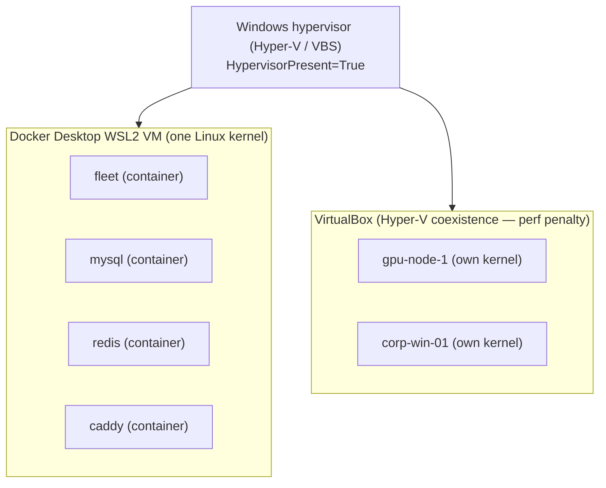
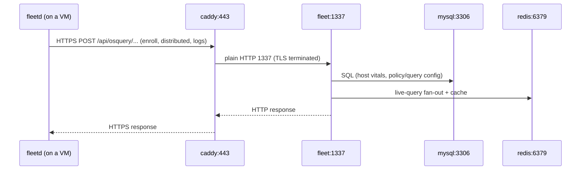
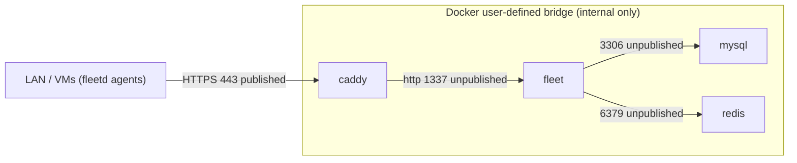
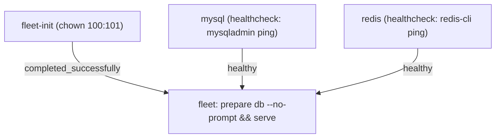
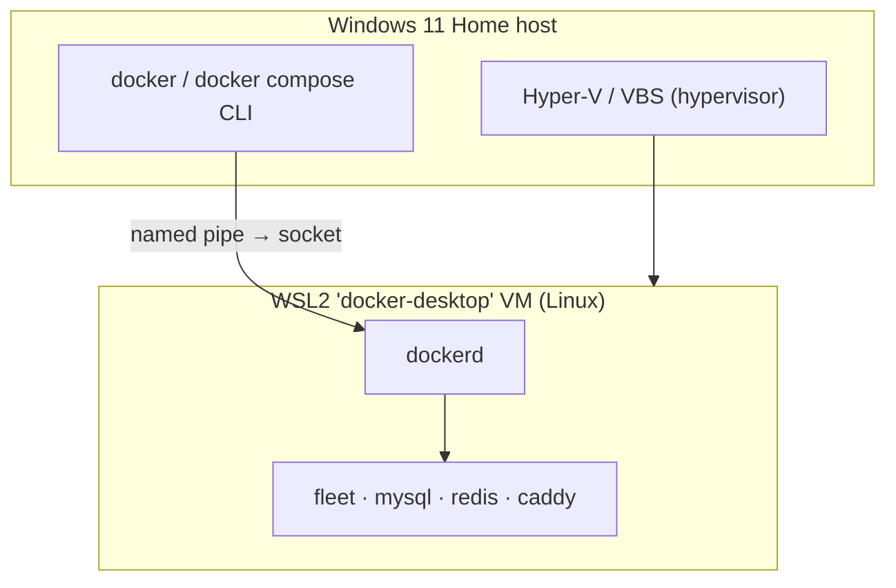

# 🐳 Containers & Docker
> Part of the **[Project AXIOM Encyclopedia](./README.md)** · Layer: Containerization. How the Fleet control plane (`axiom-core`) is packaged, isolated, wired together, and made rebuildable-from-Git as a set of Docker containers on the WSL2 backend.

`axiom-core` is the only node in the lab that is *not* a virtual machine — it is a **Docker Compose stack** (`fleet` + `mysql:8` + `redis:6` + `caddy`, plus a one-shot `fleet-init` sidecar) running inside the Linux VM that Docker Desktop keeps for you on WSL2. Everything the fleet of endpoints checks into lives here. This layer sits directly **above** the host/hypervisor layer ([01](./01-host-hypervisor-virtualization.md)) and directly **below** Fleet-the-application ([03](./03-fleet-core.md)); understanding it is understanding how the server is assembled, where its state persists, and exactly which port carries which byte. The entries below go in dependency order — from the container/VM distinction, through images and volumes and networking, up to Compose, healthchecks, the init sidecar, the Docker Desktop backend, and secret handling.

---

## Containers vs Virtual Machines (the core distinction)

- **In one line** — A VM virtualizes *hardware and boots its own kernel*; a container virtualizes *the OS* and shares the host kernel, isolating only a process tree.
- **What it actually is** — A container is one or more Linux processes fenced off with kernel primitives (**namespaces** for isolation of PID/mount/network/user/UTS/IPC, **cgroups** for CPU/memory limits, and a **union filesystem** for a layered root). There is no guest kernel, no BIOS, no virtual disk to boot — the process starts in milliseconds and its "machine" is a directory tree plus a set of namespace handles. A VM, by contrast, is a full synthetic computer: a hypervisor gives it virtual CPU/RAM/disk/NIC, and a complete guest OS boots on top. *Analogy:* a VM is a house with its own foundation, plumbing, and electrical panel; a container is a locked apartment in a shared building — its own rooms and door, but the building's utilities (the kernel) are shared.
- **Why it's in Project AXIOM** — The lab deliberately uses **both**, for opposite reasons. The **server** (`axiom-core`: Fleet, MySQL, Redis, Caddy) is containerized because it is stateless-ish infrastructure that benefits from fast, reproducible, image-pinned assembly. The **endpoints** (`gpu-node-1/2`, `ml-workstation`, `enclave-01`, the Windows corp boxes) are deliberately **real VMs, not containers** — ADR-0001 rejected "Linux hosts as containers" precisely because a shared kernel has no real block devices, so disk-encryption, FIM, and USB-storage policies would be theater. You cannot meaningfully test "is BitLocker/LUKS on?" on something that never had a disk.
- **Where it sits in the stack** — The dividing line of this whole encyclopedia. Below both containers and VMs is the host + hypervisor ([01](./01-host-hypervisor-virtualization.md)). Containers run inside Docker Desktop's WSL2 Linux VM; the lab's endpoint VMs run under VirtualBox. Both ultimately draw on the same Windows hypervisor — which is why they *coexist* (see below).
- **How it works** — `dockerd` asks the Linux kernel to `clone()` a process into fresh namespaces, applies cgroup limits, mounts a union filesystem as `/`, drops into the image's entrypoint. A hypervisor instead traps privileged instructions and emulates hardware for a guest kernel. Key consequence: containers can only run binaries for the **host kernel's OS/arch** (Linux/amd64 here), whereas a VM can run *any* OS.
- **Who talks to it, and how** — Not a network actor itself; it's an isolation model. The relevant interaction is architectural: Docker Desktop's WSL2 VM **and** the VirtualBox endpoint VMs both request virtualization from the **same Windows hypervisor** at the same time. Because `HypervisorPresent=True` (WSL2/VBS active), VirtualBox 7.1 can't take raw AMD-V and instead runs through the Hyper-V platform API — the "reduced-performance turtle" coexistence mode. Containers pay no such penalty; they're native Linux processes inside the already-running WSL2 VM.

- **Free vs Premium** — N/A (Docker/virtualization concept, no Fleet licensing).
- **Gotchas / myth-busting** — (1) "Containers are lightweight VMs" is the classic mental-model error — there is **no guest kernel**, so a Linux container cannot run a Windows binary and vice-versa. (2) Containers are *not* a security boundary as strong as a VM: they share the kernel, so a kernel exploit escapes the fence — fine for a lab control plane, but it's why the *endpoints* are VMs. (3) The perf penalty is on the **VirtualBox** side, not Docker — people wrongly blame Docker Desktop for slow VMs; the real cause is that Docker's hypervisor requirement keeps VBS on.
- **See also** — [Docker Desktop & its WSL2 backend](#docker-desktop--its-wsl2-backend) · [Host, hypervisor & Hyper-V coexistence](./01-host-hypervisor-virtualization.md) · [VirtualBox + cloud-init VMs](./01-host-hypervisor-virtualization.md)

---

## Docker Engine (daemon + client)

- **In one line** — The client/server pair where `docker` (CLI) sends commands to `dockerd` (the daemon), which actually creates and supervises containers.
- **What it actually is** — Two halves that talk over a socket. `dockerd` is a long-running root daemon that owns images, containers, volumes, and networks and drives the kernel primitives via `containerd` + `runc`. The `docker` CLI (and `docker compose`) is a thin client that turns your typed command into an HTTP request to the daemon's REST API over a Unix socket (`/var/run/docker.sock`). They are decoupled: the client can be on Windows while the daemon lives inside WSL2.
- **Why it's in Project AXIOM** — It is the runtime that brings up the entire `axiom-core` control plane. Every `docker compose up`, every image pull of `fleetdm/fleet:v4.89.1`, every volume that holds MySQL's data is the Engine doing the work. Because the lab must be "rebuildable from Git alone," the Engine is what turns the committed compose file back into a running server on any machine.
- **Where it sits in the stack** — Inside Docker Desktop's WSL2 VM ([below](#docker-desktop--its-wsl2-backend)), on top of the Linux kernel of that VM. Above it: Compose, images, containers. Beside it on Windows: the `docker` CLI the operator types into PowerShell, which forwards to the daemon in WSL2.
- **How it works** — CLI serializes your command → HTTP over the Docker socket → `dockerd` → `containerd` (image/lifecycle management) → `runc` (the OCI runtime that actually does the `clone()`/namespace/cgroup syscalls). The daemon also runs the embedded DNS resolver for user-defined networks and the health-check scheduler.
- **Who talks to it, and how** —

| Initiator | → Target | Transport | Payload |
|---|---|---|---|
| Operator's `docker`/`docker compose` CLI (Windows) | `dockerd` (WSL2) | HTTP over Docker socket (named-pipe→WSL bridge) | build/run/pull/logs commands |
| `dockerd` | Docker Hub (`registry-1.docker.io`) | HTTPS 443 | image manifest + layer pulls |
| `dockerd` | Linux kernel (same WSL2 VM) | syscalls via `runc` | create namespaces, cgroups, mounts |
| `dockerd` | each container | health-check exec, log capture | periodic probe + stdout/stderr streams |

- **Free vs Premium** — Docker Engine is free/open-source; **Docker Desktop** (the packaging that ships it on Windows) has licensing terms for large orgs but is free for a personal $0 lab.
- **Gotchas / myth-busting** — (1) `dockerd` runs as **root** inside the WSL2 VM; access to the Docker socket is effectively root — treat it as privileged. (2) On Windows there is *no* local Linux `dockerd` on the NT kernel — it lives entirely in the WSL2 distro; "Docker on Windows" is really "Docker in a hidden Linux VM." (3) Stopping Docker Desktop stops the daemon and thus the whole `axiom-core` stack, but **named volumes survive** (see [volumes](#docker-volume-named-vs-bind-mount--why-db-state-survives)).
- **See also** — [Docker Desktop & its WSL2 backend](#docker-desktop--its-wsl2-backend) · [Docker Compose](#docker-compose--the-compose-file) · [Fleet server internals](./03-fleet-core.md)

---

## Docker image, tag & digest — why we pin `:v4.89.1`

- **In one line** — An image is a read-only, layered filesystem template; a **tag** is a mutable human name for it, a **digest** is its immutable content hash.
- **What it actually is** — A stack of filesystem layers plus a JSON config (entrypoint, env, exposed ports) that together form the frozen template a container boots from. It is addressed two ways: by **tag** (`fleetdm/fleet:v4.89.1` — a friendly label that a maintainer can *re-point* to new bytes at any time) and by **digest** (`fleetdm/fleet@sha256:…` — a SHA-256 of the manifest that is mathematically bound to exact content and can never mean anything else). *Analogy:* a tag is like a Git **branch name** (moves), a digest is like a Git **commit SHA** (fixed).
- **Why it's in Project AXIOM** — Reproducibility-from-Git is a founding constraint, and floating tags quietly break it. Fleet ships roughly every three weeks, so `:latest` today is not `:latest` next month. The lab therefore **pins** every image: `fleetdm/fleet:v4.89.1`, `mysql:8`, `redis:6`, and a pinned Caddy. The official Fleet compose defaults the Fleet image to a floating `:latest` — the lab overrides that on purpose.
- **Where it sits in the stack** — Sits between the registry (Docker Hub) and the running container. A container is a *writable instance* of an image; the compose file names which image each service uses.
- **How it works** — `dockerd` resolves `repo:tag` against the registry, downloads the manifest, then pulls each missing layer by its own digest into the local content store, deduplicated across images. At run time it stacks those read-only layers under a thin writable layer for the container.
- **Who talks to it, and how** — `dockerd` (initiator) → Docker Hub over **HTTPS 443**: first a manifest request for `fleetdm/fleet:v4.89.1`, then parallel layer GETs. Nothing else pulls images. After the first pull the image is cached in the WSL2 VM, so subsequent `compose up` runs are offline for images already present.
- **Free vs Premium** — The `fleetdm/fleet` image is the **free** Fleet server (Free and Premium are the *same* binary; a `FLEET_LICENSE_KEY` unlocks Premium features at runtime — empty here). No paid image is needed for the lab.
- **Gotchas / myth-busting** — (1) **Tag naming trap:** the GitHub *release* tag is `fleet-v4.89.1`, but the **Docker image tag drops the `fleet-` prefix** → `fleetdm/fleet:v4.89.1`. Copying the release tag verbatim yields a "manifest unknown" pull error. (2) `docs-v4.90.0` / `docs-v4.91.0` on Docker Hub are **docs-branch preview builds, not stable** — do not pin them. (3) **MySQL floor:** `mysql:8` must resolve to **≥ 8.0.44**; **`9.6.0` is explicitly incompatible** — a bare `mysql:9` can drift into a broken version. (4) A tag can be silently re-pushed; if you want *bit-for-bit* immutability, additionally pin by `@sha256:` digest. (5) Pinning `platform: linux/amd64` avoids surprise arch mismatches when pulling under WSL2.
- **See also** — [Docker container](#docker-container) · [Docker Compose & the compose file](#docker-compose--the-compose-file) · [Fleet versioning & upgrades](./03-fleet-core.md)

---

## Docker container

- **In one line** — A running (or stopped) *instance* of an image: the image's read-only layers plus a thin writable layer, running as an isolated process.
- **What it actually is** — The live thing. `dockerd` takes an image, stacks a writable copy-on-write layer on top, joins it to a set of namespaces and cgroups, and runs the image's entrypoint as PID 1 inside that fence. Its hostname, network interface, process table, and filesystem view are its own; its writable layer is **ephemeral** — deleted with the container unless the data lives on a volume.
- **Why it's in Project AXIOM** — Each `axiom-core` service is exactly one container: `fleet` (runs `fleet prepare db --no-prompt && fleet serve`), `mysql` (the datastore), `redis` (queue/cache/live-query pub-sub), `caddy` (TLS terminator), and the transient `fleet-init` (chown once, exit). Containers give each service its own pinned userland while sharing the one WSL2 kernel.
- **Where it sits in the stack** — The unit Compose orchestrates. Below: the Engine and kernel. Beside: sibling containers on the same user-defined bridge network. Above: the Fleet application logic ([03](./03-fleet-core.md)).
- **How it works** — Lifecycle is `created → running → (paused) → exited/removed`. PID 1 in the container is the service process; when it exits, the container exits. `restart:` policies (e.g. `unless-stopped`) tell `dockerd` to relaunch it. The **writable layer is discarded on `docker rm`** — persistence must come from a [volume](#docker-volume-named-vs-bind-mount--why-db-state-survives).
- **Who talks to it, and how** — For the `fleet` container specifically, the concrete request path:

The `fleet` container **never** talks to the LAN directly — inbound always arrives via Caddy; outbound it opens connections to `mysql:3306` and `redis:6379` by service name over the bridge network.
- **Free vs Premium** — N/A at the container level.
- **Gotchas / myth-busting** — (1) The #1 beginner loss: "I `docker rm`'d the mysql container and my data is gone." It isn't the container that holds data — it's the **named volume**; remove that (`docker volume rm` / `compose down -v`) and it's truly gone. (2) A container is not a VM you `ssh` into and leave running forever — treat it as **cattle**: rebuild from the image + volume, don't hand-edit its filesystem. (3) The `fleet` container's PID 1 runs as **uid 100 / gid 101** (non-root) — the reason the [fleet-init sidecar](#the-fleet-init-sidecar-chown-100101--an-init-container-pattern) exists.
- **See also** — [Docker image](#docker-image-tag--digest--why-we-pin-v4891) · [Docker volume](#docker-volume-named-vs-bind-mount--why-db-state-survives) · [healthchecks & depends_on](#healthchecks--depends_on-ordering-service_healthy--service_completed_successfully)

---

## Docker volume (named vs bind mount) — why DB state survives

- **In one line** — A volume is durable storage mounted into a container that lives independently of the container's ephemeral writable layer.
- **What it actually is** — Two flavors. A **named volume** (`mysql-data:`) is storage Docker manages inside the WSL2 VM's own filesystem — you name it, Docker owns the path, it survives container removal. A **bind mount** maps a specific host path into the container (`./caddy/Caddyfile:/etc/caddy/Caddyfile`) — you control the exact file, and it's ideal for injecting config from the Git repo. *Analogy:* a named volume is a storage-unit locker Docker rents and tracks; a bind mount is you handing the container a symlink to a folder you already own.
- **Why it's in Project AXIOM** — This is *why the lab survives a reboot or an image upgrade*. MySQL's database dir, Redis's append-only file, Fleet's logs and vuln DB, and Caddy's minted certs all live on **named volumes**, so `docker compose down && up` (or bumping `fleet` to a new tag) keeps every host's history, enrollment, and MDM assets intact. Meanwhile **bind mounts** feed Git-tracked config in: the `Caddyfile`, the mkcert leaf cert + key, and the `.env` values. That split is exactly what makes the stack rebuildable-from-Git: code/config is bind-mounted from the repo, *state* is on named volumes.
- **Where it sits in the stack** — Between the container and the WSL2 VM's disk. The compose `volumes:` block declares named volumes; each service's `volumes:` list attaches them at mount points.

| Mount | Type | Holds | Why it must persist |
|---|---|---|---|
| `mysql-data → /var/lib/mysql` | named | all Fleet DB state | hosts, policies, MDM assets, users |
| `redis-data → /data` | named | AOF snapshot | queue/cache continuity |
| `fleet-logs → /logs` | named | osquery status/result logs | telemetry history |
| `vulndb → /vulndb` | named | CVE feed cache | avoids re-download each boot |
| `./Caddyfile → /etc/caddy/Caddyfile` | bind | proxy config | Git-tracked, read-only |
| `./certs/*.pem → /etc/caddy/` | bind | mkcert leaf + key | Git-tracked (or generated), read-only |

- **How it works** — On `compose up`, Docker creates any missing named volumes and mounts each into its container at the declared path, *overlaying* the image's own contents there. Writes go to the volume, not the throwaway layer. On `down` (without `-v`) the containers vanish but the volumes remain; next `up` re-attaches them.
- **Who talks to it, and how** — Only the owning container's process performs file I/O against its mounts (`mysqld` → `/var/lib/mysql`, etc.). The **fleet-init** sidecar is the exception: it mounts the *same* `/logs`, `/data`, and `/vulndb` volumes as `fleet` and `chown`s them so the non-root fleet user can write — a cross-container touch by design.
- **Free vs Premium** — N/A.
- **Gotchas / myth-busting** — (1) **`docker compose down -v` deletes named volumes** — that wipes the entire Fleet database, including MDM assets that can't be re-decrypted if `FLEET_SERVER_PRIVATE_KEY` also changed. Never use `-v` casually on `axiom-core`. (2) A **bind mount hides** whatever the image shipped at that path — mount an empty/typo'd host file over `/etc/caddy/Caddyfile` and Caddy starts with nothing. (3) Named-volume files are owned by whatever uid wrote them; because Fleet runs as uid 100, first boot on a fresh volume needs the chown sidecar or you hit the "unknown userid / permission denied" failure. (4) On WSL2, named volumes live in the Linux VM's ext4 — fast; bind-mounting from `/mnt/c/...` (Windows NTFS) is slow and can mangle permissions, so keep repo bind mounts inside the WSL2 filesystem where practical.
- **See also** — [fleet-init sidecar](#the-fleet-init-sidecar-chown-100101--an-init-container-pattern) · [.env & secret handling](#env-secretsexampleenv--secret-handling) · [TLS/PKI: mkcert & Caddy](./04-tls-and-pki.md) · [Telemetry: osquery logs](./08-telemetry-and-observability.md)

---

## Docker network & port publishing (127.0.0.1 binding)

- **In one line** — Compose puts every service on a private user-defined bridge where they reach each other by name; **port publishing** is the deliberate act of poking one hole from that private network out to the host.
- **What it actually is** — A **user-defined bridge network** is a virtual switch inside the WSL2 VM with an embedded DNS server: containers on it resolve each other by **service name** (`fleet` → the fleet container's internal IP) and can reach each other on *any* port without publishing anything. **Publishing** (`ports:`) is separate and opt-in: it maps a container port to a host interface/port so something *outside* the Docker network can connect. Nothing is reachable from outside unless explicitly published.
- **Why it's in Project AXIOM** — This is the stack's network security posture in one design choice. **MySQL (3306), Redis (6379), and Fleet's plain-HTTP listener (1337) are NOT published** — they exist only on the bridge, reachable only by their sibling containers. The **only** service that publishes to the LAN is **Caddy on 443** — the TLS front door. Fleet speaks plain HTTP internally precisely *because* that port never leaves the bridge; TLS is added exactly at the one published edge. The `127.0.0.1` binding technique is the safety valve for the debug case: if you ever publish Fleet's 1337 to poke it locally, you bind it `127.0.0.1:1337:1337` (host loopback only) — never the default `1337:1337`, which binds `0.0.0.0` and would expose **unencrypted** Fleet to every machine on the LAN.
- **Where it sits in the stack** — The wiring between containers (bridge) and the boundary to the host/LAN (published ports). Above: Caddy/TLS ([04](./04-tls-and-pki.md)). Below: the WSL2 VM's network stack and, ultimately, the host NIC.

- **How it works** — Compose auto-creates a project bridge (`<project>_default`). Each container gets an IP on it and a DNS entry equal to its service name. A `ports:` entry installs a NAT/proxy rule in `dockerd` so `host:HOSTPORT` forwards to `container:CTRPORT`. The bind address in `HOST_IP:HOSTPORT:CTRPORT` decides *which* host interface listens — omit it and you get all interfaces (`0.0.0.0`).
- **Who talks to it, and how** — (1) **fleetd on a VM** → `Caddy:443` (published) over HTTPS. (2) **Caddy** → `fleet:1337` over the bridge by service name, plain HTTP. (3) **fleet** → `mysql:3306` and `redis:6379` over the bridge. (4) The operator's browser → `Caddy:443` for the Fleet UI. Only steps (1)/(4) cross the published boundary; the rest are intra-bridge. Because TLS is terminated at Caddy, Caddy adds an `X-Forwarded-For` header so Fleet can attribute the agent's real source IP (for its logs and rate-limiting) instead of seeing every request as coming from the proxy; Fleet's client-IP/trusted-proxy handling controls how that header is parsed.
- **Free vs Premium** — N/A (Docker networking).
- **Gotchas / myth-busting** — (1) **`expose:` ≠ `ports:`** — `expose` is documentation only; `ports` actually publishes. (2) Containers reach each other by **service name, not `localhost`** — inside the `fleet` container, `localhost` is the fleet container itself, not mysql. (3) Default `1337:1337` silently binds **all** interfaces; on a laptop that means your unencrypted Fleet is on the LAN — always scope debug publishes to `127.0.0.1`. (4) On Docker Desktop/WSL2, published ports are proxied from Windows into the VM; from another LAN machine you reach them via the **host's** IP, not the container IP (which is unroutable off-box). (5) **Live-query results ride a WebSocket** upgraded *through* Caddy; because the browser's `Origin` no longer matches Fleet's own URL once proxied, the lab must set `FLEET_SERVER_WEBSOCKETS_ALLOW_UNSAFE_ORIGIN=true` (default `false`) or the live-query UI silently fails to stream results.
- **See also** — [Caddy TLS termination](./04-tls-and-pki.md) · [Docker Compose](#docker-compose--the-compose-file) · [Fleet server URL & trusted proxies](./03-fleet-core.md) · [Telemetry: Prometheus /metrics auth-gating](./08-telemetry-and-observability.md)

---

## Docker Compose & the compose file

- **In one line** — A single declarative YAML file that defines the whole multi-container stack, brought up/down as one unit with `docker compose`.
- **What it actually is** — `docker-compose.yml` describes *services* (containers), their images, env, volumes, networks, ports, healthchecks, and dependency order; `docker compose up` reconciles reality to that description. It is infrastructure-as-code for a single host — the committed source of truth from which `axiom-core` is rebuilt.
- **Why it's in Project AXIOM** — It **is** the "rebuildable from Git alone" promise for the server. One `docker compose up -d` reconstructs Fleet + MySQL + Redis + Caddy + the init sidecar, in the right order, with the right volumes, on any machine. The lab uses the **canonical supported compose from `docs/solutions/docker-compose/`** as its base — explicitly **not** the Fleet repo-root `docker-compose.yml`, which is the *developer* environment (mailhog, saml_idp, localstack) and not a deploy target. The canonical compose does *not* ship Caddy; the lab adds the Caddy service and the TLS-termination overrides on top of it.
- **Where it sits in the stack** — Orchestration layer directly above the Engine, below the running services. The `.env` file feeds it variable substitution; bind mounts feed config in.
- **How it works** — Compose parses the YAML, creates the project network + named volumes, pulls/starts services honoring `depends_on`, and (with `${VAR}` interpolation) substitutes values from `.env` and the shell. `up -d` runs detached; `down` stops+removes containers and the network (volumes survive without `-v`); `logs`, `ps`, `exec` operate on the project. Multiple `-f` files can layer overrides.
- **Who talks to it, and how** — The operator's `docker compose` CLI (initiator) → `dockerd` over the Docker socket, translating the YAML into a sequence of image pulls, network/volume creates, and container starts. Compose itself is not a running daemon — it's a client that configures the Engine and exits.
- **Free vs Premium** — N/A (Compose is free tooling). *Note:* the Fleet server it launches is Free (no license key).
- **Gotchas / myth-busting** — (1) **Wrong-file trap:** the repo-root `docker-compose.yml` in the Fleet source is a dev env — using it as your deploy target pulls in services you don't want and misses the lab wiring; use `docs/solutions/docker-compose/`. (2) The stock `env.example` is written for **Fleet terminating its own TLS** (it exposes a `FLEET_SERVER_TLS` toggle and expects a server cert/key pair mounted into the `fleet` container); the lab instead sets `FLEET_SERVER_TLS=false` and drops those cert mounts because **Caddy owns TLS** — Fleet then speaks plain HTTP on `:1337` inside the bridge. (3) `compose down -v` is the footgun again — it takes the volumes. (4) Version skew: keep `fleetctl` matched to the pinned server image, or GitOps YAML using newer keys gets rejected. (5) It orchestrates **one host** — it is not Kubernetes and has no multi-node scheduling (not needed here).
- **See also** — [healthchecks & depends_on](#healthchecks--depends_on-ordering-service_healthy--service_completed_successfully) · [.env & secret handling](#env-secretsexampleenv--secret-handling) · [Docker network & port publishing](#docker-network--port-publishing-127001-binding) · [GitOps & CI/CD](./06-gitops-and-cicd.md)

---

## healthchecks & depends_on ordering (service_healthy / service_completed_successfully)

- **In one line** — A **healthcheck** lets a container report ready/not-ready; **depends_on conditions** make Compose *wait* for that readiness before starting a dependent service.
- **What it actually is** — A healthcheck is a command Docker runs *inside* a container on an interval (e.g. `mysqladmin ping`, `redis-cli ping`); its exit code drives the container's health state: `starting → healthy → unhealthy`. `depends_on` with a **condition** turns that state into a gate: `service_healthy` (wait until the dependency is healthy), `service_completed_successfully` (wait until a one-shot exits 0), or plain `service_started` (weakest — just launched). Without conditions, `depends_on` only orders *start*, not *readiness*.
- **Why it's in Project AXIOM** — It defeats the classic boot race. Fleet's entrypoint runs `fleet prepare db --no-prompt && fleet serve`; if it fires before **MySQL** can accept connections it crash-loops, and if the log/data volumes aren't chowned yet it dies with a permission error. So `fleet` declares: wait for `mysql` **service_healthy**, `redis` **service_healthy**, and `fleet-init` **service_completed_successfully**. Only when the datastore is truly accepting queries *and* the volumes are owned by uid 100 does Fleet start migrating and serving. (Values verified against the canonical compose: 10s interval, 5s timeout, 12 retries on the DB/cache pings.)
- **Where it sits in the stack** — A Compose-level ordering mechanism; conceptually between "containers exist" and "the app can safely run." It's the glue that makes the single `up` deterministic.
- **How it works** — `dockerd` runs each service's `healthcheck.test` every `interval`, allowing `start_period` grace and `retries` failures before flipping to `unhealthy`. Compose polls these states and releases a gated dependent only when its condition is met.

- **Who talks to it, and how** — `dockerd` (initiator) → each container: executes the probe command inside it and reads the exit code; no network port is involved for the probe. Compose reads container health from the daemon and schedules starts accordingly. The dependency edges are one-directional: `fleet` waits on the other three; nothing waits on `fleet`.
- **Free vs Premium** — N/A.
- **Gotchas / myth-busting** — (1) **`depends_on` without a condition does NOT wait for readiness** — the dependency being "started" says nothing about MySQL accepting connections; you must use `service_healthy`. (2) `service_completed_successfully` is specifically for **one-shot** containers like `fleet-init` — using it on a long-running service would wait forever. (3) A too-short `start_period` marks a slow-initializing MySQL `unhealthy` and can wedge the whole `up`; give the DB adequate grace. (4) Health state is **local to this host** — it's a startup-ordering tool, not a cluster readiness/liveness system.
- **See also** — [fleet-init sidecar](#the-fleet-init-sidecar-chown-100101--an-init-container-pattern) · [Docker container lifecycle](#docker-container) · [Fleet DB migration (`prepare db`)](./03-fleet-core.md)

---

## the fleet-init sidecar (chown 100:101) — an init-container pattern

- **In one line** — A throwaway `alpine` container that runs **once** to `chown -R 100:101` the shared volumes so the non-root Fleet process can write, then exits.
- **What it actually is** — A one-shot "init container": a container whose entire job is a setup task that must complete *before* the main service starts. Here it's a pinned `alpine` running `chown -R 100:101 /logs /data /vulndb` against the same named volumes Fleet will use, then exiting 0. It runs as **root** (which it's allowed to do) precisely so it can hand ownership to the **unprivileged** uid Fleet runs as. *Analogy:* the stagehand who unlocks the dressing rooms before the (non-root) performer arrives, then leaves.
- **Why it's in Project AXIOM** — Fleet's container runs its process as **uid 100 / gid 101** (defense-in-depth: no root inside the app container). But a *freshly created* named volume is owned by `root:root`, so Fleet's first write fails with a permission/"unknown userid" error — a real startup failure class that the compose must design around. The sidecar fixes ownership on the empty volumes at first boot so migration and logging succeed. It's idempotent, so it's harmless on later boots.
- **Where it sits in the stack** — A gate in the startup sequence, wired via `depends_on: fleet-init: condition: service_completed_successfully`. It sits beside `fleet` but must finish before it.
- **How it works** — On `up`, Compose starts `fleet-init`; it mounts the shared volumes, chowns them, exits 0. That success flips `fleet`'s `service_completed_successfully` gate open. `fleet-init` never restarts (it's a task, not a service).
- **Who talks to it, and how** — No network at all. Its only interaction is **filesystem**: it and the `fleet` container both mount the *same* named volumes (backing `/logs`, `/vulndb`, and `/data`), and the sidecar mutates their ownership so the later fleet process can write. The handoff is entirely via shared-volume metadata, sequenced by the `depends_on`/completed-successfully machinery.
- **Free vs Premium** — N/A.
- **Gotchas / myth-busting** — (1) **Do not skip it.** Omitting the sidecar reproduces the "unknown userid"/permission-denied first-boot failure on a freshly created (root-owned) named volume — one of the top local-lab boot failures. (2) The magic numbers are **100:101** (uid 100 / gid 101), matching Fleet's in-image user — not `1000:1000` or `root`. (3) It's the **init-container pattern**, the Compose analogue of a Kubernetes `initContainers` entry — a task that must reach "completed" before the main workload, not a long-lived service. (4) It only helps on volumes it actually mounts — if you add a new persisted path for Fleet, add it to the chown list too.
- **See also** — [healthchecks & depends_on](#healthchecks--depends_on-ordering-service_healthy--service_completed_successfully) · [Docker volume permissions](#docker-volume-named-vs-bind-mount--why-db-state-survives) · [Fleet non-root user](./03-fleet-core.md)

---

## Docker Desktop & its WSL2 backend

- **In one line** — The Windows app that runs the Docker Engine inside a lightweight WSL2 **Linux VM**, giving Windows a real Linux container runtime.
- **What it actually is** — Docker Desktop manages a dedicated WSL2 distribution (`docker-desktop`) that boots a Linux kernel and runs `dockerd` inside it; the Windows-side `docker` CLI forwards to that daemon. All Linux containers in the lab — Fleet, MySQL, Redis, Caddy — are processes inside that one WSL2 VM. *Analogy:* Docker Desktop is a concierge that keeps a small Linux machine running in the back office and relays your Windows commands to it.
- **Why it's in Project AXIOM** — It's the substrate for the entire `axiom-core` control plane; the lab explicitly installs it in Phase 1 (the host had it *not installed* at Phase 0 recon). It also has a lab-wide side effect that shapes ADR-0001/0002: to run its WSL2 VM it **requires the Windows hypervisor to be on** (`HypervisorPresent=True`), which is exactly why VirtualBox drops into Hyper-V **coexistence** mode with a perf penalty. Docker Desktop's benefit (a real Linux runtime on Windows 11 Home) directly causes the endpoint VMs' turtle.
- **Where it sits in the stack** — Between the Windows host and the container Engine. Below: Windows + Hyper-V/VBS ([01](./01-host-hypervisor-virtualization.md)). Inside: the WSL2 Linux VM → `dockerd` → containers.
- **How it works** — On start, Docker Desktop boots its WSL2 utility VM (via the Windows hypervisor), launches `dockerd` there, and bridges the Docker named pipe from Windows into the VM so `docker`/`docker compose` on Windows reach the Linux daemon. Published ports are proxied from Windows into the VM. Named volumes live on the VM's ext4 disk.

- **Who talks to it, and how** — (1) Windows `docker` CLI → `dockerd` in WSL2 over the piped Docker socket. (2) Docker Desktop → the Windows hypervisor to boot/stop its VM. (3) LAN/browser → published `Caddy:443` via the Windows port proxy into the VM. Docker Desktop coordinates all of this; you rarely talk to its GUI beyond start/stop and resource limits (the lab caps `axiom-core` at ~10 GB).
- **Free vs Premium** — Docker Desktop is free for personal/small use (this lab); Docker's paid tiers are org-scale licensing, not needed here.
- **Gotchas / myth-busting** — (1) "Docker runs natively on Windows" — **false** for these images; they run in the hidden WSL2 Linux VM. (2) You **can't** avoid the VirtualBox perf penalty by "turning off Hyper-V" — Docker Desktop depends on it, so disabling it breaks Docker (ADR-0001 rejects this tradeoff). (3) Keep repo files you bind-mount inside the WSL2 filesystem, not `/mnt/c`, for speed and correct permissions. (4) Docker Desktop's memory limit is shared by the *whole* WSL2 VM — size it against the 36 GB lab budget so the endpoint VMs still fit.
- **See also** — [Containers vs VMs](#containers-vs-virtual-machines-the-core-distinction) · [Docker Engine](#docker-engine-daemon--client) · [Host, hypervisor & Hyper-V coexistence](./01-host-hypervisor-virtualization.md)

---

## .env, secrets.example.env & secret handling

- **In one line** — `.env` supplies Compose's `${VAR}` values (and holds secrets) and is **git-ignored**; `secrets.example.env` is the committed, value-less template you copy from.
- **What it actually is** — Compose auto-reads a file named `.env` in the project dir and substitutes `${VAR}` references in the YAML before starting anything — that's how the DB password, enroll secret, and `FLEET_SERVER_PRIVATE_KEY` reach the containers as environment variables. Because that file contains real secrets, it is **never committed**; instead the repo tracks `secrets.example.env` — the same keys with placeholder/blank values and a comment on how to generate each. New machine = copy example → fill in → `compose up`. *Analogy:* `secrets.example.env` is the blank form checked into Git; `.env` is your filled-out copy that stays in a drawer.
- **Why it's in Project AXIOM** — It squares "rebuildable from Git alone" with "no secrets in Git." The **schema** of every secret (which vars exist, how to regenerate them) is committed and reproducible; the **values** are local and gitignored. This is what lets a clone of the repo rebuild the server without ever having leaked a credential.
- **Where it sits in the stack** — A build-time input to Compose, consumed before containers start. It feeds env vars into `fleet` (and MySQL creds into `mysql`); it is *not* itself a running component.
- **How it works** — At `compose up`, Compose loads `.env`, interpolates `${FLEET_SERVER_PRIVATE_KEY}` etc. into each service's `environment:`, and passes them into the container's env. Fleet reads its config entirely from `FLEET_*` env vars. Values that must be *generated* (per the example file's instructions): `FLEET_SERVER_PRIVATE_KEY` = `openssl rand -base64 32`; the global enroll secret = a random string; MySQL passwords = random.

| Secret | Where it lives | How generated | Consumed by |
|---|---|---|---|
| `FLEET_SERVER_PRIVATE_KEY` | `.env` (gitignored) | `openssl rand -base64 32` (≥32B) | `fleet` — **encrypts MDM assets** |
| Global enroll secret | `.env` + baked into fleetd pkgs | random string | agent enrollment |
| `MYSQL_PASSWORD` / root | `.env` | random | `mysql`, `fleet` |
| API token (for GitOps) | CI secret store, not `.env` | Fleet UI (global-admin) | `fleetctl gitops` |

- **Who talks to it, and how** — Only the **Compose CLI** reads `.env`, at start, on the host — it never becomes a network endpoint. From there values flow one-way into container environments. Separately, secrets that belong *inside* Fleet artifacts (profiles/scripts) are not put in `.env` at all — Fleet supports a `$FLEET_SECRET_*` prefix that is stored encrypted server-side and injected at delivery time (see GitOps).
- **Free vs Premium** — `FLEET_SERVER_PRIVATE_KEY` is required on **Free** and is precisely **what enables MDM** (it encrypts MDM assets) — MDM is not gated behind Premium here; the key is. `FLEET_LICENSE_KEY` stays **empty** (Free).
- **Gotchas / myth-busting** — (1) **Never regenerate `FLEET_SERVER_PRIVATE_KEY` after MDM assets exist** — the old assets become permanently undecryptable; back it up the moment MDM is turned on. (2) Compose's `.env` (project-level interpolation) is a *different thing* from a service's `env_file:` (vars loaded into one container) — don't conflate them. (3) A committed `.env` is the classic leak — verify `.gitignore` covers it and only `secrets.example.env` is tracked. (4) Env-var secrets are visible via `docker inspect`/process env to anyone with Docker socket access — acceptable for a single-operator lab; for real deployments prefer Docker/BuildKit secrets. (5) The enroll secret is also **baked into every fleetd package** you build, so treat package artifacts as sensitive too.
- **See also** — [Docker Compose interpolation](#docker-compose--the-compose-file) · [Docker volume (bind-mounted config)](#docker-volume-named-vs-bind-mount--why-db-state-survives) · [MDM & the server private key](./05-mdm.md) · [GitOps `$FLEET_SECRET_*` & enroll secrets](./06-gitops-and-cicd.md) · [TLS/PKI](./04-tls-and-pki.md)

---

> **Layer recap:** `axiom-core` is a pinned, Compose-defined set of containers on Docker Desktop's WSL2 VM. State persists on **named volumes**; config arrives via **bind mounts** and `.env`; a **bridge network** keeps MySQL/Redis/Fleet private while only **Caddy:443** faces the LAN; a **healthcheck + init-sidecar** startup dance makes `fleet prepare db --no-prompt && serve` deterministic. Next layer up: [Fleet server internals →](./03-fleet-core.md). Layer below: [Host & hypervisor →](./01-host-hypervisor-virtualization.md).
