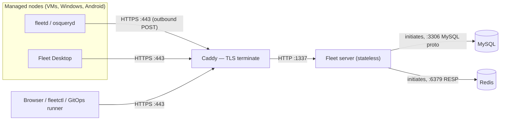
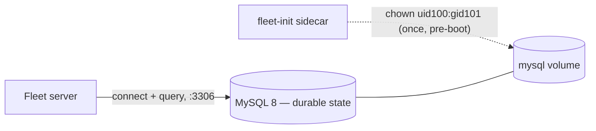
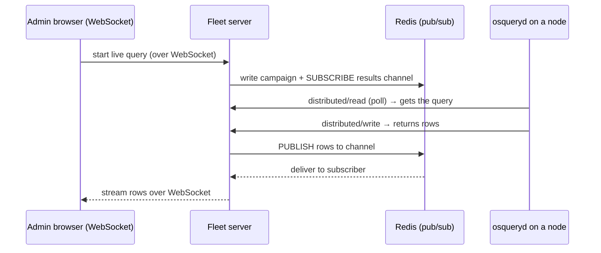
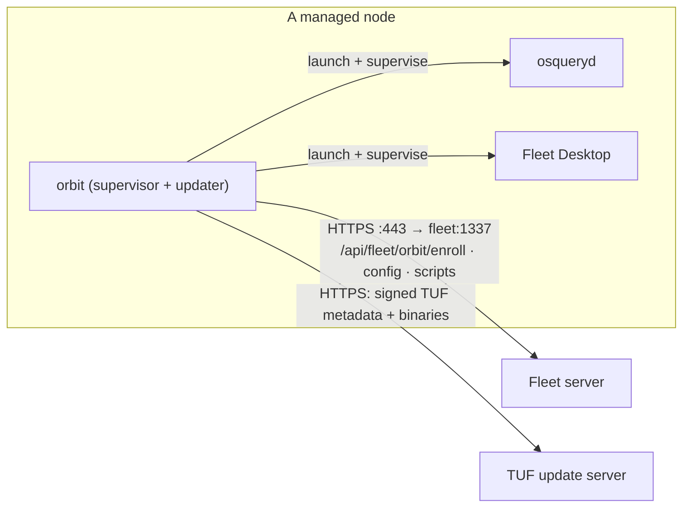
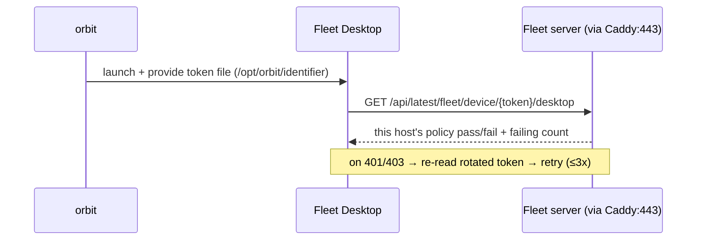
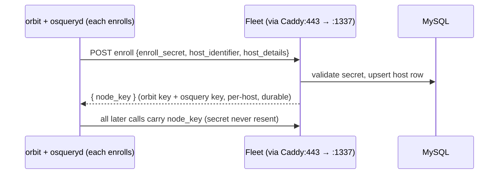
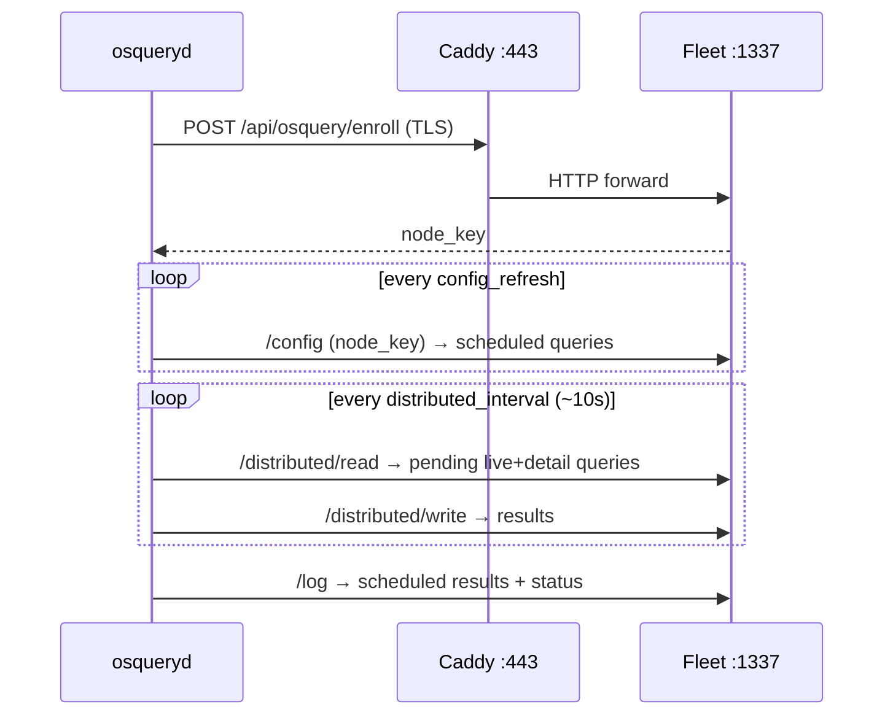
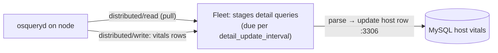
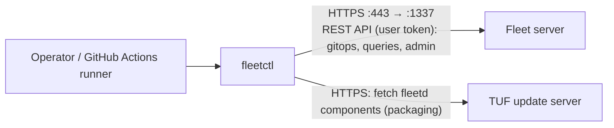

# 🛰️ Fleet Core — Server, Datastores & Agent
> Part of the **[Project AXIOM Encyclopedia](./README.md)** · Layer: Fleet Core. The control plane at the center of the lab — the Fleet server, the two datastores that give it memory (MySQL) and reflexes (Redis), the fleetd/osquery agent that reports from every node, and the endpoints and secrets that stitch them together.

This layer is the "brain and nervous system" of Project AXIOM. Everything else — TLS, MDM, GitOps, policies, telemetry, automation — either *feeds* Fleet or is *driven by* Fleet. The mental model to hold: **Fleet is a stateless Go web server** whose durable memory lives in **MySQL** and whose fast, ephemeral coordination lives in **Redis**; out on each managed node runs **fleetd** (orbit + osqueryd + Fleet Desktop), which *initiates* every connection *inbound* to Fleet — Fleet never dials a host. All that agent traffic arrives over one TLS door ([Caddy](./04-tls-and-pki.md) on `:443`), which forwards plain HTTP to the Fleet container on `:1337`. Keep the direction-of-initiation clear and the rest of the lab falls into place.

---

## FleetDM server

- **In one line** — A single stateless Go binary that is simultaneously the osquery fleet manager, the MDM server, the web UI, the REST API, and the GitOps target.
- **What it actually is** — One compiled binary (`fleet`) that runs two logical "faces" on the *same* listener: the **osquery TLS API** (machine-facing, used by agents) and the **Fleet REST API + web UI** (human/tooling-facing, used by browsers and `fleetctl`). It holds *no durable state itself* — restart it, throw it away, run three copies, and nothing is lost, because the system-of-record is [MySQL](#mysql) and the coordination bus is [Redis](#redis). In the lab we run exactly one replica, but the statelessness is why the whole thing is rebuildable from Git. Think of it as a **switchboard operator with no memory of their own**: every fact they quote comes from the filing cabinet (MySQL) and every "hold, connecting you now" happens through the intercom (Redis).
- **Why it's in Project AXIOM** — It is the "single pane of glass." All ten nodes in the [topology](./01-host-hypervisor-virtualization.md) target it (the Mac is deferred and iOS is simulated, so not all ten report *yet*); all policy/query/config is applied to it via [GitOps](./06-gitops-and-cicd.md); all telemetry and MDM flow through it. Pinned to **`fleetdm/fleet:v4.89.1`** (the image tag drops the `fleet-` prefix from the release name).
- **Where it sits in the stack** — Dead center. *Below/beside it:* [MySQL](#mysql) and [Redis](#redis) (its datastores), and [Caddy](./04-tls-and-pki.md) (the TLS front door it sits behind). *Above it:* browsers, [fleetctl](#fleetctl), and the [GitOps runner](./06-gitops-and-cicd.md). *Reaching up to it from below:* [fleetd](#fleetd--orbit) agents on every node. It runs as a container in the `axiom-core` Docker stack ([containers layer](./02-containers-and-docker.md)).
- **How it works** — On boot the lab's container command is literally `fleet prepare db --no-prompt && fleet serve`. The first half runs schema **migrations** against MySQL (idempotent; safe to re-run every boot). The second half starts the HTTP server. By default Fleet listens on **`0.0.0.0:8080`** (`FLEET_SERVER_ADDRESS`); the lab remaps it to **`:1337`**. Because [Caddy](./04-tls-and-pki.md) terminates TLS, Fleet itself runs plain HTTP (`FLEET_SERVER_TLS=false`). It is horizontally scalable precisely because it keeps zero session state locally — auth tokens, live-query campaigns, and host state all live in Redis/MySQL.
- **Who talks to it, and how** — Fleet is almost always the *receiver* of agent traffic and the *initiator* of datastore traffic:

  Key directions: **agents always initiate** (Fleet never connects *out* to a host — there is no listening agent to dial). Fleet **initiates** to MySQL (`:3306`) and Redis (`:6379`). The admin browser also holds a **WebSocket** to Fleet for live-query results; through the Caddy proxy that requires `FLEET_SERVER_WEBSOCKETS_ALLOW_UNSAFE_ORIGIN=true` (see [live-query cycle](#the-osquery-tls-api) and [TLS layer](./04-tls-and-pki.md)).
- **Free vs Premium** — The *binary is identical* across tiers; the license key toggles features (Teams, per-label policy scoping, disk-encryption/OS-update enforcement, CVSS/EPSS/KEV scores). The lab runs **Free** — see the [trust-model layer](./11-concepts-and-trust-model.md) and [ADR-0003](./07-policy-as-code.md) for what that removes and how we emulate it.
- **Gotchas / myth-busting** — (1) *Fleet is not a database*; losing the container loses nothing, losing the MySQL volume loses everything. (2) The default port is **8080**, not 1337 — 1337 is a lab choice, so don't assume it upstream. (3) Migrations are baked into the start command here, so there is no separate "run migrations" step to forget. (4) It serves osquery agents and humans on the *same* port; you don't get a separate agent port.
- **See also** — [MySQL](#mysql) · [Redis](#redis) · [Caddy & TLS termination](./04-tls-and-pki.md) · [Docker stack](./02-containers-and-docker.md) · [GitOps target](./06-gitops-and-cicd.md) · [Ops endpoints](#ops-endpoints-healthz-metrics-version)

---

## MySQL

- **In one line** — The durable system-of-record: every host, policy, query, config, software row, user, and (encrypted) MDM asset lives here.
- **What it actually is** — A relational database holding *all persistent Fleet state*. If Fleet is a switchboard operator with no memory, MySQL is the **filing cabinet** that remembers everything between calls. The lab pins **`mysql:8`** and the ground-truth requirement is **MySQL ≥ 8.0.44** — importantly **MySQL 9.6.0 is incompatible**, so don't chase the newest tag.
- **Why it's in Project AXIOM** — It is what makes the whole lab "rebuildable from Git *plus one volume*." The Fleet container is disposable; the MySQL data volume is the one piece of true state. It also stores the **encrypted MDM assets** (APNs cert/key, SCEP identities, escrowed keys) — which is why the [FLEET_SERVER_PRIVATE_KEY](#fleet_server_private_key) must never be rotated after those assets exist.
- **Where it sits in the stack** — Below Fleet, inside the `axiom-core` Docker stack. Neighbors: [Redis](#redis) (the fast, volatile counterpart) and the Fleet server (its only client). A one-shot **`fleet-init` alpine sidecar** chowns the data volume to **uid 100 / gid 101** before first boot, or Fleet's first run fails on permissions.
- **How it works** — Fleet opens a connection pool to MySQL on `:3306`. On boot, `fleet prepare db --no-prompt` applies any pending migrations (schema versioned in the binary). At runtime Fleet reads/writes rows for host vitals, scheduled-query results (if configured to store them), policy membership, software inventory, labels, users/sessions, and MDM state. Fleet supports a read-replica split (write DSN + read DSN); the lab uses a single instance for both.
- **Who talks to it, and how** — **Only Fleet talks to MySQL**, and **Fleet always initiates** over the MySQL wire protocol on `:3306` inside the Docker network. Agents *never* touch MySQL; humans *never* touch MySQL — everything is mediated by the Fleet API. Direction is strictly Fleet → MySQL (request/response), no callbacks.

- **Free vs Premium** — Identical across tiers; the datastore schema is the same. (Premium's Teams add rows/columns but need no different engine.)
- **Gotchas / myth-busting** — (1) **Version pinning is real**: `mysql:latest` can pull 9.x and break Fleet; require ≥ 8.0.44 and avoid 9.6.0. (2) The **chown sidecar is not optional** — skip it and first boot dies on a permission error, which looks like a Fleet bug but isn't. (3) Storing *scheduled-query results* in MySQL is optional and can bloat it; the lab prefers shipping logs to the [telemetry](./08-telemetry-and-observability.md) pipeline instead. (4) MDM assets in MySQL are **encrypted at rest by the app**, not by MySQL — see [FLEET_SERVER_PRIVATE_KEY](#fleet_server_private_key).
- **See also** — [FleetDM server](#fleetdm-server) · [Redis](#redis) · [FLEET_SERVER_PRIVATE_KEY](#fleet_server_private_key) · [Docker volumes & the init sidecar](./02-containers-and-docker.md) · [MDM assets](./05-mdm.md)

---

## Redis

- **In one line** — Fleet's short-term memory and message bus: caches, distributed locks/leader election, and the pub/sub fan-out that carries **live-query** results.
- **What it actually is** — An in-memory key/value store used for *ephemeral, fast-moving* state that Fleet does **not** want to hammer MySQL with. Three jobs: (1) **cache** (e.g. host-seen times, aggregated stats, auth/session bits); (2) **distributed locks & cron leadership** so that with multiple Fleet replicas only one runs each scheduled job; (3) **pub/sub** for **live queries** — the real-time "ask all hosts right now" feature. The lab pins **`redis:6`**. If MySQL is the filing cabinet, Redis is the operator's **scratch notepad and intercom** — nothing on it needs to survive a restart.
- **Why it's in Project AXIOM** — Without Redis, live queries in the UI don't work and Fleet can't safely run its background crons. It's what makes the "run this SQL across all GPU nodes and watch results stream in" experience possible.
- **Where it sits in the stack** — Beside [MySQL](#mysql), below Fleet, in the `axiom-core` stack. It is *volatile by design* — it holds no system-of-record data, so it needs no careful backup.
- **How it works** — Fleet connects to Redis on `:6379`. For a **live query**: the admin starts a campaign in the UI/`fleetctl`; Fleet writes the campaign + target set into Redis and subscribes to a results channel. Target hosts pick up the query on their next **distributed/read** poll, run it, and POST results back via **distributed/write**; the receiving Fleet instance **publishes** each result to the Redis channel; whichever Fleet instance holds the admin's WebSocket is **subscribed** and streams results to the browser. In a single-replica lab the publisher and subscriber are the same process, but the flow still routes through Redis pub/sub.
- **Who talks to it, and how** — **Only Fleet talks to Redis**, and Fleet **initiates** on `:6379` (RESP protocol) inside the Docker network. Agents and humans never touch it.

- **Free vs Premium** — Identical across tiers.
- **Gotchas / myth-busting** — (1) Redis is **not** where host data lives — flushing it loses live-query campaigns in flight and caches, nothing durable. (2) Live-query UI through the Caddy proxy needs `FLEET_SERVER_WEBSOCKETS_ALLOW_UNSAFE_ORIGIN=true`; that's a **WebSocket/origin** issue, not a Redis one, but it's the usual reason "live query spins forever." (3) Redis is the reason Fleet can be multi-replica safely (locks/leadership); with one replica you still need it. (4) Redis 6 is pinned deliberately — don't assume 7 behaves identically for Fleet's cluster/standalone config.
- **See also** — [The osquery TLS API](#the-osquery-tls-api) (distributed read/write) · [FleetDM server](#fleetdm-server) · [WebSocket origin & the proxy](./04-tls-and-pki.md) · [Telemetry](./08-telemetry-and-observability.md)

---

## osquery & osqueryd

- **In one line** — The engine that exposes a host's live OS state (processes, users, files, packages, firewall, disk-encryption status…) as **SQL tables** you can `SELECT` from; `osqueryd` is the long-running daemon form.
- **What it actually is** — **osquery** is an open-source instrumentation framework that models the operating system as a relational database: `SELECT * FROM processes`, `SELECT * FROM users`, `SELECT * FROM bitlocker_info`. **osqueryd** is the daemon that runs those queries on a schedule and responds to on-demand ("distributed") queries. It is the *actual data source* behind every host fact Fleet shows — Fleet is a manager/aggregator; osquery is the sensor. Analogy: osquery turns "the state of this machine right now" into a **database you can query**, and Fleet is the query router for thousands of those databases.
- **Why it's in Project AXIOM** — It's how every Ubuntu VM, Windows box, and Android device answers Fleet's questions: host vitals, [policy](./07-policy-as-code.md) checks (which are just SQL that returns 1 row = pass), [vulnerability](./08-telemetry-and-observability.md) software inventory, FIM events on `/opt/axiom/weights-cache` (enclave-01), and detection-only compliance reads (FDE state, OS version) since enforcement is Premium.
- **Where it sits in the stack** — On **each managed node**, wrapped and supervised by [orbit](#fleetd--orbit). It does not run standalone in the lab; orbit launches it with Fleet-supplied flags. Above it: orbit → the network → [Caddy](./04-tls-and-pki.md) → Fleet. Below it: the OS kernel/APIs it reads.
- **How it works** — In "TLS mode," osqueryd is configured (by orbit) to fetch its config, receive distributed queries, and ship logs to a remote server over the **osquery TLS API** rather than local flat files. It enrolls once to get a **node key**, then polls: a **config refresh** (scheduled queries + options) and a **distributed interval** (typically ~10s) to pick up live/detail queries. Results are logged back over TLS.
- **Who talks to it, and how** — osqueryd is a **pure client — it only makes outbound HTTPS calls; nothing connects *to* it.** It initiates to [Caddy](./04-tls-and-pki.md)`:443`, which forwards to `fleet:1337`. It authenticates each call with its node key (after enrolling with the [enroll secret](#enroll-secret)). See the [osquery TLS API](#the-osquery-tls-api) entry for the endpoint-by-endpoint breakdown.
- **Free vs Premium** — osquery is fully open-source and unaffected by Fleet's license tier. What differs is what Fleet *does* with the results (e.g. per-label policy scoping is Premium — see [ADR-0003](./07-policy-as-code.md)).
- **Gotchas / myth-busting** — (1) **The single most important trust-chain fact in this lab:** `osqueryd` does **not** use the OS system trust store. orbit and Fleet Desktop do, but osqueryd validates Fleet's TLS cert against a file you give it (`--tls_server_certs`). That's why [`fleetctl package --fleet-certificate`](#fleetctl) must bake in the **CA (`rootCA.pem`), not the leaf** — omit it and osquery enrollment fails with a TLS error even though a browser trusts the site. (2) A Fleet **policy** is just an osquery query whose contract is "returns ≥1 row ⇒ pass"; there's no separate policy engine on the host. (3) osquery tables are **platform-specific** — `bitlocker_info` is Windows-only, `disk_encryption` differs by OS — which is why the lab's [lib/](./06-gitops-and-cicd.md) is partitioned by platform.
- **See also** — [The osquery TLS API](#the-osquery-tls-api) · [fleetd & orbit](#fleetd--orbit) · [Host vitals & detail-query cycle](#host-vitals--the-detail-query-cycle) · [Policy-as-code](./07-policy-as-code.md) · [Why osqueryd needs the CA](./04-tls-and-pki.md)

---

## fleetd & orbit

- **In one line** — **fleetd** is the installable agent *bundle*; **orbit** is the supervisor/auto-updater inside it that launches and keeps osqueryd + Fleet Desktop current.
- **What it actually is** — When you install "the Fleet agent," you install **fleetd**, a bundle of three things: **orbit** (the updater/supervisor), **osqueryd** (the [query engine](#osquery--osqueryd)), and **[Fleet Desktop](#fleet-desktop)** (the end-user tray app). **orbit** is a small Go program that (a) enrolls the host, (b) launches osqueryd with the right flags and TLS config, (c) launches Fleet Desktop, and (d) **auto-updates** all three components. Analogy: orbit is the **package manager + init system for the agent itself** — you deploy it once and it keeps the moving parts patched.
- **Why it's in Project AXIOM** — It's the deploy-once agent for every node. Built per-platform with `fleetctl package --type deb|rpm|msi|pkg`. Auto-update means the lab doesn't hand-patch osquery on ten machines; orbit pulls new versions itself.
- **Where it sits in the stack** — On each managed node, the top of the on-host stack: orbit parents osqueryd and Fleet Desktop. Below it: the OS. Above/beside it (over the network): [Caddy](./04-tls-and-pki.md) → Fleet, and a **TUF update server**.
- **How it works** — orbit uses **The Update Framework (TUF)** (via the `go-tuf` library) to securely fetch component updates. It periodically checks an update repository (Fleet's public TUF repo by default, or a self-hosted one) and, per configured **channel** (e.g. `stable`), downloads a newer orbit/osqueryd/Fleet Desktop if one exists — with TUF's signed metadata guaranteeing authenticity so the update path can't be trivially poisoned. On the Fleet side, orbit talks its **own orbit API** (`/api/fleet/orbit/…`: enroll, config, flags, script execution, ping) — distinct from the raw osquery TLS API that osqueryd speaks.
- **Who talks to it, and how** — orbit is a **client** in two directions, always **outbound**:

  orbit **initiates**: to Fleet (`:443`→`:1337`) — it enrolls at **`/api/fleet/orbit/enroll`** (receiving an **orbit node key**, separate from osqueryd's), then fetches orbit config/flags and polls for **script-execution** work (it runs scripts and posts results — the basis of Phase 8 auto-remediation, which is **Free**); and to the TUF server for updates. Fleet never dials orbit. Unlike osqueryd, **orbit *does* use the OS system trust store**, so it can validate Fleet's leaf even without a baked-in CA — but osqueryd still needs the CA file, which is the whole reason `--fleet-certificate` exists.
- **Free vs Premium** — fleetd, orbit, and TUF auto-update are **Free**. Script execution via orbit is **Free** (Phase 8 works at $0). Some *targets* of scripts (e.g. locking/wiping via MDM commands) have Free/Premium splits — see [MDM](./05-mdm.md) and [automation/IR](./10-automation-and-ir.md).
- **Gotchas / myth-busting** — (1) "fleetd," "orbit," and "osquery" are **not** synonyms: fleetd = the bundle, orbit = the supervisor/updater, osqueryd = the sensor. (2) There is **no `--fleet-tls` flag** on `fleetctl package`; TLS trust is handled by `--fleet-certificate` (the CA) plus each component's trust behavior. (3) Because orbit auto-updates osqueryd, the osquery version on a host may drift ahead of what you packaged — pin the update **channel** if you need determinism. (4) The **enroll secret is embedded in the package** at build time (`--enroll-secret`); rotating it means re-packaging or re-provisioning secrets.
- **See also** — [osquery & osqueryd](#osquery--osqueryd) · [Fleet Desktop](#fleet-desktop) · [enroll secret](#enroll-secret) · [fleetctl](#fleetctl) · [Script-execution auto-remediation](./10-automation-and-ir.md) · [Trust store vs baked CA](./04-tls-and-pki.md)

---

## Fleet Desktop

- **In one line** — The end-user-facing tray app inside fleetd that shows the device's owner their own compliance status and links to self-service, authenticated by a per-device token.
- **What it actually is** — A small system-tray/menu-bar application (part of the [fleetd](#fleetd--orbit) bundle) that gives the *human using the machine* a "My device" view: which [policies](./07-policy-as-code.md) they pass/fail, how to remediate, and (where enabled) self-service actions — without giving them admin access to Fleet. It is the "**you have 1 issue to fix**" nudge on the employee's own screen, distinct from the admin console.
- **Why it's in Project AXIOM** — It closes the loop on trust-tiering and remediation: a user on `corp-win-01` can see *why* their device is out of compliance and fix it, supporting the [trust model](./11-concepts-and-trust-model.md) without a helpdesk ticket. It also demonstrates the **device-authenticated** API surface (different from admin auth).
- **Where it sits in the stack** — On each node, launched and supervised by [orbit](#fleetd--orbit), beside [osqueryd](#osquery--osqueryd). It talks to Fleet through the same [Caddy](./04-tls-and-pki.md)`:443` front door as everything else.
- **How it works** — Fleet Desktop authenticates with a **device token**: a random **v4 UUID** minted by orbit and written to a local file readable by the GUI user (on Linux/macOS, **`/opt/orbit/identifier`**; the location is platform-specific on Windows). orbit rotates it roughly hourly. Fleet Desktop calls **`/api/latest/fleet/device/{token}/desktop`** (and sibling `/device/{token}/…` endpoints) to fetch *only that host's* status. The server rejects any token older than **1 hour** since it was issued; on a 401/403 Fleet Desktop re-reads the (rotated) token from disk and retries (up to 3 attempts, ~5s apart). Because the token is in the URL path, it identifies the host without a login.
- **Who talks to it, and how** — Fleet Desktop is a **client only** and **initiates outbound** HTTPS:

  Direction is strictly Fleet Desktop → Caddy:443 → fleet:1337. Unlike osqueryd, Fleet Desktop **uses the OS system trust store** for TLS, so it validates Caddy's mkcert leaf via the OS-installed [root CA](./04-tls-and-pki.md).
- **Free vs Premium** — The core "My device" experience is **Free**. Some **self-service** and scripted actions surfaced through Desktop can involve Premium features (e.g. software self-service, certain MDM commands) — check the specific action; the lab's IR self-remediation is [script-execution based](./10-automation-and-ir.md) and Free.
- **Gotchas / myth-busting** — (1) The **device token is not the [node key](#enroll-secret)** and not an admin session — it's a scoped, rotating, host-specific credential in the URL. Because it's in the path, don't log full device URLs. (2) It **rotates ~hourly**; a Desktop stuck on an old token self-heals by re-reading the identifier file. (3) Fleet Desktop is optional at package time but on by default in fleetd. (4) It shows the *user* their status; it is **not** how the admin sees hosts (that's the web UI / REST API).
- **See also** — [fleetd & orbit](#fleetd--orbit) · [enroll secret](#enroll-secret) · [Trust model](./11-concepts-and-trust-model.md) · [Identity](./09-identity-and-access.md) · [TLS trust store](./04-tls-and-pki.md)

---

## enroll secret

- **In one line** — A shared secret a host presents once to *join* Fleet; in exchange Fleet issues that host a durable per-host **node key** used for all subsequent auth.
- **What it actually is** — A pre-shared string (created in Fleet, embedded into the fleetd package via `--enroll-secret`) that acts as the "**password to be admitted**." It is a *bootstrap* credential, not a session credential: a host uses it only at the enroll endpoints, receives a **node key** (a long random per-host token), and thereafter authenticates with the node key. Rotating an enroll secret invalidates future enrollments but does not kick already-enrolled hosts.
- **Why it's in Project AXIOM** — It's how each of the ten nodes gets admitted. The lab may issue multiple enroll secrets for *organizational* clarity — **but note the correction below**: on **Fleet Free**, enroll secrets do **not** segment hosts.
- **Where it sits in the stack** — A Fleet-side config value (stored in [MySQL](#mysql)) that is *baked into the agent package* at [`fleetctl package`](#fleetctl) time and consumed at the [enroll endpoints](#the-osquery-tls-api).
- **How it works** — fleetd's two clients enroll **separately, each presenting the same enroll secret**: **orbit** POSTs it (plus host identifiers) to `/api/fleet/orbit/enroll` and gets an **orbit node key**; **osqueryd** POSTs it to `/api/osquery/enroll` and gets an **osquery node key**. Fleet validates the secret, creates/updates the host row, and returns the relevant node key. Every later request (config, distributed read/write, log, orbit config/scripts) carries a node key; the enroll secret is never sent again.
- **Who talks to it, and how** — The **agent initiates** enrollment; Fleet is the validator:

- **Free vs Premium** — **This is a headline lab correction (see [ADR-0003](./07-policy-as-code.md)).** On **Fleet Free**, enroll secrets are *purely a join credential* — they **do not segment or tag hosts**, and *no query even reveals which secret a host used to enroll*. The common assumption "different enroll secrets = free team emulation" is **wrong**. In **Premium**, enroll secrets can be bound to **Teams** and thus do segment hosts. The lab therefore does trust-tiering with a **provisioned marker file** (`/etc/axiom/trust-tier`) read by **self-scoping policy SQL**, plus the free `platform` field and **label-targeted queries** — see [trust model](./11-concepts-and-trust-model.md) and [policy-as-code](./07-policy-as-code.md).
- **Gotchas / myth-busting** — (1) Enroll secret ≠ node key: one is a shared bootstrap password, the other is a per-host durable credential (and orbit vs osqueryd hold *different* node keys). (2) It's **embedded in the installer**, so treat packages as secret-bearing artifacts. (3) On Free it **buys you nothing for segmentation** — don't design tiers around it. (4) Rotating it doesn't disenroll existing hosts; it only affects *new* enrollments.
- **See also** — [fleetd & orbit](#fleetd--orbit) · [The osquery TLS API](#the-osquery-tls-api) · [ADR-0003 trust tiering](./07-policy-as-code.md) · [Trust model](./11-concepts-and-trust-model.md) · [fleetctl package](#fleetctl)

---

## FLEET_SERVER_PRIVATE_KEY

- **In one line** — The server-side symmetric key that **encrypts MDM assets at rest** in MySQL; setting it is what *enables* MDM at all.
- **What it actually is** — A required secret (generated with `openssl rand -base64 32`) that Fleet uses to encrypt sensitive **MDM material** — APNs certificate/key, SCEP identities, ABM/enrollment tokens, escrowed disk-encryption keys — before writing them to [MySQL](#mysql). It is the **master key to the MDM strongbox**: the ciphertext lives in the database, but only a Fleet process holding this key can decrypt it.
- **Why it's in Project AXIOM** — MDM (Windows manual enroll is Free; Apple/Android per [MDM layer](./05-mdm.md)) simply **won't turn on** without it — Fleet gates MDM enablement on the presence of this key. It's the reason the lab can store MDM certs safely in a rebuildable-from-Git database.
- **Where it sits in the stack** — A Fleet server environment secret (injected via the container env / secret store), logically paired with [MySQL](#mysql) (where the encrypted assets live) and the [MDM layer](./05-mdm.md) (what the assets are *for*).
- **How it works** — On startup Fleet reads the key from `FLEET_SERVER_PRIVATE_KEY`. When MDM assets are stored, Fleet encrypts them under this key (authenticated symmetric encryption) and persists ciphertext to the `mdm_config_assets` tables; on use, it decrypts in memory. No agent or human ever sees the key.
- **Who talks to it, and how** — Nothing "talks to" the key over the network — it's **internal to the Fleet process**. The only interaction is Fleet ↔ its own env var, then Fleet → [MySQL](#mysql) writing/reading *encrypted* blobs on `:3306`.
- **Free vs Premium** — **Required regardless of tier** to use MDM. MDM's own Free/Premium split (Windows manual enroll Free; disk-encryption *enforcement*/escrow and OS-update enforcement Premium) is separate — see [MDM](./05-mdm.md).
- **Gotchas / myth-busting** — (1) **Never regenerate it after MDM assets exist** — rotating the key orphans the ciphertext and you lose access to your MDM certs/keys (potentially unrecoverable APNs/SCEP state). Treat it as write-once for the life of the deployment. (2) It is **not** the [TLS](./04-tls-and-pki.md) key and **not** a PKI CA — it encrypts *database assets*, it does not sign or terminate TLS. (3) It is not the [enroll secret](#enroll-secret) or a node key. (4) Back it up out-of-band with the MySQL volume, since one is useless without the other.
- **See also** — [MySQL](#mysql) · [MDM layer](./05-mdm.md) · [TLS & PKI](./04-tls-and-pki.md) · [Identity & secrets](./09-identity-and-access.md)

---

## The osquery TLS API

- **In one line** — The machine-facing HTTP(S) endpoint set — enroll, config, distributed **read**/**write**, and **log** — over which osqueryd does *everything*; live queries and host vitals both ride the "distributed" pair.
- **What it actually is** — The contract osqueryd speaks in "TLS mode." Rather than local config files and log files, osqueryd fetches config, receives ad-hoc queries, and ships logs over HTTP to a remote server. Fleet implements this contract. The endpoints (Fleet mounts them under `/api/osquery/…`, with `/api/v1/osquery/…` aliases):

| Endpoint | Who calls | Direction | Payload |
|---|---|---|---|
| `/api/osquery/enroll` | osqueryd (once) | agent → Fleet | [enroll secret](#enroll-secret) + host id → returns **osquery node_key** |
| `/api/osquery/config` | osqueryd (each refresh) | agent → Fleet | node_key → returns scheduled queries + options |
| `/api/osquery/distributed/read` | osqueryd (each interval) | agent → Fleet | node_key → returns pending **live + detail queries** |
| `/api/osquery/distributed/write` | osqueryd (after running) | agent → Fleet | node_key + query results |
| `/api/osquery/log` | osqueryd | agent → Fleet | node_key + scheduled-query/result & status logs |

  (orbit does *not* use these; it enrolls and polls on its own `/api/fleet/orbit/…` API with a separate orbit node key — see [fleetd & orbit](#fleetd--orbit).)

- **Why it's in Project AXIOM** — This is the *only* way osquery host data enters Fleet. Every host vital, policy result, live-query answer, and osquery log passes through these five endpoints. Understanding them is understanding how the lab's data actually moves.
- **Where it sits in the stack** — Exposed by the Fleet server on `:1337`, reached by agents through [Caddy](./04-tls-and-pki.md)`:443`. Consumed by [osqueryd](#osquery--osqueryd) (orbit has its parallel superset).
- **How it works** — After enrolling for a node_key, osqueryd **polls**: `config` on the config-refresh interval (scheduled queries/options) and `distributed/read` on the distributed interval (default ~10s) for *pending* queries — which is where both **live queries** and Fleet's **[detail queries](#host-vitals--the-detail-query-cycle)** are delivered. It runs them and returns rows via `distributed/write`; scheduled results and status go to `log`. There is **no push**: Fleet stages work and the agent pulls it.
- **Who talks to it, and how** — **Agents always initiate**; Fleet responds:

- **Free vs Premium** — The API itself is tier-agnostic. What Fleet *does* with results differs (e.g. per-label **policy** scoping is Premium and **silently ignored on Free** — a policy runs on *all* hosts; see [ADR-0003](./07-policy-as-code.md)). Query **targeting by label** is Free.
- **Gotchas / myth-busting** — (1) **Live queries and detail queries share the distributed read/write endpoints** — they are not separate transports. (2) **It's pull, not push**: latency is bounded by the distributed interval, so a "live" query can take up to that interval to reach a host. (3) TLS to these endpoints is validated by osqueryd against the **CA file** you baked in — *not* the system trust store (see [osquery](#osquery--osqueryd) and [TLS](./04-tls-and-pki.md)). (4) The `/api/v1/osquery/…` and `/api/osquery/…` paths are equivalent aliases.
- **See also** — [osquery & osqueryd](#osquery--osqueryd) · [Host vitals & detail-query cycle](#host-vitals--the-detail-query-cycle) · [Redis live-query pub/sub](#redis) · [enroll secret](#enroll-secret) · [Policy scoping on Free](./07-policy-as-code.md)

---

## Host vitals & the detail-query cycle

- **In one line** — The built-in set of "**detail queries**" Fleet auto-runs on every host (OS, uptime, network, users, disk-encryption state, software…) to populate the host inventory you see in the UI.
- **What it actually is** — "Host vitals" are the standard facts Fleet knows about every machine. Fleet gets them not by magic but by **injecting its own osquery queries** — *detail queries* — into each host's [distributed/read](#the-osquery-tls-api) stream on a schedule, then parsing the returned rows into structured columns (OS version, hardware, network interfaces, logged-in users, installed software, FDE status, MDM state, etc.). It's an **automatic recurring census** that rides the same pull mechanism as live queries.
- **Why it's in Project AXIOM** — It's what fills the inventory for all ten nodes and feeds detection-only compliance: because disk-encryption/OS-update *enforcement* is Premium, [Phase 4](./07-policy-as-code.md) leans on detail-query **reads** of FDE and OS-version state to *detect* posture. It's also the raw material for [vulnerability](./08-telemetry-and-observability.md) matching (software inventory) and for label membership.
- **Where it sits in the stack** — A Fleet-server behavior layered on top of the [osquery TLS API](#the-osquery-tls-api); results land in [MySQL](#mysql) as host vitals and drive the UI/REST API.
- **How it works** — Fleet maintains detail queries per platform. On each host's distributed read, Fleet includes any detail queries **due** for refresh; the host runs them and returns rows via distributed/write; Fleet parses and updates the host row. The cadence is governed by **`FLEET_OSQUERY_DETAIL_UPDATE_INTERVAL`** (default **1h**), so vitals are "recent," not real-time — for *right now* you run a **live query** instead. Some vitals also update from MDM/orbit sources.
- **Who talks to it, and how** — Same direction as all osquery traffic — **host initiates**:

- **Free vs Premium** — Host vitals collection is **Free**. Turning vitals into **enforced** posture (disk-encryption enforcement + escrow, OS-update enforcement) is **Premium**; the lab does **detection-only** and documents the enforcement delta. **CVE detection** from the software vitals is Free; **CVSS/EPSS/KEV scores** are Premium (see [telemetry](./08-telemetry-and-observability.md)).
- **Gotchas / myth-busting** — (1) Vitals are **periodic, not live** — the default refresh is ~1h; don't expect the inventory to reflect a change you made seconds ago. Use a live query for immediacy. (2) Detail queries are **Fleet-injected**, not something you author — but you *can* extend host data with your own [scheduled queries/policies](./07-policy-as-code.md). (3) A host that just enrolled will show sparse vitals until its first detail-query pass completes. (4) Because detail queries are platform-aware, Windows vs Ubuntu vs Android hosts populate different columns.
- **See also** — [The osquery TLS API](#the-osquery-tls-api) · [osquery & osqueryd](#osquery--osqueryd) · [Detection-only compliance (Phase 4)](./07-policy-as-code.md) · [Vulnerabilities & software inventory](./08-telemetry-and-observability.md)

---

## Ops endpoints: /healthz, /metrics, /version

- **In one line** — Three operational endpoints: **liveness** (`/healthz`, unauthenticated), **build info** (`/version`, unauthenticated), and **Prometheus metrics** (`/metrics`, **disabled by default** — you must explicitly enable it).
- **What it actually is** — Fleet's self-report surface for operators and monitoring:
  - **`/healthz`** — liveness/readiness probe; returns **200** when Fleet has healthy connections to [MySQL](#mysql) and [Redis](#redis), **500** if a dependency check fails. You can isolate a check with a query parameter: `GET /healthz?check=mysql` or `?check=redis`. Used by container orchestration and by [Caddy](./04-tls-and-pki.md)/uptime probes.
  - **`/metrics`** — Prometheus exposition of internal counters/histograms (request rates, latencies, DB pool, cron, etc.) for the [telemetry](./08-telemetry-and-observability.md) stack. **Not served unless configured** (see below).
  - **`/version`** — build metadata (version, branch, commit, build date) — handy to confirm the running image really is **v4.89.1**.
- **Why it's in Project AXIOM** — They make the single-node stack observable and self-verifying: health checks gate the container, `/version` confirms the pin, and `/metrics` feeds the [Prometheus/telemetry](./08-telemetry-and-observability.md) layer for dashboards.
- **Where it sits in the stack** — Served by the Fleet server on `:1337`; scraped/probed by the [telemetry](./08-telemetry-and-observability.md) tooling and container healthchecks, typically *inside* the Docker network (not necessarily exposed through [Caddy](./04-tls-and-pki.md)).
- **How it works** — Plain HTTP GETs. `/healthz` runs its dependency checks on demand and returns 200/500. `/version` returns JSON build info. `/metrics` is only mounted when you configure Prometheus (see Free vs Premium); when mounted it renders the Prometheus text format.
- **Who talks to it, and how** — **Operators/monitoring initiate** inbound GETs:

| Caller | Endpoint | Purpose |
|---|---|---|
| Docker healthcheck / uptime probe | `GET /healthz` | is Fleet + deps alive? |
| [Prometheus](./08-telemetry-and-observability.md) scraper | `GET /metrics` | pull metrics on scrape interval (once enabled) |
| Operator / CI | `GET /version` | confirm image = v4.89.1 |

- **Free vs Premium** — All present on **Free**. **Key gotcha (config, not licensing):** `/metrics` is **disabled by default**. To use it you must either set Prometheus **basic-auth credentials** (`FLEET_PROMETHEUS_BASIC_AUTH_USERNAME` + `…_PASSWORD`) — which enables the endpoint *behind HTTP Basic Auth*, so the scraper must send those creds or it gets **401** — **or** set **`FLEET_PROMETHEUS_BASIC_AUTH_DISABLE=true`** to enable it *without* auth. With none of these set, the endpoint isn't served at all.
- **Gotchas / myth-busting** — (1) `/metrics` is **not open by default** — in fact it's **off** by default. The "Prometheus can't scrape Fleet" surprise is either the endpoint being disabled (never configured) or the basic-auth gate (creds set but scraper not sending them). (2) `/healthz` proves *dependencies reachable*, not "everything is fine" — a green healthz with a full disk is still possible. (3) Don't rely on `/version` for licensing state; it reports build, not tier. (4) In the lab these are best kept internal to the Docker network rather than published through the public [Caddy](./04-tls-and-pki.md) vhost.
- **See also** — [Telemetry & Prometheus](./08-telemetry-and-observability.md) · [MySQL](#mysql) · [Redis](#redis) · [Docker healthchecks](./02-containers-and-docker.md)

---

## fleetctl

- **In one line** — The command-line client for Fleet: it drives the **REST API** (not the osquery API) for GitOps, package building, queries, and admin — the human/CI counterpart to the agents.
- **What it actually is** — A single CLI binary that authenticates as a **user** and talks the Fleet **REST/JSON API**. It is how the lab is *operated*: apply [GitOps](./06-gitops-and-cicd.md) config, build agent installers, run live queries from a terminal, and inspect/modify state. Analogy: if the web UI is the dashboard, `fleetctl` is the **API steering wheel** — scriptable and CI-friendly.
- **Why it's in Project AXIOM** — Central. Two headline uses: **`fleetctl gitops -f default.yml -f teams/no-team.yml [--dry-run]`** applies the declarative config (run by the [self-hosted GitHub Actions runner](./06-gitops-and-cicd.md)), and **`fleetctl package --type deb|rpm|msi|pkg --fleet-url … --enroll-secret … --fleet-certificate rootCA.pem`** builds the [fleetd](#fleetd--orbit) installers for each node.
- **Where it sits in the stack** — Above Fleet: a client that hits the REST API through [Caddy](./04-tls-and-pki.md)`:443`. Beside the web UI (same API). Driven by an operator or by the [CI runner](./06-gitops-and-cicd.md).
- **How it works** — `fleetctl` stores a context (server URL + user API token) and sends authenticated JSON requests. `gitops` is **declarative**: anything *absent* from the applied YAML is **auto-deleted** (there is no `--delete-missing` flag; an empty top-level key means "delete everything in this section," while *omitting* the key leaves it unmanaged). `package` reaches out to a **TUF** update server to fetch fleetd components and assembles a platform installer, baking in the URL, enroll secret, and — critically — the **CA cert** for [osqueryd](#osquery--osqueryd)'s trust.
- **Who talks to it, and how** — `fleetctl` **initiates outbound** to Fleet's REST API (and to TUF when packaging):

  It authenticates as a **user token**, not a node key or device token.
- **Free vs Premium** — `fleetctl` itself is Free. **Important lab correction:** running `gitops` on **Free requires a GLOBAL-ADMIN token** — the dedicated **GitOps API-only role is Premium**. So the lab's CI runner authenticates as a global admin. (See [GitOps layer](./06-gitops-and-cicd.md).)
- **Gotchas / myth-busting** — (1) `fleetctl` speaks the **REST API**, *not* the [osquery TLS API](#the-osquery-tls-api) — different auth, different endpoints. (2) **`gitops` deletes by omission** — forgetting a section can wipe it; use `--dry-run` first. (3) `package --fleet-certificate` wants the **CA (`rootCA.pem`), not the leaf**, and there is **no `--fleet-tls` flag** (see [fleetd](#fleetd--orbit) and [TLS](./04-tls-and-pki.md)). (4) On Free you need a **global-admin** token for gitops; the API-only GitOps role won't work. (5) The GitOps runner must be **self-hosted on the host** because GitHub-cloud runners can't reach the LAN Fleet.
- **See also** — [GitOps & CI/CD](./06-gitops-and-cicd.md) · [fleetd & orbit / packaging](#fleetd--orbit) · [enroll secret](#enroll-secret) · [The osquery TLS API](#the-osquery-tls-api) · [TLS & the CA vs leaf](./04-tls-and-pki.md) · [Identity & tokens](./09-identity-and-access.md)

---

### Layer cross-references
- **Down/beside:** [Host & virtualization](./01-host-hypervisor-virtualization.md) · [Containers & Docker](./02-containers-and-docker.md) · [TLS & PKI](./04-tls-and-pki.md)
- **Up/driven-by:** [MDM](./05-mdm.md) · [GitOps & CI/CD](./06-gitops-and-cicd.md) · [Policy-as-code](./07-policy-as-code.md) · [Telemetry](./08-telemetry-and-observability.md) · [Identity](./09-identity-and-access.md) · [Automation & IR](./10-automation-and-ir.md) · [Trust model](./11-concepts-and-trust-model.md)
