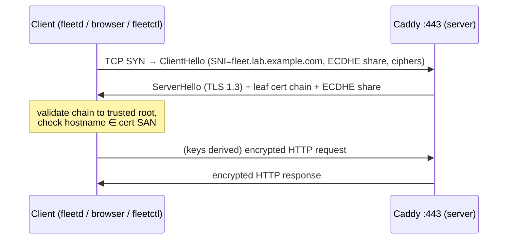
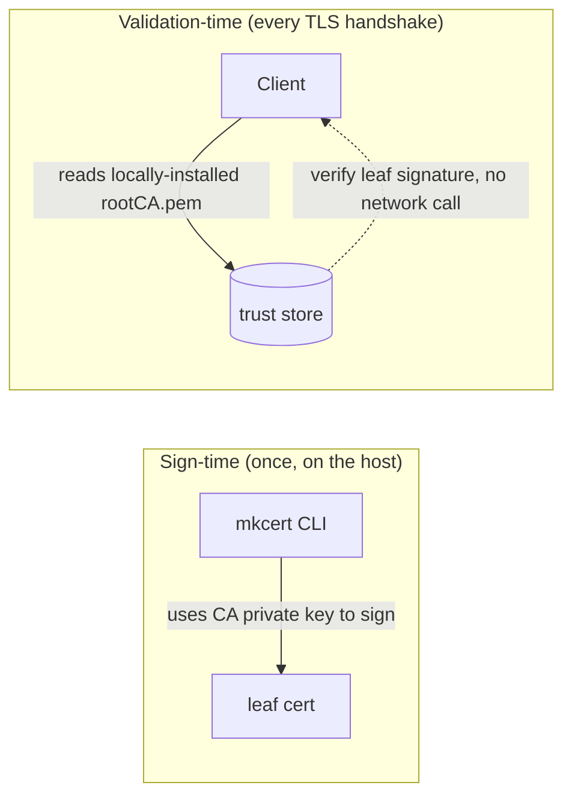
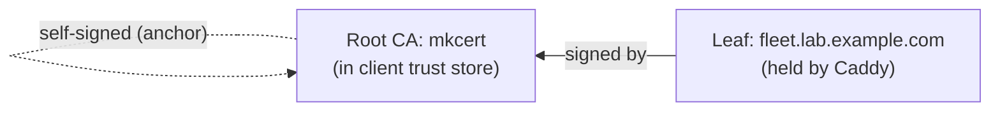
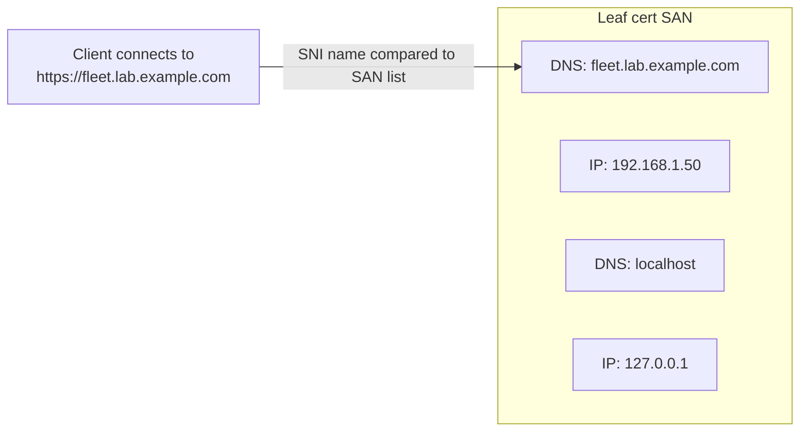
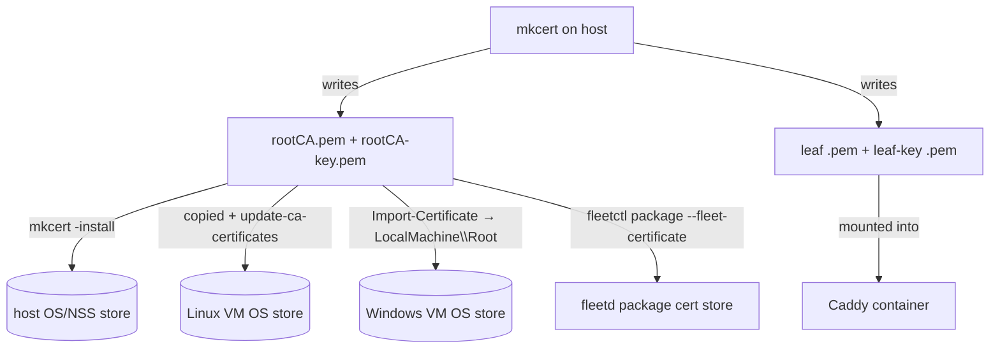
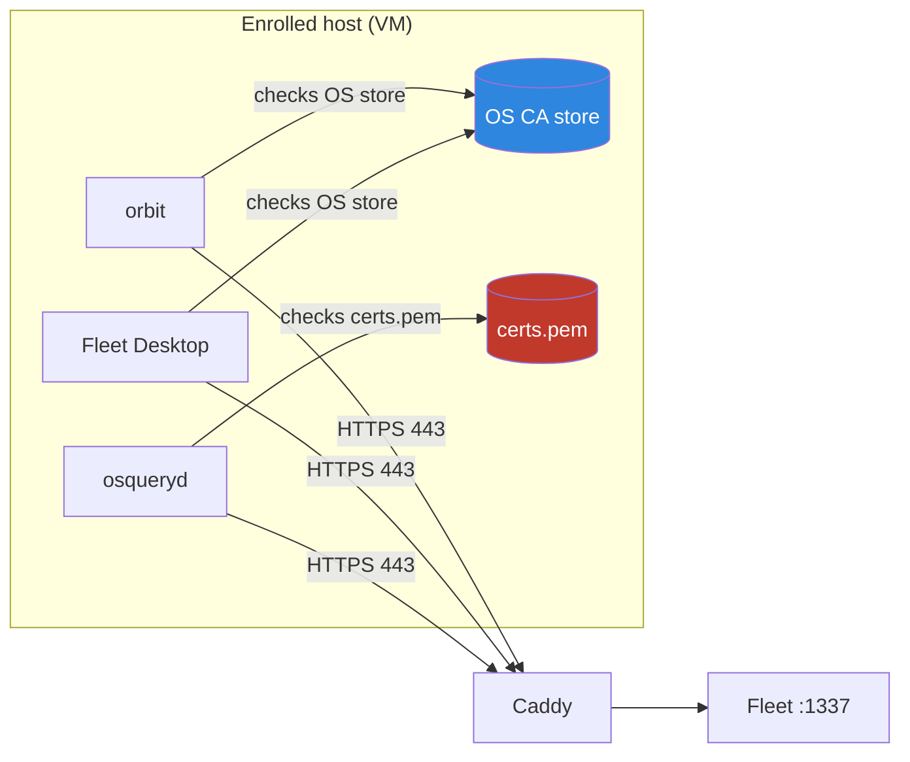
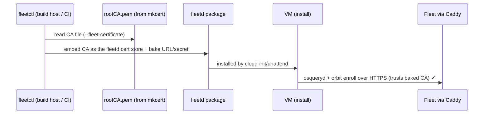
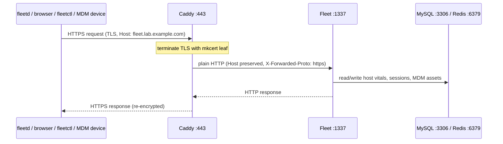
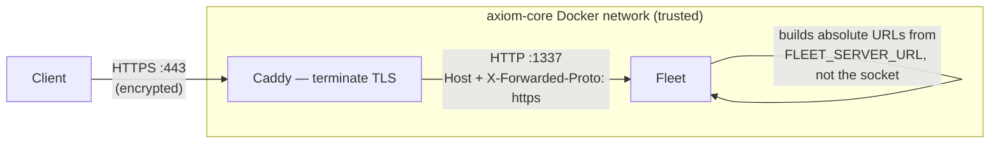
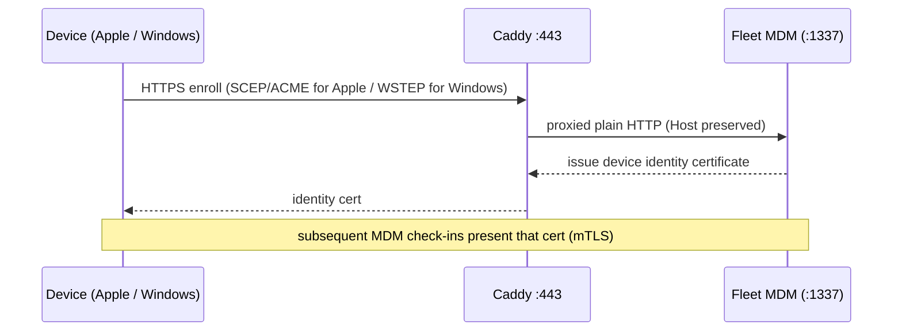

# 🔐 TLS, Certificates & the Local CA
> Part of the **[Project AXIOM Encyclopedia](./README.md)** · Layer: TLS / PKI. How every byte between an agent and Fleet gets encrypted and how the lab manufactures its own trust for $0 — the local CA, the certificate chain, who terminates TLS, and the one trust-store split that breaks more local Fleet labs than anything else.

This layer is the **trust plumbing** that sits underneath everything the agents and the browser do. Fleet itself speaks plain HTTP inside the Docker network; **Caddy** wraps that in TLS at the edge using a leaf certificate signed by a **mkcert** local CA, and every client — browser, `fleetctl`, and the `fleetd` agents on the VMs — has to be taught to trust that CA. The subtle, lab-defining wrinkle is that `fleetd` is not one client but three (orbit, osqueryd, Fleet Desktop), and they do **not** all consult the same trust store. Get the CA into the right places and the whole fleet enrolls silently; miss one and osquery fails to enroll while everything else looks green.

---

## TLS / HTTPS — what it actually guarantees

- **In one line** — TLS is the protocol that turns a raw TCP socket into an encrypted, tamper-evident, server-authenticated channel; HTTPS is just HTTP running inside one.
- **What it actually is** — Transport Layer Security (the successor to SSL; current versions **1.2** and **1.3**). It gives three guarantees, and it is worth being precise about which: **confidentiality** (an eavesdropper on the LAN sees ciphertext, not enroll secrets or query results), **integrity** (a man-in-the-middle can't silently flip bytes — the record MAC/AEAD tag breaks), and **server authentication** (the client cryptographically confirms it is talking to the entity named in the certificate, and that a CA it trusts vouched for that name). Analogy: a sealed, tamper-evident diplomatic pouch carried by a courier whose ID card was issued by an authority both sides already trust. What TLS does **not** give you: any promise that the server is *benign*, that the *content* is true, or (by default) that the *client* is who it claims — client authentication (mTLS) is a separate opt-in, and it is exactly what SCEP/WSTEP add for MDM (see [SCEP](#scep--certificate-enrollment-for-mdm-preview-cross-ref)).
- **Why it's in Project AXIOM** — every agent-to-server exchange carries secrets (the enroll secret on first contact, live-query results, MDM payloads). On a flat lab LAN with a Windows host, VMs, and an Android AVD all on the same virtual switch, plaintext would leak the enroll secret to anything sniffing the bridge. TLS is also a hard *requirement*, not a nicety: Apple and Windows MDM refuse to enroll over anything but HTTPS with a valid chain.
- **Where it sits in the stack** — the transport layer directly beneath every HTTP interaction in the lab. Above it: Fleet's REST/osquery APIs, the MDM protocols, the live-query WebSocket. Below it: TCP/IP on the VirtualBox bridged/NAT network. Its immediate neighbor is [Caddy](#caddy--reverse-proxy--tls-terminator), which is the only process in the lab that actually performs the TLS handshake on the server side.
- **How it works** — the client opens TCP to port 443 and sends a `ClientHello` (supported versions, cipher suites, an ECDHE key share, and the target hostname in SNI). The server replies `ServerHello` choosing TLS 1.3 + a cipher, sends its **certificate chain**, and its own key share. The client validates the chain (signature up to a trusted root) and checks the hostname against the cert's SAN, then both sides derive the same symmetric session keys from the ECDHE exchange. From there every HTTP request/response is an AEAD-encrypted TLS record. TLS 1.3 does this in **one round trip**.
- **Who talks to it, and how** — TLS is always **client-initiated**. In AXIOM the clients are `fleetd` (each VM), a browser, and `fleetctl`; the server side is always Caddy.



  Note that the encryption boundary **ends at Caddy** — see [TLS termination](#tls-termination--why-fleet-serves-plain-http-behind-caddy).
- **Free vs Premium** — TLS is protocol-level and entirely free; nothing about Fleet Premium changes it. (Fleet *Premium* adds features that *run over* TLS, not the transport itself.)
- **Gotchas / myth-busting** — (1) "HTTPS = secure/safe" is the classic confusion: HTTPS authenticates the *pipe and the far endpoint's name*, not the honesty of what flows through it. (2) A valid TLS connection to the *wrong* server is still cryptographically valid — that's what SAN checking and CA trust exist to prevent. (3) TLS 1.0/1.1 are dead; Caddy negotiates 1.2/1.3 only, which is fine for every AXIOM client.
- **See also** — [Caddy](#caddy--reverse-proxy--tls-terminator) · [TLS termination](#tls-termination--why-fleet-serves-plain-http-behind-caddy) · [X.509 & SAN](#x509-certificate--the-san-subject-alternative-name) · [Fleet core & the API surface](./03-fleet-core.md)

---

## Certificate Authority (CA) — trust anchor

- **In one line** — a CA is an entity whose signature on a certificate means "I vouch that this public key belongs to this name," and whose own certificate you have pre-installed as a *trust anchor*.
- **What it actually is** — a keypair plus a policy. The CA holds a private signing key; anything it signs, a client that trusts the CA's public certificate will accept. Trust is **not** derived from anywhere — it is *bootstrapped* by you physically placing the CA's certificate into a trust store ahead of time. Analogy: a passport-issuing authority. You trust a passport not because you verified the holder, but because you already decided to trust the government that stamped it, and that stamp is unforgeable. A **public** CA (Let's Encrypt, DigiCert) is one whose root ships pre-installed in every OS and browser; a **private/local** CA (ours) is one you install yourself on exactly the machines that need it.
- **Why it's in Project AXIOM** — the lab is $0 and offline-friendly, running on invented hostnames like `fleet.lab.example.com` that no public CA will ever sign (they only sign domains you control and can prove via ACME). So AXIOM runs **its own** CA via [mkcert](#mkcert--our-0-local-ca). That CA becomes the single trust anchor every agent, browser, and `fleetctl` is taught to trust.
- **Where it sits in the stack** — the root of the PKI layer. Below it: nothing (it *is* the anchor). Above/beside it: the leaf certificate it signs (held by Caddy) and the trust stores it gets installed into (OS stores, osquery's `certs.pem`).
- **How it works** — the CA signs a certificate by hashing its contents (name, public key, validity, SANs) and producing a signature over that hash with its private key (RSA or ECDSA). A verifier recomputes the same hash and checks it against the signature using the CA's *public* key — proving the CA signed exactly these bytes and nothing was altered. (The familiar "decrypt the signature with the public key" phrasing is only literally true for RSA; ECDSA verifies by a different computation, but the guarantee is identical.) The CA's private key never leaves the machine; only its public certificate is distributed.
- **Who talks to it, and how** — this is the counter-intuitive part: **in this lab, nothing makes a network call to the CA.** A local mkcert CA is an *offline signer*, not a running service.



  Public CAs are consulted over the network at validation time via OCSP/CRL revocation checks; our static local CA has **no revocation service**, so validation is a purely local cryptographic check against the installed `rootCA.pem`. The only thing that ever touches the CA *private* key is the `mkcert` binary on the host when generating a leaf.
- **Free vs Premium** — irrelevant to Fleet tiering; the CA lives entirely outside Fleet. (Fleet Premium can *integrate* external CAs like DigiCert/custom SCEP for deploying end-user certs, but that's a different job — see [SCEP](#scep--certificate-enrollment-for-mdm-preview-cross-ref).)
- **Gotchas / myth-busting** — (1) A CA is not a server you point clients at; it's an offline trust anchor you *pre-distribute*. (2) Trusting a CA is a big deal — a machine that trusts your mkcert root will accept *any* leaf that root signs, so the `rootCA-key.pem` private key is the crown jewel; leaking it lets an attacker mint trusted certs for any name. (3) "Self-signed cert" and "private CA cert" are different: a self-signed leaf vouches only for itself; a CA can vouch for a whole hierarchy of leaves.
- **See also** — [Root/intermediate/leaf](#root-ca-vs-intermediate-vs-leaf--the-chain-of-trust) · [mkcert](#mkcert--our-0-local-ca) · [OS trust store vs certs.pem](#os-trust-store-vs-osquerys-embedded-certspem--the-key-split) · [Trust model overview](./11-concepts-and-trust-model.md)

---

## Root CA vs intermediate vs leaf — the chain of trust

- **In one line** — the chain of trust is the ordered list of signatures a verifier walks from the certificate in front of it (leaf) up to a certificate it already trusts (root), optionally passing through intermediates.
- **What it actually is** — three roles for X.509 certificates: the **root** is self-signed and lives in trust stores (the anchor); an **intermediate** is signed by the root and signs leaves (an operational buffer so the root key can stay offline in a vault); the **leaf** (a.k.a. end-entity/server cert) is what a service actually presents. Analogy: the root is a nation's constitutional authority locked in a vault; an intermediate is a regional issuing office it delegates to; the leaf is your individual ID card issued by that office. A verifier trusts your ID because it can trace: ID ← regional office ← constitution (which it already trusts).
- **Why it's in Project AXIOM** — AXIOM's chain is deliberately **short: leaf ← root, no intermediate.** mkcert's root signs the Caddy leaf directly. Public PKI uses intermediates to protect an offline root key, but a $0 local lab has no such operational need, and a shorter chain means fewer moving parts to distribute and fewer chain-assembly bugs.
- **Where it sits in the stack** — spans the PKI layer top-to-bottom: root at the anchor, leaf held by [Caddy](#caddy--reverse-proxy--tls-terminator), nothing in between.
- **How it works** — during the handshake the server sends its leaf (and any intermediates, but here there are none). The client builds a path from the leaf upward: for each cert it verifies the signature using the *issuer's* public key, until it reaches a cert whose issuer is present in its trust store. If the top of the path is a trusted root, the chain validates; if the path can't reach a trusted anchor, it fails ("unable to get local issuer certificate").
- **Who talks to it, and how** — chain-walking happens **inside the client** during validation; there's no separate service.



  What each client must possess to make this validate:

  | Client | Presents | Must trust |
  |---|---|---|
  | Caddy (server) | the **leaf** + its private key | — |
  | Browser / `fleetctl` / orbit / Fleet Desktop | — | mkcert **root** (in OS store, or the baked cert — see below) |
  | osqueryd | — | mkcert **root** (in its `certs.pem`, *never* the OS store) |

- **Free vs Premium** — not a Fleet-tiered concept.
- **Gotchas / myth-busting** — (1) Trust stores hold **roots**, not leaves — you install `rootCA.pem` on clients, never the leaf. (2) The server must send the leaf (Caddy does); the client never fetches missing chain certs from a local mkcert setup, so if you *did* introduce an intermediate you'd have to bundle it with the leaf. (3) Because there's no intermediate here, "leaf-on-server + rootCA.pem-on-client" is a complete, valid chain — this is exactly why the mkcert model works.
- **See also** — [X.509 & SAN](#x509-certificate--the-san-subject-alternative-name) · [mkcert](#mkcert--our-0-local-ca) · [`--fleet-certificate`](#--fleet-certificate--baking-the-ca-into-the-agent-package)

---

## X.509 certificate & the SAN (Subject Alternative Name)

- **In one line** — an X.509 certificate is the signed data structure that binds a public key to one or more names, and the SAN field is the modern, authoritative list of names the cert is valid for.
- **What it actually is** — a standardized (RFC 5280) blob containing: subject and issuer names, the subject's **public key**, a validity window (notBefore/notAfter), a serial number, key-usage constraints, and the **Subject Alternative Name** extension — a list of DNS names and/or IP addresses the certificate covers. The legacy Common Name (CN) field is effectively **dead for hostname matching**: modern clients (browsers since ~2017, the Go TLS stack that Fleet/`fleetctl` use, and osquery's OpenSSL-based verification) match the requested hostname against the **SAN** and ignore CN whenever a SAN is present — and mkcert always emits one. Analogy: an ID card whose "also known as" list must contain the exact name you're checking, or the guard rejects it even if the card is otherwise genuine.
- **Why it's in Project AXIOM** — clients reach Fleet by different names depending on where they are: the DNS name `fleet.lab.example.com`, the host's LAN IP (e.g. `192.168.1.50`), and sometimes `localhost`/`127.0.0.1` from the host itself. **Every** name a client might use in its `--fleet-url` or browser bar must appear in the leaf's SAN, or that client's handshake fails hostname verification — even though the signature is perfectly valid.
- **Where it sits in the stack** — the data object at the heart of the PKI layer. It's produced by [mkcert](#mkcert--our-0-local-ca), presented by [Caddy](#caddy--reverse-proxy--tls-terminator), validated by every TLS client.
- **How it works** — mkcert stamps the SAN list from its command-line arguments into the leaf. At validation, the client takes the hostname it *intended* to connect to (from the URL, carried in SNI) and checks it against the SAN entries: DNS names match DNS-type SANs (with optional wildcard), IP literals match IP-type SANs. A miss = `x509: certificate is valid for A, B, not C`.
- **Who talks to it, and how** — the certificate is passive data; it is *presented* by Caddy in the handshake and *inspected* by the client.



  The lab's mkcert invocation therefore lists every name up front:
  `mkcert fleet.lab.example.com 192.168.1.50 localhost 127.0.0.1` → produces `fleet.lab.example.com+3.pem` (the `+3` = three extra SANs beyond the first).
- **Free vs Premium** — not Fleet-tiered.
- **Gotchas / myth-busting** — (1) **CN is not checked** — putting the hostname only in CN and omitting SAN yields "certificate has no SAN" or a hard hostname-mismatch failure. (2) `FLEET_SERVER_URL` and the SANs must line up: MDM enrollment and osquery both use the URL's hostname for SNI, so a URL name missing from the SAN silently breaks enrollment. (3) IPs must be IP-type SANs, not DNS-type — listing `192.168.1.50` as a DNS name won't match an IP connection. (4) Adding a new node name later means **re-issuing the leaf** (regenerate with mkcert and reload Caddy); you can't append a SAN to an existing cert.
- **See also** — [mkcert](#mkcert--our-0-local-ca) · [Caddy](#caddy--reverse-proxy--tls-terminator) · [TLS/HTTPS](#tls--https--what-it-actually-guarantees) · [`FLEET_SERVER_URL` & Fleet core config](./03-fleet-core.md)

---

## mkcert — our $0 local CA

- **In one line** — mkcert is a tiny CLI that creates a local CA on first run and mints locally-trusted leaf certificates for any names you ask for, with zero configuration.
- **What it actually is** — a single Go binary ([FiloSottile/mkcert](https://github.com/FiloSottile/mkcert)) that maintains one CA keypair in a per-user directory (`mkcert -CAROOT` prints the path) and, on demand, generates SAN leaf certs signed by it. Its headline trick is `mkcert -install`, which inserts the CA root into the machine's OS trust store (and the NSS store used by Firefox/Chromium) so locally-issued certs "just work" in browsers without warnings. Analogy: a self-run notary public — you are both the notary and the customer, and `-install` is you telling your own computer "recognize this notary's stamp."
- **Why it's in Project AXIOM** — it's the $0, reproducible-from-Git way to get real, chain-valid TLS on invented hostnames. No ACME, no public domain, no paid CA. The rebuild story is two commands, and the only non-Git artifacts (the CA keypair and the leaf) are generated deterministically on the host.
- **Where it sits in the stack** — the issuing authority of the PKI layer, run once on the host. Its outputs feed [Caddy](#caddy--reverse-proxy--tls-terminator) (leaf + leaf key) and every trust store in the lab (root cert).
- **How it works** — the relevant commands in AXIOM's Phase 1:
  | Command | Effect |
  |---|---|
  | `mkcert -install` | creates the CA (first run) and adds `rootCA.pem` to the **host's** OS + NSS trust stores |
  | `mkcert -CAROOT` | prints the dir holding `rootCA.pem` (public) and `rootCA-key.pem` (secret signer) |
  | `mkcert fleet.lab.example.com 192.168.1.50 localhost 127.0.0.1` | generates the leaf `…+3.pem` and key `…+3-key.pem`, signed by the CA |

  The leaf + leaf-key go to Caddy. The **`rootCA.pem`** is the file that must be distributed to every *other* machine and into the fleetd package.
- **Who talks to it, and how** — mkcert is a **build-time CLI**, not a service. Nobody connects to it. It writes files; humans/scripts move those files.



- **Free vs Premium** — entirely outside Fleet; free.
- **Gotchas / myth-busting** — (1) `-install` only trusts the CA on the **host** — VMs and the fleetd package are separate jobs (that's the whole next section). (2) The leaf's private key (`…-key.pem`) is what Caddy uses for TLS; it is **not** `FLEET_SERVER_PRIVATE_KEY` (that's a Fleet symmetric key for encrypting MDM assets — different key, different job; see [TLS termination](#tls-termination--why-fleet-serves-plain-http-behind-caddy)). (3) Guard `rootCA-key.pem` — it can sign a trusted cert for *any* name. (4) Adding a node ⇒ re-run the `mkcert <names>` line with the full name set and reload Caddy; mkcert can't extend an existing cert.
- **See also** — [CA](#certificate-authority-ca--trust-anchor) · [X.509 & SAN](#x509-certificate--the-san-subject-alternative-name) · [`--fleet-certificate`](#--fleet-certificate--baking-the-ca-into-the-agent-package) · [OS trust store vs certs.pem](#os-trust-store-vs-osquerys-embedded-certspem--the-key-split) · [Host & virtualization](./01-host-hypervisor-virtualization.md)

---

## OS trust store vs osquery's embedded certs.pem — THE key split

- **In one line** — on every enrolled host, `fleetd` validates TLS against **two different trust anchors**: orbit and Fleet Desktop consult the OS system trust store, while **osqueryd ignores the OS store entirely** and trusts only its own bundled `certs.pem`.
- **What it actually is** — `fleetd` is a bundle of three programs (see [the fleetd agent](./03-fleet-core.md)): **orbit** (updater/supervisor), **osqueryd** (the query engine), and **Fleet Desktop** (the tray app). orbit and Fleet Desktop are ordinary TLS clients that consult the operating system's CA store. osqueryd is different by design: per Fleet's [certificates-in-fleetd guide](https://fleetdm.com/guides/certificates-in-fleetd), "osqueryd doesn't support using the system's CA root store, it requires passing in a certificate file with the root CA store." fleetd therefore launches osqueryd with `--tls_server_certs` pointed at a bundled file it ships as `certs.pem` (by default a Mozilla CA bundle). Analogy: three housemates who need to recognize the same visitor, but two check the shared family address book by the door while the third stubbornly only trusts the private notebook in his own pocket. Update the address book and two recognize the guest; the third still slams the door.
- **Why it's in Project AXIOM** — this split is **the single most common reason a local Fleet lab half-works.** Trusting the mkcert root on a VM (`update-ca-certificates` / `Import-Certificate`) satisfies orbit and Fleet Desktop, so orbit connects, the host appears to "check in," and Fleet Desktop is happy — but **osqueryd's enrollment fails** because its `certs.pem` has never heard of your mkcert CA. You get a host that looks online-ish but returns no query data. AXIOM avoids this entirely by baking the CA into the agent's cert store at package-build time (next entry).
- **Where it sits in the stack** — inside each enrolled host, at the boundary between the [fleetd agent](./03-fleet-core.md) and the TLS transport. Beside it: the host OS trust store (populated by cloud-init / unattend); above it: the osquery/orbit TLS clients.
- **How it works** — all three components make **outbound HTTPS to Caddy:443** and each validates the presented leaf against *its own* configured anchor:

  | fleetd component | Trust anchor it uses | Populated by |
  |---|---|---|
  | **orbit** | OS system CA store | OS trust of `rootCA.pem` **or** the baked cert |
  | **Fleet Desktop** | OS system CA store | OS trust of `rootCA.pem` **or** the baked cert |
  | **osqueryd** | its `certs.pem` file (via `--tls_server_certs`) | **only** the baked cert / `--fleet-certificate` |

  Critically (verified in the [certificates-in-fleetd guide](https://fleetdm.com/guides/certificates-in-fleetd)): osqueryd *cannot* use the system store, full stop. So the mkcert CA **must** be present in `certs.pem`, and OS-trusting it is not a substitute.
- **Who talks to it, and how** — same destination, independent validations:



  If only the blue box (OS store) trusts mkcert, orbit + Fleet Desktop connect but osqueryd fails. Both boxes must trust it.
- **Free vs Premium** — free; this is agent architecture, not a licensed feature.
- **Gotchas / myth-busting** — (1) "I trusted the CA on the VM, why is osquery still failing?" — because osqueryd never reads the OS store; you trusted the wrong anchor. (2) The fix is **not** more OS-trust work; it's baking the CA into the package via `--fleet-certificate`. (3) `--insecure` on `fleetctl package` disables validation for both anchors — a dev-only crutch that hides the real fix. (4) Diagnose with `fleetctl debug connection --fleet-certificate ./rootCA.pem https://fleet.lab.example.com`, which exercises the osquery-style path specifically.
- **See also** — [`--fleet-certificate`](#--fleet-certificate--baking-the-ca-into-the-agent-package) · [The fleetd agent (orbit/osqueryd/Fleet Desktop)](./03-fleet-core.md) · [Zero-touch CA trust in cloud-init/unattend](./01-host-hypervisor-virtualization.md) · [mkcert](#mkcert--our-0-local-ca)

---

## `--fleet-certificate` — baking the CA into the agent package

- **In one line** — a `fleetctl package` flag that embeds a specific CA (our `rootCA.pem`) into the fleetd installer so all three fleetd components — crucially osqueryd — trust the lab's TLS from the very first boot.
- **What it actually is** — a build-time argument to `fleetctl package`. You point it at a **CA certificate file** and fleetd ships that file as its bundled cert store instead of the default Mozilla `certs.pem`. Per the guide, when this flag is used "such certificate file is used as a CA root store by orbit, Fleet Desktop and osqueryd," and "the system's CA store is not used when generating the fleetd package this way." So it does double duty: it hands osqueryd the anchor it can't otherwise get, and it overrides the OS store for the other two — making the agent's trust self-contained and independent of whatever the host OS happens to trust.
- **Why it's in Project AXIOM** — it is the clean, GitOps-friendly answer to the trust-store split. Rather than scripting CA-trust into every OS store and *hoping* osqueryd cooperates (it won't), AXIOM bakes `rootCA.pem` into the package once at build time; every VM that installs it enrolls silently. The flag value is literally `"$(mkcert -CAROOT)/rootCA.pem"`.
- **Where it sits in the stack** — at the **CI/build boundary** between the PKI layer and agent provisioning. Upstream: mkcert produces `rootCA.pem`. Downstream: the emitted `.deb`/`.rpm`/`.msi`/`.pkg` is what cloud-init/unattend installs on each node.
- **How it works** — the canonical build:
  ```bash
  fleetctl package --type deb --fleet-desktop \
    --fleet-url=https://fleet.lab.example.com \
    --enroll-secret=<ENROLL_SECRET> \
    --fleet-certificate="$(mkcert -CAROOT)/rootCA.pem"
  ```
  At install time the bundled cert lands in **`/opt/orbit`** (macOS/Linux) or **`C:\Program Files\Orbit`** (Windows) — per the guide, the same location as the default `certs.pem`, just replaced with your CA. orbit then launches osqueryd with `--tls_server_certs` pointed at that file, and uses the same file as its own and Fleet Desktop's root store. The enroll secret and fleet URL are baked in the same step.
- **Who talks to it, and how** — the flag is consumed by **`fleetctl` on the build host**, not by any running service; its *output* is what talks to Fleet later.



- **Free vs Premium** — free; `fleetctl package` is the standard, free build path for all platforms.
- **Gotchas / myth-busting** — (1) **It takes the CA (`rootCA.pem`), never the leaf.** Feeding the leaf makes osqueryd trust exactly one cert with no chain flexibility and breaks as soon as the leaf is reissued — the flag wants the *anchor*. (2) **There is no `--fleet-tls` flag** — don't invent it; TLS is implied by an `https://` `--fleet-url`. (3) Windows `.msi` builds need Docker running on the host. (4) macOS `.pkg` notarization must run on macOS (relevant only to the deferred Mac Studio). (5) Because the CA is baked at build time, **rotating the mkcert CA means rebuilding and reinstalling every package** — a real operational cost to weigh before regenerating the CA.
- **See also** — [OS trust store vs certs.pem](#os-trust-store-vs-osquerys-embedded-certspem--the-key-split) · [mkcert](#mkcert--our-0-local-ca) · [The fleetd agent](./03-fleet-core.md) · [Building & shipping packages in CI](./06-gitops-and-cicd.md) · [Enroll secrets](./03-fleet-core.md)

---

## Caddy — reverse proxy & TLS terminator

- **In one line** — Caddy is the lab's edge web server: it owns port 443, performs the TLS handshake using the mkcert leaf, and forwards decrypted requests to Fleet over plain HTTP.
- **What it actually is** — a small, single-binary Go web server known for making HTTPS trivial. In AXIOM it runs as a container in the `axiom-core` stack and plays two roles at once: **TLS terminator** (it holds the leaf + leaf-key and decrypts inbound TLS) and **reverse proxy** (it relays those requests to the Fleet container and streams responses back). Analogy: a front-desk receptionist who speaks the encrypted "outside" language to visitors and plain internal language to the back office — and, importantly, relays messages **verbatim** so nothing downstream notices the translation.
- **Why it's in Project AXIOM** — it lets Fleet stay blissfully unaware of TLS. Instead of mounting certs into the Fleet container and wrestling with `FLEET_SERVER_TLS=true` (whose `env.example` bind-mounts fail the container if the cert files are missing), Caddy centralizes all cert handling in one place with a three-line config. It also cleanly handles the WebSocket upgrade for live query and passes MDM/SCEP traffic through untouched.
- **Where it sits in the stack** — the **edge** of the `axiom-core` container stack. Above/outside it: all external clients (VMs' fleetd, browsers, `fleetctl`, MDM devices). Below/behind it: the Fleet container at `fleet:1337` on the Docker bridge. Beside it: MySQL and Redis, which it never touches (only Fleet does).
- **How it works** — the entire lab Caddyfile:
  ```
  fleet.lab.example.com {
      tls /etc/caddy/fleet.lab.example.com+3.pem /etc/caddy/fleet.lab.example.com+3-key.pem
      reverse_proxy fleet:1337
  }
  ```
  The `tls` directive pins the **explicit mkcert leaf + key** (so Caddy does **not** try to auto-provision a Let's Encrypt cert — there's no public domain and no ACME here). The `reverse_proxy` target is the **service name `fleet`** (resolved by Compose's embedded DNS to the Fleet container's bridge IP), *not* `127.0.0.1` — inside the Caddy container, loopback is Caddy itself, and Fleet's `1337` is never published to the host (see [Docker networking](./02-containers-and-docker.md)). By default Caddy's proxy is **transparent**: it preserves the `Host` header and automatically injects `X-Forwarded-For`/`X-Forwarded-Proto`, which is exactly what osquery TLS, the live-query WebSocket, and Apple/Windows MDM+SCEP need to work unchanged.
- **Who talks to it, and how** — Caddy is the hub every external interaction funnels through:



  Concretely: `fleetd` on `gpu-node-1` initiates an outbound **HTTPS POST** to `fleet.lab.example.com:443` → Caddy terminates TLS → forwards **plain HTTP** to `fleet:1337` (by service name over the bridge) → Fleet writes host vitals to MySQL and publishes live-query state to Redis → the response re-encrypts on the way back out.
- **Free vs Premium** — Caddy is independent OSS; no Fleet licensing involved.
- **Gotchas / myth-busting** — (1) Caddy would normally fetch a free Let's Encrypt cert automatically, but the explicit `tls <cert> <key>` directive **disables** that — essential, since public ACME can't validate a private hostname. (2) The reverse-proxy target is the Fleet **internal HTTP** port `1337` reached by **service name** `fleet` on the bridge, not 443, not TLS, and not `127.0.0.1`. (3) Because Fleet trusts forwarded headers only from configured proxies, Caddy's source IP must be covered by `FLEET_SERVER_TRUSTED_PROXIES` — and since Caddy is a *sibling container*, Fleet sees its **Docker-bridge IP**, not loopback, so this value is the compose network's subnet (e.g. `172.18.0.0/16`; confirm with `docker network inspect`), **not** `127.0.0.1`. Get it wrong and Fleet ignores `X-Forwarded-For`, logging Caddy's IP instead of the agent's real LAN IP. (4) The live-query WebSocket also needs `FLEET_SERVER_WEBSOCKETS_ALLOW_UNSAFE_ORIGIN=true`; a passing agent check does **not** prove the UI's WS path works through the proxy — test live query in the browser explicitly.
- **See also** — [TLS termination](#tls-termination--why-fleet-serves-plain-http-behind-caddy) · [The axiom-core Docker stack](./02-containers-and-docker.md) · [Fleet server config & ports](./03-fleet-core.md) · [Live query & the WebSocket](./08-telemetry-and-observability.md)

---

## TLS termination — why Fleet serves plain HTTP behind Caddy

- **In one line** — TLS termination is the design decision to decrypt TLS at Caddy and let Fleet speak plain HTTP inside the trusted Docker network, moving all cert handling to a single edge process.
- **What it actually is** — the architectural pattern where the encrypted boundary ends ("terminates") at the reverse proxy, and traffic beyond it (proxy → app) is plaintext over a private, trusted network segment. The alternative — **TLS passthrough / end-to-end TLS** — would have Fleet itself terminate TLS (`FLEET_SERVER_TLS=true`, certs mounted into the Fleet container). Analogy: the front desk opens the sealed envelope, reads it to the back office over an internal intercom, and reseals the reply — versus couriering the sealed envelope all the way to the back office.
- **Why it's in Project AXIOM** — it's the simplest correct path for a single-host lab: one place (Caddy) owns certs, Fleet's config drops the fragile cert bind-mounts, and cert rotation touches only Caddy. The trade-off — plaintext on the proxy→Fleet hop — is acceptable because that hop stays **inside one Docker network on the host**, never on the wire.
- **Where it sits in the stack** — it *is* the boundary between the PKI layer and the Fleet application layer, physically located at [Caddy](#caddy--reverse-proxy--tls-terminator). External side: HTTPS. Internal side: HTTP to `1337`.
- **How it works** — the load-bearing Fleet env vars that make termination correct:
  | Var | Value | Why |
  |---|---|---|
  | `FLEET_SERVER_TLS` | `false` | Fleet listens plain HTTP; Caddy owns TLS |
  | `FLEET_SERVER_URL` | `https://fleet.lab.example.com` | the **external** name — MDM/enroll redirects and SAN checks key off this |
  | `FLEET_SERVER_TRUSTED_PROXIES` | Docker bridge subnet (compose net CIDR) | tells Fleet how to read the real client IP from Caddy's `X-Forwarded-For` — Caddy is a sibling container, so its source is a **bridge IP**, not loopback |
  | `FLEET_SERVER_WEBSOCKETS_ALLOW_UNSAFE_ORIGIN` | `true` | live-query WS works when the Origin is the proxy |
  | `FLEET_SERVER_PRIVATE_KEY` | `openssl rand -base64 32` | **unrelated to TLS** — symmetric key that encrypts MDM assets and is what *enables* MDM |

  Fleet is behind a proxy, so it must learn the *real* external scheme/host from `FLEET_SERVER_URL` and the forwarded headers rather than from its own socket (which only sees `http://…:1337`). That's why `FLEET_SERVER_URL` is set explicitly and trusted-proxies is configured — otherwise MDM enrollment URLs and redirect links would come out as `http://` or with the wrong host.
- **Who talks to it, and how** — the "termination event" is internal to Caddy; what matters is the header contract on the plaintext hop:



- **Free vs Premium** — free; a deployment choice, not a feature.
- **Gotchas / myth-busting** — (1) **`FLEET_SERVER_PRIVATE_KEY` is not a TLS key.** It's a base64 symmetric key (≥32 bytes) that encrypts MDM assets and is *what enables MDM*; it never touches the handshake. Regenerating it after MDM assets exist makes them undecryptable — never rotate it casually. (2) If `FLEET_SERVER_URL` is set to the internal `http://…:1337`, MDM/enroll flows hand out unreachable/insecure URLs — it must be the external HTTPS name. (3) The `env.example` default `FLEET_SERVER_TLS=true` bind-mounts `certs/fleet.crt|key` **read-only, and the container won't start if they're missing** — the lab deliberately flips this to `false` and deletes those mounts. (4) Plaintext proxy→Fleet is fine *only because* it's contained in one Docker network on a single host; don't copy this pattern across untrusted hosts without mTLS.
- **See also** — [Caddy](#caddy--reverse-proxy--tls-terminator) · [Fleet server config & `FLEET_SERVER_PRIVATE_KEY`](./03-fleet-core.md) · [MDM asset encryption](./05-mdm.md) · [Docker stack & networking](./02-containers-and-docker.md)

---

## SCEP — certificate enrollment for MDM (preview, cross-ref)

- **In one line** — SCEP (Simple Certificate Enrollment Protocol) is how an MDM-enrolling Apple device gets its own **identity certificate** from Fleet, turning the MDM channel into a mutually-authenticated (mTLS) link — a PKI mechanism that lives *inside* the MDM layer, so it's only previewed here (and on newer Apple Silicon it's being superseded by ACME — see below).
- **What it actually is** — a lightweight protocol for a device to request and receive a client certificate from a CA/registration authority. In Fleet MDM, the Fleet server acts as the SCEP authority: during Apple enrollment the device generates a keypair and obtains a **SCEP identity cert** (or, on attested Apple Silicon, an **ACME** cert) that it then presents on every MDM connection, so Fleet knows the far end is a specific enrolled device, not just "someone with the enroll URL." Whereas the [TLS/leaf story](#tls--https--what-it-actually-guarantees) authenticates *the server to the client*, this adds the reverse: *the client (device) to the server*. Windows MDM does the equivalent job with a different protocol — **MS-WSTEP** (WS-Trust X.509 token enrollment), reached after the standard MS-MDE2 discovery step — issuing the Windows device its identity cert (full flow in [MDM entry 9](./05-mdm.md#9-windows-wstep-enrollment-and-provisioning-packages)).
- **Why it's in Project AXIOM** — MDM device identity is what makes management commands trustworthy. It matters here mainly as the reason the [Caddy](#caddy--reverse-proxy--tls-terminator) proxy must be **host-preserving and transparent**: SCEP/WSTEP and the MDM check-in must pass through unchanged, or enrollment breaks. Full treatment lives in the MDM file; this entry exists so the PKI reader knows where device-side certs come from. Apple enrollment is deferred to the real Mac Studio; Windows manual MDM is exercised at $0; iOS is simulated.
- **Where it sits in the stack** — straddles PKI and MDM: the *protocol* is PKI, but the *use* is MDM enrollment. It rides the same TLS transport terminated by Caddy. Neighbors: the leaf/CA plumbing below, the MDM check-in protocol above.
- **How it works** — (Apple) the device hits Fleet's SCEP endpoint through Caddy, proves it holds the enrollment context, and receives an identity cert; Fleet then **auto-renews each host's MDM identity cert ~180 days before expiry** by pushing a fresh enrollment profile (an `InstallProfile` command). That 180-day window is *current* behavior: it was **30 days** in Fleet 4.46.0 and was widened to 180 (around Fleet 4.55.0) so certs don't lapse while a laptop is away — the cert's total validity window is still version-dependent, so confirm against the doc. On **Apple Silicon Macs running macOS 14+ that enroll via ADE**, Fleet **4.84.0+ (so including v4.89.1) issues the identity cert via ACME with a hardware-bound key attested by the Secure Enclave** instead of SCEP — SCEP can't bind the key to the Enclave or prove genuine hardware. SCEP remains the path for **Intel Macs, iPhones/iPads, and any manual (non-ADE) enrollment**, and a qualifying device that first enrolled via SCEP moves to ACME on its next renewal cycle. **In AXIOM specifically this means SCEP, not ACME:** the lab has no ABM/ADE and the (deferred) Mac Studio would enroll manually. Treat the SCEP-vs-ACME split as version- **and** enrollment-dependent; confirm against the [device-attestation explainer](https://fleetdm.com/articles/what-is-device-attestation) and the [Apple MDM setup guide](https://fleetdm.com/guides/apple-mdm-setup) for v4.89.1 before relying on specifics.
- **Who talks to it, and how** — **device-initiated**, over HTTPS through Caddy:



- **Free vs Premium** — the **built-in** MDM identity plumbing (Apple SCEP/ACME, Windows WSTEP) rides along with MDM, which is **free**: Windows manual MDM and Apple MDM server-side are both $0. What's **Premium** is *custom* certificate delivery — integrating an external SCEP server or DigiCert to push certs to end-user devices via config profiles (e.g. Wi-Fi/VPN client certs). Don't conflate "Fleet's own MDM identity certs" (free) with "deploy certs to users from a third-party CA" (Premium).
- **Gotchas / myth-busting** — (1) SCEP/ACME certs are **device→server** identity, a different axis from the server→client TLS this file otherwise covers — both exist on the MDM channel simultaneously. (2) SCEP/ACME is Apple-side; **Windows uses WSTEP**, not SCEP — mixing them up leads to wrong config vars (the Windows WSTEP `_BYTES` vars take file *content*; dropping `_BYTES` means a *path* — an easy mis-swap that yields a cryptic MDM turn-on failure). (3) On current Fleet, an ADE-enrolled Apple Silicon Mac (macOS 14+) uses **ACME rather than SCEP**, so "SCEP" as a blanket term is imprecise for Apple — but AXIOM's manual, no-ABM path stays on SCEP; check the version *and* the enrollment type.
- **See also** — [Mobile Device Management (full treatment)](./05-mdm.md) · [Caddy (host-preserving proxy)](#caddy--reverse-proxy--tls-terminator) · [`FLEET_SERVER_PRIVATE_KEY` enables MDM asset encryption](./03-fleet-core.md) · [X.509 & SAN](#x509-certificate--the-san-subject-alternative-name)

---

> **Layer recap.** TLS gives you an encrypted, server-authenticated pipe; a **CA** is the trust anchor that makes that authentication meaningful; **mkcert** manufactures both a CA and a leaf for $0; the leaf lives on **Caddy**, which **terminates TLS** and hands Fleet plain HTTP. The one thing that trips up every local build is the **trust-store split** — osqueryd ignores the OS store, so the CA must be baked in with **`--fleet-certificate`**. And device-side identity (**SCEP**/ACME on Apple, **WSTEP** on Windows) is a second, MDM-layer certificate story that rides the same transport. Continue to **[Mobile Device Management →](./05-mdm.md)** or back to the **[Encyclopedia index](./README.md)**.
