# 📱 Mobile Device Management (Apple / Windows / Android)
> Part of the **[Project AXIOM Encyclopedia](./README.md)** · Layer: MDM (device configuration & command channel). This file explains how Fleet becomes the *MDM server* for Project AXIOM's Windows and Apple hosts, how it *proxies* Google's cloud for Android, and — for every piece — exactly who initiates contact with whom, in which direction, over what port, carrying what.

MDM is the layer that lets Fleet *change* a device, not just *observe* it. Osquery (the [telemetry](./08-telemetry-and-observability.md) side) is read-only: it answers questions. MDM is the write path: it pushes configuration profiles, and it sends imperative commands (lock, wipe, install profile). The three OS vendors implement this write path completely differently — Apple built a poll-after-push protocol woken by APNs, Microsoft reused the OMA-DM/SyncML standard over HTTPS, and Google made it a *cloud API* where Fleet never touches the device at all. This file walks each one, with the AXIOM-specific Free-vs-Premium reality baked in: **Windows manual MDM is free, Apple MDM is free but needs real hardware (deferred), Android is GA and free for the enrollment modes we care about, and the fancy lock/wipe/zero-touch bits are mostly Premium.**

A note on ports before we start. In this lab *nothing* talks to Fleet directly on 1337. Every inbound device connection lands on **[Caddy](./04-tls-and-pki.md):443**, which terminates TLS with the mkcert leaf and forwards plaintext HTTP to `fleet:1337` inside the Docker network. When you read "device → Fleet:443" below, mentally expand it to "device → Caddy:443 (TLS) → fleet:1337 (plain HTTP)". See [TLS & PKI](./04-tls-and-pki.md) for why.

---

## 1. MDM: the concept and the check-in loop

- **In one line** — MDM is a vendor-blessed control channel where a server enrolls an OS's built-in management agent and then pushes signed settings and imperative commands to it.
- **What it actually is** — Every modern OS ships a *native* management client baked into the OS (Apple's `mdmclient`, Windows' OMA-DM client / `omadmclient.exe`, Android's *Android Device Policy* app backed by Google Play services). MDM is the server that these clients trust. Unlike an ordinary app, the native client can do privileged things — install a root CA, enforce a passcode policy, wipe the disk — *because the OS vendor gives the enrolled server that authority*. Analogy: osquery is a security camera (it can only look); MDM is a set of remote hands the vendor lets you rent, but only after the device owner signs the enrollment "power of attorney."
- **Why it's in Project AXIOM** — It's half the reason Fleet exists. Phase 3+ of the lab uses MDM to enroll `corp-win-01` (Windows manual MDM, free), to *demonstrate* Apple MDM against the deferred `mac-studio`, and to manage `android-byod`. Detection policies read state via osquery; MDM is how we'd *remediate* config drift with a profile instead of a script.
- **Where it sits in the stack** — It's a peer of [osquery/telemetry](./08-telemetry-and-observability.md) inside the [Fleet core](./03-fleet-core.md), sitting *above* [TLS/PKI](./04-tls-and-pki.md) (which carries and authenticates it) and *below* [policy-as-code](./07-policy-as-code.md) and [GitOps](./06-gitops-and-cicd.md) (which declare *what* profiles should exist). Beside it lives [automation/IR](./10-automation-and-ir.md), which reaches for MDM commands and scripts as remediation tools.
- **How it works** — The defining pattern for Apple and Windows is **push-to-wake, then pull**. The server cannot open a socket to a laptop that may be behind NAT, asleep, or on hotel Wi-Fi. So the flow is inverted: the *device* holds a long-lived connection to a vendor push service; the server sends a contentless "poke" through that service; the poke wakes the native client, which then dials *back out* to the MDM server over HTTPS to ask "what do you want?". The server answers with a queued command; the device executes and reports the result. Android breaks this mold entirely — Google hosts the whole loop and Fleet just calls Google's API (see entry 10).
- **Who talks to it, and how** —

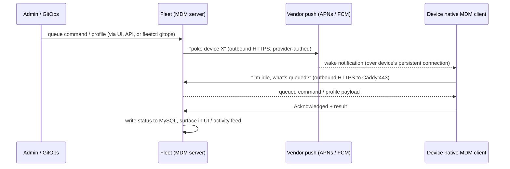

  The device *always* initiates the substantive HTTPS connection; the push service only ever carries a wake signal, never the actual command payload. In AXIOM the "Fleet" box is really Caddy:443 → fleet:1337, and the result is persisted to [MySQL](./03-fleet-core.md).
- **Free vs Premium** — The *protocol* and enrollment are free on all three platforms. The gated bits are the high-value *actions and orchestration*: most lock/wipe (entry 12), the zero-touch ADE setup experience (entry 6), per-team scoping of profiles (Teams are Premium — see [trust model](./11-concepts-and-trust-model.md)), and disk-encryption/OS-update *enforcement*. Detection of that same state via osquery is free.
- **Gotchas / myth-busting** — (1) MDM is **not** an agent you install like fleetd; it's the OS's own client that you *enroll*. On AXIOM the [fleetd agent](./03-fleet-core.md) (orbit + osqueryd + Fleet Desktop) and the MDM enrollment are *two independent channels to the same host* — a host can be fleetd-enrolled but not MDM-enrolled, and vice-versa. (2) The server never "reaches into" the device; every real action is a device-initiated pull. (3) MDM ≠ EDR: there's no native "network isolate" command (see entry 12).
- **See also** — [fleetd, orbit & osquery](./03-fleet-core.md) · [Enrollment](#2-enrollment-how-a-device-becomes-managed) · [Automation & IR](./10-automation-and-ir.md) · [Trust model](./11-concepts-and-trust-model.md)

---

## 2. Enrollment: how a device becomes managed

- **In one line** — Enrollment is the one-time handshake that installs the MDM payload — server URL, an identity certificate, and a push topic — turning a stranger device into one Fleet is authorized to command.
- **What it actually is** — A trust-establishment ceremony. At the end of it the device holds: (a) the MDM server URL to check in to, (b) a **device identity certificate** (issued during enrollment via SCEP on Apple, WSTEP on Windows) that the device presents on every check-in so the server knows *which* host is calling, and (c) for Apple, the **APNs topic** the server will use to wake it. Enrollment is also where the device installs the [lab root CA](./04-tls-and-pki.md) so it trusts Caddy's leaf cert. Think of it as issuing a badge (the identity cert) *and* a phone number to be paged on (the push topic) in one appointment.
- **Why it's in Project AXIOM** — It's the gate to every later phase. `corp-win-01` enrolls via **Windows manual MDM (free)** — the marquee AXIOM MDM demo. `android-byod` enrolls by scanning a Google-generated token/QR. `mac-studio` would enroll manually or via ADE, but is **deferred** because it needs real Apple hardware plus an Apple Business Manager org.
- **Where it sits in the stack** — The doorway between an unmanaged host and the MDM channel. It leans hard on [TLS/PKI](./04-tls-and-pki.md) (the root CA must already be trusted for enrollment TLS to succeed) and on [identity](./09-identity-and-access.md) (enrollment can be gated by an IdP/SSO login in richer setups; in AXIOM Free it's largely open/secret-based).
- **How it works** — Two archetypes:
  - **User-initiated / manual** (what AXIOM uses at $0): a human triggers it. macOS: download & open an *enrollment profile* (`.mobileconfig`) → Settings approves it. Windows: **Settings → Accounts → Access work or school → Enroll only in device management**, typing the Fleet MDM discovery URL. Android BYOD: open the enrollment link / scan the QR → *Android Device Policy* app provisions a work profile.
  - **Automated / zero-touch**: the device is pre-assigned to the MDM server in a vendor portal (Apple ABM/ADE, Android zero-touch, Windows Autopilot) and enrolls itself on first boot. AXIOM defers all of these (no ABM org, no Autopilot tenant).
- **Who talks to it, and how** —

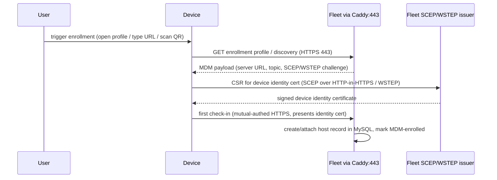

  Direction is always device-outbound to Caddy:443. The identity cert issued here is *not* the same as the fleetd enroll secret; enroll secrets belong to the osquery/fleetd channel ([Fleet core](./03-fleet-core.md) / [identity](./09-identity-and-access.md)), MDM identity certs belong to the MDM channel.
- **Free vs Premium** — Manual enrollment is free on Windows, Apple, and Android. Automated enrollment (ADE/Autopilot/zero-touch) is not itself the paywall so much as the *hardware + vendor-org* requirement; some post-enrollment ADE niceties (setup-experience software/scripts) are Premium.
- **Gotchas / myth-busting** — (1) On Windows, "Access work or school" offers **two** things: full *Microsoft Entra (Azure AD) join* vs *Enroll only in device management*. AXIOM wants the latter — MDM without an Entra tenant. (2) macOS *manual* enrollment is **not supervised**; only ADE-enrolled Macs are supervised, and a pile of commands (notably EraseDevice on Apple silicon, activation-lock bypass) need supervision — a real limit on the deferred `mac-studio`. (3) Enrollment TLS fails if the device doesn't already trust the [root CA](./04-tls-and-pki.md); on macOS the enrollment profile can carry the CA, but osqueryd still won't consult the system trust store (see [fleetd packaging](./03-fleet-core.md)).
- **See also** — [WSTEP enrollment](#9-windows-wstep-enrollment-and-provisioning-packages) · [ABM/ADE zero-touch](#6-apple-abm-ade-dep-and-vpp-zero-touch-premium-deferred) · [Enroll secrets & identity](./09-identity-and-access.md) · [TLS/PKI root CA](./04-tls-and-pki.md)

---

## 3. Configuration profile: the unit of managed settings

- **In one line** — A configuration profile is the declarative document — an Apple `.mobileconfig`, a Windows SyncML/CSP XML, or a JSON DDM declaration — that says "these settings shall be true on the device," which Fleet delivers and the OS enforces.
- **What it actually is** — The *noun* of MDM (commands are the verbs). It's a bundle of typed *payloads*: a Wi-Fi payload, a passcode-policy payload, a certificate payload, a restrictions payload. The OS applies all payloads atomically and, crucially, *remembers* it owns them — remove the profile and the settings revert. Analogy: a profile is a **standing policy memo** filed with the device ("smoking is prohibited in this building"), whereas a command is a one-off order ("evacuate now").
- **Why it's in Project AXIOM** — Profiles are how AXIOM enforces config declaratively and versions it in Git. In [GitOps](./06-gitops-and-cicd.md), `.mobileconfig`/XML/JSON files live under `lib/` (platform-partitioned: `lib/macos`, `lib/windows`) and are referenced from `default.yml`/`teams/no-team.yml`. Applying the YAML makes Fleet reconcile each host's installed profiles to match.
- **Where it sits in the stack** — Authored in the [policy-as-code / GitOps](./06-gitops-and-cicd.md) layer, delivered over the MDM channel, enforced by the OS. It's the payload that entries 4–11 are the *transport* for.
- **How it works** — Fleet stores the desired-profile set per host (or per team, Premium). On each check-in it diffs desired vs installed and issues `InstallProfile` / `RemoveProfile` (Apple) or `Add`/`Replace`/`Delete` SyncML ops (Windows). Apple profiles are plist XML and can be signed and/or encrypted; Windows profiles are SyncML fragments targeting CSP OMA-URIs; DDM declarations are JSON the device evaluates itself.
- **Who talks to it, and how** —

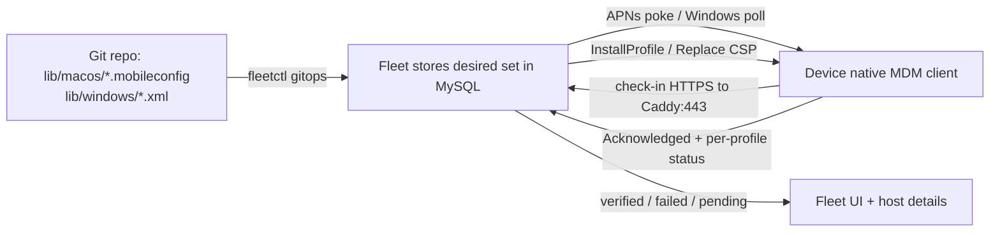

  The self-hosted [GitHub Actions runner](./06-gitops-and-cicd.md) pushes desired state *into* Fleet; the device pulls the actual profile bytes on its next check-in. Fleet then reports each profile as *verified/pending/failed* per host.
- **Free vs Premium** — Delivering profiles is **free** on all platforms. What's Premium: scoping profiles to **Teams** (Free has only the single "no-team" scope — see [trust model](./11-concepts-and-trust-model.md)), and certain *enforcement* profiles whose value is the enforcement (FileVault escrow, OS-update DDM). You can still ship a passcode/restriction profile at $0.
- **Gotchas / myth-busting** — (1) **GitOps is declarative and deletes silently**: a profile you remove from the applied YAML is *removed from every host* — there is no `--delete-missing` flag; absence means "delete" (see [GitOps](./06-gitops-and-cicd.md)). (2) A macOS profile isn't "applied when Fleet sends it" — it's *verified* only after the device re-reports it; watch for "pending"/"failed" states. (3) Windows profiles are **not** `.mobileconfig` — reusing Apple XML on Windows just fails; you need SyncML/CSP (entry 8).
- **See also** — [.mobileconfig & DDM](#5-apple-mobileconfig-and-declarative-device-management-ddm) · [Windows CSP](#8-windows-csp-configuration-service-provider) · [GitOps lib/ layout](./06-gitops-and-cicd.md) · [Policy-as-code](./07-policy-as-code.md)

---

## 4. Apple APNs: the wake channel

- **In one line** — APNs (Apple Push Notification service) is Apple's global push network that Fleet uses purely to *wake* a Mac/iPhone so the device will call back and pull its MDM commands.
- **What it actually is** — A permanent, Apple-run pub/sub fabric. Every Apple device keeps one persistent TLS socket open to APNs from boot to shutdown. MDM piggybacks on it: to reach a device, the MDM server sends a push through APNs addressed by the device's **push token** and the MDM **topic**; APNs relays a payload-less nudge down the device's existing socket. APNs never carries the MDM command itself — only "hey, check in." Analogy: APNs is the hotel pager system; Fleet pages room 412, and the guest walks to the front desk (Fleet) to get the actual message.
- **Why it's in Project AXIOM** — It's mandatory for Apple MDM: no APNs certificate, no Apple MDM, full stop. AXIOM obtains a free **MDM push certificate** for the fictional Axiom Intelligence via the Apple Push Certificates Portal (free with an Apple ID). This is why Apple MDM is "free but deferred" — the cert is free, but there's no Apple device to wake until the `mac-studio` phase.
- **Where it sits in the stack** — An *external Apple dependency* bolted onto the MDM channel, parallel to [TLS/PKI](./04-tls-and-pki.md). It sits between Fleet and every Apple device but is owned by Apple, not the lab.
- **How it works** — Two certs and two directions:
  - **Provider side (Fleet → APNs):** Fleet authenticates to `api.push.apple.com:443` over HTTP/2 using the **MDM push certificate** (the one from the portal). Fleet POSTs a push for a given device token + topic.
  - **Device side (device → APNs):** each device holds a persistent connection to `*-courier.push.apple.com` on **TCP 5223** (falling back to **443** on locked-down networks). APNs pushes the wake down this socket.
  - The **topic** is the `UID` in the push cert's subject (`com.apple.mgmt.External.<uuid>`) and must match the topic embedded in each device's enrollment profile.
- **Who talks to it, and how** —

| Leg | Initiator | Direction | Endpoint : Port | Protocol | Payload |
|---|---|---|---|---|---|
| Provider push | Fleet | outbound | api.push.apple.com : 443 | HTTP/2 + client cert (MDM push cert) | device token + topic, empty push |
| Device connection | Apple device | outbound, held open | *-courier.push.apple.com : 5223 (fallback 443) | Apple push proto over TLS | keep-alive; receives wake |
| Check-in (the actual work) | Apple device | outbound | Fleet via Caddy : 443 | HTTPS (MDM protocol) | Idle → command → Acknowledged |

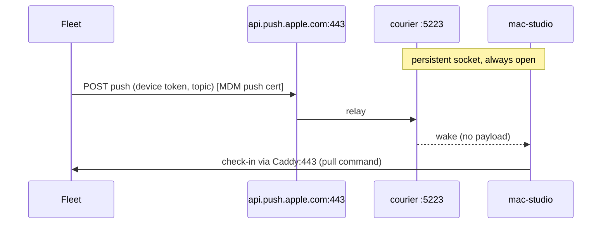

- **Free vs Premium** — The APNs push certificate is **free** (Apple ID at the Push Certificates Portal); Fleet imposes no charge to use it. Nothing Premium here.
- **Gotchas / myth-busting** — (1) APNs carries **no command data** — losing sight of this makes people think APNs is a security-sensitive command path; it isn't, it's a doorbell. (2) The push cert **must be renewed every ~year**; let it lapse and *all* Apple devices go silent until re-enrolled — renew, never re-create, or you re-enroll the fleet. (3) Port 5223 outbound is the classic corporate-firewall failure; Apple's 443 fallback exists but some proxies still break it. (4) The APNs push cert is distinct from `FLEET_SERVER_PRIVATE_KEY`: the private key is what *enables* MDM by encrypting Fleet's stored MDM assets (see [TLS/PKI](./04-tls-and-pki.md)) and must **never be regenerated once MDM assets exist**; the push cert only authenticates Fleet to Apple.
- **See also** — [MDM check-in loop](#1-mdm-the-concept-and-the-check-in-loop) · [FLEET_SERVER_PRIVATE_KEY & MDM assets](./04-tls-and-pki.md) · [.mobileconfig & DDM](#5-apple-mobileconfig-and-declarative-device-management-ddm)

---

## 5. Apple .mobileconfig and Declarative Device Management (DDM)

- **In one line** — `.mobileconfig` is the classic imperative "install this profile" document; DDM is Apple's newer model where the device holds JSON *declarations*, evaluates them itself, and proactively reports status back.
- **What it actually is** —
  - **`.mobileconfig`**: an XML plist of payloads (Wi-Fi, passcode, certificate, restrictions…). The server *pushes* it and *polls* to confirm. It can be signed (integrity/authenticity) and encrypted (confidentiality of secrets like Wi-Fi PSKs).
  - **DDM (Declarative Device Management)**: introduced by Apple at WWDC 2021 with iOS 15, and extended to macOS with Ventura (macOS 13) in 2022, to fix the "server must poll everything" scaling problem. The server ships **declarations** in four types — *configurations* (settings), *assets* (reference data like certs/credentials), *activations* (predicates that group configurations under conditions), and *management declarations* (server capabilities/org info). The device becomes an autonomous agent: it evaluates activations locally and *pushes a status report* to the server whenever a subscribed attribute changes — no polling. Analogy: `.mobileconfig` is a manager checking on each task; DDM is handing the device a runbook and a status pager it uses on its own initiative.
- **Why it's in Project AXIOM** — It's how AXIOM expresses Apple config-as-code. Fleet stores both `.mobileconfig` and DDM JSON declarations from version-controlled YAML, so the `mac-studio` phase can demo modern declarative config and DDM-based OS-update enforcement (documented as a Premium delta).
- **Where it sits in the stack** — The Apple concrete form of entry 3's "configuration profile," transported by the Apple MDM channel (entries 1/4). Authored in [GitOps](./06-gitops-and-cicd.md) under `lib/macos/`.
- **How it works** — Fleet checks a per-host desired set and issues `InstallProfile`/`RemoveProfile` for `.mobileconfig`; for DDM it delivers the declaration set (configurations, activations, assets, plus a management-status subscription) so the device syncs its declarations and opens a **status channel** it writes to unprompted. Fleet supports DDM on macOS, iOS, and iPadOS — including custom DDM software-update-enforcement declarations. The **4.89** line is notably more DDM-capable than earlier builds: it added **asset** and **user-scoped** declarations and turned on the `mdm.allow_all_declarations` feature flag out-of-the-box. Exact per-declaration-type coverage still evolves each release, so confirm what the pinned **v4.89.1** build supports against the [DDM primer](https://fleetdm.com/articles/declarative-device-management-a-primer) and the release notes rather than assuming.
- **Who talks to it, and how** —

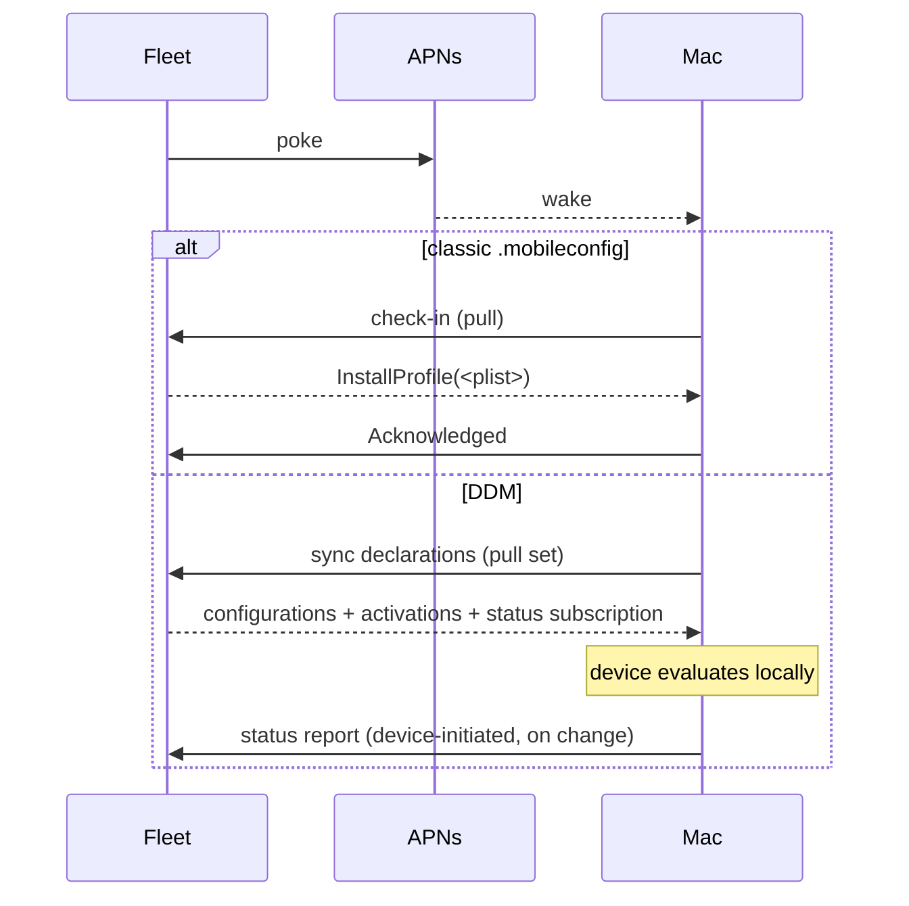

  Both still ride device-outbound HTTPS to Caddy:443; DDM's difference is *who decides when to report* — the device, on change, not the server's poll timer.
- **Free vs Premium** — Shipping profiles/declarations is **free**. DDM-based **OS-update enforcement** and **FileVault enforcement/escrow** are Premium (they're *enforcement*); the equivalent *detection* (osquery reads FileVault + OS version) is free — this is exactly AXIOM's Phase 4 detection-only posture.
- **Gotchas / myth-busting** — (1) DDM is **not** a wire protocol replacing MDM — it rides the *same* Apple MDM transport and APNs wake; it changes the *data model*, not the pipes. (2) Not every setting is DDM-capable yet; Apple ports capabilities gradually, so real fleets run `.mobileconfig` and DDM side by side. (3) A signed profile isn't an encrypted profile — signing proves origin, encryption hides contents; secrets need the latter.
- **See also** — [Configuration profile](#3-configuration-profile-the-unit-of-managed-settings) · [APNs wake channel](#4-apple-apns-the-wake-channel) · [Policy detection vs enforcement](./07-policy-as-code.md) · [GitOps lib/macos](./06-gitops-and-cicd.md)

---

## 6. Apple ABM, ADE (DEP), and VPP: zero-touch (Premium, deferred)

- **In one line** — Apple Business Manager (ABM) is the org portal where devices and app licenses are registered so they can enroll automatically (ADE, née DEP) and receive purchased apps (VPP) — none of which AXIOM can fully exercise at $0.
- **What it actually is** —
  - **ABM (Apple Business Manager):** the web portal that ties an organization to Apple; the account where you register purchased hardware, hold the ADE token, and manage app/book licenses. Requires a verified real business (D-U-N-S number).
  - **ADE (Automated Device Enrollment)** — the current name for **DEP (Device Enrollment Program)**: hardware bought through Apple/authorized resellers is pre-assigned to your MDM server. On first boot (or after erase) the device phones Apple, learns its MDM server, and enrolls **supervised** with no user profile install.
  - **VPP (Volume Purchase Program)** — now "Apps and Books" in ABM: buy app licenses centrally and push them via MDM without Apple IDs.
- **Why it's in Project AXIOM** — It's the "zero-touch" ideal and the *supervised* path that unlocks the strongest Apple commands. AXIOM **defers** it: the fictional Axiom Intelligence has no D-U-N-S/ABM org, and the only real Mac (`mac-studio`) is manually acquired, not ABM-registered. So the lab documents ADE/VPP as the enterprise delta and runs Apple via manual enrollment when it runs Apple at all.
- **Where it sits in the stack** — An upstream Apple *supply-chain/identity* layer feeding the enrollment step (entry 2). It's above enrollment (it *decides* enrollment happens) and external to the lab.
- **How it works** — ABM issues a **server token** (`.p7m`) that Fleet imports; Apple's ADE / device-management endpoints then let Fleet fetch the list of assigned devices and define the enrollment/setup profile they'll receive on first boot. On boot the device contacts Apple's automated-enrollment (Setup Assistant) service, is told "your MDM is Fleet," and enrolls supervised automatically.
- **Who talks to it, and how** —

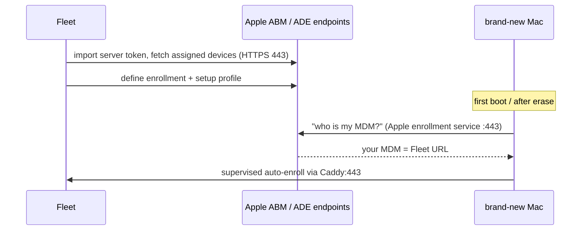

  Fleet↔ABM is server-to-server HTTPS on a schedule; the *device* only contacts Apple's enrollment service at first boot, then Fleet directly.
- **Free vs Premium** — The ABM account and ADE mechanism aren't a Fleet paywall, but **Teams** (needed to auto-assign ADE devices to a scope) and the **ADE "setup experience"** (install software/run scripts during Setup Assistant) are **Premium**. Combined with the D-U-N-S + real-hardware requirement, this is why AXIOM marks the whole area *deferred*.
- **Gotchas / myth-busting** — (1) **DEP and ADE are the same thing**, just renamed — don't treat them as two systems. (2) ADE is the *only* way to get **supervision** without wiping; supervision is what unlocks EraseDevice on Apple silicon, managed activation-lock bypass, etc. — manual enrollment can't grant it. (3) You cannot "add" a random used Mac to ABM after the fact unless it was bought through an ABM-linked channel (or added via Apple Configurator, within a provisional/removable window) — so grey-market hardware can't do true zero-touch.
- **See also** — [Enrollment](#2-enrollment-how-a-device-becomes-managed) · [MDM commands (supervision-gated)](#12-mdm-commands-lock-wipe-isolate-free-vs-premium) · [Teams are Premium](./11-concepts-and-trust-model.md) · [Host & virtualization topology](./01-host-hypervisor-virtualization.md)

---

## 7. Windows OMA-DM and SyncML: the protocol

- **In one line** — OMA-DM is the open device-management protocol Windows speaks over HTTPS, and SyncML is the XML envelope that carries its `Add`/`Replace`/`Get`/`Delete`/`Exec` commands to and from CSPs.
- **What it actually is** — **OMA-DM** (Open Mobile Alliance Device Management) is a decades-old standard (from the phone era) that Windows adopted for modern MDM. **SyncML** (Synchronization Markup Language) is its concrete XML message format. A management "session" is a back-and-forth of numbered packages: the client opens with device info + alerts, the server replies with a body of commands, the client returns status/results, repeat until done. Analogy: SyncML is a diplomatic pouch of formal request/acknowledgement letters; OMA-DM is the courier protocol that sequences the exchange.
- **Why it's in Project AXIOM** — This is the actual wire protocol behind AXIOM's headline free feature: **Windows manual MDM** on `corp-win-01` (and on-demand `corp-win-02`). Every profile/setting Fleet enforces on Windows is ultimately a SyncML `Replace`/`Add` targeting a CSP.
- **Where it sits in the stack** — The Windows transport layer of the MDM channel — the sibling of Apple's MDM-protocol-over-HTTPS. Below it: [TLS/PKI](./04-tls-and-pki.md) (Caddy) and the device identity cert from WSTEP (entry 9). Above it: CSPs (entry 8) and profiles (entry 3).
- **How it works** — After enrollment the Windows OMA-DM client **polls** the management endpoint on a schedule (set at enrollment via the DMClient CSP; optionally nudged by a WNS push). Each session is HTTPS `POST`s of `application/vnd.syncml.dm+xml`:

| Package | From → To | Contains |
|---|---|---|
| Pkg #1 | client → server | device identity, `Alert` (session trigger), device characteristics |
| Pkg #2 | server → client | management commands: `Add`, `Replace`, `Get`, `Delete`, `Exec` on OMA-URIs |
| Pkg #3 | client → server | `Status` + `Results` for each command |
| Pkg #4 | server → client | more commands or session close |

- **Who talks to it, and how** —

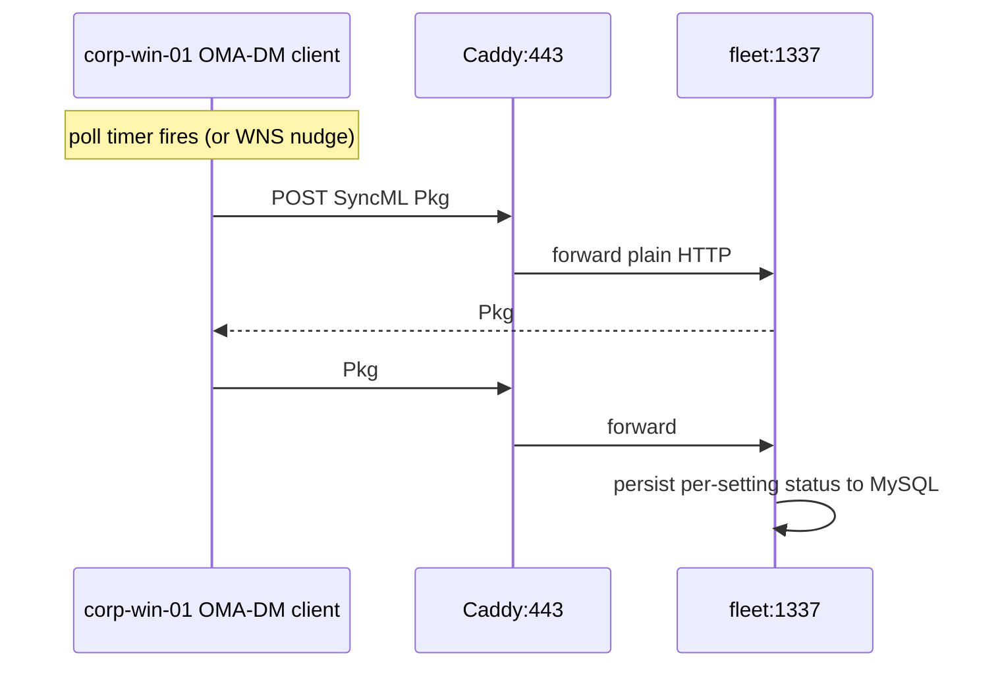

  The Windows client always initiates the HTTPS session (poll-driven); Fleet answers within the open request with the SyncML command body. No inbound connection to the device is ever made.
- **Free vs Premium** — The OMA-DM/SyncML channel and Windows manual MDM are **free** — a core AXIOM $0 win. Premium sits *above* the protocol (Teams-scoped profiles, BitLocker *enforcement*/escrow). Reading BitLocker state via osquery is free.
- **Gotchas / myth-busting** — (1) OMA-DM is **poll-based** by default; WNS is only a *wake optimization*, not required — so Windows changes can lag until the next poll (unlike Apple's near-instant APNs poke). (2) SyncML is finicky XML — a malformed OMA-URI or wrong data type yields a numeric `Status` error, not a friendly message; read the status codes. (3) It's *not* HTTP REST — don't expect JSON; it's SOAP-adjacent XML with strict structure.
- **See also** — [Windows CSP](#8-windows-csp-configuration-service-provider) · [WSTEP enrollment](#9-windows-wstep-enrollment-and-provisioning-packages) · [Configuration profile](#3-configuration-profile-the-unit-of-managed-settings) · [TLS via Caddy](./04-tls-and-pki.md)

---

## 8. Windows CSP (Configuration Service Provider)

- **In one line** — A CSP is the Windows-side handler that maps an incoming OMA-DM node path to a real OS setting — the "device driver" that turns SyncML into an actual registry/policy change.
- **What it actually is** — Windows exposes hundreds of CSPs (BitLocker CSP, Policy CSP, Wi-Fi CSP, DMClient CSP, RemoteWipe CSP…), each presenting a tree of nodes addressed by **OMA-URI** like `./Device/Vendor/MSFT/BitLocker/RequireDeviceEncryption`. When a SyncML `Replace` lands on that URI, the CSP executes the corresponding privileged change. Analogy: the OMA-DM message is a mailing address; the CSP is the department at that address that actually does the work; the OMA-URI is the exact desk within it.
- **Why it's in Project AXIOM** — CSPs are *what AXIOM configures* on Windows. Any `lib/windows/*.xml` profile is a set of CSP node writes. Phase 4 detection-vs-enforcement lives here: AXIOM can *read* BitLocker/Defender state (free, via osquery) but *enforcing* it would mean `Replace`-ing BitLocker-CSP nodes (enforcement = Premium territory).
- **Where it sits in the stack** — The topmost Windows-native layer of the MDM channel: SyncML (entry 7) is the envelope, CSP is the recipient, the OS setting is the effect. It's the Windows analogue of an Apple payload's *effect*.
- **How it works** — Fleet emits SyncML ops naming OMA-URIs; the OMA-DM client dispatches each to the owning CSP; the CSP applies it and returns a `Status`. Two families matter: the **Policy CSP** (a giant umbrella exposing Group-Policy-like ADMX-backed settings) and **feature CSPs** (BitLocker, Wi-Fi, RemoteWipe, DMClient, etc.). AXIOM authors these as XML profiles in Git.
- **Who talks to it, and how** —

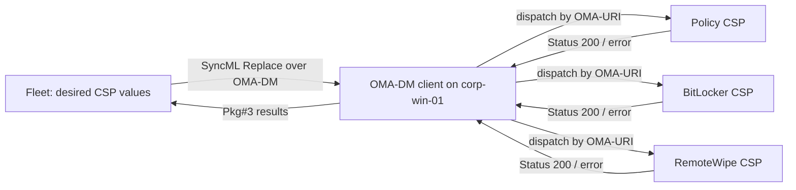

  Nothing external talks to a CSP directly — CSPs are reachable *only* through the enrolled OMA-DM client, which is why enrollment (entry 9) is the prerequisite for any of this.
- **Free vs Premium** — Delivering CSP settings is **free**. The gate is *which* settings deliver business value only when enforced (BitLocker encryption enforcement + key escrow = Premium). Detection of the same via osquery/[telemetry](./08-telemetry-and-observability.md) = free.
- **Gotchas / myth-busting** — (1) CSP ≠ Group Policy: they overlap (Policy CSP surfaces many GPO settings) but a device can't be driven by both cleanly — MDM/CSP and domain GPO can conflict; AXIOM's `corp-win-01` is MDM-managed, not domain-joined. (2) OMA-URIs are **case-sensitive and exact** — `./Device/...` (per-device) vs `./User/...` (per-user) target different scopes; a wrong prefix silently no-ops or errors. (3) Not every CSP node is writable/readable in every Windows edition — `corp-win-01` runs Windows 11 **Enterprise Eval**, which exposes the full set; Home would not.
- **See also** — [OMA-DM & SyncML](#7-windows-oma-dm-and-syncml-the-protocol) · [RemoteWipe CSP → lock/wipe](#12-mdm-commands-lock-wipe-isolate-free-vs-premium) · [Detection vs enforcement](./07-policy-as-code.md) · [Telemetry: reading Windows state](./08-telemetry-and-observability.md)

---

## 9. Windows WSTEP enrollment and provisioning packages

- **In one line** — WSTEP is the certificate-enrollment step of Windows MDM (the device gets its identity cert), while provisioning packages (`.ppkg`) and `unattend.xml` are the *bulk/zero-touch* ways to preconfigure or auto-enroll Windows without clicking through Settings.
- **What it actually is** —
  - **WSTEP (MS-WSTEP):** Microsoft's profile of WS-Trust for X.509 token enrollment. During Windows MDM enrollment the device runs **discovery (MS-MDE2)** → **certificate policy/enrollment (MS-XCEP / MS-WSTEP)** → **provisioning (OMA-DM)**. WSTEP is the leg where the device submits a CSR and receives the **client identity certificate** it will present on every OMA-DM session.
  - **Provisioning package (`.ppkg`):** a bundle built with **Windows Configuration Designer** that applies settings — *including MDM enrollment* — in bulk by double-clicking a file or during OOBE.
  - **`unattend.xml` / `autounattend.xml`:** the Windows Setup *answer file* that automates OOBE (locale, account, and post-setup commands) for hands-off OS install — the Windows counterpart to the Linux VMs' cloud-init NoCloud seed.
- **Why it's in Project AXIOM** — WSTEP is invisible-but-essential: it's what mints `corp-win-01`'s MDM identity cert during the free manual enrollment. `unattend.xml` (or an `autounattend.xml` on the install ISO) is how AXIOM makes the Windows 11 Enterprise Eval VMs **rebuildable from Git** — no manual OOBE clicking — mirroring ADR-0002's cloud-init approach for the Ubuntu VMs. A `.ppkg` is the path to *pre-bake* MDM enrollment so a fresh `corp-win-02` self-enrolls.
- **Where it sits in the stack** — WSTEP sits *inside* the enrollment step (entry 2), between discovery and OMA-DM provisioning, resting on [TLS/PKI](./04-tls-and-pki.md). Provisioning packages / `unattend.xml` sit *below* everything, in the [host/VM provisioning layer](./01-host-hypervisor-virtualization.md) alongside cloud-init.
- **How it works** — Manual flow: user enters the MDM URL → device POSTs to the **discovery** endpoint (learns the enrollment/policy/management URLs) → **WSTEP** exchange issues the client cert → device switches to **OMA-DM** and pulls its first profiles. A `.ppkg` or `unattend.xml` `FirstLogonCommands` can supply the URL/credentials so this whole chain runs unattended.
- **Who talks to it, and how** —

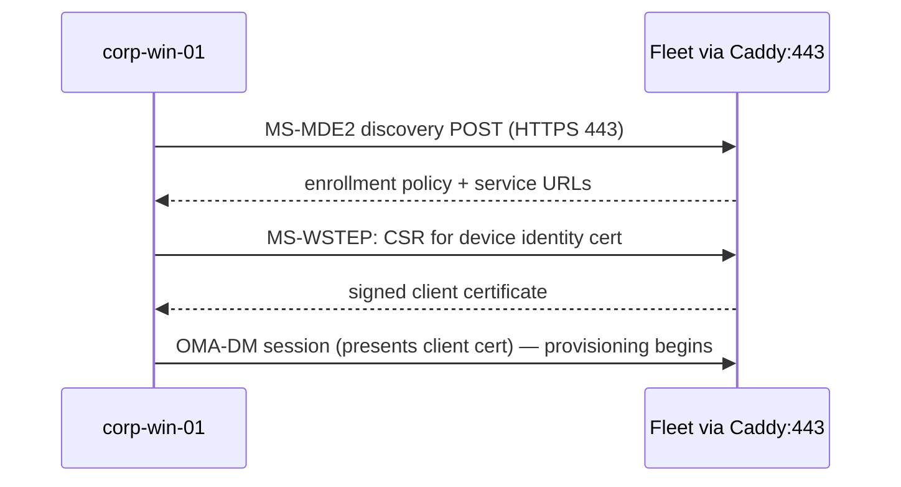

  All device-outbound to Caddy:443. `unattend.xml`/`.ppkg` don't "talk" to Fleet themselves — they *seed* the device so it initiates the above on its own.
- **Free vs Premium** — WSTEP enrollment and manual Windows MDM are **free**. Provisioning packages and `unattend.xml` are Windows tooling, not Fleet features — free. (True zero-touch **Autopilot** needs Entra/Intune and is out of AXIOM's $0 scope — [identity](./09-identity-and-access.md).)
- **Gotchas / myth-busting** — (1) `unattend.xml` (Setup answer file) ≠ MDM enrollment — it can *trigger* enrollment but is a separate OS-install mechanism; don't conflate them. (2) The WSTEP client cert is the Windows analogue of Apple's SCEP identity cert — both are the "who is calling" credential, distinct from the fleetd enroll secret. (3) Discovery can fail if the MDM URL's TLS chain isn't trusted by the Windows system store — unlike osqueryd, the OMA-DM client *does* use the system trust store, so the [lab root CA](./04-tls-and-pki.md) must be installed on the Windows box first.
- **See also** — [Enrollment](#2-enrollment-how-a-device-becomes-managed) · [OMA-DM sessions](#7-windows-oma-dm-and-syncml-the-protocol) · [Host/VM provisioning & cloud-init](./01-host-hypervisor-virtualization.md) (ADR-0002) · [Root CA trust](./04-tls-and-pki.md)

---

## 10. Android Enterprise and the Android Management API

- **In one line** — Android management is **cloud-mediated**: Fleet is an EMM that calls Google's Android Management API (AMAPI), Google's *Android Device Policy* app is the on-device agent, and Fleet never talks to the phone directly.
- **What it actually is** — **Android Enterprise** is Google's umbrella program for managed Android. The **Android Management API (AMAPI)** is a Google-hosted REST API through which an EMM (Fleet) creates an *enterprise*, defines *policies*, mints *enrollment tokens*, and issues *commands*. The device runs **Android Device Policy (ADP)** — a Google-provided agent app that runs atop Google Play services — which pulls policy and executes commands from Google's cloud, woken by **FCM** (Firebase Cloud Messaging). Analogy: for Apple/Windows, Fleet is the switchboard; for Android, Fleet phones **Google's** switchboard and Google connects the call.
- **Why it's in Project AXIOM** — It makes Android management **GA and free** for the modes AXIOM wants — no self-hosted Android MDM server, no third-party fallback (the old "Headwind MDM" workaround is unnecessary). `android-byod` (an Android Studio AVD) enrolls into a work profile and is managed entirely through Google's API from Fleet.
- **Where it sits in the stack** — A *cloud-proxied* variant of the MDM channel. Uniquely, the [Caddy/TLS](./04-tls-and-pki.md) inbound path and APNs/OMA-DM logic **don't apply** to the device link — the device talks to Google, and Fleet↔Google is a separate server-to-server integration configured in [identity/integrations](./09-identity-and-access.md).
- **How it works** — Setup binds Fleet to a Google **enterprise** (an OAuth/service-account link, established with a free Android Enterprise subscription via any Google Workspace/Microsoft 365/work-email account). Fleet writes a **policy** object (JSON) to AMAPI and generates an **enrollment token**. The device enrolls (QR/link) → ADP registers the device to that enterprise → Google applies the policy. Fleet issues commands by POSTing to AMAPI; Google delivers them to ADP via FCM; ADP reports status back up to Google; Fleet reads it back from AMAPI.
- **Who talks to it, and how** —

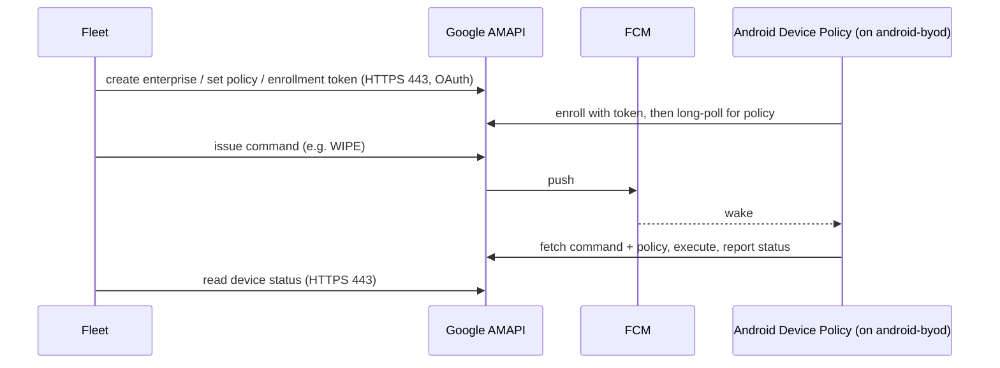

  Two independent server-to-server legs, both to Google on 443 — Fleet↔Google (management) and ADP↔Google (policy/commands). **Fleet and the phone never connect directly**, so the lab's Caddy/mkcert PKI is irrelevant to the Android device path.
- **Free vs Premium** — Android MDM is **GA and free** in Fleet for **work-profile BYOD** and **fully-managed** enrollment, plus the **company-owned Wipe** command. See entries 11–12 for the exact command split (BYOD Wipe and all Lock/Clear-passcode are Premium). Requires Google-side setup (a work-email Android Enterprise subscription to bind the enterprise); Google charges nothing for it, and no Fleet license is needed for the free modes.
- **Gotchas / myth-busting** — (1) This is not self-hosted — if Google's cloud or the device's Play services are unreachable, management stops; there is no LAN-only Android MDM. (2) The **self-hosted GitHub Actions runner** constraint (GitHub cloud can't reach the LAN) does *not* apply to Android device management — that's an outbound integration to Google, which works fine. (3) Because Google runs the agent, Fleet exposes the *subset* of controls AMAPI offers — you can't push arbitrary Android internals the way a `.mobileconfig`/CSP lets you on Apple/Windows.
- **See also** — [Work profile & Play Protect](#11-android-work-profile-and-play-protect-certification) · [MDM commands](#12-mdm-commands-lock-wipe-isolate-free-vs-premium) · [Identity / cloud integrations](./09-identity-and-access.md) · [MDM check-in concept](#1-mdm-the-concept-and-the-check-in-loop)

---

## 11. Android work profile and Play Protect certification

- **In one line** — A *work profile* is an OS-enforced encrypted container for company apps/data on a personal phone, and **Play Protect certification** (real Google Play services) is the hard prerequisite that makes an Android device — or AVD — enrollable at all.
- **What it actually is** —
  - **Work profile (BYOD / "profile owner"):** Android splits the device into a personal side and a cryptographically separate managed side. The MDM controls only the work profile — work apps, work-profile passcode, work data — and cannot see or wipe personal apps, photos, or messages. Removing management deletes only the container. (Contrast **fully-managed / "device owner"**, where the MDM controls the whole device — AXIOM supports both.) Analogy: a work profile is a locked office suite inside your house; the employer holds the office key, never the house key.
  - **Play Protect certification:** Google's attestation that a device passes the Compatibility Test Suite and ships genuine **Google Mobile Services (GMS)** — including Google Play services, which *is* the runtime that Android Device Policy depends on. No GMS ⇒ no ADP ⇒ no enrollment.
- **Why it's in Project AXIOM** — `android-byod` demonstrates the realistic BYOD posture (manage work data, respect personal privacy). And Play Protect certification is a concrete **lab gotcha**: it dictates *which emulator image* AXIOM must use — see below.
- **Where it sits in the stack** — Work profile is an *enrollment mode / on-device isolation* concept within the Android MDM channel (entry 10). Play Protect certification is a *device/host prerequisite* sitting under it, in the [host/virtualization](./01-host-hypervisor-virtualization.md) layer since it constrains the AVD image choice.
- **How it works** — At enrollment the token specifies the mode; ADP provisions either a work profile (creating the container) or takes device-owner control. Policy from AMAPI then applies to the managed scope. Certification is checked implicitly: ADP only installs/runs on a GMS-certified device, and Google's *Play Integrity/Play Protect* signals gate enrollment.
- **Who talks to it, and how** — Same topology as entry 10 (Fleet↔Google↔ADP). The work-profile boundary is enforced *locally by Android*, not by any network peer — no one "talks to" the container from outside except through ADP applying Google's policy.

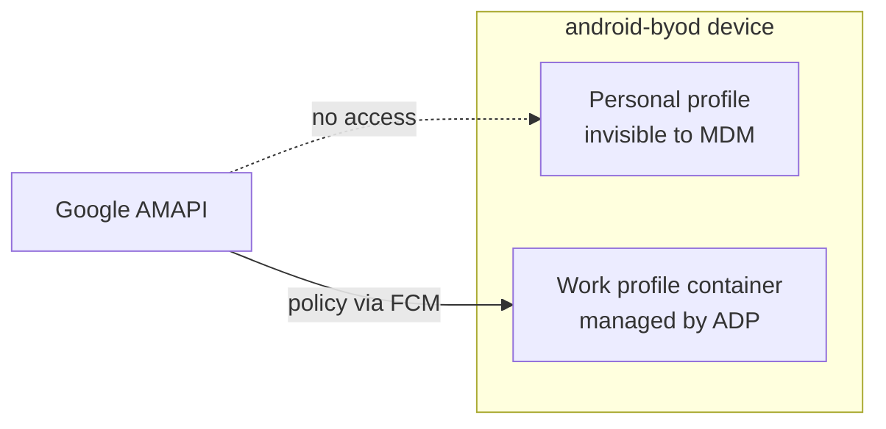

- **Free vs Premium** — Work-profile BYOD and fully-managed enrollment are **free** in Fleet's Android MDM (GA). The Premium split shows up in *commands* on BYOD (entry 12), not in the enrollment mode itself.
- **Gotchas / myth-busting** — (1) **The big AXIOM AVD gotcha:** an **AOSP** emulator image has *no* Google Play services, so ADP can't run and enrollment is impossible. You must use a **"Google Play" (Play-store, Play-Protect-certified) system image** AVD, not "Google APIs" or plain AOSP. (2) Work profile ≠ a second user account you can spy on — the personal side is genuinely off-limits to the MDM by OS design; "we manage the phone" overstates BYOD reach. (3) Fully-managed requires the device to enroll from a factory-reset state (device-owner can't be added to an in-use personal phone) — fine for an AVD you can reset freely.
- **See also** — [Android Management API](#10-android-enterprise-and-the-android-management-api) · [MDM commands (BYOD vs company-owned)](#12-mdm-commands-lock-wipe-isolate-free-vs-premium) · [AVD / emulator host setup](./01-host-hypervisor-virtualization.md)

---

## 12. MDM commands: lock, wipe, isolate (Free vs Premium)

- **In one line** — These are the *imperative verbs* of MDM — one-shot orders to lock the screen, erase the device, or (for isolation) run a remediation script — and in Fleet they're the most tier-gated part of the whole layer.
- **What it actually is** — Where profiles are standing policy, commands are single actions delivered through the same channel: Apple `DeviceLock`/`EraseDevice` (macOS wipe uses Erase All Content and Settings — EACS), the Windows **RemoteWipe CSP** (`doWipeProtected`) and lock, and Android AMAPI `LOCK`/`RESET_PASSWORD` (clear-passcode)/`WIPE`. **"Isolate" is the odd one out — there is no native MDM "network-isolate" command on any of these platforms.** In AXIOM, isolation is *synthesized* from Fleet's free **script-execution API** (kill connectivity via a host script), triggered by a **failing-policy webhook** — this is the Phase 8 auto-remediation story, and it's the honest answer to "how do we isolate a compromised host at $0."
- **Why it's in Project AXIOM** — Lock/wipe are the "break-glass" IR actions; isolate-via-script is the automated containment AXIOM actually builds (script execution + webhooks are **free**). This entry is also the clearest lens on the lab's Free-vs-Premium reality.
- **Where it sits in the stack** — The action tip of the MDM channel, wired into [automation/IR](./10-automation-and-ir.md) (webhooks, scripts) and driven by [policy-as-code](./07-policy-as-code.md) (a failing policy is the trigger).
- **How it works** — A lock/wipe is queued like any command and delivered via each platform's transport (APNs-woken pull for Apple, OMA-DM/RemoteWipe CSP for Windows, AMAPI/FCM for Android). "Isolate" instead fires: failing policy → Fleet webhook → [automation/IR](./10-automation-and-ir.md) receiver → Fleet script-execution API → fleetd runs the containment script on the host.
- **Who talks to it, and how** —

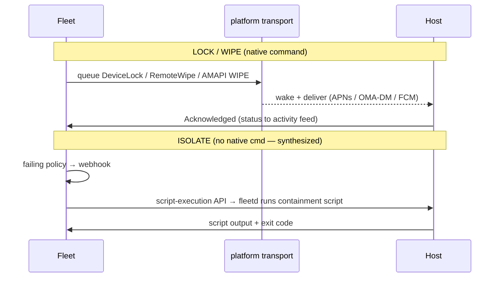

- **Free vs Premium** — This is genuinely version-dependent; the split as understood for AXIOM at **v4.89.1 (2026-07-20)** is:

| Action | Platform | Tier in AXIOM | Mechanism |
|---|---|---|---|
| **Wipe** | Android — **company-owned / fully-managed** | **Free** | AMAPI `WIPE`; made Free for company-owned hosts in Fleet 4.87.0 |
| **Wipe** | Android — **BYOD / work-profile** | **Premium** | AMAPI `WIPE` (removes only the work profile) |
| **Lock / Clear-passcode** | Android (both modes) | **Premium** | AMAPI `LOCK` / `RESET_PASSWORD` |
| **Lock / Wipe** | macOS, Windows, iOS/iPadOS | **Premium** | native MDM cmd (EACS / RemoteWipe CSP) |
| **Wipe** | Linux | **Free via script** | destructive host script via the free script-execution API — *not* a native Fleet wipe command (that's Premium) |
| **"Isolate"** | all | **Free** | script-execution API + failing-policy webhook (no native cmd) |

  **How to read the split (the sources look contradictory but aren't).** The [Fleet 4.87.0 release notes](https://fleetdm.com/releases/fleet-4-87-0) — the release that *introduced* Android lock/wipe/clear-passcode, shipped just before the pinned v4.89.1 — state it plainly: *"Made the Wipe command available to Fleet Free users for Android (company-owned) hosts, in both the UI and the API,"* while every other lock/wipe/clear-passcode action stays Premium. The general [lock-wipe guide](https://fleetdm.com/guides/lock-wipe-hosts) carries a blanket "Available in Fleet Premium" header and simply doesn't spell out that one Free carve-out — it's a summary, not a contradiction. So the operative rule for **v4.89.1** is: **company-owned Android Wipe is Free; BYOD-work-profile Wipe and all Lock/Clear-passcode are Premium.** This still lands AXIOM's "Android Wipe at $0" goal — the lab enrolls `android-byod` **fully-managed** (device-owner; an AVD resets freely), which is exactly the mode that can wipe for free. Fleet is actively moving low-level lock/wipe toward Free (tracking [issue #17178](https://github.com/fleetdm/fleet/issues/17178)), so re-confirm against [fleetdm.com/pricing](https://fleetdm.com/pricing) before depending on the exact boundary. The one thing AXIOM *never* needs Premium for is **isolation** — it's built entirely from the free script-execution API.
- **Gotchas / myth-busting** — (1) **There is no MDM "network isolate."** If a doc implies MDM can quarantine a host's network like an EDR, it's wrong for these platforms — AXIOM does it with scripts. (2) Apple **EraseDevice on Apple silicon requires supervision** (ADE), so the manually-enrolled `mac-studio` may not be able to remote-wipe even with Premium — a supervision limit, not just a license one (entry 6). (3) Android **BYOD "wipe" ≠ factory reset** — it removes the work profile only; personal data survives (in Fleet, unenrolling a BYOD Android host removes its work profile). (4) Fleet deliberately keeps lock/wipe **low-key in the UI** (tracked in the activity feed rather than as status badges) — don't expect a big red "LOCKED" flag.
- **See also** — [Automation & IR: webhooks + script execution](./10-automation-and-ir.md) · [Policy-as-code triggers](./07-policy-as-code.md) · [Android AMAPI](#10-android-enterprise-and-the-android-management-api) · [Supervision via ADE](#6-apple-abm-ade-dep-and-vpp-zero-touch-premium-deferred) · [Windows RemoteWipe CSP](#8-windows-csp-configuration-service-provider)

---

> **Layer recap.** Fleet is a *real MDM server* for Windows (OMA-DM/SyncML/CSP, free, the AXIOM headline) and for Apple (MDM-over-HTTPS woken by APNs, free but hardware-deferred), and a *cloud proxy* to Google for Android (AMAPI, GA + free for BYOD/fully-managed enrollment and the company-owned Wipe command). The invariant across all three: **the device always initiates the substantive connection; push services only wake it.** The Premium wall runs through *enforcement, Teams-scoping, and most lock/wipe* — while *detection, profile delivery, enrollment, and script-based isolation* stay at $0. Next: how the desired-state for all these profiles is authored and reconciled → [GitOps & CI/CD](./06-gitops-and-cicd.md); how their compliance is judged → [Policy-as-code](./07-policy-as-code.md).
