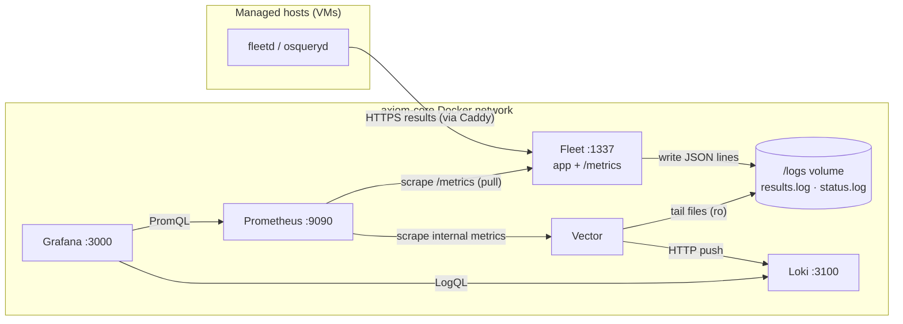

# 📈 Telemetry & Observability
> Part of the **[Project AXIOM Encyclopedia](./README.md)** · Layer: Telemetry. How host and server signals leave Fleet, get shipped and stored, and become the three dashboards that make the lab legible — logs via Vector→Loki, metrics via Prometheus, rendered in Grafana, all defined as code.

This layer is the lab's nervous system. Fleet already collects a firehose of host data (osquery results, its own server metrics), but raw data on a disk is not observability — you need it *shipped*, *stored in a query-able shape*, and *rendered*. Project AXIOM does this with an all-FOSS, $0 pipeline that lives as extra containers inside the `axiom-core` stack: **Fleet** emits logs (to a filesystem volume) and metrics (on `/metrics`); **Vector** tails the logs and **Prometheus** scrapes the metrics; **Loki** stores logs and Prometheus stores metrics; **Grafana** reads both and renders dashboards provisioned from JSON in Git. Everything is declarative and rebuildable — losing the whole telemetry stack costs a `docker compose up`, not a re-configuration.



> **Naming note:** in this file, "logs" almost always means the two osquery log streams Fleet emits; "metrics" means the Prometheus time-series Fleet's server exposes. Keeping those two words straight is 80% of understanding this layer.

---

## Observability: logs vs metrics vs traces

- **In one line** — The three fundamental telemetry signal types; a mental model for *which kind of question* each answers.
- **What it actually is** — "Observability" is the property of being able to ask arbitrary questions about a running system from the outside, using the signals it emits. The canonical taxonomy is three "pillars":
  - **Logs** — discrete, timestamped *events* ("host X's osquery returned this result at 12:03:11"). High-cardinality, verbose, great for "what exactly happened."
  - **Metrics** — numeric measurements sampled over time ("Fleet is holding 42 open MySQL connections"). Cheap to store, aggregate-friendly, great for "how much / how fast / trending which way."
  - **Traces** — the causal path of a single request across services. Great for "where did the latency go." *Project AXIOM does not implement tracing* (see Gotchas).
  - Analogy: logs are the CCTV footage (every event, bulky), metrics are the dashboard gauges (a needle per quantity, glanceable), traces are a package's tracking history (one shipment's journey across hubs).
- **Why it's in Project AXIOM** — It's the organizing principle for the whole layer: the lab deliberately runs *two separate pipelines* because logs and metrics have opposite storage/query characteristics. Vector→Loki is the **logs** pipeline; Prometheus is the **metrics** pipeline; Grafana unifies them at the glass. Understanding the split explains why there are four telemetry containers instead of one.
- **Where it sits in the stack** — This is the conceptual root of Layer 08. Everything below it (Fleet logs, Vector, Loki, Prometheus, Grafana) is an implementation of one pillar or the plumbing between them. It sits *above* [fleet-core](./03-fleet-core.md) (the data source) and *beside* [policy-as-code](./07-policy-as-code.md) (which produces much of the log content) and [automation & IR](./10-automation-and-ir.md) (which acts on the signals).
- **How it works** — You classify each question by signal type, then route it to the store built for that shape: counting/rate/trend questions → a time-series DB queried with PromQL; "show me the events matching…" questions → a log store queried with LogQL. Cardinality is the deciding axis: a metric with millions of distinct label values explodes a TSDB, so host-identifying detail belongs in logs (Loki), while aggregate counts belong in metrics (Prometheus).
- **Who talks to it, and how** — Nothing "talks to" the concept; it dictates the wiring of everyone who does. The rule it enforces in this lab: **host-level, event-shaped, high-cardinality data (osquery results, FIM events) flows into Loki; server-level, aggregate, numeric data flows into Prometheus.** Every routing decision in the sections below traces back to this.
- **Free vs Premium** — Purely architectural; no license implications. All three pillars are achievable at $0 with the FOSS tools chosen here. (Fleet *Premium* would add richer built-in data like vuln scores, but not a new signal type.)
- **Gotchas / myth-busting** — (1) *"Just log everything and grep it"* fails at scale and for trends — you cannot cheaply compute a 7-day p95 latency from log lines; that's what metrics are for. (2) **AXIOM has no traces.** Fleet is effectively a monolith behind Caddy, so distributed tracing would add machinery for near-zero payoff; the lab is honest about being a two-pillar (logs + metrics) observability stack, not three. (3) Metrics ≠ aggregated logs: they're independently emitted; Fleet's `/metrics` counters are not derived from the osquery log files.
- **See also** — [Fleet result logs vs status logs](#fleet-result-logs-vs-status-logs) · [Prometheus and the `/metrics` endpoint](#prometheus-and-the-metrics-endpoint) · [Loki: the log store, and LogQL](#loki-the-log-store-and-logql) · [fleet-core](./03-fleet-core.md)

---

## Fleet result logs vs status logs

- **In one line** — The two osquery log *streams* Fleet emits: **result logs** carry query answers (the data you care about); **status logs** carry osquery's own operational chatter (health of the agent).
- **What it actually is** — osquery on each host produces two independent streams, and Fleet relays both to whatever "logging destination" plugin you configure:
  - **Result logs** — the output rows of *scheduled queries* and the differential/snapshot events they generate (new process, changed file via `file_events`, software inventory delta, etc.). This is the substance: "host `enclave-01` saw file `/opt/axiom/weights-cache/model.bin` modified."
  - **Status logs** — osquery's internal INFO/WARNING/ERROR messages: "query X took 900ms," "table Y failed," "config refreshed." This is the *meta* stream — the agent describing its own operation, not the endpoint's state.
  - Analogy: result logs are the survey *answers*; status logs are the *field notes from the interviewer* ("respondent hesitated, question 4 timed out").
- **Why it's in Project AXIOM** — Result logs are the raw material for two of the three dashboards: the **Enclave FIM** timeline is literally `file_events` result rows, and **compliance-by-tier** is built from scheduled-query result rows carrying each host's trust-tier. Status logs are how the lab answers "is the agent healthy / are queries failing?" without SSHing into a VM. Both are captured for free and shipped by the same Vector pipeline.
- **Where it sits in the stack** — Produced by [osqueryd inside fleetd](./03-fleet-core.md#fleetd) on each managed host, relayed by the Fleet server, and written to the [filesystem logging destination](#the-filesystem-logging-destination-the-logs-volume). Immediately downstream is [Vector](#vector-the-log-shipper-and-router).
- **How it works** — Hosts run scheduled queries per their agent config; osquery batches results and status lines and sends them **up to the Fleet server** on its normal check-in. Fleet does not interpret them as telemetry — it hands each stream to the configured *log plugin*. AXIOM sets the **filesystem** plugin for both, so Fleet appends newline-delimited JSON to two files. Fleet supports many other destinations (`firehose`, `kinesis`, `kafka`, `pubsub`, `lambda`, `stdout`…); `filesystem` is chosen because it's $0 and local. Key env vars (verify names against the v4.89.1 tag):

  | Env var | Value in AXIOM | Meaning |
  |---|---|---|
  | `FLEET_OSQUERY_RESULT_LOG_PLUGIN` | `filesystem` | where result logs go |
  | `FLEET_OSQUERY_STATUS_LOG_PLUGIN` | `filesystem` | where status logs go |
  | `FLEET_FILESYSTEM_RESULT_LOG_FILE` | `/logs/osqueryd.results.log` | result file path (default `/tmp/osquery_result`) |
  | `FLEET_FILESYSTEM_STATUS_LOG_FILE` | `/logs/osqueryd.status.log` | status file path (default `/tmp/osquery_status`) |

- **Who talks to it, and how** —
  1. **osqueryd (on a VM) → Fleet:** outbound HTTPS `POST` from the host to `FLEET_SERVER_URL` (the Caddy hostname:443) → Caddy terminates TLS → forwards plain HTTP to `fleet:1337`. Payload = batched result + status JSON on the standard osquery log endpoints. The **host always initiates**; Fleet never pulls logs.
  2. **Fleet → filesystem:** Fleet appends each stream as JSON lines to its file under `/logs`.
  3. **Vector → files:** Vector *tails* those files (see next two sections). Neither Fleet nor Vector reaches back to the host for logs.

  ```mermaid
  sequenceDiagram
    participant O as osqueryd (VM)
    participant C as Caddy :443
    participant F as Fleet :1337
    participant L as /logs volume
    O->>C: HTTPS POST results+status (host initiates)
    C->>F: plain HTTP (TLS terminated)
    F->>L: append osqueryd.results.log
    F->>L: append osqueryd.status.log
    Note over L: newline-delimited JSON
  ```
- **Free vs Premium** — Filesystem osquery logging (both streams) is **Free**. What you *query* those results *for* can hit Premium limits elsewhere — e.g. vulnerability **CVE IDs** appear in software inventory results (Free) but **CVSS/EPSS/KEV scores are Premium**, so a "risk by score" panel isn't buildable at $0.
- **Gotchas / myth-busting** — (1) **Result ≠ status is a common mix-up:** if a compliance panel is empty, check you're reading `osqueryd.results.log`, not the status file. (2) **Policies don't emit result logs.** Fleet *policies* (pass/fail) live in the Fleet DB and surface via UI/API/webhooks — they are *not* in the result log. To get compliance data into Loki, AXIOM schedules **queries** that mirror the policy checks (carrying the trust-tier column); see [compliance-by-tier](#compliance-by-tier). (3) **Snapshot vs differential:** a query in `snapshot` mode logs the full result set every run (noisier); `differential` logs only adds/removes — pick per query to control log volume. (4) Empty results are normal — a scheduled query with no matching rows logs nothing.
- **See also** — [The filesystem logging destination](#the-filesystem-logging-destination-the-logs-volume) · [policy-as-code](./07-policy-as-code.md) · [Enclave FIM dashboard](#enclave-fim) · [Vulnerability detection (automation/IR)](./10-automation-and-ir.md)

---

## The filesystem logging destination (the `/logs` volume)

- **In one line** — The shared Docker volume mounted at `/logs`, where Fleet writes the two osquery log files and from which Vector reads them — the hand-off point between the producer and the shipper.
- **What it actually is** — A named Docker volume (or bind mount) attached to **two** containers: the `fleet` container writes to it, the `vector` container reads it. It is the deliberately-simple, $0 alternative to a message bus: instead of Fleet pushing to Kafka/Kinesis, Fleet appends to plain files and Vector tails them. Think of it as a shared mailbox on the wall between two rooms — Fleet drops letters in one side, Vector picks them up from the other.
- **Why it's in Project AXIOM** — It decouples the collector (Fleet) from the shipper (Vector): each can restart independently, and Vector's file checkpoint means a Vector restart resumes without re-reading or dropping lines. It's also the same volume the **fleet-init sidecar chowns** at boot, so it ties directly into the stack's startup correctness.
- **Where it sits in the stack** — A [Docker volume](./02-containers-and-docker.md) inside the `axiom-core` stack. *Above* it: the Fleet server (writer) and osquery result/status streams. *Below/beside* it: Vector (reader). It is pure plumbing — no process of its own.
- **How it works** — Declared once in compose and mounted into both services (typically **read-write for Fleet, read-only for Vector**). Fleet's filesystem log plugin opens `osqueryd.results.log` and `osqueryd.status.log` under this path and appends. Vector's `file` source globs the same paths and tails them, persisting a byte-offset checkpoint on its own data volume. **Log rotation** matters here: Fleet can rotate its own files (`FLEET_FILESYSTEM_ENABLE_LOG_ROTATION=true`, backed by lumberjack) or you rely on an external `logrotate`; without rotation the volume grows unbounded. Vector must handle rotation gracefully (it follows the inode/truncation).
- **Who talks to it, and how** — Nobody "talks to" a volume over the network; access is via the container filesystem:
  1. **Fleet (uid 100 / gid 101) → `/logs`:** `open()`/`append()` writes.
  2. **fleet-init sidecar → `/logs`:** a one-shot `alpine` container runs `chown -R 100:101 /logs /data /vulndb` **before Fleet starts** (`depends_on: service_completed_successfully`). Skip it and Fleet — which runs non-root as 100:101 — cannot write the files and **crashes on boot** (the "unknown userid" failure class).
  3. **Vector → `/logs`:** read-only `tail`, plus checkpoint writes to *its own* state dir (not `/logs`).

  | Actor | Access | Direction | Purpose |
  |---|---|---|---|
  | fleet-init | chown (one-shot) | write | fix ownership to 100:101 before boot |
  | Fleet | append | write | emit result/status JSON |
  | Vector | tail | read-only | ship lines onward |
- **Free vs Premium** — Entirely Free; it's just Docker + a filesystem plugin.
- **Gotchas / myth-busting** — (1) **The chown sidecar is not optional** — it's the #1 first-boot failure for this stack and is unrelated to telemetry per se, but the `/logs` volume is one of the three paths it fixes. (2) **Unbounded growth:** result logs on a busy fleet can fill the disk fast; enable rotation and/or let Loki be the long-term store while `/logs` stays a short buffer. (3) **`/logs` is a buffer, not an archive** — treat Loki as the queryable store; don't build dashboards that grep the raw files. (4) Permissions surprise: if you `docker compose down -v` you wipe the checkpoint and Vector may re-ship the current file head on next boot (usually harmless, occasionally duplicate lines).
- **See also** — [containers & Docker (volumes, sidecars)](./02-containers-and-docker.md) · [fleet-init & first-boot ordering](./03-fleet-core.md) · [Vector](#vector-the-log-shipper-and-router)

---

## Vector: the log shipper and router

- **In one line** — The high-performance pipeline (by Datadog, FOSS) that *tails* Fleet's log files, parses/enriches each line, and *pushes* the results into Loki — the "collect → transform → route" engine of the logs pillar.
- **What it actually is** — Vector is a single Rust binary that models a pipeline as **sources → transforms → sinks**. Sources ingest (here: a `file` source tailing `/logs/*.log`); transforms reshape (parse JSON, extract fields, add/rename labels via VRL — Vector Remap Language); sinks emit (here: a `loki` sink). It's the modern replacement for Logstash/Fluentd, chosen for low memory and a clean config. Analogy: a mailroom that opens each incoming letter, stamps it with the right routing labels, and forwards it to the correct department.
- **Why it's in Project AXIOM** — Loki wants pushed, *labeled* streams — it won't tail files itself. Vector is the adapter: it turns Fleet's flat JSON log lines into Loki-shaped streams, attaching the labels the dashboards filter on (`host`, `trust_tier`, `query_name`, `stream=result|status`, `enclave=true`). It also normalizes the two osquery log shapes and can drop noise before it ever hits storage, keeping Loki small on a laptop.
- **Where it sits in the stack** — Squarely between the [`/logs` volume](#the-filesystem-logging-destination-the-logs-volume) (its source) and [Loki](#loki-the-log-store-and-logql) (its sink), as a container on the `axiom-core` Docker network. It is the only component that reads the raw log files.
- **How it works** — On boot Vector reads its config (TOML/YAML), opens the `file` source, and begins tailing from its last checkpoint. Each new line flows through the transform graph: `parse_json` turns the string into structured fields; VRL logic promotes select fields to Loki *labels* (kept low-cardinality) while the full JSON stays in the log *body*. The `loki` sink batches lines and `POST`s them. Vector also runs an `internal_metrics` source so it can report its own throughput/errors (exposed for Prometheus — see [exporters](#data-sources-and-exporters)).
- **Who talks to it, and how** —
  1. **Vector → `/logs` files:** local read-only tail (no network).
  2. **Vector → Loki:** outbound HTTP `POST` to `http://loki:3100/loki/api/v1/push` on the internal Docker network, body = a batch of `{stream: {labels…}, values: [[ts, line], …]}`. **Vector initiates**; Loki never calls Vector.
  3. **Prometheus → Vector:** *inbound* scrape — Prometheus pulls Vector's `internal_metrics` from a `prometheus_exporter` sink (e.g. `vector:9598/metrics`). Direction reversed vs the Loki hop.
  4. **Vector → Fleet `/metrics` (optional):** Vector *can* host a `prometheus_scrape` source to pull Fleet metrics itself, but AXIOM leaves metric-scraping to Prometheus to keep responsibilities clean.

  ```mermaid
  flowchart LR
    logs[("/logs/*.log")] -->|file source: tail ro| V[Vector]
    V -->|parse_json + VRL relabel| V
    V -->|"HTTP POST /loki/api/v1/push"| loki["Loki :3100"]
    prom["Prometheus :9090"] -->|"scrape :9598/metrics (pull)"| V
  ```
- **Free vs Premium** — Vector is MPL-2.0 FOSS, $0. No Fleet license interaction.
- **Gotchas / myth-busting** — (1) **Label cardinality is a footgun:** promote `host`/`trust_tier`/`stream` to Loki labels, but **never** promote unbounded fields (a raw timestamp, a file hash, a PID) — high-cardinality labels blow up Loki's index. Keep those in the log *body* and extract at query time with LogQL. (2) Vector is *not* the store — if you never run Loki, tailing still "works" but nothing is queryable. (3) Config-format churn: Vector renames sink options across releases; pin the Vector image tag and validate with `vector validate` in CI. (4) Timestamp handling: parse the osquery event's own `unixTime`/`calendarTime` into Vector's `@timestamp` so Loki indexes event-time, not ingest-time — otherwise a backlog after a restart lands all lines at "now."
- **See also** — [Loki](#loki-the-log-store-and-logql) · [The `/logs` volume](#the-filesystem-logging-destination-the-logs-volume) · [Prometheus](#prometheus-and-the-metrics-endpoint) · [data sources & exporters](#data-sources-and-exporters)

---

## Loki: the log store, and LogQL

- **In one line** — Grafana's horizontally-scalable log database that indexes only *labels* (not full text) and is queried with **LogQL**; the store for the logs pillar.
- **What it actually is** — Loki (by Grafana Labs) is "Prometheus, but for logs": it stores log lines grouped into **streams**, where a stream is a unique set of labels (`{host="enclave-01", stream="result", trust_tier="elevated"}`). It builds a small index over *labels only* and keeps the raw log bodies in compressed **chunks**. That's why it's cheap: it doesn't full-text-index gigabytes; it narrows by labels first, then scans the matching chunks. **LogQL** is its query language — a log stream selector `{…}` plus optional line filters (`|= "weights-cache"`), parsers (`| json`), and metric aggregations (`count_over_time`, `rate`). Analogy: a library that indexes books only by a few spine labels (author, genre, year); to find a sentence you first pull the right shelf, then read.
- **Why it's in Project AXIOM** — It's the queryable home for everything Vector ships, and the backing store for two of the three dashboards (**Enclave FIM** and **compliance-by-tier**). LogQL's `count_over_time`/`rate` also let Loki produce *metrics-shaped* panels (e.g. "FIM events per hour") without a separate metrics pipeline, which keeps the lab small.
- **Where it sits in the stack** — Downstream of [Vector](#vector-the-log-shipper-and-router) (its only writer in this lab), upstream of [Grafana](#grafana-dashboards) (its only reader). Runs as a container on the `axiom-core` network in **monolithic/single-binary mode** with **filesystem** chunk storage — no S3/object store needed for a laptop.
- **How it works** — Loki exposes an HTTP API on `:3100`. Writes arrive at `/loki/api/v1/push`; Loki appends each line to the in-memory stream for its label set, periodically flushing chunks to local disk (with a boltdb-shipper/TSDB index). Reads arrive at `/loki/api/v1/query_range` (and `/query`), where the LogQL engine resolves the label selector against the index, streams the matching chunks, applies filters/parsers/aggregations, and returns series or log lines. Retention and chunk size are configured for the lab's small footprint.
- **Who talks to it, and how** —
  1. **Vector → Loki (write):** inbound HTTP `POST /loki/api/v1/push` from `vector` → `loki:3100`. Vector initiates.
  2. **Grafana → Loki (read):** inbound HTTP `GET/POST /loki/api/v1/query_range` from `grafana` → `loki:3100`, carrying a LogQL query when a panel or Explore view refreshes. Grafana initiates on every dashboard refresh.
  3. **Prometheus → Loki (optional):** Loki exposes its *own* `/metrics`; Prometheus can scrape it to monitor the log store itself.
  4. Loki initiates **no** outbound calls in this topology (it's a passive store).

  | Peer | Path/port | Direction | Payload |
  |---|---|---|---|
  | Vector | `POST :3100/loki/api/v1/push` | in | labeled log batches |
  | Grafana | `:3100/loki/api/v1/query_range` | in | LogQL query → series/lines |
  | Prometheus | `:3100/metrics` | in (scrape) | Loki's own metrics |
- **Free vs Premium** — Loki is AGPL FOSS, $0. (Grafana *Cloud* Loki is a paid hosted option; irrelevant here — AXIOM self-hosts.)
- **Gotchas / myth-busting** — (1) **Loki is not Elasticsearch** — it does *not* full-text-index. Fast queries always start with a tight `{label}` selector; a bare `|= "text"` scan over all streams is slow. (2) **Label cardinality (again):** the constraint is enforced *here*; too many streams (one per hash/PID) makes Loki crawl — this is why Vector must keep labels low-cardinality. (3) **Event-time vs ingest-time:** if Vector didn't map the osquery timestamp, your FIM timeline will be wrong after any backlog. (4) LogQL `rate()`/`count_over_time()` can synthesize metrics from logs, but that's not a substitute for real Prometheus metrics on server internals — use each pillar for what it's good at.
- **See also** — [Vector](#vector-the-log-shipper-and-router) · [Grafana](#grafana-dashboards) · [Enclave FIM](#enclave-fim) · [PromQL and scraping](#promql-and-scraping) (the metrics analogue)

---

## Prometheus and the `/metrics` endpoint

- **In one line** — Prometheus is the pull-based time-series database that **scrapes** numeric metrics; Fleet *can* expose them at `/metrics` on its `:1337` listener — but that endpoint is **disabled by default** and must be explicitly enabled.
- **What it actually is** — Prometheus is a metrics TSDB + scraper: on a fixed interval it makes HTTP `GET`s to each configured target's metrics path, parses the Prometheus text exposition format (`fleet_http_request_duration_seconds_bucket{…} 42`), and appends samples to its local TSDB, each identified by a metric name plus label set. Fleet's server is instrumented with Go/`client_golang` and publishes hundreds of series — HTTP request rate/latency histograms, datastore (MySQL/Redis) pool stats, and Go runtime counters (goroutines, GC), etc. — at `GET /metrics`. These are *server-internal* signals: an aggregate business figure like "how many hosts are enrolled" is a Fleet API/UI stat, **not** a native `/metrics` gauge. Analogy: Prometheus is a meter-reader who walks a fixed route every 15 seconds, jotting each gauge's current value into a ledger.
- **Why it's in Project AXIOM** — It's the entire data source for the **fleet-health** dashboard and the lab's early-warning system: is Fleet keeping up, is the DB pool saturating, are requests erroring, how many hosts are actually checking in. It's also the metrics backend Grafana pairs with Loki. Fleet's `/metrics`, filesystem logs, and `/healthz` are the "full observability plumbing" the research brief calls out as **Free**.
- **Where it sits in the stack** — A container on the `axiom-core` network. It *reaches into* [Fleet](./03-fleet-core.md) (and [Vector](#vector-the-log-shipper-and-router), [Loki](#loki-the-log-store-and-logql), exporters) by scraping; it *feeds* [Grafana](#grafana-dashboards) by being queried. It is the metrics-pillar counterpart to Loki.
- **How it works** — A `prometheus.yml` lists `scrape_configs`, each a *job* with targets, a `metrics_path` (default `/metrics`), an interval, and optional `basic_auth`. Prometheus loops the route, scrapes, and stores. **Crucially, in v4.89.1 Fleet does not serve `/metrics` at all by default.** The Fleet server's `prometheus` config gates it: with `basic_auth.disable=false` and no `basic_auth.username`/`password` set (all defaults), **metrics collection and the endpoint are disabled** — a scrape then gets a `404` and Prometheus marks the target `down` (it is *not* a `401`). You must consciously opt in one of two ways:

  | Approach | On Fleet | On Prometheus | Trade-off |
  |---|---|---|---|
  | **Enable, no auth** | `FLEET_PROMETHEUS_BASIC_AUTH_DISABLE=true` | plain scrape, no creds | simplest; only acceptable because `/metrics` is reachable **only inside** the Docker network |
  | **Enable, basic auth** | set `FLEET_PROMETHEUS_BASIC_AUTH_USERNAME` + `…_PASSWORD` | `basic_auth: {username, password}` in the scrape job | keeps auth on; a *credential-less* scrape of this variant is what actually returns `401` |

  *(Confirmed against Fleet's server-config reference: config shape `prometheus.basic_auth.{username,password,disable}`, env vars `FLEET_PROMETHEUS_BASIC_AUTH_{USERNAME,PASSWORD,DISABLE}`, with `disable` defaulting to `false`. This default-off behavior is the known training-data delta the research brief flags — see [fleetdm.com/docs](https://fleetdm.com/docs/configuration/fleet-server-configuration).)*
- **Who talks to it, and how** —
  1. **Prometheus → Fleet (scrape):** outbound HTTP `GET fleet:1337/metrics` on the internal Docker network, on the scrape interval. **Prometheus initiates; Fleet is passive.** Note this hop **bypasses Caddy** — there's no reason to go through the public TLS proxy for a container-to-container pull, so Prometheus hits `:1337` directly and the endpoint is never exposed to the LAN.
  2. **Prometheus → Vector / Loki / node exporters (scrape):** same pull pattern to each target's metrics port.
  3. **Grafana → Prometheus (query):** inbound HTTP to `prometheus:9090/api/v1/query_range` carrying PromQL on dashboard refresh.
  4. **Prometheus → Alertmanager (optional):** if alert rules fire, Prometheus pushes to Alertmanager — AXIOM leans on Fleet's failing-policy webhooks (Phase 8) for alerting instead, so this is usually unused.

  ```mermaid
  sequenceDiagram
    participant P as Prometheus :9090
    participant F as Fleet :1337
    participant G as Grafana :3000
    loop every scrape_interval
      P->>F: GET /metrics (only if enabled)
      F-->>P: text exposition (counters/gauges/histograms)
      P->>P: append samples to TSDB
    end
    G->>P: PromQL query_range (on refresh)
    P-->>G: time series → panels
  ```
- **Free vs Premium** — Prometheus itself is Apache-2.0 FOSS. Fleet's `/metrics` is **Free**. The gotcha isn't licensing — it's that the endpoint ships **off** (metrics collection disabled) and you must consciously enable it, either unauthenticated (`disable=true`) or behind basic auth. (Contrast: some *data* you'd chart, like vuln scores, is Premium — but that data lives in the API/inventory, not in `/metrics`.)
- **Gotchas / myth-busting** — (1) **The default-off is the trap** — teams wire the scrape, see "target down," and blame networking; the real cause is that `/metrics` isn't served until you set `FLEET_PROMETHEUS_BASIC_AUTH_DISABLE=true` (or matching creds). A `401` specifically means the opposite mistake: you enabled *basic auth* but the scrape job is missing the credentials. (2) **`/metrics` shares the app port `1337`** — it's not a separate service; scrape the Fleet container directly, not Caddy. (3) Prometheus is **pull, not push** — Fleet doesn't send metrics anywhere; if a target is missing, Prometheus just didn't scrape it. (4) `/metrics` (Prometheus) and `/healthz` (liveness) are different endpoints for different jobs — don't scrape `/healthz` for metrics. (5) Metrics are **aggregate** — there's no per-host row here; per-host truth lives in Loki/the Fleet API.
- **See also** — [PromQL and scraping](#promql-and-scraping) · [fleet-health dashboard](#fleet-health) · [fleet-core (`/healthz`, server internals)](./03-fleet-core.md) · [TLS/Caddy (why the scrape bypasses it)](./04-tls-and-pki.md)

---

## PromQL and scraping

- **In one line** — **Scraping** is *how* Prometheus ingests (a timed HTTP pull of `/metrics`); **PromQL** is *how* you ask questions of what it stored (a functional query language over labeled time series).
- **What it actually is** —
  - **Scraping:** the pull-based collection model. Prometheus, not the target, decides when data is captured; each scrape is a snapshot of every series the target currently exposes. Reliability is inverted from push systems: if a target dies, its series simply stop — Prometheus knows immediately (the synthetic `up` metric goes 0).
  - **PromQL:** you select series by name + label matchers (`fleet_http_request_duration_seconds_count{handler="/api/v1/osquery/log"}`), then apply functions. `rate()`/`irate()` turn counters into per-second rates; `histogram_quantile()` turns histogram buckets into p50/p95/p99 latencies; `sum by (code)(…)` aggregates. Analogy: scraping is taking the meter photo on a schedule; PromQL is the spreadsheet formula that turns a column of photos into "average kWh/day, top 3 spikes."
- **Why it's in Project AXIOM** — Every panel on **fleet-health** is a PromQL expression: request throughput (`rate(...[5m])`), error ratio (`sum(rate(...{code=~"5.."}[5m])) / sum(rate(...[5m]))`), p95 latency (`histogram_quantile(0.95, ...)`), DB pool saturation, enrolled-host gauge. Understanding scraping explains why a freshly-restarted Fleet shows a gap, and why `rate()` needs a time window.
- **Where it sits in the stack** — Both are facets of [Prometheus](#prometheus-and-the-metrics-endpoint): scraping is its ingest edge (toward Fleet/Vector/exporters); PromQL is its query edge (toward Grafana). Conceptual siblings of Loki's push-ingest + [LogQL](#loki-the-log-store-and-logql).
- **How it works** — Scrape: for each job, Prometheus resolves targets, GETs `metrics_path`, parses exposition text, and stamps every sample with the scrape time plus the target's job/instance labels. PromQL: the engine evaluates an expression at each step over a range, returning instant vectors, range vectors, or scalars that Grafana renders. Counters only ever go up (reset to 0 on process restart) — which is exactly why you almost never chart a raw counter; you chart its `rate()`.
- **Who talks to it, and how** — Scraping is the **Prometheus → target** pull described in the previous section (over the internal Docker network, `GET /metrics`). PromQL travels the other way: **Grafana → Prometheus** as HTTP `GET prometheus:9090/api/v1/query_range?query=<PromQL>&start&end&step` on each panel refresh; Prometheus evaluates against its TSDB and returns JSON series. A human in Grafana's **Explore** view issues the same call ad hoc.
- **Free vs Premium** — FOSS, $0. No Fleet gating on the query language; gating (if any) is on what *data* Fleet emits — and server metrics are all Free.
- **Gotchas / myth-busting** — (1) **`rate()` needs ≥2 samples in its window** — `rate(x[5m])` on a target scraped every 15s is fine, but too-short a window or a just-started target yields no data (a common "empty panel" cause). (2) **Counter resets:** `rate()`/`increase()` are reset-aware; subtracting raw counter values across a restart gives garbage. (3) **Cardinality bites Prometheus too** — never expose a metric labeled by hostname/PID; that's what Loki is for. (4) **Instant vs range:** a Stat panel wants an instant vector, a Time-series panel a range — mismatched query types are a frequent "no data"/"only one point" confusion. (5) Scrape interval ≠ dashboard refresh; you can't see finer resolution than you scrape.
- **See also** — [Prometheus & `/metrics`](#prometheus-and-the-metrics-endpoint) · [fleet-health](#fleet-health) · [Loki/LogQL (the log-side analogue)](#loki-the-log-store-and-logql) · [Grafana](#grafana-dashboards)

---

## Grafana: dashboards

- **In one line** — The visualization and exploration front-end that queries Loki (LogQL) and Prometheus (PromQL) and renders them as the lab's dashboards — the single pane of glass at `:3000`.
- **What it actually is** — Grafana is a web app that connects to one or more **data sources**, runs queries against them, and draws the results as **panels** (time series, stat, table, logs, heatmap…) arranged on **dashboards**. It renders *both* pillars side by side — a metrics chart from Prometheus next to a log stream from Loki — which is why the lab can have one glass instead of two tools. It also has an **Explore** mode for ad-hoc LogQL/PromQL without saving a dashboard. Analogy: the cockpit display that fuses inputs from many different instruments into one readable layout.
- **Why it's in Project AXIOM** — It's where the whole telemetry layer *pays off*: the three dashboards (fleet-health, compliance-by-tier, Enclave FIM) live here, giving a human (or an interviewer) an at-a-glance read of server health, per-tier compliance, and enclave file integrity. It's the portfolio's "money shot."
- **Where it sits in the stack** — The top of Layer 08, a container on `axiom-core`. Downstream of [Prometheus](#prometheus-and-the-metrics-endpoint) and [Loki](#loki-the-log-store-and-logql) (its data sources); optionally fronted by [Caddy](./04-tls-and-pki.md) for external HTTPS access. It stores its own config (dashboards, users) in a small DB (SQLite by default, or the lab's MySQL).
- **How it works** — On boot Grafana loads **provisioning** files (data sources + dashboard providers — see [dashboards-as-code](#dashboards-as-code-provisioning-from-json-in-git)), registers the Loki and Prometheus data sources, and imports dashboard JSON from disk. When a user opens a dashboard, each panel fires its query to its data source, and Grafana renders the response; panels auto-refresh on an interval. Auth is a local admin (`GF_SECURITY_ADMIN_PASSWORD`) for the lab, with SSO available later via [Keycloak](./09-identity-and-access.md).
- **Who talks to it, and how** —
  1. **Browser (operator) → Grafana:** HTTPS to Grafana via Caddy:443 (or direct `:3000` on the host). The human initiates.
  2. **Grafana → Prometheus:** outbound HTTP `GET prometheus:9090/api/v1/query_range` (PromQL) per metrics panel, on refresh.
  3. **Grafana → Loki:** outbound HTTP `GET loki:3100/loki/api/v1/query_range` (LogQL) per log panel, on refresh.
  4. **Grafana → its own DB:** reads/writes dashboards, users, prefs.
  5. **Prometheus → Grafana `/metrics` (optional):** Grafana exposes its own metrics to be scraped.

  ```mermaid
  flowchart LR
    U["Operator browser"] -->|HTTPS via Caddy| G["Grafana :3000"]
    G -->|PromQL query_range| P["Prometheus :9090"]
    G -->|LogQL query_range| L["Loki :3100"]
    G -->|read/write| DB[("Grafana DB")]
  ```
- **Free vs Premium** — Grafana OSS (AGPL) covers everything the lab needs at $0. Grafana *Enterprise/Cloud* adds features AXIOM doesn't use. Independent of Fleet licensing.
- **Gotchas / myth-busting** — (1) **UI edits are ephemeral** unless exported back to Git JSON — the provisioned dashboards are read-managed; treat the browser as a *view/scratchpad*, the JSON as truth (see next entry). (2) **Data-source UID drift:** panels reference a data source by UID; if provisioning assigns a different UID than the dashboard JSON expects, every panel shows "data source not found" — pin UIDs in both files. (3) Grafana renders but never *stores* telemetry — no Loki/Prometheus means empty panels; Grafana being "up" proves nothing about data flow. (4) Behind Caddy, Grafana needs `GF_SERVER_ROOT_URL`/`serve_from_sub_path` set correctly or asset URLs break.
- **See also** — [dashboards-as-code](#dashboards-as-code-provisioning-from-json-in-git) · [data sources & exporters](#data-sources-and-exporters) · [the three dashboards](#the-three-dashboards) · [identity / Keycloak SSO](./09-identity-and-access.md) · [TLS & Caddy](./04-tls-and-pki.md)

---

## Dashboards-as-code: provisioning from JSON in Git

- **In one line** — Defining Grafana's data sources and dashboards as versioned files (YAML providers + dashboard JSON) that Grafana loads on boot, so the whole observability UI is rebuildable from Git — no clicking.
- **What it actually is** — Grafana's **provisioning** mechanism: at startup (and on a watch interval) it reads YAML under `/etc/grafana/provisioning/` — `datasources/*.yaml` declares Prometheus/Loki connections; `dashboards/*.yaml` declares *providers* that point at a folder of dashboard **JSON** models. Each dashboard is a JSON document (panels, queries, layout) checked into the repo. This is the observability layer's expression of the lab's whole **GitOps** ethos: the same "declare desired state in Git, reconcile on apply" philosophy that [fleetctl gitops](./06-gitops-and-cicd.md) applies to Fleet, applied to Grafana. Analogy: infrastructure-as-code, but the "infrastructure" is your charts.
- **Why it's in Project AXIOM** — It satisfies the lab's prime directive — **rebuildable from Git alone**. Losing the Grafana container (or the whole host) and running `docker compose up` restores all three dashboards byte-identical, because they're files, not database rows someone hand-built. It also makes dashboards reviewable in PRs and CI-validatable.
- **Where it sits in the stack** — A configuration facet of [Grafana](#grafana-dashboards), tightly coupled to [GitOps/CI-CD](./06-gitops-and-cicd.md). The JSON/YAML live in the repo (e.g. `telemetry/grafana/provisioning/…` and `telemetry/grafana/dashboards/*.json`) and are bind-mounted into the container.
- **How it works** — Compose mounts the repo's provisioning + dashboards dirs into the Grafana container. On boot Grafana: (1) creates the Loki/Prometheus data sources from `datasources.yaml` (with **pinned UIDs**); (2) each dashboard provider imports every JSON in its folder into a Grafana folder; (3) with `allowUiUpdates: false` and a positive `updateIntervalSeconds`, Grafana periodically re-reads the files, so a `git pull` on the host (or a fresh mount) propagates changes and *reverts* any drift made in the UI. The dashboard JSON references data sources by the pinned UID, so the two files must agree.
- **Who talks to it, and how** —
  1. **Git/CI → repo → host filesystem:** a merge to `main` updates the JSON/YAML; the [self-hosted runner](./06-gitops-and-cicd.md) (or a `git pull`) refreshes the mounted files on the host. One-directional: Git is the source.
  2. **Grafana → provisioning files:** local reads at boot and on the watch interval. No network.
  3. **Grafana → data sources:** the provisioned Loki/Prometheus connections are then used exactly as in the [Grafana](#grafana-dashboards) section.
- **Free vs Premium** — Fully Free (Grafana OSS). No Fleet interaction.
- **Gotchas / myth-busting** — (1) **The round-trip trap:** editing a panel in the browser does *not* update the Git JSON — you must **export** the dashboard JSON and commit it, or the next provisioning reload wipes your change. Establish the discipline: prototype in UI → *Export → save to Git*. (2) **UID pinning is mandatory** — without fixed data-source UIDs, imported dashboards can't resolve their source and render empty. (3) `allowUiUpdates: false` is a feature, not a bug — it enforces that Git wins. (4) Dashboard JSON has a schema version tied to the Grafana image; pin the Grafana tag so exported JSON stays importable. (5) Secrets (data-source passwords) shouldn't sit in provisioning YAML in plaintext — use `${ENV}` interpolation from the compose env.
- **See also** — [Grafana](#grafana-dashboards) · [GitOps & CI/CD](./06-gitops-and-cicd.md) · [the three dashboards](#the-three-dashboards) · [data sources & exporters](#data-sources-and-exporters)

---

## Data sources and exporters

- **In one line** — **Data sources** are Grafana's configured backends to *read from* (Loki, Prometheus); **exporters** are little processes that translate some system's state into Prometheus metrics so it becomes *scrapeable* — the two ends of "how does a system show up on a dashboard."
- **What it actually is** —
  - **Data source (Grafana concept):** a named, typed connection (`type: prometheus`, `url: http://prometheus:9090`, or `type: loki`, `url: http://loki:3100`) with a UID that panels reference. It's *outbound-read* config — Grafana pulling from a store.
  - **Exporter (Prometheus concept):** a sidecar that exposes a `/metrics` endpoint for something that can't expose Prometheus format itself. `node_exporter` turns Linux host stats (CPU, memory, disk, load) into metrics; `cadvisor` does the same for container stats; Vector's `internal_metrics`→`prometheus_exporter` sink exports Vector's own throughput; Loki/Grafana/Prometheus each self-expose. Fleet needs no exporter — it's *natively* instrumented at [`/metrics`](#prometheus-and-the-metrics-endpoint).
  - Analogy: a data source is the cable from the cockpit display to an instrument; an exporter is an adapter that gives a dumb sensor a standard plug so the display can read it.
- **Why it's in Project AXIOM** — Data sources are what let one Grafana render both pillars (the two provisioned connections). Exporters widen what the lab can see beyond Fleet: `node_exporter` on each Ubuntu/Windows VM (or on `axiom-core`) lets Prometheus chart host CPU/RAM/disk alongside Fleet's app metrics, which is useful context on a RAM-constrained laptop running the whole fleet.
- **Where it sits in the stack** — Data sources are a facet of [Grafana](#grafana-dashboards) (provisioned per [dashboards-as-code](#dashboards-as-code-provisioning-from-json-in-git)). Exporters sit *beside the thing they measure* and are scrape *targets* of [Prometheus](#prometheus-and-the-metrics-endpoint) — one on the host, optionally one per VM.
- **How it works** — Data sources: declared in `datasources.yaml`, created at Grafana boot, addressed by UID in dashboard JSON. Exporters: each is a small HTTP server on its own port (`node_exporter` :9100, `cadvisor` :8080, Vector exporter :9598…); you add a `scrape_config` job per exporter in `prometheus.yml`, and Prometheus pulls them on the interval like any target.
- **Who talks to it, and how** —
  1. **Grafana → data source (Prometheus/Loki):** outbound query (PromQL/LogQL) as covered above; the data source is the *destination*, Grafana initiates.
  2. **Prometheus → exporter:** outbound scrape `GET <exporter>:<port>/metrics`; Prometheus initiates, the exporter passively answers.
  3. **Exporter → its subject:** local reads (e.g. `node_exporter` reads `/proc`, `/sys`). No network.

  | Thing | Kind | Who initiates | Path |
  |---|---|---|---|
  | Prometheus | Grafana data source | Grafana | `prometheus:9090` |
  | Loki | Grafana data source | Grafana | `loki:3100` |
  | node_exporter | Prometheus exporter | Prometheus (scrape) | `:9100/metrics` |
  | Vector internal | Prometheus exporter | Prometheus (scrape) | `:9598/metrics` |
  | Fleet | *native* (no exporter) | Prometheus (scrape) | `fleet:1337/metrics` |
- **Free vs Premium** — All FOSS, $0. Note the *content* ceiling again: Fleet exposes server metrics freely, but device-*data* dashboards (e.g. vuln **scores**) are limited by Fleet's Free tier, not by the exporter mechanism.
- **Gotchas / myth-busting** — (1) **Native ≠ exporter:** don't hunt for a "Fleet exporter" — Fleet *is* the target; you just point a scrape job at it. (2) **UID, not name:** panels bind to the data-source UID; renaming a source in the UI without fixing UIDs breaks dashboards. (3) An exporter shows the *host/container's* view, which can differ from what's inside a VM — `node_exporter` on `axiom-core` measures the Docker host, not `enclave-01`; to chart a VM you run an exporter *in* that VM. (4) More exporters = more scrape load and cardinality — on a laptop, add them deliberately.
- **See also** — [Grafana](#grafana-dashboards) · [Prometheus & scraping](#promql-and-scraping) · [dashboards-as-code](#dashboards-as-code-provisioning-from-json-in-git) · [containers & Docker](./02-containers-and-docker.md)

---

## The three dashboards

The payoff of the layer: three provisioned dashboards, each mapping to a specific audience question and a specific pillar. They are defined as [JSON-in-Git](#dashboards-as-code-provisioning-from-json-in-git) and rendered by [Grafana](#grafana-dashboards).

| Dashboard | Question it answers | Primary source | Query lang | Pillar |
|---|---|---|---|---|
| **fleet-health** | "Is the Fleet server healthy and keeping up?" | Prometheus | PromQL | metrics |
| **compliance-by-tier** | "How compliant is each trust tier, right now and over time?" | Loki (+ optional exporter/API) | LogQL | logs |
| **Enclave FIM** | "What changed under the enclave's protected weights cache?" | Loki | LogQL | logs |

### fleet-health

- **In one line** — A metrics dashboard reading Prometheus, showing Fleet server throughput, latency, error rate, DB/Redis pool health, and goroutines/GC (plus enrolled/online host counts, which come from a small Fleet-API exporter rather than `/metrics`).
- **What it actually is / Why it's here** — The operational health board for `axiom-core`'s Fleet server. On a 36 GB laptop running the whole fleet, this is the first place you look when enrollment feels slow or the UI lags — it distinguishes "Fleet is fine, the network is slow" from "the MySQL pool is saturated."
- **How it works & Who talks to it** — Every panel is a PromQL query Grafana sends to `prometheus:9090/api/v1/query_range`; Prometheus answers from samples it scraped from `fleet:1337/metrics`. Representative panels: request rate `sum(rate(fleet_http_request_duration_seconds_count[5m]))`; error ratio over `{code=~"5.."}`; p95 latency via `histogram_quantile(0.95, sum by (le)(rate(fleet_http_request_duration_seconds_bucket[5m])))`; MySQL open/idle connections; goroutine + GC pause. Enrolled/online **host-count** panels are the exception — those aren't in `/metrics` (it's server-internal), so they read from the Fleet REST API via a tiny exporter. (The metric names above — e.g. `fleet_http_request_duration_seconds*` — are *illustrative*; confirm the exact set against the running v4.89.1 `/metrics` output, as Fleet's metric names evolve.)
- **Free vs Premium** — Fully Free — server metrics are all Free plumbing.
- **Gotchas** — Needs the `/metrics` scrape to actually succeed → **`FLEET_PROMETHEUS_BASIC_AUTH_DISABLE=true`** (or creds), else every panel is empty and it looks like Fleet is "down." A gap after restart is a counter reset, not an outage.
- **See also** — [Prometheus](#prometheus-and-the-metrics-endpoint) · [PromQL](#promql-and-scraping) · [fleet-core](./03-fleet-core.md)

### compliance-by-tier

- **In one line** — A logs-backed dashboard breaking policy/compliance state down by **trust tier** (Standard vs Elevated/Enclave), the visual proof that ADR-0003's free-tier tiering actually works.
- **What it actually is / Why it's here** — The lab's tiering story made visible: it must show that Elevated controls (FDE verified, screen-lock ≤5 min, FIM present) are evaluated against enclave hosts and that Standard hosts aren't falsely flagged. Because [Fleet Free can't scope policies by label/team](./07-policy-as-code.md), the tier can't come from a Fleet "team" field — it must come from the **provisioned tier marker** (`/etc/axiom/trust-tier`, the `enclave` label, the canary path).
- **How it works & Who talks to it** — Two honest data paths (the lab uses the first as primary):
  1. **Loki / LogQL (primary, $0 plumbing):** AXIOM schedules **queries** (not policies) that mirror each compliance check *and emit the host's `trust_tier` as a column*. osquery → Fleet → `/logs/osqueryd.results.log` → Vector (promotes `trust_tier`, `host` to labels) → Loki. Grafana panels run LogQL like `sum by (trust_tier) (count_over_time({stream="result", check="screenlock", compliant="false"}[1h]))` to chart non-compliance per tier. Grafana initiates each query to `loki:3100`.
  2. **Failing-policy webhook + tiny exporter (alternative, for true *policy* state):** Fleet's **failing-policy webhooks (Free)** fire to the [SOAR-lite receiver](./10-automation-and-ir.md); a small exporter can expose per-tier pass/fail as Prometheus gauges for a PromQL version of the board. Used when you want the *policy engine's* verdict rather than a mirrored scheduled query.
- **Free vs Premium** — The mechanism is deliberately Free: **per-label/team policy scoping is Premium and silently ignored on Free**, so the tier dimension is carried in the *query result data* (the marker), not in Fleet's scoping. Premium would let you group by real Team and delete the marker plumbing.
- **Gotchas** — (1) **Don't expect this from Fleet policies-in-`/metrics`** — policy pass/fail isn't a filesystem result log and isn't a default Prometheus metric; you must either ship mirrored scheduled-query results or run the webhook+exporter path. (2) The tier label is only as trustworthy as the host-local marker (a host could self-downgrade — a documented Free limitation). (3) Keep `trust_tier` low-cardinality (a handful of values) so it's a safe Loki/Prometheus label.
- **See also** — [policy-as-code & self-scoping SQL](./07-policy-as-code.md) · [ADR-0003 tiering](../adr/0003-free-tier-trust-tiering.md) · [Fleet result logs](#fleet-result-logs-vs-status-logs) · [automation/IR webhooks](./10-automation-and-ir.md) · [trust model](./11-concepts-and-trust-model.md)

### Enclave FIM

- **In one line** — A logs-backed timeline of **File Integrity Monitoring** events on the enclave's protected path `/opt/axiom/weights-cache`, showing every create/modify/delete with path, action, and hash.
- **What it actually is / Why it's here** — `enclave-01` is the High-Trust node guarding model weights; FIM is its signature control. This dashboard turns osquery's `file_events` into a human-readable audit trail — "at 03:14 a new file appeared under weights-cache, sha256 …" — which is exactly the kind of enclave-integrity evidence the portfolio story needs.
- **How it works & Who talks to it** — FIM is osquery's `file_events` table, populated only when the agent config declares `file_paths` for `/opt/axiom/weights-cache/**` and enables FS events. A **label-targeted scheduled query** (targeting the free `enclave` label — [query targeting by label is Free](./07-policy-as-code.md)) runs `SELECT target_path, action, sha256, time FROM file_events;` on `enclave-01`. Flow: osquery emits change events → Fleet → `/logs/osqueryd.results.log` → Vector (labels `host="enclave-01"`, `enclave="true"`) → Loki. Grafana panels run LogQL such as `{host="enclave-01"} | json | line_format "{{.action}} {{.target_path}}"` for the event stream, plus `count_over_time(...[1h])` for a change-rate sparkline. Grafana → `loki:3100` on refresh.
- **Free vs Premium** — Entirely Free: osquery FIM, filesystem result logs, and **label-targeted queries** are all $0. (This is the one place where "labels" *are* the right free tool — for **query targeting**, never for policy scoping.)
- **Gotchas** — (1) **FIM needs config, not just a query** — without `file_paths` declared in agent options, `file_events` is empty and the dashboard shows nothing even though the query "works." (2) Event-time mapping matters most here: if Vector didn't parse osquery's timestamp, the FIM timeline is misordered. (3) `file_events` can be chatty under heavy I/O — scope `file_paths` tightly and consider `differential` logging to avoid drowning Loki. (4) This is **detection**, not prevention — FIM tells you a file changed; it doesn't block it (blocking would be OS-level hardening, out of osquery's remit).
- **See also** — [Loki / LogQL](#loki-the-log-store-and-logql) · [Fleet result logs](#fleet-result-logs-vs-status-logs) · [policy-as-code (enclave label & targeting)](./07-policy-as-code.md) · [host hardening / enclave](./01-host-hypervisor-virtualization.md) · [trust model](./11-concepts-and-trust-model.md)

---

## Layer recap

- **Two pipelines, one glass.** Logs: osquery → Fleet → `/logs` → **Vector** → **Loki** (LogQL). Metrics: **Prometheus** *pulls* Fleet's `/metrics` (PromQL). **Grafana** reads both.
- **Direction cheat-sheet:** hosts *push* logs up to Fleet; Vector *pushes* to Loki; Prometheus *pulls* from everyone; Grafana *pulls* from Loki + Prometheus. The only "push to store" hop is Vector→Loki; everything metric is pull.
- **The three v4.89.1 deltas that bite:** (1) `/metrics` is **disabled by default** — set `FLEET_PROMETHEUS_BASIC_AUTH_DISABLE=true` or give creds to serve it at all; (2) the **fleet-init chown sidecar** must fix `/logs` ownership to `100:101` or Fleet won't write logs at all; (3) **policies aren't in the result log** — compliance-by-tier is built from mirrored *scheduled queries* (carrying the trust-tier marker) or the webhook path, because **per-label/team policy scoping is Premium**.
- **Everything is code:** dashboards, data sources, and exporters are files in Git, provisioned on boot — lose the stack, `docker compose up`, and it's back.

**See also across the encyclopedia:** [fleet-core](./03-fleet-core.md) · [containers & Docker](./02-containers-and-docker.md) · [TLS & PKI (Caddy)](./04-tls-and-pki.md) · [GitOps & CI/CD](./06-gitops-and-cicd.md) · [policy-as-code](./07-policy-as-code.md) · [automation & IR](./10-automation-and-ir.md) · [identity (Grafana SSO)](./09-identity-and-access.md) · [cross-cutting & trust model](./11-concepts-and-trust-model.md)
