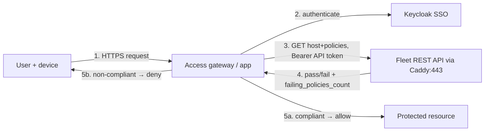
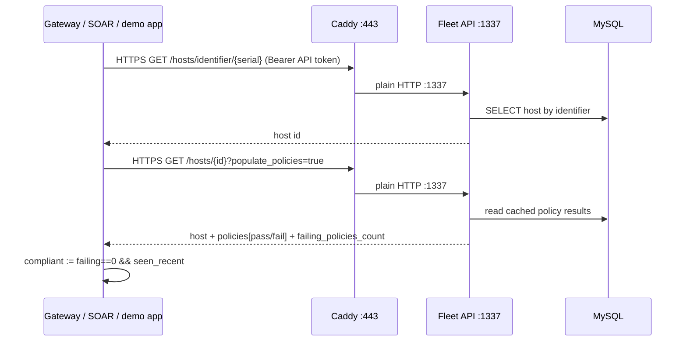

# 🪪 Identity & Access
> Part of the **[Project AXIOM Encyclopedia](./README.md)** · Layer: Identity. How humans and machines *prove who they are* to Fleet and to each other, and how the lab turns "who are you?" and "is your device healthy?" into an allow/deny decision — at $0, honestly labelled Free vs Premium.

This layer sits above the plumbing (Docker, Fleet core, TLS) and answers two different questions that are easy to conflate. **Authentication** decides *who is logging in* — handled by Keycloak (our self-hosted IdP) speaking SAML to Fleet's admin console. **Device trust / conditional access** decides *whether the machine in your hands is healthy enough to be let in* — handled by reading Fleet's policy verdicts back out through its REST API. Fleet Free gives us real SAML SSO for admins but *not* the Premium identity glue (JIT provisioning, SCIM, native conditional access), so Phase 7 pairs stock Keycloak with a small FastAPI sketch to demonstrate the pattern the Premium features would productise. Everything here is declared in Git — the Keycloak realm as JSON, the Fleet SSO settings as GitOps YAML — so the whole identity fabric rebuilds from a clone.

---

## Identity & IAM — authentication vs authorization

- **In one line** — Identity is the verified claim "I am X"; IAM (Identity & Access Management) is the machinery that establishes that claim (**authentication**) and then decides what X is allowed to do (**authorization**).
- **What it actually is** — Two distinct steps people routinely merge into one word ("login"). *Authentication* (AuthN) answers **"are you who you say you are?"** — proven with a password, a SAML assertion, a client certificate, an API token. *Authorization* (AuthZ) answers **"now that I believe you, what may you touch?"** — enforced by roles/permissions. Analogy: AuthN is the passport check at the border (identity verified); AuthZ is the visa stamp that says which zones you may enter. A valid passport with no visa still gets you turned away — authenticated but not authorized.
- **Why it's in Project AXIOM** — Every trust decision in the lab decomposes into these two. An engineer logging into the Fleet UI: AuthN via Keycloak SAML, AuthZ via a Fleet role (admin / maintainer / observer). A `fleetd` agent enrolling: AuthN via the enroll secret + TLS, AuthZ implicitly "may report telemetry". The GitHub Actions runner applying GitOps: AuthN via a Fleet API token, AuthZ requires that token be **global admin** on Free. Naming which half you mean keeps the design honest.
- **Where it sits in the stack** — The conceptual root of this Identity layer. It sits *beside* the [TLS/PKI layer](./04-tls-and-pki.md) (which authenticates *machines* via certificates) and *above* [Fleet core](./03-fleet-core.md) (which enforces AuthZ via roles). It is *consumed by* the [MDM](./05-mdm.md) and [automation/IR](./10-automation-and-ir.md) layers.
- **How it works** — AuthN produces a **verified principal** (a user or a device with a proven identity) plus, usually, a short-lived credential (a session token, a signed assertion). AuthZ then evaluates that principal against a policy: in Fleet, a role table; in the device-trust demo, "does this host pass its policies?". The two are chained: no AuthZ without a principal from AuthN first.
- **Who talks to it, and how** — This is an abstraction, so the "who" is every concrete actor below. The pattern to hold in your head: a **principal** (browser, agent, CI runner, gateway) presents a **credential** to a **verifier** (Fleet, Keycloak) over **HTTPS through Caddy:443**, gets back a **decision**. Each following entry makes one of those arrows concrete.
- **Free vs Premium** — The *concepts* are free; the *sophistication of AuthZ* is where Fleet charges. Free AuthZ = global roles only (one flat scope). Premium AuthZ = per-**team** roles (an observer on Team A, admin on Team B) — unavailable here, which is exactly why the lab has a single global scope (see [ADR-0003](../adr/0003-free-tier-trust-tiering.md)).
- **Gotchas / myth-busting** — "SSO" is an **authentication** convenience, not authorization — logging in via Keycloak does *not* by itself grant a Fleet role; the role must be assigned in Fleet (manually on Free, or via JIT/SAML attributes on Premium). Also: an **enroll secret is not identity** — it is a shared bearer token that says "I'm allowed to enroll", not "I am host X"; on Free no query even reveals which secret a host used (see [ADR-0003](../adr/0003-free-tier-trust-tiering.md)).
- **See also** — [Keycloak](#keycloak--the-identity-provider-idp) · [Fleet roles & the global-admin token](./03-fleet-core.md) · [TLS/PKI — machine identity](./04-tls-and-pki.md) · [Trust model](./11-concepts-and-trust-model.md)

---

## Keycloak — the Identity Provider (IdP)

- **In one line** — Keycloak is the lab's self-hosted, open-source Identity Provider: the authority that authenticates humans and hands Fleet a signed "yes, this is Alice" assertion.
- **What it actually is** — A Java (Quarkus) identity server that stores users/groups, runs login screens, and speaks the federation protocols (SAML 2.0, OpenID Connect / OAuth2) that let *other* apps outsource their login to it. It is the free, run-it-yourself analogue of Okta, Microsoft Entra ID, or Google Workspace. Analogy: Keycloak is the **passport office** — it issues and checks the credentials; Fleet is a **border post** that trusts passports from that office without re-verifying the person itself.
- **Why it's in Project AXIOM** — The lab needs to demonstrate enterprise SSO into Fleet without paying for a cloud IdP. Keycloak provides a real SAML IdP at $0, lets us script users/groups, and (crucially) also speaks **OIDC/OAuth2**, which the Phase 7 [device-trust demo](#the-fastapi-device-trust-demo--the-free-tier-sketch) uses to authenticate its own users. One container covers both the "SSO into the admin console" story and the "OAuth-protected app" story.
- **Where it sits in the stack** — Runs as a **container in the `axiom-core` Docker stack** ([containers layer](./02-containers-and-docker.md)), beside Fleet, MySQL, Redis, and Caddy. Below it: Docker + the WSL2 VM. Beside it: Caddy, which terminates TLS for it just as for Fleet. Above it: Fleet's admin UI and the device-trust app, which are its *relying parties*.
- **How it works** — Keycloak organises everything into a **[realm](#realm--and-realm-as-json-in-git)** (an isolated tenant with its own users, keys, and clients). Each app that trusts Keycloak is registered as a **client** inside the realm. On login, Keycloak authenticates the user against its own user store, then mints a **signed token** — a SAML assertion (for Fleet) or an OIDC ID token / OAuth access token (for the demo app) — signed with the realm's private key. The relying party verifies that signature against the realm's published public cert/metadata. Keycloak needs a backing database for its own state; in the lab's import-driven setup the committed realm JSON is the authoritative source, so an embedded/dev store is acceptable and its contents are disposable — rebuild from the JSON rather than treating the DB as the record of truth.
- **Who talks to it, and how** —

```mermaid
sequenceDiagram
    participant Br as Admin browser
    participant Cad as Caddy :443
    participant KC as Keycloak (realm axiom)
    participant Fl as Fleet UI/API
    Br->>Cad: HTTPS GET Fleet /login, click "Sign in with SSO"
    Cad->>Fl: plain HTTP :1337
    Fl-->>Br: 302 redirect carrying a SAML AuthnRequest → Keycloak URL
    Br->>Cad: HTTPS to keycloak host (SAML AuthnRequest)
    Cad->>KC: plain HTTP to keycloak :8080
    KC-->>Br: login form; user submits credentials
    KC-->>Br: signed SAMLResponse (assertion), auto-POST back to Fleet
    Br->>Cad: HTTPS POST /api/v1/fleet/sso/callback (SAMLResponse)
    Cad->>Fl: plain HTTP :1337
    Fl->>Fl: verify signature vs realm IdP cert, map attributes → user
    Fl-->>Br: Fleet session token, redirect to dashboard
```

  The key directional facts: the **browser** is the courier — Keycloak and Fleet never open a socket to each other during a browser SSO login; the SAML messages ride *through the browser* via redirects and form-POSTs, all over **HTTPS terminated at Caddy:443** and forwarded as plain HTTP internally. The *only* direct Fleet→Keycloak call is the one-time (or periodic) fetch of the realm **metadata URL** when SSO is configured. The device-trust demo talks to Keycloak over **OIDC** (browser redirect to `/realms/axiom/protocol/openid-connect/auth`, then a back-channel token exchange).
- **Free vs Premium** — Keycloak is 100% free/open-source. It substitutes for the **Premium** "native conditional access with Entra/Okta" that Fleet gates — but note Keycloak gives us *authentication*, not Fleet's *device-trust enforcement*; that gap is what the FastAPI demo fills.
- **Gotchas / myth-busting** — (1) Keycloak must be reachable by the **admin's browser**, not by the Fleet container — so its public URL/SAN must be trusted by the browser and match the realm's configured base URL, or redirects break. (2) Realm signing keys matter: if Keycloak rotates its realm keys, Fleet's cached IdP metadata goes stale and assertions fail signature validation — re-point Fleet at the metadata URL (or re-import metadata). (3) Clock skew between the Keycloak and Fleet containers can invalidate time-bounded assertions; both share the host clock here so it's usually a non-issue, but worth knowing. (4) Fleet's admin-console SSO is **SAML only** — there is no OIDC option for logging into the Fleet UI (confirmed against the [v4.89.1 SSO doc](https://fleetdm.com/docs/deploy/single-sign-on-sso), which supports "Okta, authentik, Google Workspace, Microsoft AD/Entra ID… as well as any other IdP that supports the **SAML standard**" — so Keycloak qualifies), so register a `saml` client for it and verify key names against the v4.89.1 GitOps schema (`org_settings.sso_settings`: `enable_sso`, `idp_name`, `entity_id`, `metadata_url`).
- **See also** — [realm-as-JSON](#realm--and-realm-as-json-in-git) · [SAML](#saml--and-the-idpsp-trust) · [SSO](#sso-single-sign-on--sso-only-admin-login) · [Caddy / TLS termination](./04-tls-and-pki.md) · [Docker stack](./02-containers-and-docker.md)

---

## realm — and realm-as-JSON in Git

- **In one line** — A Keycloak *realm* is a self-contained identity tenant (its own users, groups, signing keys, and app registrations); exporting it to a JSON file makes the entire IdP configuration versioned, reviewable, and rebuildable from Git.
- **What it actually is** — Inside Keycloak, a **realm** is the top-level isolation boundary. Users in realm A cannot see realm B; each realm has its own cryptographic keys and its own set of **clients** (registered relying-party apps) and **client scopes** (what claims those apps receive). The lab uses one realm, `axiom` (the built-in `master` realm is reserved for administering Keycloak itself and should never hold app users). **Realm-as-JSON** is Keycloak's native import/export: the whole realm — users, groups, roles, clients like `fleet-saml` and `device-trust-oidc`, mappers, required actions — serialises to a single JSON document that Keycloak can re-import on boot (`kc.sh start --import-realm`, reading a mounted `realm-export.json`).
- **Why it's in Project AXIOM** — The lab's prime directive is *rebuildable from Git alone*. Clicking a realm together in the Keycloak admin UI would be un-reproducible drift. Committing `identity/keycloak/axiom-realm.json` means the IdP is **configuration-as-code**, peer to the [GitOps](./06-gitops-and-cicd.md) YAML that configures Fleet: `docker compose up` mounts the JSON, Keycloak imports it, and the realm exists identically every time.
- **Where it sits in the stack** — A data artifact consumed by the Keycloak container at startup. It lives in the Git repo (identity directory), is loaded by Docker Compose (a bind-mount into `/opt/keycloak/data/import/` + `--import-realm`), and materialises as runtime state inside Keycloak. Conceptually it is to Keycloak what `default.yml` is to Fleet.
- **How it works** — On container start Keycloak reads the JSON and idempotently creates/updates the realm. The file declares clients with their protocol (`saml` or `openid-connect`), redirect URIs, and **attribute mappers** (which turn user properties into SAML attributes / OIDC claims — e.g. mapping a Keycloak group to the `FLEET_JIT_USER_ROLE_GLOBAL` SAML attribute). Secrets (client secrets, the bootstrap admin password) are **not** hard-coded in the committed JSON — the bootstrap admin comes from environment variables and client secrets are set out-of-band (admin API or a post-import step), so the repo stays free of live credentials.
- **Who talks to it, and how** — Only the **Keycloak container** reads it, once, at boot, from the local filesystem (a bind-mounted volume) — no network. Humans talk to it through **Git**: edit JSON → PR → merge → redeploy. To capture UI changes back into Git, an operator runs Keycloak's export (`kc.sh export --realm axiom`) and commits the diff — the same "export, review, commit" loop used for Grafana dashboards-as-JSON in the [telemetry layer](./08-telemetry-and-observability.md).
- **Free vs Premium** — Purely a Keycloak feature — free. (Realm export/import is core Keycloak, not a Fleet capability at all.)
- **Gotchas / myth-busting** — (1) A full realm export can include **hashed user credentials and secrets** — scrub or template those before committing; the safe pattern is to export *config* and provision *users* separately (or via env). (2) Import is create-or-update, but deletions in the UI are **not** reflected by re-import unless you rebuild the realm — realm JSON is not as strictly declarative as Fleet GitOps (which *auto-deletes* anything absent — see [GitOps](./06-gitops-and-cicd.md)). Treat the JSON as the source of truth and rebuild if you need convergence. (3) Signing keys: exporting/re-importing can regenerate realm keys unless you pin them — a regenerated key silently breaks Fleet's cached IdP metadata (same failure mode as key rotation above).
- **See also** — [Keycloak](#keycloak--the-identity-provider-idp) · [GitOps declarative config](./06-gitops-and-cicd.md) · [Grafana dashboards-as-JSON](./08-telemetry-and-observability.md) · [SAML](#saml--and-the-idpsp-trust)

---

## SAML — and the IdP↔SP trust

- **In one line** — SAML 2.0 is the XML-based browser-SSO protocol in which an **Identity Provider** (Keycloak) sends a signed *assertion* about a user to a **Service Provider** (Fleet), which trusts it because it verifies the IdP's signature.
- **What it actually is** — **S**ecurity **A**ssertion **M**arkup **L**anguage: a standard for expressing "this IdP vouches that user U authenticated at time T and has attributes A" as a signed XML document. Two roles: the **IdP** issues assertions (Keycloak), the **SP** consumes them (Fleet). The trust between them is **one anchor**: the SP holds the IdP's **public signing certificate** (or a metadata URL pointing to it) and accepts only assertions bearing a valid signature from that key. Analogy: a **notarised letter** — the SP doesn't phone the IdP to confirm; it recognises the notary's seal (the signature) and trusts the contents.
- **Why it's in Project AXIOM** — SAML is the protocol Fleet's admin-console SSO speaks, and it is **Free**. It lets the lab demonstrate real federated login (Keycloak → Fleet) — the same mechanism a $0 lab and a Fortune-500 both use — without any Premium licence.
- **Where it sits in the stack** — The wire protocol *between* the Keycloak and Fleet entries. It rides on top of [TLS](./04-tls-and-pki.md) (assertions travel over HTTPS via the browser) and underneath [SSO](#sso-single-sign-on--sso-only-admin-login) (SSO is the user-facing experience; SAML is the plumbing that delivers it).
- **How it works** — Establishing the **IdP↔SP trust** is a two-sided exchange of metadata:

  | Direction | Who gives what | Contains |
  |---|---|---|
  | IdP → SP | Keycloak realm **metadata URL** (`/realms/axiom/protocol/saml/descriptor`) | IdP entity ID, SSO endpoint URL, **public signing cert** |
  | SP → IdP | Fleet's **entity ID** + **ACS (callback) URL** | who Fleet is, where to POST the assertion back |

  At login, the SP-initiated flow is: Fleet builds a SAML **AuthnRequest** → browser carries it to Keycloak → Keycloak authenticates the user and returns a signed **SAMLResponse** (the assertion) → browser POSTs it to Fleet's **Assertion Consumer Service** at `/api/v1/fleet/sso/callback` → Fleet validates the signature against the realm cert, reads the `NameID` (the user's email) and any custom attributes, and establishes a session. IdP-initiated flow skips Fleet's AuthnRequest — the user starts at Keycloak and Keycloak POSTs an unsolicited assertion to the callback.
- **Who talks to it, and how** — The **browser is the transport** for the assertions (SAML "HTTP-POST/Redirect bindings") — Keycloak and Fleet exchange assertions *through* it, never directly. The **only** back-channel call is Fleet fetching the IdP **metadata URL** directly from Keycloak (HTTPS) when SSO is configured or refreshed. Everything is **HTTPS terminated at Caddy:443**, forwarded as plain HTTP to Fleet:1337 / Keycloak:8080 internally. Payloads: base64-encoded, signed XML.
- **Free vs Premium** — SAML SSO login into Fleet is **Free**. What SAML *carries* can trigger Premium features: **JIT provisioning** and **SAML-attribute role sync** (auto-creating users and setting roles from `FLEET_JIT_USER_ROLE_GLOBAL`) are **Premium** — on Free the assertion still authenticates, but the user must already exist in Fleet (see [SCIM/JIT](#scim--jit-provisioning-premium-context)).
- **Gotchas / myth-busting** — (1) **Trust is signature-based, not network-based** — Fleet never "calls the IdP to check" per login; if the realm signing key changes, every assertion fails until Fleet re-reads metadata. (2) Entity ID and ACS URL are **exact-match** strings — a trailing slash or http-vs-https mismatch between Fleet's `FLEET_SERVER_URL`, its `entity_id`, and Keycloak's client config silently breaks SSO with opaque errors. (3) SAML is XML and signed — it is **not** an API token; you cannot `curl` a SAML login. (4) Don't confuse the **SSO handshake window** (Fleet only accepts a returning SAMLResponse for a short bounded period after issuing the AuthnRequest) with the **logged-in session lifetime** (Fleet's `session_duration` server config) — they are different timers.
- **See also** — [SSO](#sso-single-sign-on--sso-only-admin-login) · [SAML vs OIDC/OAuth2](#saml-vs-oidcoauth2--a-brief-contrast) · [Keycloak](#keycloak--the-identity-provider-idp) · [TLS/PKI — where the certs come from](./04-tls-and-pki.md)

---

## SSO (single sign-on) & SSO-only admin login

- **In one line** — SSO lets an admin authenticate to Fleet with their Keycloak identity instead of a Fleet-local password; "SSO-only" means a given Fleet user has **no** password and can log in *only* through the IdP.
- **What it actually is** — Single sign-on is the user-facing outcome of the SAML machinery: one credential (your Keycloak login) admits you to many apps. In Fleet, a user account can be flagged **SSO-enabled**, at which point Fleet stops accepting a password for that user and always bounces them to Keycloak. Analogy: a corporate badge that opens every door — you authenticate once at the turnstile (Keycloak) and the building (Fleet, Grafana, the demo app) recognises the badge.
- **Why it's in Project AXIOM** — It demonstrates the real enterprise pattern (centralised login, disable-once-offboard, no per-app passwords) and lets the lab show identity governance: revoke a user in Keycloak → they lose Fleet access, no Fleet-side cleanup needed. It also removes standing passwords from the Fleet DB for SSO users, shrinking the credential attack surface.
- **Where it sits in the stack** — The experience layer on top of [SAML](#saml--and-the-idpsp-trust). Below it: SAML + Keycloak. Beside it: Fleet's role-based **authorization** (SSO handles *who*; roles still handle *what*). It is configured via [GitOps YAML](./06-gitops-and-cicd.md) under `org_settings.sso_settings`.
- **How it works** — SSO is turned on in Fleet's settings (declared in `default.yml`) with roughly these keys (verify exact names against the v4.89.1 docs):

  | Setting | Meaning |
  |---|---|
  | `enable_sso: true` | offer the "Sign in with SSO" button |
  | `idp_name: Keycloak` | label on that button |
  | `entity_id` | Fleet's SAML entity ID (matches Keycloak client) |
  | `metadata_url` | Keycloak realm descriptor URL (source of the IdP cert) |
  | `enable_sso_idp_login: true` | also accept IdP-initiated logins |
  | `enable_jit_provisioning` | **Premium** — auto-create users on first login |

  Per **user**, `sso_enabled: true` makes that account SSO-only (Fleet refuses password auth for them). Keep at least one **local-password admin** as break-glass so an IdP outage can't lock everyone out — Fleet doesn't force this, so it's a discipline you enforce; that also means "SSO-only" is realistically *per-user*, not a global elimination of passwords.
- **Who talks to it, and how** — Same flow as the [Keycloak diagram](#keycloak--the-identity-provider-idp): admin **browser** initiates against Fleet (HTTPS/Caddy:443), gets redirected to Keycloak, returns a signed assertion to `/api/v1/fleet/sso/callback`, and Fleet issues a session. The **CI runner** that applies GitOps does *not* use SSO — it authenticates the REST API with a **bearer API token** (which must be **global admin** on Free), a separate machine-identity path.
- **Free vs Premium** — **The SSO login itself is Free.** The convenience layer around it is Premium: **JIT provisioning** (auto-create the user), **SAML role sync** (set the Fleet role from an assertion attribute), and **per-team role assignment**. On Free you get the door (SSO) but must hand-cut the keys (create each Fleet user and set their global role manually).
- **Gotchas / myth-busting** — (1) SSO ≠ authorization: a brand-new SSO user with no Fleet account can *authenticate* at Keycloak yet be *rejected* by Fleet because JIT is off (Premium) and no matching user exists — on Free, pre-create the user. (2) Keep the break-glass local admin's password in the secret store; if you flip your own admin to SSO-only and Keycloak is down, you'll want it. (3) The GitOps token is deliberately *not* an SSO session — SSO sessions are short-lived and interactive; automation needs a long-lived API token. (4) IdP-initiated login for end-user *device* enrollment auth uses a *different* callback path (`/api/v1/fleet/mdm/sso/callback`) — don't confuse admin-console SSO with the MDM end-user SSO in the [MDM layer](./05-mdm.md).
- **See also** — [SAML](#saml--and-the-idpsp-trust) · [SCIM / JIT provisioning](#scim--jit-provisioning-premium-context) · [Fleet roles & global-admin token](./03-fleet-core.md) · [GitOps `org_settings`](./06-gitops-and-cicd.md)

---

## SAML vs OIDC/OAuth2 — a brief contrast

- **In one line** — Two federation protocol families for the same job (delegated login): **SAML** is the older XML/browser-POST standard Fleet's admin console uses; **OIDC/OAuth2** is the newer JSON/JWT, API-and-mobile-friendly standard the device-trust demo uses.
- **What it actually is** — **OAuth 2.0** is an *authorization* framework (issue an *access token* granting an app scoped access to a resource). **OpenID Connect (OIDC)** is a thin *authentication* layer on top of OAuth2 that adds an **ID token** (a signed JWT asserting *who* the user is) — so OIDC is the true "login" protocol, OAuth2 the "access delegation" one. **SAML 2.0** predates both and bundles authN + attribute delivery into one signed-XML assertion. Keycloak speaks all three fluently.
- **Why it's in Project AXIOM** — The lab uses **both** deliberately: Fleet's admin SSO is **SAML-only** (as of v4.89.1) so we register a `saml` client in Keycloak for it; the Phase 7 [FastAPI device-trust app](#the-fastapi-device-trust-demo--the-free-tier-sketch) is a fresh app, so we give it an **OIDC** client — showing the same IdP serving two protocol styles, which is exactly how real environments look.
- **Where it sits in the stack** — Both are peers *beside* [SAML](#saml--and-the-idpsp-trust) in this layer, riding on [TLS](./04-tls-and-pki.md), issued by [Keycloak](#keycloak--the-identity-provider-idp).
- **How it works** — Contrast at a glance:

  | | SAML 2.0 | OIDC / OAuth2 |
  |---|---|---|
  | Token format | signed **XML** assertion | signed **JWT** (ID token) + opaque/JWT access token |
  | Transport | browser HTTP-POST/Redirect bindings | browser redirect + **back-channel** token endpoint |
  | Best fit | server-rendered web SSO | SPAs, mobile, APIs, service-to-service |
  | "Login" claim | the assertion itself | the **ID token** (OIDC) |
  | Fleet admin SSO | ✅ supported | ❌ not for admin console (v4.89.1) |
  | Keycloak endpoint | `/realms/axiom/protocol/saml` | `/realms/axiom/protocol/openid-connect/*` |

- **Who talks to it, and how** — **SAML (Fleet):** browser is the sole courier; assertion POSTed to Fleet's ACS. **OIDC (demo app):** browser is redirected to Keycloak's `/auth`, returns to the app with a short **authorization code**, and the app makes a **direct back-channel HTTPS POST** to Keycloak's `/token` endpoint to swap the code for an ID token + access token — a server-to-server call that SAML's browser-only flow doesn't have. That back-channel is the practical reason OIDC suits APIs and SAML suits classic web apps.
- **Free vs Premium** — Protocol choice is a Keycloak/free concern; Fleet charges nothing for SAML SSO. Note only that Fleet **admin login** doesn't offer OIDC in v4.89.1 — don't plan to point Fleet's console at an OIDC client. (Fleet *does* use OAuth elsewhere — its Premium **conditional-access** integration authenticates to Microsoft Entra via the Graph API to report device compliance — but never for logging into the admin console, which is SAML-only; verify specifics in the [SSO doc](https://fleetdm.com/docs/deploy/single-sign-on-sso).)
- **Gotchas / myth-busting** — (1) People say "OAuth login" but mean **OIDC** — bare OAuth2 has no standard identity claim; if you need *who the user is*, you need OIDC's ID token. (2) Don't try to feed Fleet an OIDC client and expect admin SSO — it wants SAML metadata. (3) A JWT is *self-describing and verifiable offline* (check the signature + `exp`); a SAML assertion is likewise self-contained — neither requires calling the IdP per request, which is what makes both scale.
- **See also** — [SAML](#saml--and-the-idpsp-trust) · [Keycloak](#keycloak--the-identity-provider-idp) · [FastAPI device-trust demo](#the-fastapi-device-trust-demo--the-free-tier-sketch)

---

## SCIM / JIT provisioning (Premium context)

- **In one line** — Two ways to get users *into* Fleet automatically from the IdP: **JIT** creates a Fleet user the first time they SSO in; **SCIM** lets the IdP push/sync users, groups, and departments to Fleet ahead of time — **both are Fleet Premium**, so the lab documents them as the Premium delta and provisions users by hand on Free.
- **What it actually is** — **JIT (Just-In-Time) provisioning:** on a user's first successful SSO login, Fleet reads their email/name (and role, from `FLEET_JIT_USER_ROLE_GLOBAL` SAML attributes) out of the assertion and *creates the Fleet account on the spot* — no pre-registration. **SCIM (System for Cross-domain Identity Management):** a REST/JSON protocol where the **IdP is the client** and Fleet is the server; the IdP proactively **pushes** create/update/deactivate user and group events (`Push New Users`, `Push Profile Updates`, `Push Groups`) so Fleet's user directory and each host's **IdP identity** (username, groups, department — "foreign vitals") stay in sync. Analogy: JIT is issuing a visitor badge at the door the moment someone arrives; SCIM is HR sending the badge office the full staff roster in advance and every time it changes.
- **Why it's in Project AXIOM** — They're in the encyclopedia to be **honest about the Premium boundary** and to define the upgrade path. On Free the lab cannot auto-provision Fleet admins or map hosts to their human owner via the IdP; documenting JIT/SCIM makes the "what Premium buys" story concrete and shows the lab author understands enterprise identity lifecycle, not just login.
- **Where it sits in the stack** — Above [SSO](#sso-single-sign-on--sso-only-admin-login). JIT rides *inside* the SAML assertion (same channel as login). SCIM is a *separate* IdP-driven API integration into Fleet, adjacent to the REST API. Both feed Fleet's user/host directory consumed by the [MDM](./05-mdm.md) and label layers.
- **How it works** — **JIT:** enabled by `enable_jit_provisioning` + Keycloak attribute mappers that emit the role attribute; the *default* role for a JIT user (when no role attribute is supplied) is Global Observer unless an attribute overrides it. **SCIM:** the IdP is configured with Fleet's SCIM base URL + a bearer token; it then makes outbound HTTPS calls to Fleet (`/api/v1/fleet/scim/v2/...`) mapping at minimum `userName` (unique key), `givenName`, `familyName` (plus optionally `department`, groups). Fleet stores these as **IdP host vitals** you can use as variables in config profiles or as label criteria (`FLEET_VAR_HOST_END_USER_IDP_*`).
- **Who talks to it, and how** —

  | Feature | Initiator | Direction / transport | Payload |
  |---|---|---|---|
  | JIT | user's **browser** (SSO login) | assertion via browser → Fleet ACS (HTTPS/Caddy:443) | SAML attributes (email, name, `FLEET_JIT_USER_ROLE_GLOBAL`) |
  | SCIM | the **IdP** (Keycloak/Entra/Okta) | outbound HTTPS **push** → Fleet `/api/v1/fleet/scim/v2/...` | JSON user/group create/update/deactivate |

  Note the initiator flip: JIT is triggered by the *end user logging in*; SCIM is driven by the *IdP on its own schedule* (or on directory change) — a machine-to-machine push Fleet just receives.
- **Free vs Premium** — **Both Premium.** JIT provisioning: Premium. SCIM / "foreign vitals — map IdP users to hosts" (username, groups, department): Premium. On **Free**: SSO authenticates, but every Fleet user must be **pre-created manually** and given a role; hosts are **not** linked to their human owner via the IdP (you'd map by hostname/serial conventions instead). This is a real limitation, not a workaround gap — call it out in runbooks.
- **Gotchas / myth-busting** — (1) SAML SSO being Free misleads people into expecting auto-user-creation — that's **JIT, and it's Premium**; a Free SSO login for a non-existent user just fails. (2) SCIM ≠ SSO: SSO is the login moment (SAML), SCIM is the directory sync (its own API) — an org can run one without the other. (3) SCIM's unique key is `userName`; a mismatched mapping in the IdP silently creates duplicates or fails updates. (4) Verify current gating on the [Fleet pricing table](https://github.com/fleetdm/fleet/blob/main/handbook/company/pricing-features-table.yml) — feature tiers shift across the ~3-week release cadence.
- **See also** — [SSO](#sso-single-sign-on--sso-only-admin-login) · [SAML attributes](#saml--and-the-idpsp-trust) · [labels & host vitals](./07-policy-as-code.md) · [ADR-0003 — why Free has one flat scope](../adr/0003-free-tier-trust-tiering.md)

---

## device trust / conditional access — the concept

- **In one line** — Conditional access is the policy "you may reach this resource **only** from a device that is enrolled *and* currently passing its health checks" — it fuses *who you are* (identity) with *how healthy your device is* (posture) into one allow/deny gate.
- **What it actually is** — The Zero-Trust idea that a valid user credential is **necessary but not sufficient**: the access decision also consults live device posture — is the disk encrypted, OS patched, screen-lock on, agent reporting? "Device trust" is the device-posture half; "conditional access" is the enforcement gate that combines it with identity. Analogy: a nightclub that checks both your ID (identity) *and* that you're wearing the dress code (device posture) — fail either and you're turned away, even with a real ID.
- **Why it's in Project AXIOM** — It's the capstone that ties this whole platform together: Fleet already *measures* posture (policies in the [policy-as-code layer](./07-policy-as-code.md)); conditional access is what makes that measurement *gate real access* rather than just paint a dashboard red. Demonstrating it — even as a sketch — turns Fleet from an observability tool into an enforcement point.
- **Where it sits in the stack** — Straddles Identity and [policy-as-code](./07-policy-as-code.md). It *reads* two inputs: an authenticated principal (from [SSO](#sso-single-sign-on--sso-only-admin-login)/Keycloak) and a compliance verdict (from [Fleet's REST API](#how-fleets-rest-api-answers-is-this-device-compliant)). It *sits in front of* a protected resource (a web app, an SSH bastion, a VPN).
- **How it works** — A gateway (or the app itself) intercepts the request, confirms identity, then queries Fleet: *"is the host this user is on currently compliant?"* Fleet answers from its most recent policy evaluation. The gate applies a rule — e.g. **allow iff `failing_policies_count == 0` and the host was seen within N minutes** — and permits or blocks. The rule can be tiered: the [High-Trust Enclave](../adr/0003-free-tier-trust-tiering.md) might demand a stricter posture than a Standard host.
- **Who talks to it, and how** —



  Directional facts: the **user's device** initiates; the **gateway** is the active decision-maker, making a **server-to-server HTTPS call to Fleet** (bearer API token, not the user's session) to fetch posture; Fleet is a **passive responder** — it never pushes "this device went bad" to the gateway, so the gateway must poll/query at access time. (This **pull** shape is the lab's free design; the Premium native version *inverts* it — Fleet *pushes* each host's compliance to the IdP, e.g. Entra via the Graph API, and the IdP enforces — see Free vs Premium below.)
- **Free vs Premium** — **Native conditional access (turnkey integration with Microsoft Entra / Okta, where Fleet evaluates policies, reports each device's compliance to the IdP, and the IdP's own access policy blocks non-compliant sign-ins) is Premium** — and unavailable in the lab regardless. On **Free**, all the *ingredients* exist (policies are free, the REST API is free), so the lab **hand-builds** a *pull*-model gate as the [FastAPI demo](#the-fastapi-device-trust-demo--the-free-tier-sketch) rather than buying the productised push integration.
- **Gotchas / myth-busting** — (1) The verdict is **as fresh as the last policy evaluation** — Fleet's default policy update interval (`FLEET_OSQUERY_POLICY_UPDATE_INTERVAL`) is ~1 hour, so a device that just failed can still read "compliant" until the next check-in; production conditional access mitigates with shorter intervals or on-demand refresh — note the staleness explicitly. (2) Conditional access **enforces at the resource**, not on the endpoint — a non-compliant device isn't *stopped from computing*, it's *denied the resource*; that's the honest scope of a Fleet-driven gate (Premium disk-encryption/OS *enforcement* is a different, endpoint-side control the lab can't do — see [policy-as-code](./07-policy-as-code.md)). (3) You must reliably map *the authenticated user's session* to *a specific Fleet host id* — on Free without SCIM/foreign-vitals, do this by device identifier (serial/UUID/hostname), which is the demo's trickiest real-world seam.
- **See also** — [FastAPI device-trust demo](#the-fastapi-device-trust-demo--the-free-tier-sketch) · [REST API compliance](#how-fleets-rest-api-answers-is-this-device-compliant) · [policies](./07-policy-as-code.md) · [MDM enrollment](./05-mdm.md) · [Trust model](./11-concepts-and-trust-model.md)

---

## the FastAPI device-trust demo — the free-tier sketch

- **In one line** — A small self-hosted FastAPI web app that stands in for a productised conditional-access gateway: it authenticates a user via Keycloak (OIDC), asks Fleet's REST API whether that user's device is compliant, and shows "access granted / denied" — proving the pattern at $0.
- **What it actually is** — A minimal Python/FastAPI service (a container in the `axiom-core` stack) with one protected route. It is a **teaching sketch**, not a production PEP (Policy Enforcement Point): it demonstrates the *shape* of device-trust — IdP login + Fleet posture query + decision — without the Premium Entra/Okta plumbing. Analogy: a working scale model of the nightclub door (ID check + dress-code check) rather than the real venue's turnstile hardware.
- **Why it's in Project AXIOM** — Fleet Free has **no** native conditional access ([ADR context](../adr/0003-free-tier-trust-tiering.md) / research brief §4). To still tell the Zero-Trust story, Phase 7 builds this sketch. It also exercises the *other* protocol path (OIDC, vs Fleet's SAML) against the same Keycloak, and it consumes Fleet's compliance data the same way a real SOAR or gateway would — reinforcing the [automation/IR](./10-automation-and-ir.md) patterns.
- **Where it sits in the stack** — A container beside Keycloak and Fleet in [axiom-core](./02-containers-and-docker.md), fronted by [Caddy TLS](./04-tls-and-pki.md). It is a **client of two services**: Keycloak (for AuthN via OIDC) and Fleet's REST API (for device posture). It sits *in front of* a mock "protected resource" route.
- **How it works** — Request lifecycle: (1) unauthenticated hit on the protected route → redirect to Keycloak OIDC `/auth`; (2) user logs in, returns with an auth code; (3) the app back-channels Keycloak's `/token` to get an ID token → knows *who* the user is and (via a claim or a form field) *which device* they're on; (4) the app calls Fleet `GET /api/v1/fleet/hosts/identifier/{serial|uuid|hostname}` to resolve the Fleet host id, then reads its policy verdicts (host detail with `populate_policies=true`, or the host policies list); (5) it applies the rule (`failing_policies_count == 0` and recently seen) → renders **granted** or **denied**, optionally listing *which* policy failed.
- **Who talks to it, and how** —

  | Step | Initiator → Target | Protocol / port | Auth / payload |
  |---|---|---|---|
  | Login | browser → Keycloak (via Caddy:443) | OIDC redirect | user credentials → auth code |
  | Token swap | **FastAPI app → Keycloak** `/token` | back-channel HTTPS | client secret + code → ID/access token (JWT) |
  | Posture query | **FastAPI app → Fleet REST API** (via Caddy:443) | HTTPS GET, proxied to :1337 | **Bearer API token** (a dedicated Fleet user; global on Free) → JSON of host + policies |
  | Decision | app → browser | HTTPS response | allow/deny page |

  The app holds **two secrets**: its Keycloak OIDC client secret and a **Fleet API token**. Both come from the secret store, never Git. The Fleet token is a *service* identity — it authenticates the app to Fleet, entirely separate from the human's OIDC session.
- **Free vs Premium** — The whole demo is **Free** — it deliberately reuses only free primitives (OIDC via Keycloak, Fleet REST API, Fleet policies). It *emulates* the Premium conditional-access product; the honest framing in the portfolio is "this is the pattern; Premium productises it with native Entra/Okta enforcement and SCIM-based user↔host mapping."
- **Gotchas / myth-busting** — (1) It's a **demo/PEP sketch**, not a hardened gateway — it enforces only its own route; it doesn't intercept SSH/VPN/arbitrary traffic (a real PEP would sit inline). Say so. (2) The **user↔host mapping** is the honest weak point on Free (no SCIM foreign-vitals) — the demo maps by device identifier, which a savvy user could spoof; acceptable for a lab, noted as a limitation. (3) **Staleness** — it inherits Fleet's ~1-hour policy freshness; the UI should show "posture as of <last seen>" so the demo doesn't overclaim real-time enforcement. (4) Give the app's Fleet token the **least privilege** that still reads hosts/policies; on Free roles are global, so document that it's broader than ideal (Premium per-team read-only would tighten it).
- **See also** — [device trust / conditional access](#device-trust--conditional-access--the-concept) · [REST API compliance](#how-fleets-rest-api-answers-is-this-device-compliant) · [SAML vs OIDC](#saml-vs-oidcoauth2--a-brief-contrast) · [automation / SOAR-lite receiver](./10-automation-and-ir.md)

---

## how Fleet's REST API answers "is this device compliant?"

- **In one line** — You resolve the device to a Fleet **host id**, then `GET` that host with its policies; a **row of pass/fail policy verdicts** plus a **`failing_policies_count`** is Fleet's machine-readable "compliant?" answer — and the whole REST API is **Free**.
- **What it actually is** — Fleet has no single boolean `compliant` field; "compliance" is *derived* from **policy results**. A Fleet **policy** is a yes/no osquery question where **1 row returned = pass, 0 rows = fail** (see [policy-as-code](./07-policy-as-code.md)). The API exposes, per host, every policy's `response` (`pass`/`fail`) and an aggregate failing count. A caller decides "compliant" = "zero (or zero *relevant*) failing policies." Analogy: a health checkup report — Fleet hands you the itemised results; *you* decide the pass mark.
- **Why it's in Project AXIOM** — This endpoint is the **integration seam** for everything downstream: the [device-trust demo](#the-fastapi-device-trust-demo--the-free-tier-sketch) queries it to gate access, the [SOAR-lite receiver](./10-automation-and-ir.md) cross-checks it during remediation, and dashboards summarise it. It's the API that turns Fleet's policy engine into a service other systems consult.
- **Where it sits in the stack** — The read interface of [Fleet core](./03-fleet-core.md), exposed over HTTPS via [Caddy](./04-tls-and-pki.md). It reads from Fleet's MySQL-backed host/policy state (populated by [osquery telemetry](./08-telemetry-and-observability.md)). It is *consumed by* the Identity and [automation/IR](./10-automation-and-ir.md) layers.
- **How it works** — Two steps, both Free:

  1. **Resolve identity → host id.** If you only have a serial/UUID/hostname: `GET /api/v1/fleet/hosts/identifier/{identifier}` returns the host (Fleet accepts hostname, UUID, osquery host id, node key, or hardware serial). Or filter: `GET /api/v1/fleet/hosts?query=<term>`.
  2. **Read the verdict.** `GET /api/v1/fleet/hosts/{id}` returns the host including `issues.failing_policies_count`; add **`populate_policies=true`** to include the per-policy `pass`/`fail` array. To find *every* host failing a specific control instead, filter the list endpoint: `GET /api/v1/fleet/hosts?policy_id={pid}&policy_response=failing`.

  For an **end-user, self-service** view there's the Fleet Desktop **device** channel: `GET /api/latest/fleet/device/{device_token}` (the "My device" page data) and the lightweight `GET /api/latest/fleet/device/{device_token}/desktop` (failing-policy count for the menu-bar badge) — these authenticate with a **per-host device token**, not an admin API token.
- **Who talks to it, and how** —



  Directional facts: the **caller always initiates** (Fleet never calls out with posture — it's request/response, pull not push). Auth is a **Bearer API token** in the `Authorization` header (global-admin-tier on Free) for admin endpoints, or a **device token** for the self-service endpoints. All traffic is **HTTPS to Caddy:443 → plain HTTP to Fleet:1337**. The answer is read from **cached** state in MySQL — Fleet does not run osquery on-demand for the call.
- **Free vs Premium** — **The REST API, host endpoints, and policy results are all Free.** What's Premium is *around* it: **per-team scoping** of policies (Free runs every policy on every host — so "relevant policies" filtering is your job — see [ADR-0003](../adr/0003-free-tier-trust-tiering.md)) and **CVE severity scores** (CVSS/EPSS/KEV) if you tried to fold vuln data into the trust decision. Compliance-by-policy itself costs nothing.
- **Gotchas / myth-busting** — (1) **No native `compliant` boolean** — don't look for one; compute it from `failing_policies_count` / the policies array. (2) **Freshness** — results are from the last policy update (Fleet's default policy update interval is ~1 hour), *not* live at call time; gate designs must tolerate or shorten this. (3) **Free has one flat scope**, so *every* policy result appears on *every* host — the self-scoping SQL guard (`(out-of-scope) OR (compliant)`) means out-of-scope policies read as **pass**, so a naive `failing==0` check is actually correct for tiering *because* the guards auto-pass irrelevant hosts (this is the whole point of [ADR-0003](../adr/0003-free-tier-trust-tiering.md)). (4) **Version drift** — confirm `populate_policies`, the `identifier` path, and `device` endpoints against the **v4.89.1** [REST API doc](https://fleetdm.com/docs/rest-api); response shapes shift across releases. (5) The policy-webhook payload (push side, used by [automation/IR](./10-automation-and-ir.md)) has **two documented shapes** — curl-test what your build emits before wiring a receiver (research brief §6).
- **See also** — [device trust / conditional access](#device-trust--conditional-access--the-concept) · [FastAPI demo](#the-fastapi-device-trust-demo--the-free-tier-sketch) · [policy-as-code & the pass/fail convention](./07-policy-as-code.md) · [automation / failing-policy webhooks](./10-automation-and-ir.md) · [Fleet core & the API token](./03-fleet-core.md)

---

> **Free-tier honesty, in one breath:** SAML SSO into Fleet is Free and real. JIT provisioning, SCIM (IdP↔host mapping), per-team roles, and native conditional access are **Premium** — so on $0 we authenticate with Keycloak, pre-create Fleet users by hand, and hand-build the device-trust gate as a FastAPI sketch that reads Fleet's free REST API. The pattern is genuine; the productisation is the paid delta. See [ADR-0003](../adr/0003-free-tier-trust-tiering.md) and the [Phase 0/1 research brief](../research/2026-07-20-phase0-1-fleet-brief.md).
