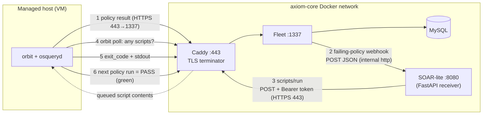

# 🚨 Security Automation & Incident Response
> Part of the **[Project AXIOM Encyclopedia](./README.md)** · Layer: Automation & IR. How Fleet's two free primitives — failing-policy/vulnerability **webhooks** and the **script-execution API** — combine into a $0 "SOAR-lite" loop, plus the three incident-response drills (lost laptop, enclave FIM trip, CVE response) and how we measure the loop with **MTTR**.

This is the layer where AXIOM stops *observing* and starts *acting*. Everything below it — the agent ([fleet-core](./03-fleet-core.md)), the policies ([policy-as-code](./07-policy-as-code.md)), the logs and metrics ([telemetry](./08-telemetry-and-observability.md)) — produces signals; this layer closes the loop by turning a signal into a change on a host, automatically where it's safe and via a human-reviewed ticket where it isn't. The whole loop is built from **two things Fleet Free gives you for free** (outbound webhooks and the script-execution API) glued together by a tiny FastAPI receiver we call **SOAR-lite**. Because both primitives are Free, the entire Phase 8 auto-remediation story runs at $0 — the honest caveats are that the *ergonomic* MDM lock/wipe actions and CVE risk-*scores* are Premium, and that Fleet's default webhook cadence (once per day) has to be turned down before any of this feels like "incident response."



> **Reading the arrows:** the host *always* initiates contact (steps 1, 4, 5, 6 are outbound from the VM through Caddy:443). Fleet initiates exactly one outbound call — the webhook to SOAR-lite (step 2) — and SOAR-lite initiates exactly one — the authenticated `scripts/run` call back to Fleet (step 3). Fleet never pushes a script to a host; it *queues* one and waits for orbit to pull it. That pull-based design is the single most important mental-model correction in this whole layer.

---

## 1. Webhook — the push contract

- **In one line** — An HTTP callback: instead of you polling Fleet "did anything fail yet?", Fleet **POSTs a JSON payload to a URL you own** the moment something newly fails.
- **What it actually is** — A webhook inverts the normal request direction. A normal API call is *pull* (client asks, server answers); a webhook is *push* (server calls the client when an event occurs). The "contract" is: you register a `destination_url`, and when a trigger fires, Fleet sends `POST <url>` with `Content-Type: application/json` and an event-shaped body. Analogy: it's the difference between refreshing a package-tracking page every hour (polling) and getting a text the instant the truck leaves the depot (webhook). Fleet exposes several webhook triggers; the two AXIOM uses are **failing-policy** automations and **vulnerability** automations.
- **Why it's in Project AXIOM** — It is the *event source* for the entire automation layer. A policy going red ([policy pass/fail](./07-policy-as-code.md#2-fleet-policy--passfail-semantics-1-row--pass)) or a new CVE landing in software inventory is meaningless until something *reacts*; the webhook is how Fleet hands that event off to [SOAR-lite](#2-soar--our-soar-lite-receiver) without SOAR-lite having to poll. Webhooks are **Free**, which is why AXIOM's remediation is buildable at $0.
- **Where it sits in the stack** — Emitted by the **Fleet server** (the trigger logic lives in Fleet's cron/automations subsystem), configured declaratively in `org_settings.webhook_settings` in GitOps YAML ([GitOps](./06-gitops-and-cicd.md#3-gitops--git-as-the-single-source-of-truth)). Directly downstream is the SOAR-lite receiver. Upstream are the [policies](./07-policy-as-code.md) and [vulnerability detection](#10-drill-c--cve-response--software-inventory--vulnerability-detection) that produce the events.
- **How it works** — Two triggers matter here:
  - **Failing-policies webhook** (`webhook_settings.failing_policies_webhook`): on each check cycle, Fleet finds policies that are *newly failing* and POSTs a payload naming the policy and the affected hosts. A representative (classic, grouped-by-policy) body:
    ```json
    {
      "timestamp": "2026-07-20T14:03:11Z",
      "policy": { "id": 42, "name": "enclave-01 weights-cache canary intact",
                  "query": "SELECT 1 WHERE ...", "critical": true },
      "hosts": [ { "id": 7, "hostname": "enclave-01",
                   "url": "https://axiom-core.lab/hosts/7" } ]
    }
    ```
  - **Vulnerabilities webhook** (`webhook_settings.vulnerabilities_webhook`): fires when Fleet's vuln scan finds **new** CVEs, listing the CVE IDs and affected hosts (drives [Drill C](#10-drill-c--cve-response--software-inventory--vulnerability-detection)).
  - Both are gated by an **interval** (`webhook_settings.interval`, **default 24h**) and by **"newly failing"** semantics — Fleet only notifies on a *transition* (no-response→fail, or pass→fail), never on every consecutive failure. `host_batch_size` chunks large `hosts` arrays across multiple POSTs.
- **Who talks to it, and how** —
  1. **Fleet → receiver (the only outbound direction):** Fleet's cron opens a plain **HTTP `POST`** to the configured `destination_url`. In AXIOM that's an *internal* Docker DNS name, e.g. `http://soar-lite:8080/hooks/failing-policy` — container-to-container inside the `axiom-core` network, so no TLS is needed on this hop. Payload = the JSON above. Fleet does **not** wait for a meaningful response body; a `2xx` is "delivered."
  2. **Receiver → Fleet (the reaction, a *separate* call):** SOAR-lite turns around and calls Fleet's REST API (see [§3](#3-fleet-rest-api--api-tokens)/[§4](#4-fleet-script-execution-api--safe-auto-remediation)) — that's a normal authenticated pull, not part of the webhook.
- **Free vs Premium** — Webhook automations (failing-policy, vulnerability, host-status) are **Free**. The *alternative* delivery target — filing a **Jira/Zendesk ticket** directly from Fleet — is also available; what's genuinely Premium is fine-grained *per-team* automation routing (teams are Premium). On Free you configure the **global** failing-policies webhook.
- **Gotchas / myth-busting** — (1) **The 24-hour default will fool you.** Out of the box Fleet checks for failing policies **once per day**, so your "instant" automation can lag up to a day. Turn `webhook_settings.interval` down (minutes) in the lab or MTTR is meaningless. (2) **"Newly failing" ≠ "currently failing."** A host that fails, is remediated, then fails again *does* re-fire; a host that just *stays* failing does **not** re-fire every cycle. If you want to re-nudge persistent failures you need different machinery. (3) **No signature/HMAC by default.** Fleet does not sign the webhook body, so the receiver can't cryptographically verify the sender — AXIOM's boundary is that only Fleet can reach SOAR-lite on the internal network (optionally add a shared-secret header). (4) **The two webhooks have *different* body shapes** — the failing-policies webhook is grouped **by policy** (`{policy, hosts[]}`), while the vulnerabilities webhook is keyed **by CVE** (`{vulnerability, hosts[]}`). Route each to its own parser and pin the exact field names to the v4.89.1 `webhook_settings` docs rather than assuming one schema. (5) A webhook is *fire-and-forget* — if SOAR-lite is down, that notification is **lost** (Fleet does not durably retry), though the policy stays red so the next transition or a manual sweep catches it.
- **See also** — [SOAR-lite](#2-soar--our-soar-lite-receiver) · [policy automations (webhooks)](./07-policy-as-code.md#9-critical-flag--policy-automations-webhooks) · [Fleet result vs status logs](./08-telemetry-and-observability.md#fleet-result-logs-vs-status-logs) · [GitOps: webhook_settings in YAML](./06-gitops-and-cicd.md#3-gitops--git-as-the-single-source-of-truth)

---

## 2. SOAR & our "SOAR-lite" receiver

- **In one line** — **SOAR** = Security Orchestration, Automation & Response: the "brain" that receives an alert and *decides and executes* a response; **SOAR-lite** is AXIOM's ~200-line FastAPI stand-in for one.
- **What it actually is** — Commercial SOAR platforms (Tines, Splunk SOAR, Cortex XSOAR) are visual playbook engines: an event comes in, a playbook branches ("is this host in the enclave? is the policy critical?"), calls out to other tools, and either auto-remediates or opens a ticket. AXIOM doesn't need — and at $0 can't justify — a full SOAR, so it ships a **SOAR-lite**: a single FastAPI service with a couple of webhook routes and a small dispatch table mapping `policy_id → action`. It's the "orchestration + decision" node; Fleet supplies the "response" muscle (the script API). Analogy: SOAR-lite is a **911 dispatcher** — it doesn't put out the fire, it takes the call, decides *which* truck to send, and dispatches it (or, for a cat in a tree, files a non-urgent report instead).
- **Why it's in Project AXIOM** — Fleet *can* run a script directly on policy failure by itself (its built-in "policy-automation: run script" is Free), but AXIOM deliberately routes through an external receiver because that's where the *interesting* decisions live: **auto-remediate vs file-a-ticket** ([§5](#5-remediation--auto-vs-ticket-file)), branch on **trust tier** ([trust tiers](./11-concepts-and-trust-model.md#trust-tiers--standard-elevated-byod)), take actions Fleet *can't* (e.g. writing an **evidence pack** to disk, or in [Drill B](#9-drill-b--enclave-fim-trip--nic-isolation--evidence-pack) isolating a NIC), and enrich a CVE with free public risk feeds ([Drill C](#10-drill-c--cve-response--software-inventory--vulnerability-detection)). It's also the pedagogical centerpiece of the layer: one small service makes the whole "detect→decide→act→verify" loop legible.
- **Where it sits in the stack** — A container on the `axiom-core` [Docker network](./02-containers-and-docker.md), *beside* Fleet. Upstream (input): Fleet's [webhooks](#1-webhook--the-push-contract). Downstream (output): back to the [Fleet REST API](#3-fleet-rest-api--api-tokens) for scripts, and *sideways* to a ticket file / Grafana / the host's NIC depending on the playbook.
- **How it works** — FastAPI exposes routes like `POST /hooks/failing-policy` and `POST /hooks/vulnerability`. On receipt it: (a) parses `policy_id`/`host_id` (or CVE list), (b) looks up a **playbook** in a static dispatch map, (c) for auto-remediable items, authenticates to Fleet with a stored **API token** and calls the [script-execution API](#4-fleet-script-execution-api--safe-auto-remediation), (d) for human-in-the-loop items, appends a structured record to a **ticket file** (`incidents/INC-*.json`) and/or notifies, (e) writes its own decision to a log so the action is auditable. It holds no long-term state beyond the Fleet API token (from a Docker secret) and its dispatch map (from Git).

  ```mermaid
  sequenceDiagram
    participant F as Fleet
    participant S as SOAR-lite (FastAPI)
    participant C as Caddy:443 → Fleet:1337
    participant T as ticket file / Grafana
    F->>S: POST /hooks/failing-policy (JSON)
    Note over S: parse → look up playbook(policy_id)
    alt safe & idempotent
      S->>C: POST /api/v1/fleet/scripts/run (Bearer token)
      C-->>S: 202 execution_id
    else needs a human
      S->>T: append INC-2026-07-20-xx.json
    end
    S-->>F: 200 OK (ack)
  ```
- **Who talks to it, and how** —
  | Peer | Direction | Protocol/port | Payload |
  |---|---|---|---|
  | **Fleet** | → SOAR-lite (inbound) | internal HTTP `POST` :8080 | failing-policy / vulnerability JSON |
  | **SOAR-lite** | → Fleet (outbound) | HTTPS :443 → Caddy → :1337 | `Authorization: Bearer <token>` + `scripts/run` body |
  | **SOAR-lite** | → local disk | filesystem | evidence pack / ticket JSON |
  | **Docker secret** | → SOAR-lite (read at boot) | mounted file | the Fleet API token |
  | **Git / GitOps** | → SOAR-lite (build time) | image / config | the playbook dispatch map |
- **Free vs Premium** — Entirely **Free** — it's your own FastAPI code plus Fleet's free webhook + script APIs. It is, in effect, a hand-rolled substitute for the *routing/orchestration* that Premium teams-based automations would give you.
- **Gotchas / myth-busting** — (1) **SOAR-lite is not a security boundary by itself** — anything that can POST to it can trigger playbooks, so keep it off the host-facing network and give it a least-privilege-*ish* token (see [§3](#3-fleet-rest-api--api-tokens) for why "least" is hard on Free). (2) **Make playbooks idempotent** — the same webhook can arrive twice; running "disable-guest-account" twice must be harmless. (3) **Don't auto-remediate the un-reversible** — SOAR-lite should *only* auto-run scripts whose blast radius you'd accept unattended; the rest file tickets. (4) It is deliberately *lite*: no queue, no durable retry, no dedup store — if you outgrow that you've outgrown the lab's $0 constraint and want real Tines/n8n.
- **See also** — [remediation: auto vs ticket-file](#5-remediation--auto-vs-ticket-file) · [Incident Response drills](#6-incident-response-ir--the-drill-format) · [device-trust FastAPI sketch (same pattern, identity layer)](./09-identity-and-access.md#the-fastapi-device-trust-demo--the-free-tier-sketch) · [containers & Docker](./02-containers-and-docker.md)

---

## 3. Fleet REST API & API tokens

- **In one line** — Fleet's HTTP/JSON control surface (everything the UI and `fleetctl` do goes through it), guarded by a **bearer token** you put in `Authorization: Bearer <token>`.
- **What it actually is** — Fleet is API-first: the web UI is just a client of the same REST API that `fleetctl`, the GitOps runner, SOAR-lite, and the device-trust demo all use. Endpoints live under `/api/v1/fleet/…` and speak JSON. Auth is a **bearer token** — a signed session/JWT-style string sent in the `Authorization` header on every request. There are two flavors of token: an **interactive session token** (minted by `POST /api/v1/fleet/login`, expires) and an **API-only user token** (belongs to a user created with `api_only: true`, long-lived, can't log into the UI) — the latter is what automation should use.
- **Why it's in Project AXIOM** — It's the *only* way the non-human actors get anything done: SOAR-lite runs scripts through it ([§4](#4-fleet-script-execution-api--safe-auto-remediation)), the [self-hosted GitOps runner](./06-gitops-and-cicd.md#8-github-hosted-vs-self-hosted-runner--why-the-lan-needs-one) applies config through it, and the [device-trust sketch](./09-identity-and-access.md#how-fleets-rest-api-answers-is-this-device-compliant) reads host compliance through it. Understanding the token model is what keeps those credentials from becoming a foot-gun.
- **Where it sits in the stack** — Exposed by the **Fleet server** on `:1337` (plain HTTP), reachable only *through* [Caddy:443](./04-tls-and-pki.md#caddy--reverse-proxy--tls-terminator) which terminates TLS. It sits above [MySQL](./02-containers-and-docker.md) (the API reads/writes host vitals and MDM assets there) and beside [Keycloak](./09-identity-and-access.md#keycloak--the-identity-provider-idp) (which authenticates *human* admins via SAML, then Fleet issues them a session token).
- **How it works** — A client sends `Authorization: Bearer <token>`; Fleet validates it, resolves the user + role, and authorizes the specific action (RBAC). Common endpoints AXIOM touches: `POST /api/v1/fleet/login` (get a token), `GET /api/v1/fleet/hosts` / `GET /api/v1/fleet/hosts/:id` (host + compliance state), `POST /api/v1/fleet/scripts/run` (run a script), `GET /api/v1/fleet/software` and the host software endpoints (inventory + CVEs). `fleetctl` stores its token in `~/.fleet/config`; automation reads its token from a **Docker secret / env var**, never hard-codes it.
- **Who talks to it, and how** —
  ```mermaid
  flowchart LR
    ui["Admin browser (UI)"] -->|"session token, HTTPS 443"| caddy
    cli["fleetctl (host)"] -->|"token from ~/.fleet, HTTPS 443"| caddy
    ci["GitOps runner"] -->|"global-admin token, HTTPS 443"| caddy
    soar["SOAR-lite"] -->|"API-only token, HTTPS 443"| caddy
    dt["device-trust demo"] -->|"read-only token, HTTPS 443"| caddy
    caddy["Caddy :443"] -->|"plain HTTP :1337"| fleet["Fleet REST API"]
  ```
  Every caller initiates *outbound* to Caddy:443 → Fleet:1337, carrying its bearer token. Fleet answers JSON. Internal callers (SOAR-lite) *could* hit `http://fleet:1337` directly on the Docker network, but AXIOM routes them through Caddy so they use the same trusted [mkcert](./04-tls-and-pki.md#mkcert--our-0-local-ca) TLS path as everyone else.
- **Free vs Premium** — The REST API itself is **Free**. The catch is **roles**: Fleet Free supports creating an **API-only user**, but the *narrow, least-privilege* roles (the **GitOps** role, per-team roles, custom RBAC) are **Premium**. So on Free, an automation token that needs to run scripts and apply GitOps ends up holding a broad **global** role (admin/maintainer) — you can't cleanly scope it down. That's a real security compromise the lab documents, not hides (same finding as [GitOps needing a global-admin token](./06-gitops-and-cicd.md#3-gitops--git-as-the-single-source-of-truth)).
- **Gotchas / myth-busting** — (1) **Use an *API-only* user, not your admin session** — session tokens expire and rotate on password change, breaking automation at the worst time. (2) **The token is a bearer secret** — anyone holding it *is* that user; store it in a Docker secret, keep it out of Git and out of URLs (it belongs in the header). (3) **No fine-grained scoping on Free** means the SOAR-lite token can do far more than run scripts — mitigate with network isolation and by keeping the token's blast radius in mind. (4) `fleetctl` is not a separate protocol — it's a REST client; anything it does you can do with `curl`, which is handy for debugging playbooks.
- **See also** — [script-execution API](#4-fleet-script-execution-api--safe-auto-remediation) · [how Fleet's REST API answers "is this device compliant?"](./09-identity-and-access.md#how-fleets-rest-api-answers-is-this-device-compliant) · [GitOps API token](./06-gitops-and-cicd.md#5-fleetctl-gitops--dry-run--apply) · [Caddy / TLS termination](./04-tls-and-pki.md#tls-termination--why-fleet-serves-plain-http-behind-caddy)

---

## 4. Fleet script-execution API — safe auto-remediation

- **In one line** — The REST endpoint that **queues a shell/PowerShell script for a host**, which orbit then **pulls and runs**, returning stdout + exit code — the "hands" of the automation loop.
- **What it actually is** — A pair of endpoints plus the orbit machinery that executes what they queue. You POST a script (by id, by name, or inline contents) targeted at a `host_id`; Fleet stores a pending execution; the host's **orbit** agent, on its next check-in, notices the pending script, downloads it, runs it in the right interpreter, and reports back. Crucially it is **pull-based**: Fleet never opens a connection *to* the host. Analogy: Fleet is a **job board**, not a foreman — it pins a task to the board with a host's name on it, and the host walks over on its own schedule and takes it down.
- **Why it's in Project AXIOM** — It's the free execution primitive that makes Phase 8 real: SOAR-lite decides *what* to do, this API is *how* it happens. Disable-guest-account, re-enable the host firewall, suspend BitLocker, drop the enclave NIC, kick off a package update — all are scripts run through this endpoint. Because it (and webhooks) are **Free**, the auto-remediation loop costs $0.
- **Where it sits in the stack** — An endpoint on the [Fleet REST API](#3-fleet-rest-api--api-tokens) (server side) paired with **orbit** inside [fleetd](./03-fleet-core.md#fleetd--orbit) (host side). Above it: SOAR-lite (the caller). Below it: the host OS shell that actually runs the script.
- **How it works** — Endpoints (verify exact paths against the v4.89.1 REST API docs; the repo standardizes on):
  | Endpoint | Mode | Returns |
  |---|---|---|
  | `POST /api/v1/fleet/scripts/run` | **async** | `execution_id` immediately; result later |
  | `POST /api/v1/fleet/scripts/run/sync` | **synchronous** | blocks up to a timeout, returns the result inline |
  | `GET /api/v1/fleet/scripts/results/:execution_id` | poll | `exit_code`, `output`, `runtime`, `message` |

  Request body carries `host_id` plus **exactly one of** `script_id` (a saved script), `script_name`+`team_id`, or `script_contents` (inline). Constraints to respect: scripts must be **enabled** on the host — **fleetd ships with script execution *disabled by default***, so the lab builds the agent with `fleetctl package --enable-scripts` (Windows unattended: `msiexec … ENABLE_SCRIPTS=true`; macOS hosts with Fleet MDM turned on get it enabled automatically). There is **no `--disable-scripts` flag** — off *is* the default, and the run endpoint returns an error if the target host has scripts disabled. Interpreters are **`.sh`/`.py` on macOS+Linux** (default `/bin/sh`, use a shebang for `zsh`/`bash`; Python needs a Python shebang) and **`.ps1` PowerShell on Windows**; inline `script_contents` are capped at **10,000 characters** (save the script and pass `script_name`/`script_id` for anything larger), and each run has a **5-minute execution timeout** — long jobs should be a script that backgrounds work, not a blocking run.
- **Who talks to it, and how** —
  ```mermaid
  sequenceDiagram
    participant S as SOAR-lite
    participant C as Caddy:443
    participant F as Fleet:1337
    participant O as orbit (host)
    S->>C: POST /scripts/run {host_id, script_id} + Bearer
    C->>F: plain HTTP
    F-->>S: 202 {execution_id}  (queued)
    O->>C: orbit check-in (HTTPS 443, host-initiated)
    C->>F: plain HTTP
    F-->>O: "pending script" + contents
    O->>O: run in /bin/sh | pwsh, capture stdout+rc
    O->>C: POST result {execution_id, exit_code, output}
    C->>F: plain HTTP
    S->>C: GET /scripts/results/:execution_id  (poll)
  ```
  1. **SOAR-lite → Fleet:** outbound HTTPS to Caddy:443 → Fleet:1337, `POST /scripts/run` with bearer token; Fleet returns an `execution_id` and **queues** it.
  2. **orbit → Fleet (the pull):** the host, on its **orbit check-in interval**, initiates outbound HTTPS:443, learns a script is pending, and downloads the contents.
  3. **orbit runs it locally**, captures stdout/stderr + exit code.
  4. **orbit → Fleet:** posts the result back (outbound). SOAR-lite (or the UI) later reads `/scripts/results/:execution_id`.
- **Free vs Premium** — Running scripts via API/UI/`fleetctl run-script`, and Fleet's built-in **"run script on policy failure"** automation, are **Free**. The Premium deltas are *scale/convenience*: `continuous_automations_enabled` (re-run on *every* consecutive failure, not just the first transition) is Premium, and richer **per-team** script targeting rides on Premium teams.
- **Gotchas / myth-busting** — (1) **Pull, not push** — "Fleet ran a script on the box" is shorthand; Fleet *queued* it and the host *fetched* it, so a host that's offline or slow to check in runs it late (this is a real term in your [MTTR](#7-mttr--mean-time-to-remediate) budget). (2) **Not a shell** — it's fire-a-script-and-read-the-result, not an interactive session; there's no stdin, and the timeout is unforgiving. (3) **exit code is your contract** — write remediation scripts to exit non-zero on failure so SOAR-lite (and Fleet's activity feed) can tell success from silent no-op. (4) **Scripts run as root/SYSTEM** — powerful and dangerous; keep them in Git, review them, and make them idempotent. (5) `fleetctl run-script --script-path … --host …` is the same API for interactive testing of a playbook before you wire it into SOAR-lite.
- **See also** — [SOAR-lite](#2-soar--our-soar-lite-receiver) · [remediation: auto vs ticket-file](#5-remediation--auto-vs-ticket-file) · [orbit / fleetd](./03-fleet-core.md#fleetd--orbit) · [Drill B (NIC isolation via script)](#9-drill-b--enclave-fim-trip--nic-isolation--evidence-pack)

---

## 5. remediation — auto vs ticket-file

- **In one line** — The *decision* every alert forces: **fix it automatically** (safe, reversible, unambiguous) or **file a ticket for a human** (risky, judgment-heavy, or destructive).
- **What it actually is** — "Remediation" is the act of moving a host from non-compliant back to compliant. AXIOM splits it into two lanes because not all fixes are equal in blast radius. **Auto-remediation** runs a script unattended: re-enable a firewall, disable the guest account, restart a stopped `osqueryd`, apply a config — things that are idempotent and hard to get wrong. **Ticket-file remediation** writes a structured incident record (`incidents/INC-*.json`, and/or a Grafana annotation) for a human to act on: anything destructive (wipe), ambiguous (why did FDE turn off?), or requiring context a script can't have. Analogy: a **thermostat** vs a **smoke alarm** — the thermostat quietly corrects the temperature (auto); the smoke alarm just makes noise so a human decides whether to grab the extinguisher or call the fire department (ticket).
- **Why it's in Project AXIOM** — It's the core policy of SOAR-lite and the honest answer to "should a lab auto-nuke a $0 laptop?" — usually no. The split lets AXIOM auto-fix the boring 80% (drift back to a known-good config) while keeping humans in the loop for the 20% that could destroy data or mask a real intrusion. It also maps cleanly onto the free/premium reality: the *reversible* auto lane uses the Free script API; the *destructive* lane (true MDM wipe) is Premium and therefore lands in the ticket lane anyway ([Drill A](#8-drill-a--loststolen-laptop--mdm-lockwipe)).
- **Where it sits in the stack** — The branch logic lives in [SOAR-lite](#2-soar--our-soar-lite-receiver). Its two outputs are the [script-execution API](#4-fleet-script-execution-api--safe-auto-remediation) (auto) and a ticket file + [Grafana](./08-telemetry-and-observability.md#grafana-dashboards) annotation / notification (human).
- **How it works** — SOAR-lite keys off the incoming `policy_id`/CVE and a small **classification table** that tags each remediation as `auto` or `ticket`, with metadata (target script, severity, trust tier). The rule of thumb encoded there:

  | Lane | When | Mechanism | Example |
  |---|---|---|---|
  | **Auto** | reversible · idempotent · unambiguous cause | `POST /scripts/run` | re-enable host firewall; disable guest acct; restart osqueryd |
  | **Ticket** | destructive · ambiguous · needs human judgment | write `INC-*.json` + notify | lost-laptop wipe; FDE unexpectedly off; possible intrusion |
- **Who talks to it, and how** — Input: a [webhook](#1-webhook--the-push-contract) from Fleet → SOAR-lite (internal HTTP POST). Auto branch: SOAR-lite → Fleet [scripts/run](#4-fleet-script-execution-api--safe-auto-remediation) (HTTPS 443, bearer). Ticket branch: SOAR-lite → local disk (`incidents/`) and/or → Grafana annotation API / a chat webhook. Verification (both lanes): the next [osquery policy interval](./07-policy-as-code.md#12-osquery-intervals--how-fast-a-policy-flips-redgreen) re-evaluates the SQL and the host flips green when actually fixed — remediation isn't "done" until the policy agrees.
- **Free vs Premium** — Both lanes are **Free** to *build*. What forces an item into the ticket lane is often a *Premium capability gap*: since ergonomic MDM **lock/wipe** and CVE **risk scores** are Premium, those decisions can't be safely automated at $0 and are handed to a human by design.
- **Gotchas / myth-busting** — (1) **Auto-remediation can hide an attacker** — if malware keeps disabling the firewall and you keep silently re-enabling it, you've built a fight-loop that masks the intrusion; auto-fixes should also *record* that they fired so a human notices a pattern. (2) **"Green" ≠ "safe"** — a policy flipping back to pass means the *symptom* is gone, not that the root cause is understood; that's exactly why destructive/ambiguous cases go to tickets. (3) **Idempotency is mandatory** in the auto lane (duplicate webhooks, retries). (4) A ticket file with no human process is just a slower way to lose the alert — the lab treats `incidents/` as the drill's artifact of record, reviewed during the [IR drill](#6-incident-response-ir--the-drill-format).
- **See also** — [SOAR-lite](#2-soar--our-soar-lite-receiver) · [IR drills](#6-incident-response-ir--the-drill-format) · [self-scoping policy SQL (what "green" means)](./07-policy-as-code.md#6-self-scoping-policy-sql--the-enclave-tiering-trick-adr-0003) · [defense-in-depth](./11-concepts-and-trust-model.md#defense-in-depth--least-privilege)

---

## 6. Incident Response (IR) & the drill format

- **In one line** — **IR** is the disciplined process of handling a security event end-to-end; a **drill** is a scripted, repeatable rehearsal of that process against a deliberately-triggered incident.
- **What it actually is** — Incident Response is usually framed by the NIST 800-61 lifecycle: **Prepare → Detect & Analyze → Contain → Eradicate → Recover → Post-incident (lessons learned)**. A *drill* exercises that lifecycle on a synthetic incident so you find the gaps before a real one does. AXIOM formalizes each drill as a small runbook with a fixed shape so the three drills are comparable and rebuildable from Git. Analogy: a **fire drill** — you don't wait for a real fire to learn where the exits are; you rehearse the walk, time it, and fix the bottleneck.
- **Why it's in Project AXIOM** — The whole automation layer exists to *shorten and prove* IR. Drills are how the lab demonstrates that the detect→decide→act→verify loop actually works, produces evidence, and has a measurable [MTTR](#7-mttr--mean-time-to-remediate). They also exercise the honest edges: which steps are truly automated at $0 vs which are "documented as the Premium delta."
- **Where it sits in the stack** — IR is the *consumer* of everything below: it fires when a [policy](./07-policy-as-code.md)/[FIM](./07-policy-as-code.md#10-file-integrity-monitoring-fim--the-weights-cache-canary)/[vuln](#10-drill-c--cve-response--software-inventory--vulnerability-detection) signal crosses a threshold, flows through [webhook](#1-webhook--the-push-contract) → [SOAR-lite](#2-soar--our-soar-lite-receiver) → [script API](#4-fleet-script-execution-api--safe-auto-remediation), and its artifacts land in [telemetry](./08-telemetry-and-observability.md) (Grafana/Loki) and in `incidents/`.
- **How it works — the drill format** — Every AXIOM drill is documented with the same headings so they read like an aircraft checklist:
  | Section | What it captures |
  |---|---|
  | **Scenario** | the story ("`corp-win-01` is reported stolen") |
  | **Trigger** | the exact signal (policy fail / FIM event / vuln webhook) |
  | **Expected detection** | which policy/query catches it, and its interval |
  | **Containment** | the automated or manual first action |
  | **Eradication/Recovery** | the fix that returns the host to green |
  | **Evidence** | what's captured (logs, `INC-*.json`, PIN, Grafana annotation) |
  | **MTTR target** | the wall-clock budget and how it's measured |
  | **Free-vs-Premium honesty** | which steps are real at $0, which are documented-only |
- **Who talks to it, and how** — A drill is *run by a human operator* who injects the trigger (touches a canary file, marks a host stolen, installs a vulnerable package), then observes the automated chain. The operator interacts with Fleet's [UI/REST API](#3-fleet-rest-api--api-tokens) to observe host state, reads [Grafana](./08-telemetry-and-observability.md#grafana-dashboards) for the timeline, and inspects `incidents/` for the artifact. The *automated* actors (Fleet, SOAR-lite, orbit) talk to each other exactly as in the loop diagram at the top of this file.
- **Free vs Premium** — Running drills is **Free**. The value of the format is that it forces each drill to state its Premium gaps out loud (e.g. escrowed-PIN lock, disk-encryption *enforcement*, CVE scores).
- **Gotchas / myth-busting** — (1) **A drill that always passes teaches nothing** — inject real failure and let the loop miss things; the point is to find the 24h-webhook-interval-class surprises. (2) **Detection interval dominates the story** — a drill's "how fast did we catch it?" is bounded by the [osquery policy interval](./07-policy-as-code.md#12-osquery-intervals--how-fast-a-policy-flips-redgreen), which the operator should note. (3) **Containment ≠ eradication** — isolating a NIC stops the bleeding but doesn't remove the cause; drills separate the two so you don't declare victory early. (4) Post-incident review is a real step, not paperwork — it's where the playbook/policy gets edited in Git and the next rebuild inherits the fix.
- **See also** — [MTTR](#7-mttr--mean-time-to-remediate) · [Drill A](#8-drill-a--loststolen-laptop--mdm-lockwipe) · [Drill B](#9-drill-b--enclave-fim-trip--nic-isolation--evidence-pack) · [Drill C](#10-drill-c--cve-response--software-inventory--vulnerability-detection) · [the enclave & weights protection](./11-concepts-and-trust-model.md#the-high-trust-enclave--weights-adjacent-access)

---

## 7. MTTR — mean time to remediate

- **In one line** — The **average wall-clock time from an incident being detected to the host being verifiably fixed** — the single number that says whether the automation loop is fast or just theoretically capable.
- **What it actually is** — MTTR (Mean Time To **Remediate**, sometimes Respond/Repair/Recover) is the mean of `(t_resolved − t_detected)` across incidents. It's a member of a family — **MTTD** (detect), **MTTA** (acknowledge), **MTTR** (remediate) — and mixing them up produces flattering-but-wrong numbers. In AXIOM the clock starts when Fleet fires the [webhook](#1-webhook--the-push-contract) (t0) and stops when the same policy re-evaluates **green** (t_end) — i.e. remediation is only "done" when osquery agrees the condition is fixed.
- **Why it's in Project AXIOM** — It turns "we have automation" into "our loop closes in N minutes," and it's the metric each [drill](#6-incident-response-ir--the-drill-format) reports. It's also the number that exposes AXIOM's biggest latency trap (the 24h webhook interval) — you can't improve what you don't measure.
- **Where it sits in the stack** — Computed from timestamps that already exist: Fleet's **activity feed** / script-execution records and the policy pass/fail transition times, viewable in [Grafana](./08-telemetry-and-observability.md#grafana-dashboards) from [Loki](./08-telemetry-and-observability.md#fleet-result-logs-vs-status-logs) log lines. No new component — it's a *derived* measure over the automation loop.
- **How it works — the AXIOM latency budget** — MTTR here is a **sum of intervals**, and two of them dominate:
  | Term | Typical driver | Lab default | Tune to |
  |---|---|---|---|
  | detect | osquery **policy interval** | ~1h | minutes |
  | notify | **webhook `interval`** | **24h** ⚠️ | minutes |
  | decide | SOAR-lite processing | ~instant | — |
  | queue→pickup | **orbit check-in interval** | seconds–minutes | — |
  | fix | script runtime | seconds | — |
  | verify | *next* policy interval to flip green | ~1h | minutes |

  So `MTTR ≈ notify_interval + queue/pickup + runtime + verify_interval` (detection precedes t0). The lesson the table teaches: on stock settings your MTTR is measured in *days* because of the 24h webhook cadence and hourly policy intervals; turn both down and it collapses to *minutes* — none of which costs a cent.
- **Who talks to it, and how** — Nothing "calls" MTTR; it's assembled *after the fact*. The operator (or a small script) reads: the webhook-fired timestamp from SOAR-lite's log, the `scripts/results` `runtime`, and the policy green-transition time from Fleet's activity feed / a scheduled query mirrored into Loki. Grafana renders it as a per-drill panel.
- **Free vs Premium** — Measuring MTTR is **Free** — all the timestamps come from the free activity feed, script results, and osquery logs. (Premium's value here would be nicer built-in reporting, not new data.)
- **Gotchas / myth-busting** — (1) **The 24h webhook default makes "real-time automation" a myth until you change it** — this is the #1 MTTR killer in the lab. (2) **Don't measure MTTR from when the *human* noticed** — that's MTTA; automated MTTR should start at machine-detection to be honest about the loop. (3) **Verify-to-green is part of MTTR** — stopping the clock when the script *exits 0* overstates your speed; the policy re-eval interval is real latency. (4) **"newly failing" gating** means a flapping host doesn't inflate your incident count — good for the number, but watch that it doesn't hide a persistent problem. (5) A single dramatic incident skews a *mean*; for a handful of drills, report each MTTR individually rather than one average.
- **See also** — [webhook interval gotcha](#1-webhook--the-push-contract) · [osquery intervals](./07-policy-as-code.md#12-osquery-intervals--how-fast-a-policy-flips-redgreen) · [Grafana dashboards](./08-telemetry-and-observability.md#grafana-dashboards) · [IR drill format](#6-incident-response-ir--the-drill-format)

---

## 8. Drill A — lost/stolen laptop → MDM lock/wipe

- **In one line** — Scenario: `corp-win-01` is reported stolen; the drill exercises **containment via MDM lock/wipe** — and is the most *honest* drill because the ergonomic lock/wipe is Premium, so the Free lab does the reversible parts and documents the rest.
- **What it actually is** — The classic "device left in a taxi" incident. The ideal response is: **lock** the device (make it unusable, ideally with an escrowed PIN so IT can unlock if recovered) and, if unrecoverable, **wipe** it (destroy company data). AXIOM's target host is `corp-win-01` (Windows 11 Enterprise Eval, **MDM manually enrolled — which is Free**); `mac-studio` is deferred and would use Apple MDM.
- **Why it's in Project AXIOM** — It's the canonical MDM-action drill and the cleanest illustration of the **Free/Premium seam**: Windows manual MDM enrollment is Free, but Fleet's polished **Lock/Wipe host actions** (the Actions-dropdown buttons, `fleetctl mdm lock|unlock|wipe`, the escrowed 6-digit unlock PIN) are **Fleet Premium**. So the lab shows what $0 can and cannot do, rather than pretending.
- **Where it sits in the stack** — Trigger is human ("host marked stolen"); response spans [MDM](./05-mdm.md#12-mdm-commands-lock-wipe-isolate-free-vs-premium) (the ideal path) and the [script-execution API](#4-fleet-script-execution-api--safe-auto-remediation) (the free path), orchestrated by [SOAR-lite](#2-soar--our-soar-lite-receiver) and filed into the [ticket lane](#5-remediation--auto-vs-ticket-file) (destructive ⇒ human-approved).
- **How it works (Free path vs Premium delta)** —
  | Step | Free ($0, what the lab actually does) | Premium delta (documented only) |
  |---|---|---|
  | **Lock** | script-API `POST /scripts/run` a PowerShell lockout: force logoff/lock console, disable local accounts, **suspend/rotate BitLocker** so the disk needs the recovery key | Fleet **MDM Lock** host action (one-click). **Unlock** is remote for **Windows**/Linux; **macOS** instead returns an **escrowed 6-digit PIN** to type on the device |
  | **Wipe** | *documented, not auto-run*; ticket-filed for human approval. (Android **company-owned Wipe** *is* Free — see [MDM §12](./05-mdm.md#12-mdm-commands-lock-wipe-isolate-free-vs-premium)) | Fleet **MDM Wipe** host action (RemoteWipe CSP `doWipeProtected` on Windows, EACS on macOS) from UI or `fleetctl mdm wipe` |
  | **Evidence** | `INC-*.json` with host, serial, last check-in, last known IP, operator, timestamps | same, plus (macOS) the escrowed unlock PIN held in Fleet |
- **Who talks to it, and how** —
  ```mermaid
  sequenceDiagram
    participant Op as Operator
    participant S as SOAR-lite
    participant C as Caddy:443→Fleet
    participant W as corp-win-01 (orbit)
    Op->>S: POST /incidents/stolen {host_id}
    S->>C: POST /scripts/run {PowerShell lockout} + Bearer
    W->>C: orbit check-in (host-initiated 443)
    C-->>W: pending lockout script
    W->>W: logoff + disable accts + suspend BitLocker
    W->>C: exit_code 0
    S->>S: write INC-*.json (WIPE pending human approval)
  ```
  Note the direction: even for a "stolen" device, Fleet cannot reach out to it — the lockout only lands **when `corp-win-01` next checks in** (a real caveat: a powered-off/offline stolen laptop gets nothing until it phones home; a true *MDM* wipe likewise waits for the device to contact the push/OMA-DM channel).
- **Free vs Premium** — **Free:** Windows manual MDM enroll, script-based lockout, Android company-owned wipe, evidence capture. **Premium:** the one-click **Lock/Wipe *host actions*** (`fleetctl mdm lock|unlock|wipe`) across macOS/Windows/Linux, plus the macOS escrowed 6-digit unlock PIN. (An open Fleet request to expose the *low-level* lock/wipe commands on Free is **not yet shipped as of v4.89.1** — confirm against [fleetdm.com/guides/lock-wipe-hosts](https://fleetdm.com/guides/lock-wipe-hosts).)
- **Gotchas / myth-busting** — (1) **"Fleet Free can remote-wipe a Mac/Windows laptop with one click" is false** — that convenience is Premium; Free relies on the script API or the raw OS/MDM mechanism you drive yourself. (2) **A stolen device that's offline is uncontainable until it checks in** — pull-based means no magic reach-out. (3) **Wipe is irreversible** — correctly this drill routes wipe to the human/ticket lane, never auto. (4) **Lock via BitLocker-suspend is a lock-*out*, not a screen lock** — it makes the disk unbootable without the recovery key, which is arguably stronger than a PIN lock but different in kind; be clear about which you mean. (5) macOS lock/wipe is entirely **deferred** (no enrolled Mac yet).
- **See also** — [MDM commands: lock, wipe, isolate (Free vs Premium)](./05-mdm.md#12-mdm-commands-lock-wipe-isolate-free-vs-premium) · [MDM check-in loop](./05-mdm.md#1-mdm-the-concept-and-the-check-in-loop) · [remediation lanes](#5-remediation--auto-vs-ticket-file) · [MTTR (offline-host latency)](#7-mttr--mean-time-to-remediate)

---

## 9. Drill B — Enclave FIM trip → NIC isolation + evidence pack

- **In one line** — Scenario: something touches the model-weights [canary](#12-the-canary-concept) on `enclave-01`; [FIM](./07-policy-as-code.md#10-file-integrity-monitoring-fim--the-weights-cache-canary) catches it, a policy flips red, and SOAR-lite **auto-isolates the host's NIC** and **snapshots evidence** — the drill that best justifies aggressive automation.
- **What it actually is** — `enclave-01` is the hardened, weights-adjacent VM ([the enclave](./11-concepts-and-trust-model.md#the-high-trust-enclave--weights-adjacent-access)). osquery's **`file_events`** watches `/opt/axiom/weights-cache` (including a [canary file](#12-the-canary-concept) that legitimate workflows *never* touch). A read/modify of that path is an extremely high-signal indicator of compromise or exfiltration prep — high enough that AXIOM is willing to *auto-contain* (unlike Drill A's destructive wipe, dropping a NIC is reversible). Analogy: a **bank vault motion sensor** that, when tripped, doesn't just ring — it drops the steel shutter and starts the tape.
- **Why it's in Project AXIOM** — Protecting model weights is the *reason the lab has this shape* ([model-weights protection](./11-concepts-and-trust-model.md#model-weights-protection--why-the-lab-has-this-shape)). This drill is the payoff: it shows detection (FIM), the [self-scoping enclave policy](./07-policy-as-code.md#6-self-scoping-policy-sql--the-enclave-tiering-trick-adr-0003) going red only for in-scope hosts, an *auto* containment that's safe because it's reversible, and a preserved **evidence pack** for the post-incident review.
- **Where it sits in the stack** — Detection: [osquery FIM](./07-policy-as-code.md#10-file-integrity-monitoring-fim--the-weights-cache-canary) → result log → [Loki/Grafana Enclave-FIM panel](./08-telemetry-and-observability.md#enclave-fim). Reaction: policy → [webhook](#1-webhook--the-push-contract) → [SOAR-lite](#2-soar--our-soar-lite-receiver) → [script API](#4-fleet-script-execution-api--safe-auto-remediation) drops the NIC and dumps evidence. Networking substrate: the VirtualBox NIC on the [host/hypervisor](./01-host-hypervisor-virtualization.md) layer.
- **How it works** —
  1. **Detect:** `file_events` records access to the canary; a scheduled query mirrors it into a result log, and a **policy** ("weights-cache canary intact") flips to **fail** on the next interval.
  2. **Notify:** Fleet fires the failing-policy webhook to SOAR-lite (marked `critical`).
  3. **Contain (auto):** SOAR-lite runs a containment script via `scripts/run` that **installs a drop-all firewall rule** (e.g. nftables allowing only the Fleet control channel, or `nmcli/ip link` scoping) — cutting exfil paths while leaving the host observable to Fleet.
  4. **Preserve evidence (auto):** a second script writes an **evidence pack** — process list, open sockets, recent `file_events`, logged-in users, hashes of the touched files, `dmesg`/auth logs — to a tarball, and SOAR-lite records `INC-*.json` + a [Grafana annotation](./08-telemetry-and-observability.md#grafana-dashboards) at t0.
  5. **Human takes over:** eradication/recovery is a ticket — NIC isolation is containment, not a fix.

  ```mermaid
  flowchart LR
    canary["canary touched\n/opt/axiom/weights-cache"] --> fim["osquery file_events"]
    fim --> pol["policy: canary intact → FAIL"]
    pol --> wh["webhook → SOAR-lite"]
    wh --> iso["scripts/run: drop-all firewall"]
    wh --> ev["scripts/run: evidence pack .tar"]
    iso --> tick["INC-*.json + Grafana annotation"]
    ev --> tick
  ```
- **Who talks to it, and how** — osqueryd (host) → Fleet (outbound HTTPS 443, `file_events` results). Fleet → SOAR-lite (internal HTTP webhook). SOAR-lite → Fleet `scripts/run` ×2 (HTTPS 443, bearer). orbit on `enclave-01` pulls both scripts on its next check-in and executes them — **order matters**: isolate *first*, then collect evidence, so exfil is cut before you spend seconds snapshotting. Critically, isolation **must not sever orbit's control channel** if you want the host to keep reporting — hence a *drop-all-except-Fleet* firewall rule is safer than a hard `link down` (a real design trade-off to note in the runbook).
- **Free vs Premium** — Fully **Free**: FIM, policies, webhooks, and the script API are all $0. There is no Premium "network quarantine" action in Fleet for laptops/servers — AXIOM *builds* isolation from the free script primitive, which is exactly the point.
- **Gotchas / myth-busting** — (1) **FIM is detective, not preventive** — osquery `file_events` reports *after* the access; it does not block it, so containment races the attacker (honest limitation; a real enclave would add a kernel-level LSM/AppArmor prevention layer). (2) **`link down` can blind you** — if the NIC you drop is the one orbit uses, the host goes dark and you lose telemetry *and* the ability to run the evidence script; prefer a scoped firewall rule. (3) **Evidence order** — isolate before collecting, but collect *volatile* state (sockets, processes) fast; it's gone on reboot. (4) **Canary trip ≈ zero false positives**, which is what licenses the aggressive auto-response — don't apply this pattern to a noisy FIM path on real config files.
- **See also** — [the canary concept](#12-the-canary-concept) · [FIM & the weights-cache canary](./07-policy-as-code.md#10-file-integrity-monitoring-fim--the-weights-cache-canary) · [Enclave FIM dashboard](./08-telemetry-and-observability.md#enclave-fim) · [the High-Trust Enclave](./11-concepts-and-trust-model.md#the-high-trust-enclave--weights-adjacent-access) · [VirtualBox NIC (host layer)](./01-host-hypervisor-virtualization.md)

---

## 10. Drill C — CVE response → software inventory + vulnerability detection

- **In one line** — Scenario: a known-vulnerable package is present on a fleet host; the drill exercises Fleet's **Free CVE detection** (software inventory → CVE match → vulnerability webhook) and an update-or-ticket response.
- **What it actually is** — Fleet continuously builds a **software inventory** (installed apps/packages/versions) from osquery detail queries, then matches that inventory against public vulnerability feeds to surface **CVE IDs** per host and per software title. Drill C injects a vulnerable version (e.g. an old `openssl`/`curl`/browser), watches Fleet flag the CVE, and runs the response: **auto-update** where safe (script API) or **ticket** where not.
- **Why it's in Project AXIOM** — It proves the third detection modality (vulnerability, alongside policy and FIM) works at $0, and it's the drill where the Free/Premium line is subtle: **CVE *detection* is Free; the *risk scores* that tell you which CVE to fix first are Premium.** The drill therefore also demonstrates enriching CVEs with **free public feeds** to recover prioritization without paying.
- **Where it sits in the stack** — Data: osquery software inventory → Fleet [vuln processing](./08-telemetry-and-observability.md) → MySQL, exposed via the [software REST endpoints](#3-fleet-rest-api--api-tokens) and the **vulnerabilities webhook**. Response: [SOAR-lite](#2-soar--our-soar-lite-receiver) → [script API](#4-fleet-script-execution-api--safe-auto-remediation) (patch) or ticket lane. Feeds come from the internet (NVD/CISA/OS vendors).
- **How it works** —
  1. **Inventory:** osquery reports installed software on each check-in; Fleet stores it.
  2. **Feed sync:** Fleet, on a schedule (`FLEET_VULNERABILITIES_PERIODICITY`, **default 1h**) makes **outbound HTTPS** calls to public feeds (NVD CPE/CVE dictionaries; OVAL for Linux; MSRC for Windows) and caches them in its vuln-DB directory (`FLEET_VULNERABILITIES_DATABASES_PATH`, **default `/tmp/vulndbs`** — the lab mounts a persistent Docker volume there so a restart doesn't re-download the whole feed).
  3. **Match:** Fleet maps each installed title → CPE → applicable CVEs and writes the results to MySQL; the UI/API now show "host X: CVE-YYYY-NNNNN affecting openssl 1.1.1".
  4. **Notify:** when *new* vulns appear, the **vulnerabilities webhook** POSTs the CVE list + affected hosts to SOAR-lite.
  5. **Respond:** SOAR-lite decides — a safe, reversible package update → `scripts/run` (auto); a risky/major-version bump → `INC-*.json` (ticket). Prioritization uses **free** CVSS/EPSS/KEV enrichment SOAR-lite fetches itself (see [§11](#11-cve--cvss--epss--kev--whats-free-vs-premium)).
- **Who talks to it, and how** —
  ```mermaid
  flowchart LR
    osq["osqueryd: software inventory"] -->|"HTTPS 443 (host→Fleet)"| fleet["Fleet"]
    nvd["NVD / CISA / MSRC feeds"] -->|"Fleet pulls, HTTPS out"| fleet
    fleet -->|"match → MySQL"| db[("MySQL")]
    fleet -->|"vulnerabilities webhook"| soar["SOAR-lite"]
    soar -->|"scripts/run: apt/winget update"| fleet
    soar -->|"enrich CVE (free APIs)"| ext["NVD API · FIRST EPSS · CISA KEV"]
  ```
  Directions worth noting: the **host pushes** inventory up; **Fleet pulls** feeds out to the internet; **Fleet pushes** the vuln webhook to SOAR-lite; **SOAR-lite pulls** free score feeds and **pushes** the patch script back through Fleet.
- **Free vs Premium** — **Free:** software inventory, CVE **detection/IDs**, the vulnerabilities webhook, script-based patching. **Premium:** Fleet-rendered **CVSS**, **EPSS probability**, and **CISA KEV** flags, plus Premium vuln-feed sources — i.e. the *scores*, not the *findings* ([§11](#11-cve--cvss--epss--kev--whats-free-vs-premium)).
- **Gotchas / myth-busting** — (1) **"No CVSS column" ≠ "no vulnerability data"** — Free gives you the CVE IDs; you just don't get Fleet's built-in severity/priority scoring. (2) **Fleet needs outbound internet** to build `/vulndb` — an air-gapped Fleet won't detect CVEs without a mirrored feed. (3) **Detection lags the feed sync + inventory interval** — a package installed seconds ago isn't flagged until the next inventory + vuln run (part of Drill C's MTTR). (4) **Auto-patching is riskier than it looks** — a version bump can break the workload; keep major upgrades in the ticket lane. (5) **False positives happen** — CPE matching can over- or under-match; a flagged CVE is a *lead*, confirm before you act.
- **See also** — [CVE/CVSS/EPSS/KEV — Free vs Premium](#11-cve--cvss--epss--kev--whats-free-vs-premium) · [software inventory & result logs](./08-telemetry-and-observability.md#fleet-result-logs-vs-status-logs) · [compliance-matrix.md (hand-mapped free answer)](./07-policy-as-code.md#8-compliance-matrixmd--the-hand-mapped-free-tier-answer) · [vulnerability webhook](#1-webhook--the-push-contract)

---

## 11. CVE / CVSS / EPSS / KEV — what's Free vs Premium

- **In one line** — Four distinct vulnerability primitives: **CVE** = the *identifier* (what), **CVSS** = a *severity* score (how bad), **EPSS** = an *exploit-likelihood* probability (how likely to be attacked), **KEV** = a *"known exploited in the wild"* flag (is it being used right now).
- **What it actually is** —
  | Term | Full name / owner | Answers | Shape |
  |---|---|---|---|
  | **CVE** | Common Vulnerabilities & Exposures (MITRE/CVE Program) | *which* flaw | `CVE-2026-01234` |
  | **CVSS** | Common Vulnerability Scoring System (FIRST.org) | *how severe* | 0.0–10.0 base score + vector |
  | **EPSS** | Exploit Prediction Scoring System (FIRST.org) | *how likely to be exploited (30-day)* | 0–1 probability |
  | **KEV** | Known Exploited Vulnerabilities catalog (CISA) | *is it exploited **now*** | boolean membership |
  - Analogy: CVE is the **disease name**, CVSS is **how dangerous the disease is in general**, EPSS is **the odds you'll actually catch it this month**, and KEV is **"there's a confirmed outbreak on your street."** You triage with all four, not just severity — a medium-CVSS CVE that's on KEV outranks a high-CVSS one nobody exploits.
- **Why it's in Project AXIOM** — [Drill C](#10-drill-c--cve-response--software-inventory--vulnerability-detection) needs to *prioritize*, and prioritization is exactly where Fleet Free stops: you get the CVE IDs but not the scores that rank them. The lab's answer is to reconstruct the scores from **free public sources** in SOAR-lite / the [compliance matrix](./07-policy-as-code.md#8-compliance-matrixmd--the-hand-mapped-free-tier-answer), proving you can replicate the Premium *view* at $0 with more effort.
- **Where it sits in the stack** — CVE IDs are produced by Fleet's [vuln matching](#10-drill-c--cve-response--software-inventory--vulnerability-detection) (Free). Scores are either a Premium Fleet feature *or* an external enrichment SOAR-lite fetches. Consumed by the [remediation decision](#5-remediation--auto-vs-ticket-file) and [MTTR](#7-mttr--mean-time-to-remediate) prioritization.
- **How it works — and the free workaround** — Fleet Free surfaces `CVE-YYYY-NNNNN` per host/software. To prioritize without Premium, SOAR-lite (or a nightly job) calls the **free public APIs**: the **NVD API** for CVSS base scores/vectors, the **FIRST EPSS API** for exploit probability, and the **CISA KEV JSON** for the exploited-in-the-wild flag — then joins them to Fleet's CVE list to produce a ranked worklist. This is precisely the Premium value re-created at $0.
- **Who talks to it, and how** — Fleet → (out) public feeds to *detect* CVEs. SOAR-lite → (out) NVD/EPSS/KEV public HTTPS APIs to *score* them (read-only, unauthenticated or free-key). Neither talks *to* a CVE — these are data lookups keyed on the CVE ID.
- **Free vs Premium** — **Free:** CVE IDs (detection). **Premium (in Fleet's UI/API):** CVSS scores, EPSS probabilities, CISA KEV flags, and premium feed sources. **Free-with-effort:** all three scores via public APIs you integrate yourself.
- **Gotchas / myth-busting** — (1) **CVSS is severity, not risk** — a 9.8 nobody exploits can be lower priority than a 6.5 on KEV; use EPSS/KEV to convert severity into *risk*. (2) **Premium buys convenience, not exclusive data** — the scores are public; you're paying Fleet to pre-join them. (3) **CVSS versions differ** (v3.1 vs v4.0) — be explicit about which you display. (4) **EPSS is a moving target** — it's recomputed daily, so a re-run can re-rank your worklist; snapshot the score you acted on into the incident record.
- **See also** — [Drill C](#10-drill-c--cve-response--software-inventory--vulnerability-detection) · [compliance-matrix.md](./07-policy-as-code.md#8-compliance-matrixmd--the-hand-mapped-free-tier-answer) · [$0 / free-tier-only](./11-concepts-and-trust-model.md#0--free-tier-only--and-never-silently-substitute) · [remediation lanes](#5-remediation--auto-vs-ticket-file)

---

## 12. the canary concept

- **In one line** — A **deliberately-placed tripwire** (a file, credential, or record that legitimate work never touches) whose only job is to convert a *silent* compromise into a *loud, high-confidence* alert the instant an intruder brushes against it.
- **What it actually is** — Borrowed from the "canary in the coal mine": a fragile sentinel that fails *first* and *loudly*. In security it's a **honeytoken** — a fake secret, a decoy file, a bogus AWS key, a dummy admin account — that has no business being accessed. Because nothing legitimate reads it, *any* access is almost certainly hostile, giving you a near-zero-false-positive signal. AXIOM's canary is a file inside `/opt/axiom/weights-cache` on `enclave-01` (a plausible-looking `model-*.bin` decoy) watched by [osquery FIM](./07-policy-as-code.md#10-file-integrity-monitoring-fim--the-weights-cache-canary). Analogy: a mapmaker's **trap street** or a dictionary's fake **mountweazel** word — a fabricated entry that exists only so that if it ever shows up elsewhere, you *know* someone copied your data.
- **Why it's in Project AXIOM** — Model weights are the crown jewels ([model-weights protection](./11-concepts-and-trust-model.md#model-weights-protection--why-the-lab-has-this-shape)). Detecting an intruder *rummaging* toward them, cheaply and with high confidence, is worth more than a hundred noisy signals. The canary is what makes [Drill B](#9-drill-b--enclave-fim-trip--nic-isolation--evidence-pack)'s **aggressive auto-isolation** defensible: you only dare auto-contain because a canary trip is almost never a false alarm.
- **Where it sits in the stack** — A passive artifact on `enclave-01`'s filesystem, watched by [osquery `file_events`](./07-policy-as-code.md#10-file-integrity-monitoring-fim--the-weights-cache-canary), surfaced through [result logs → Loki → the Enclave-FIM dashboard](./08-telemetry-and-observability.md#enclave-fim), and wired to a [policy → webhook → SOAR-lite](#9-drill-b--enclave-fim-trip--nic-isolation--evidence-pack) response.
- **How it works** — You provision the canary file at build time (from Git/cloud-init), then point osquery's `file_events` at its path. On the next FIM scan, any access/modify emits an event → result log → a **policy** ("canary untouched") flips red → webhook → containment. The canary itself does *nothing*; it's inert bait. The whole value is the asymmetry: cheap to place, catastrophic (for the attacker) to touch.
- **Who talks to it, and how** — *Ideally nobody.* Legitimate processes never open it. When an intruder (or a curious script) reads/modifies it, **osqueryd** (host-initiated, outbound HTTPS 443 → Fleet) reports the `file_events` row; Fleet stores it, flips the policy, and pushes the webhook to SOAR-lite, which drives NIC isolation + evidence. The canary is a pure *source* of a signal — it never initiates anything itself.
- **Free vs Premium** — **Free.** A canary is just a file plus osquery FIM plus a policy/webhook — all $0. (Hosted honeytoken services like Canarytokens exist, but the lab's local-file approach needs none.)
- **Gotchas / myth-busting** — (1) **A canary ≠ FIM.** FIM watches *real* files that legitimately change (noisy); a canary is a file that should *never* change — the high-signal subset. Don't conflate the tripwire with the general monitor. (2) **Detective, not preventive** — like all FIM, it tells you *after* the touch; it doesn't block the read, so containment races the attacker (pair it with a real prevention control in production). (3) **Make it believable** — a canary named `DO_NOT_TOUCH_HONEYPOT.txt` catches no one; it must look like something worth stealing. (4) **Disambiguation:** "canary" here is the security honeytoken sense, *not* a "canary deployment" (a progressive software rollout) — same word, unrelated concept. (5) **A canary you forget to monitor is just a file** — the signal only exists if `file_events` is actually watching the path and a policy is actually evaluating it.
- **See also** — [FIM & the weights-cache canary](./07-policy-as-code.md#10-file-integrity-monitoring-fim--the-weights-cache-canary) · [Drill B](#9-drill-b--enclave-fim-trip--nic-isolation--evidence-pack) · [Enclave FIM dashboard](./08-telemetry-and-observability.md#enclave-fim) · [the High-Trust Enclave](./11-concepts-and-trust-model.md#the-high-trust-enclave--weights-adjacent-access) · [defense-in-depth & least privilege](./11-concepts-and-trust-model.md#defense-in-depth--least-privilege)

---

> **Layer recap.** AXIOM's automation & IR layer is two Free Fleet primitives — **outbound webhooks** (the event) and the **pull-based script-execution API** (the action) — stitched together by a tiny **SOAR-lite** receiver that decides **auto vs ticket**. Three drills exercise it end-to-end: **A** (lost laptop — honest about Premium lock/wipe), **B** (enclave canary trip — the one that earns aggressive auto-isolation), and **C** (CVE response — Free detection, scores reconstructed from public feeds). Every loop is measured by **MTTR**, whose dominant terms are two tunable intervals (the 24h webhook default and the osquery policy interval) — turn them down and $0 automation closes in minutes. → Continue to [**11 · Concepts & Trust Model**](./11-concepts-and-trust-model.md), which frames *why* the enclave, the tiers, and the weights-first design exist in the first place.
