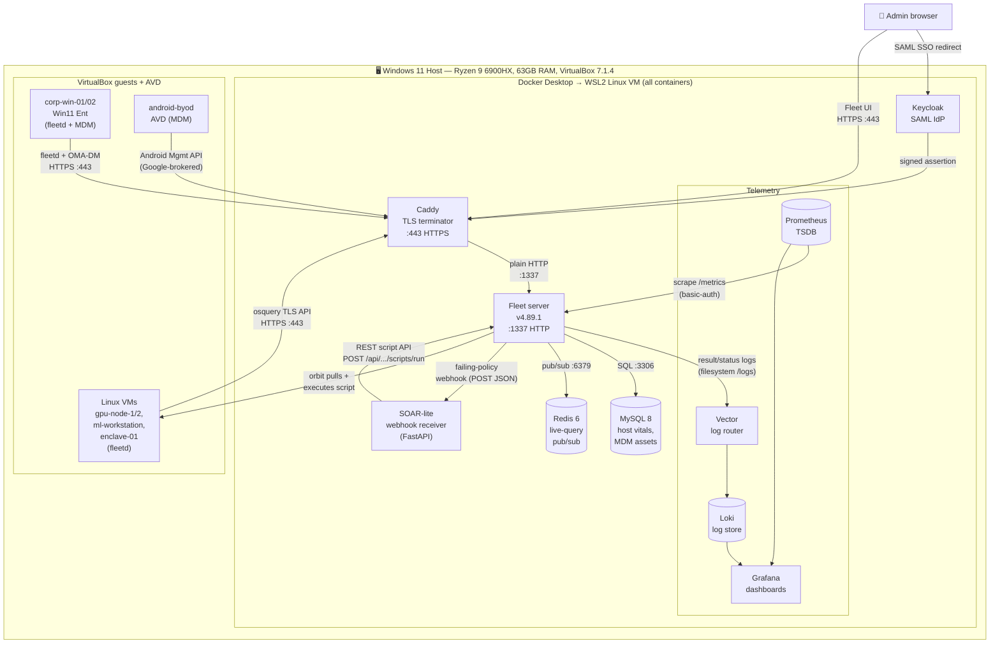

# 📖 Project AXIOM — Stack Encyclopedia

This is the reference encyclopedia for **Project AXIOM**: a $0, fully open-source,
single-machine device-management lab that emulates how a frontier-AI company
("Axiom Intelligence") would fleet-manage laptops, GPU boxes, and a hardened
model-weights enclave — built entirely on Fleet **v4.89.1 Free**, rebuildable from
Git alone. It is written for a **competent-generalist engineer** who wants a deep
mental model: not "click here," but *how each piece functions and — above all — how
the pieces talk to each other* (who initiates contact, in which direction, over what
port, carrying what payload). Every claim is pinned to the **real decisions in this
lab**, so where a design choice is load-bearing you'll find it cross-referenced to an
ADR in [`../adr/`](../adr/) (notably ADR-0002 VirtualBox+cloud-init, and ADR-0003 the
free-tier trust-tiering correction). Where something is Premium-only, simulated, or
deferred, the text says so plainly rather than pretending the Free tier can do it.

---

## How to read this

The layers are numbered **bottom-up** — each file assumes the one below it exists but
re-explains nothing, and every file is **self-contained and cross-linked** (jump in
anywhere; follow the `→ see` pointers when a concept lives in another layer). The
recommended first read-through, foundation → surface:

1. **Host / hypervisor / virtualization** — the physical machine, VT-x/AMD-V, Hyper-V coexistence, WSL2, VirtualBox, cloud-init.
2. **Containers & Docker** — how the Fleet stack is packaged and wired.
3. **Fleet core** — the Fleet server, orbit/osquery agent (`fleetd`), enroll flow, node keys.
4. **TLS & PKI** — mkcert CA, Caddy termination, the osquery trust-store split.
5. **MDM** — Apple/Windows/Android enrollment and the check-in loop.
6. **GitOps & CI/CD** — `fleetctl gitops`, the auto-delete footgun, the self-hosted runner.
7. **Policy-as-code** — osquery SQL, policies, labels, the self-scoping enclave trick.
8. **Telemetry & observability** — Fleet logs → Vector → Loki, `/metrics` → Prometheus → Grafana.
9. **Identity & access** — Keycloak, SAML SSO, the device-trust sketch.
10. **Automation & IR** — webhooks → SOAR-lite → the Fleet script API, incident drills.
11. **Cross-cutting concepts & trust model** — the framing that ties every layer together.

> New to Fleet? Read 1 → 2 → (3) → 4 first; they explain the substrate. Already fluent
> in Docker/TLS? Skip to 6–11 for the AXIOM-specific decisions.

---

## The stack at a glance

**Reading the arrows:** agents and browsers always reach Fleet **through Caddy on
:443** (nothing else is exposed); Caddy proxies to Fleet's plain-HTTP **:1337** inside
the WSL2 network. Fleet is the hub — it owns MySQL/Redis, emits logs *outbound* to
Vector, exposes `/metrics` for Prometheus to *pull*, trusts Keycloak for admin login,
and drives remediation back down to hosts via orbit.

---

## Two data-flow walkthroughs

### (a) A Linux VM enrolls and reports compliance

1. **Package build (on the host):**
   `fleetctl package --type deb --fleet-url https://fleet.axiom.lab:443 --enroll-secret <secret> --fleet-certificate rootCA.pem`.
   The `--fleet-certificate` flag bakes the **mkcert Root CA** into the package —
   **the CA, not the leaf** — because `osqueryd` does **not** read the OS trust store
   (only orbit and Fleet Desktop do). Without the CA baked in, osquery TLS enrollment
   fails even though the OS trusts the cert.
2. **Install on `gpu-node-1`:** the `.deb` lays down **orbit** (updater/supervisor),
   **osqueryd**, and **Fleet Desktop**. orbit starts first and reads the enroll secret.
3. **TLS handshake at Caddy:** orbit opens **HTTPS to Caddy :443**. Caddy presents its
   **mkcert leaf** (SAN = `fleet.axiom.lab`); the agent validates it against the baked-in
   Root CA. Caddy then reverse-proxies cleartext to **Fleet :1337**.
4. **Enroll:** osquery hits the **osquery TLS API** (`POST /api/v1/osquery/enroll`)
   with the enroll secret + a host identifier; Fleet returns a **node key** (the
   per-host bearer token used on every subsequent call).
5. **Detail queries → host vitals:** Fleet hands osquery its **config** (`/config`);
   osquery runs the built-in **detail queries** (OS version, disk, network, uptime,
   software inventory) and POSTs results to `/api/v1/osquery/log`. Fleet writes these
   **host vitals into MySQL**; Redis brokers any live-query fan-out.
6. **A self-scoping policy evaluates:** on the next **policy interval**, osquery runs
   the policy SQL. AXIOM's enclave-tiering policies are written as
   `SELECT 1 WHERE (host-not-in-scope) OR (host-compliant)` keyed on the provisioned
   marker file `/etc/axiom/trust-tier` — so **out-of-scope hosts auto-pass** (1 row =
   pass = green) and only in-scope, non-compliant hosts go **red**. (This SQL pattern
   exists *because* per-label policy scoping is Premium and silently ignored on Free —
   ADR-0003.)
7. **A failing policy fires a webhook:** when an in-scope host returns **0 rows**
   (fail), Fleet's **policy-automation webhook** POSTs a JSON payload (host + policy id)
   to the SOAR-lite receiver — handing off to walkthrough (b).

### (b) A policy fails and gets auto-remediated

1. **Webhook out:** Fleet POSTs the failing-policy JSON to the **SOAR-lite** FastAPI
   receiver (a container in the WSL2 network). Failing-policy webhooks + the script API
   are **Free**, so this whole loop runs at $0.
2. **SOAR-lite decides:** the receiver parses `host_id`/`policy_id`, maps it to a
   remediation script, and authenticates back to Fleet with an **API token**.
3. **Script-execution API:** SOAR-lite calls
   `POST /api/v1/fleet/scripts/run` (host id + script contents/ id) over **HTTPS :443**
   through Caddy.
4. **orbit pulls & executes:** Fleet queues the script; on `gpu-node-1`, **orbit**
   polls, pulls the script, and **executes it on the host**, returning stdout/exit code
   to Fleet.
5. **Policy flips green:** on the next **policy interval** osquery re-evaluates the same
   SQL; the remediated condition now returns 1 row → **pass** → the host goes green, and
   **MTTR** is the wall-clock from webhook to green.

---

## Acronyms — quick reference

| Acronym | Expansion |
|---|---|
| MDM | Mobile Device Management |
| CA | Certificate Authority |
| TLS | Transport Layer Security |
| SAN | Subject Alternative Name (in an X.509 cert) |
| SCEP | Simple Certificate Enrollment Protocol |
| APNs | Apple Push Notification service |
| DDM | Declarative Device Management (Apple) |
| ABM / ADE / DEP | Apple Business Manager / Automated Device Enrollment / Device Enrollment Program |
| VPP | Volume Purchase Program (Apple app licensing) |
| CSP | Configuration Service Provider (Windows MDM) |
| OMA-DM | Open Mobile Alliance Device Management (Windows MDM protocol) |
| WSTEP | WS-Trust X.509 Token Enrollment Protocol (Windows enroll) |
| PPKG | Provisioning Package (Windows `.ppkg`) |
| SSO | Single Sign-On |
| SAML | Security Assertion Markup Language |
| OIDC | OpenID Connect (identity layer over OAuth2) |
| IdP | Identity Provider |
| SP | Service Provider (SAML relying party, e.g. Fleet) |
| SCIM | System for Cross-domain Identity Management (user provisioning) |
| CI/CD | Continuous Integration / Continuous Delivery |
| ADR | Architecture Decision Record |
| FIM | File Integrity Monitoring |
| CVE | Common Vulnerabilities and Exposures |
| CVSS | Common Vulnerability Scoring System |
| EPSS | Exploit Prediction Scoring System |
| KEV | Known Exploited Vulnerabilities (CISA catalog) |
| SOAR | Security Orchestration, Automation and Response |
| MTTR | Mean Time To Remediate (a.k.a. Respond/Repair) |
| BYOD | Bring Your Own Device |
| WSL2 | Windows Subsystem for Linux 2 |
| SLAT | Second-Level Address Translation (AMD calls it NPT/RVI) |
| AVD | Android Virtual Device (Android Studio emulator) |
| IAM | Identity and Access Management |

---

## ⚠️ Mental-model corrections

> The lab's design turns on several things that are **widely assumed but wrong** on
> Fleet Free v4.89.1. If you internalize only one section, make it this one.

- **"Labels + per-label policy + separate enroll secrets = free teams" is WRONG.**
  Per-label **policy scoping is Premium** and **silently ignored** on Free (the policy
  runs on *all* hosts, no error). Enroll secrets **do not segment** hosts (no query even
  reveals which secret a host used). Teams are Premium. → Free tiering is done with
  **self-scoping policy SQL** keyed on `/etc/axiom/trust-tier`, the free `platform`
  field, and **label-targeted queries** (query targeting by label *is* free). See ADR-0003.
- **`osqueryd` ignores the OS system trust store.** orbit + Fleet Desktop use it;
  osquery does not. The CA must be **baked into the package** or enrollment fails.
- **`--fleet-certificate` takes the CA (`rootCA.pem`), NOT the leaf.** There is no
  `--fleet-tls` flag.
- **Prometheus `/metrics` is auth-gated by default.** You need
  `FLEET_PROMETHEUS_BASIC_AUTH_DISABLE=true` or basic-auth creds — scraping won't work
  out of the box.
- **Disk-encryption *enforcement* + escrow and OS-update *enforcement* are Premium.**
  Free can **detect** FDE/version state (osquery reads it); Phase 4 is detection-only,
  and enforcement is documented as the Premium delta.
- **Android MDM is Free and GA** for work-profile BYOD, fully-managed, and Wipe (Lock /
  clear-passcode are Premium) — no Headwind fallback needed; needs a Play-Protect AVD,
  not AOSP.
- **macOS is real-but-deferred, not simulated.** A 2025 Mac Studio exists; Apple MDM
  server-side is Free (APNs cert is free with an Apple ID), but enrollment needs real
  Apple hardware, so it's sequenced last. **iOS** *is* simulated (no device + no ABM).

---

## File index

Links are relative to this directory. Entry counts are the top-level headings in each file.

| # | File | What it covers | Entries |
|---|---|---|---|
| 01 | [01-host-hypervisor-virtualization.md](01-host-hypervisor-virtualization.md) | The physical host, VT-x/AMD-V + SLAT, Hyper-V coexistence, WSL2, VirtualBox, cloud-init/NoCloud, AVD, macOS virt (deferred) | 11 |
| 02 | [02-containers-and-docker.md](02-containers-and-docker.md) | Containers vs VMs, Docker engine/image/volume/network, Compose, healthchecks, the `fleet-init` chown sidecar, Docker Desktop + secrets | 11 |
| 03 | [03-fleet-core.md](03-fleet-core.md) | The Fleet server, MySQL, Redis, the `fleetd` agent (orbit + osqueryd + Fleet Desktop), enroll secret + node key, `FLEET_SERVER_PRIVATE_KEY`, osquery TLS API, host vitals, ops endpoints, `fleetctl` | 12 |
| 04 | [04-tls-and-pki.md](04-tls-and-pki.md) | TLS/HTTPS, CA + chain of trust, X.509/SAN, mkcert, the osquery `certs.pem` split, `--fleet-certificate`, Caddy termination, SCEP | 10 |
| 05 | [05-mdm.md](05-mdm.md) | The MDM check-in loop, enrollment, profiles, Apple APNs/DDM/ABM, Windows OMA-DM/CSP/WSTEP, Android Enterprise, lock/wipe (Free vs Premium) | 12 |
| 06 | [06-gitops-and-cicd.md](06-gitops-and-cicd.md) | Git monorepo, GitOps as source of truth, the auto-delete footgun, `fleetctl gitops`, drift, GitHub Actions, self-hosted runner, CI gates, ADRs | 12 |
| 07 | [07-policy-as-code.md](07-policy-as-code.md) | osquery tables/SQL, policy pass/fail, scheduled queries, labels (grouping ≠ scope), teams (Premium), self-scoping SQL, CIS, FIM, ATT&CK, intervals | 12 |
| 08 | [08-telemetry-and-observability.md](08-telemetry-and-observability.md) | Logs vs metrics vs traces, Fleet result/status logs, Vector → Loki/LogQL, Prometheus/`/metrics`/PromQL, Grafana, dashboards-as-code | 12 |
| 09 | [09-identity-and-access.md](09-identity-and-access.md) | AuthN vs AuthZ, Keycloak IdP, realm-as-JSON, SAML + IdP↔SP trust, SSO-only admin, SAML vs OIDC, SCIM/JIT, device-trust FastAPI sketch | 10 |
| 10 | [10-automation-and-ir.md](10-automation-and-ir.md) | Webhook contract, SOAR-lite receiver, Fleet REST + API tokens, script-execution API, IR drills (lost laptop, FIM trip, CVE), MTTR, canary | 12 |
| 11 | [11-concepts-and-trust-model.md](11-concepts-and-trust-model.md) | The AXIOM framing, reference fleet segments, trust tiers, the enclave, model-weights protection, $0/free-only, rebuild-from-cold, defense-in-depth | 12 |
